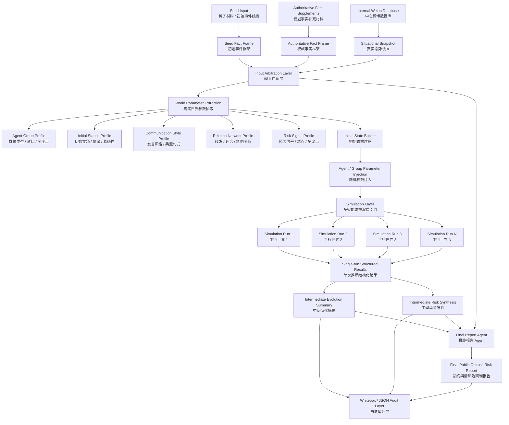
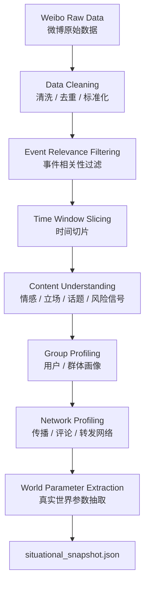

# Adarian 真实态势感知型舆情推演系统远期规划 v0.1

> 文档类型：远期路线规划 / 系统架构设计 / 模块功能说明  
> 适用项目：Adarian 多智能体舆情推演系统  
> 当前定位：从“种子材料驱动的多智能体推演”升级为“真实态势感知 + 多轮平行推演 + 中间结构化研判 + 最终业务报告”的产品级系统  
> 生成日期：2026-05-14  
> 状态：draft / exploration  
> 核心原则：种子材料定题；权威材料补事实；微博数据定状态；推演补趋势；中间研判筛风险；最终报告解释判断。

---

## 0. Executive Summary

Adarian 后续系统的远期目标不是简单生成一份舆情报告，而是建立一套可解释、可复盘、可验证的 **真实态势感知型舆情推演系统**。

系统将从当前的：

```text
种子材料
  ↓
LLM 生成群体
  ↓
多智能体推演
  ↓
最终报告
```

升级为：

```text
种子材料
  + 权威事实补充
  + 微博数据库真实态势数据
  ↓
输入仲裁层
  ↓
真实世界参数抽取
  ↓
初始态建模
  ↓
多轮平行推演
  ↓
中间结构化研判
  ↓
最终业务报告
  ↓
Whitebox / JSON / 验收审计
```

其中最关键的系统转变是：

```text
从“LLM 根据种子材料想象舆情世界”
升级为
“从真实微博数据抽取当前舆论世界参数，再启动多智能体推演”。
```

---

## 1. 总体产品定位

### 1.1 系统目标

Adarian 的远期定位是：

```text
面向公共事件、品牌危机、治理风险和舆情应急场景，
基于真实舆情数据构建当前态势，
通过多智能体推演生成未来可能趋势，
再将多轮推演结果聚合为可读、可审计、可复盘的风险研判报告。
```

### 1.2 核心价值

传统舆情系统通常只能回答：

```text
现在发生了什么？
现在舆论热度如何？
大家正在讨论什么？
当前情绪如何？
```

Adarian 需要进一步回答：

```text
在当前舆论态势下，未来可能向哪些方向演化？
哪些风险在多次推演中稳定出现？
哪些群体可能成为风险放大器？
哪些叙事可能形成现实治理压力？
报告如何面向政府 / 公安 / 监管 / 企业决策者表达？
```

### 1.3 核心叙事

```text
传统舆情系统偏“态”；
Adarian 补“势”。

态 = 当前真实舆情状态。
势 = 基于多智能体推演得到的未来可能趋势。
```

---

## 2. 总体架构

### 2.1 总体链路



---

## 3. 输入体系设计

### 3.1 三类核心输入

系统远期输入分为三类：

| 输入 | 中文名称 | 主要作用 | 权威边界 |
|---|---|---|---|
| `seed_input` | 种子材料 | 定义初始事件框架与任务边界 | 初始框架，不保证最新 |
| `authoritative_fact_frame` | 权威事实补充 | 修正和补全事实、时间线、主体关系、官方回应 | 事实补充优先源 |
| `situational_snapshot` | 真实态势快照 | 抽取当前舆情状态、群体、情绪、话题、网络和风格 | 当前舆情状态优先源 |

一句话：

```text
种子材料定题；
权威材料补事实；
微博数据定状态。
```

---

## 4. Seed Input：种子材料层

### 4.1 职责

种子材料层负责回答：

```text
这个事件是什么？
本次系统要围绕什么事件进行推演？
初始叙事框架是什么？
涉及哪些核心主体？
核心矛盾是什么？
```

### 4.2 边界

种子材料不是绝对事实权威，而是：

```text
初始事件框架权威源。
```

如果种子材料滞后、信息缺失或存在理解偏差，需要进入输入仲裁层处理。

### 4.3 建议结构

```json
{
  "event_name": "",
  "event_summary": "",
  "core_conflict": "",
  "involved_entities": [],
  "seed_time": "",
  "seed_authority_level": "high / medium / low / unknown",
  "known_limitations": []
}
```

---

## 5. Authoritative Fact Supplements：权威事实补充层

### 5.1 设计决策

当前阶段不引入 MCP / 开放联网检索。

事实补充优先使用：

```text
官方通报
权威媒体报道
政府公告
平台声明
企业致歉
行业协会通报
人工指定材料
```

### 5.2 为什么不做 MCP

MCP / Web Search 会引入：

```text
来源可信度问题
检索噪声
网页变动
引用漂移
联网不稳定
prompt 注入
事实冲突
结果不可复现
```

当前更稳的路径是：

```text
权威材料人工指定 / 内部整理
  ↓
结构化事实补充
  ↓
输入仲裁
```

### 5.3 输出产物

建议产物：

```text
authoritative_fact_frame.json
```

结构：

```json
{
  "source_type": "official / authoritative_media / enterprise_statement / association_notice",
  "source_title": "",
  "published_at": "",
  "source_url_or_ref": "",
  "confirmed_facts": [],
  "timeline_updates": [],
  "involved_entities": [],
  "official_responses": [],
  "open_questions": [],
  "conflicts_with_seed": [],
  "do_not_infer": []
}
```

### 5.4 职责边界

事实补充层负责：

```text
补事实；
补时间线；
补主体关系；
补官方回应；
标记与种子材料冲突；
声明不可推断内容。
```

不负责：

```text
判断风险等级；
生成对策建议；
判断舆论趋势；
代表公众态度；
做模拟参数；
替最终报告做结论。
```

---

## 6. Situational Awareness：真实态势感知层

### 6.1 核心定位

真实态势感知层不是给报告补一章现状分析，而是：

```text
真实世界到模拟世界的参数转译器。
```

它的首要任务是从真实微博数据中抽取可校准模拟世界的参数：

```text
群体
比例
初始立场
情绪
语言风格
关系网络
KOL
传播结构
风险信号
```

### 6.2 数据来源

当前优先数据源：

```text
中心内部微博数据库
```

后续可扩展：

```text
新闻数据库
短视频平台数据
微信公众号数据
评论区数据
跨平台数据
```

但 R0 阶段先只做微博数据库。

### 6.3 需要摸底的数据库字段

| 能力 | 所需字段 | 用途 |
|---|---|---|
| 声量趋势 | 发布时间 / 采集时间 | 时间切片、热度趋势 |
| 内容理解 | 微博正文 / 评论正文 / 转发正文 | 情感、立场、话题、风格 |
| 互动强度 | 转发数 / 评论数 / 点赞数 | KOL、影响力、传播活跃度 |
| 用户画像 | 用户ID / 认证类型 / 粉丝数 / 简介 / 地区 | 群体识别 |
| 传播结构 | 原微博ID / 转发ID / 评论父ID | 关系网络 |
| 话题结构 | hashtag / 关键词 | 话题聚类 |

### 6.4 处理链路



---

## 7. Situational Snapshot Contract

### 7.1 目标

`situational_snapshot.json` 是真实态势感知层的核心输出。

它不是最终报告正文，而是用于：

```text
输入仲裁；
初始态建模；
群体生成；
网络结构构建；
推演参数校准；
最终报告第二章现状数据分析。
```

### 7.2 建议结构

```json
{
  "snapshot_meta": {
    "event_name": "",
    "data_source": ["weibo"],
    "time_window": {
      "start": "",
      "end": ""
    },
    "sample_size": 0,
    "generated_at": ""
  },
  "event_relevance": {
    "query_terms": [],
    "filter_strategy": "",
    "relevance_confidence": "high / medium / low"
  },
  "volume_profile": {
    "post_count": 0,
    "comment_count": 0,
    "repost_count": 0,
    "peak_time": "",
    "trend": "rising / stable / declining / unknown"
  },
  "topic_clusters": [
    {
      "topic_id": "",
      "label": "",
      "keywords": [],
      "share": 0.0,
      "representative_posts": []
    }
  ],
  "sentiment_profile": {
    "positive": 0.0,
    "neutral": 0.0,
    "negative": 0.0,
    "dominant_emotions": []
  },
  "group_profiles": [
    {
      "group_name": "",
      "estimated_percentage": 0,
      "stance_direction": "support / oppose / neutral / unclear",
      "stance_intensity": 0.0,
      "main_concerns": [],
      "communication_style": "",
      "typical_phrases": [],
      "representative_posts": [],
      "susceptibility_hint": "high / medium / low",
      "influence_hint": "high / medium / low"
    }
  ],
  "network_profile": {
    "available": true,
    "kol_candidates": [],
    "source_distribution": [],
    "relation_edges": [
      {
        "source_group": "",
        "target_group": "",
        "relation_type": "amplify / oppose / trust / question / quote",
        "weight": 0.0
      }
    ]
  },
  "risk_signal_candidates": [
    {
      "risk_signal": "",
      "evidence": [],
      "related_groups": [],
      "confidence": "high / medium / low"
    }
  ],
  "recommended_simulation_parameters": {
    "suggested_agent_groups": [],
    "suggested_initial_stance": [],
    "suggested_relation_edges": [],
    "suggested_prompt_style_hints": []
  }
}
```

### 7.3 R0 产物范围

R0 只要求稳定输出：

```text
topic_clusters
sentiment_profile
group_profiles
recommended_simulation_parameters
```

暂不要求：

```text
完整传播树
实时滚动
跨平台融合
强化学习参数
完整用户历史画像
```

---

## 8. Input Arbitration Layer：输入仲裁层

### 8.1 核心职责

输入仲裁层负责处理：

```text
种子材料滞后
种子材料缺失
种子材料与权威材料冲突
权威事实与舆论说法冲突
微博数据中的谣言 / 情绪 / 公众归因
真实态势数据与模拟参数之间的映射边界
```

### 8.2 核心原则

```text
事实不能由舆论数据直接改写；
但当前态势必须由真实数据校正。
```

### 8.3 权威分配矩阵

| 信息层 | 默认权威源 | 如果 seed 滞后/缺失 | 输出方式 |
|---|---|---|---|
| 事件起点 | seed_input | 保留为初始线索 | event_frame |
| 当前时间线 | authoritative_fact_frame + situational_snapshot | 真实数据优先校正 | timeline_snapshot |
| 事件事实 | 权威事实补充 / 高权威 seed | 缺失则 unknown，不让微博直接定事实 | confirmed_facts |
| 舆论反应 | situational_snapshot | seed 只做补充 | public_reaction |
| 公众归因 | situational_snapshot | 标注为公众质疑 / 网民归因 | attribution_claims |
| 群体画像 | situational_snapshot | seed + LLM fallback | group_profiles |
| 初始立场 | situational_snapshot | seed fallback | initial_stance |
| 传播结构 | situational_snapshot | Phase 2 synthetic graph | social_graph_seed |
| 风险候选 | simulation_results + risk signals | 进入中间研判层 | risk_candidates |
| 最终风险判断 | intermediate_risk_synthesis | final report 只解释 | risk_synthesis |

### 8.4 输出产物

建议产物：

```text
input_arbitration_report.json
```

结构：

```json
{
  "seed_authority_level": "medium",
  "seed_lag_detected": true,
  "event_frame": {
    "event_name": "",
    "core_conflict": "",
    "involved_entities": []
  },
  "timeline_snapshot": {
    "seed_time": "",
    "latest_data_time": "",
    "current_stage": "",
    "missing_updates": []
  },
  "confirmed_facts": [],
  "situational_claims": [],
  "public_reactions": [],
  "conflicts": [],
  "fallback_fields": [],
  "recommended_simulation_start_state": {}
}
```

---

## 9. Initial State Builder：初始态构建器

### 9.1 职责

初始态构建器负责把输入仲裁后的结果转译为模拟系统可消费的初始状态。

输入：

```text
input_arbitration_report.json
situational_snapshot.json
authoritative_fact_frame.json
seed_input
```

输出：

```text
phase1_input_bundle.json
phase2_graph_seed.json
phase3_simulation_config.json
```

### 9.2 核心功能

```text
1. 生成 agent group types。
2. 生成每类群体的规模权重。
3. 生成初始立场和情绪。
4. 生成发言风格提示。
5. 生成关系网络种子。
6. 生成风险信号提示。
7. 标记哪些字段来自真实数据，哪些来自 fallback。
```

### 9.3 三种模拟起点模式

| 模式 | 条件 | 说明 |
|---|---|---|
| Seed-only Mode | 没有真实态势数据 | 从种子材料定义的初始事件开始推演 |
| Situation-calibrated Mode | 有真实态势快照，但不滚动 | 从当前态势快照开始推演 |
| Rolling Situation Mode | 有多时间窗口数据 | 每个窗口重新校准态势，再做短程推演 |

---

## 10. Agent / Group Parameter Injection：群体参数注入层

### 10.1 参数类型

| 参数 | 来源 | 用途 |
|---|---|---|
| 群体类型 | topic / user clustering | Phase 1 opinion_spreaders |
| 群体占比 | 当前样本分布 | agent sampling weight |
| 初始立场 | sentiment / stance classification | Phase 3 初始状态 |
| 情绪强度 | sentiment / emotion profile | 推演易感性 |
| 关注议题 | topic clusters | agent concerns |
| 发言风格 | representative posts | persona prompt style |
| 影响力 | followers / interactions / reposts | graph edge weight |
| 群体关系 | repost / comment / co-topic | Phase 2 social graph |
| 风险信号 | risk signal classifier | intermediate risk seed |

### 10.2 注入原则

```text
真实数据优先；
LLM 只做缺失字段补全；
所有 fallback 必须可追踪；
不得把公众说法写成事件事实；
不得把采样比例写成全网真实比例。
```

---

## 11. Simulation Layer：多智能体推演层

### 11.1 定位

多智能体推演层负责补“势”。

它基于校准后的当前态势，探索未来可能出现的舆情演化趋势。

### 11.2 推演形态

当前建议采用：

```text
小规模 agent group
3-5 ticks
多次平行 run
结构化输出
```

不建议当前直接进入：

```text
上千 agent
复杂动态博弈
完整会话记忆系统
实时滚动大规模仿真
```

### 11.3 平行世界推演

```text
Run 1
Run 2
Run 3
...
Run N
```

每个 run 相互独立，用于观察：

```text
哪些风险反复出现；
哪些演化轨迹稳定；
哪些群体长期成为风险放大器；
哪些观点只在个别 run 中偶然出现。
```

---

## 12. Single-run Structured Results：单次推演结构化结果

### 12.1 职责

单次推演结果不直接进入最终人读报告，而是作为中间结构化研判层的输入。

### 12.2 包含内容

```text
演化轨迹
群体发言
风险候选
拐点 / 极化 / 立场变化
代表性观点候选
群体状态变化
```

### 12.3 边界

最终报告不应大量展示：

```text
单次过程指标
立场分机械变化
单轮极化数值
未经聚合的偶然风险
```

允许进入中间层：

```text
多轮稳定风险
反复出现的风险类型
高频风险标签
代表性演化模式
```

---

## 13. Intermediate Evolution Summary：中间演化摘要层

### 13.1 定位

中间演化摘要层服务最终报告第三章：

```text
演化推演分析
```

### 13.2 主要功能

```text
1. 聚合多次推演中的主要演化方向。
2. 总结群体立场如何变化。
3. 识别是否存在扩散、极化、反转、失焦、外部放大等趋势。
4. 将过程数据压缩为报告可读摘要。
```

### 13.3 输出示例

```json
{
  "dominant_evolution_patterns": [],
  "stable_group_shifts": [],
  "polarization_tendency": "",
  "attention_shift": "",
  "narrative_drift": "",
  "report_ready_summary": ""
}
```

---

## 14. Intermediate Risk Synthesis：中间风险研判层

### 14.1 定位

中间风险研判层服务最终报告第四章：

```text
风险研判
```

它是最终风险判断的主要权威源。

### 14.2 主要功能

```text
1. 聚合多次推演中的风险候选。
2. 给风险打标签。
3. 判断风险出现频次和稳定性。
4. 区分偶然风险和稳定风险。
5. 将模拟结果翻译为现实可能风险。
6. 决定哪些风险进入最终报告。
```

### 14.3 建议结构

```json
{
  "risk_items": [
    {
      "risk_name": "",
      "risk_type": "",
      "trigger_basis": [],
      "multi_run_frequency": 0,
      "stability": "high / medium / low",
      "affected_subjects": [],
      "reality_explanation": "",
      "should_enter_final_report": true,
      "do_not_overstate": []
    }
  ]
}
```

### 14.4 核心规则

```text
单轮过程指标后台化；
多轮稳定风险结论前台化。
```

不推荐：

```text
某群体立场分从 5.2 上升至 6.1。
```

推荐：

```text
多轮推演中，围绕执法公信力的质疑反复出现，说明该事件存在治理信任受损风险。
```

---

## 15. Final Report Agent：最终报告 Agent

### 15.1 输入

最终报告 Agent 应该消费：

```text
1. input_arbitration_report.json
2. situational_snapshot.json
3. intermediate_evolution_summary.json
4. intermediate_risk_synthesis.json
5. authoritative_fact_frame.json
```

### 15.2 不应该直接消费

```text
未经聚合的所有原始微博
未经筛选的单轮推演全部发言
未经中间层处理的裸指标
未经标注的公众传言
```

### 15.3 职责

```text
面向人读报告组织表达；
解释风险判断；
区分事实、舆论、推演；
减少裸指标；
保证报告业务可读。
```

不负责：

```text
重新计算风险等级；
重新识别拐点；
重新发明风险标签；
把模拟结果写成现实事实；
把公众说法写成事实定责。
```

---

## 16. 最终报告结构

### 16.1 推荐结构

```text
一、舆情概要
二、舆情数据分析
三、演化推演分析
四、风险研判
五、对策建议
附录：方法 / 参数 / 数据说明
```

### 16.2 章节职责

| 章节 | 作用 | 主要输入 |
|---|---|---|
| 舆情概要 | 说明事件背景、事实框架、核心矛盾 | seed_input + authoritative_fact_frame |
| 舆情数据分析 | 描述当前态势，即“态” | situational_snapshot |
| 演化推演分析 | 描述模拟得到的未来可能趋势，即“势” | intermediate_evolution_summary |
| 风险研判 | 解释稳定风险与现实可能后果 | intermediate_risk_synthesis |
| 对策建议 | 给出面向决策者的处置建议 | risk_synthesis + policy template |
| 附录 | 方法说明、数据说明、模拟边界 | whitebox / JSON artifacts |

### 16.3 报告口径

必须明确：

```text
本报告基于种子材料、权威事实补充材料与当前态势数据共同生成。
种子材料用于定义事件初始框架；
权威材料用于修正和补全事实；
当前态势数据用于校准舆情状态与模拟起点；
多智能体推演结果用于识别未来可能风险；
报告中的风险判断属于模拟推演口径，不等同于现实事实断言。
```

---

## 17. Whitebox / JSON Audit Layer：白盒审计层

### 17.1 定位

Whitebox 层只做：

```text
观察
检查
汇总
验证
审计
```

不做：

```text
生成
决策
改变模拟行为
替代 RuntimeLogger
成为 runtime authority
```

### 17.2 远期产物

```text
input_arbitration_report.json
situational_snapshot.json
intermediate_evolution_summary.json
intermediate_risk_synthesis.json
report_synthesis_context.json
final_report.json
final_report.md
whitebox_summary.json
report_product_acceptance.json
```

### 17.3 验收检查

Whitebox 应检查：

```text
1. 最终报告是否区分事实、舆论、推演。
2. 风险是否来自 intermediate_risk_synthesis。
3. 报告是否引用不存在的事实。
4. 是否把公众说法写成事实。
5. 是否把单轮过程指标当作最终结论。
6. 是否出现未授权的风险等级重算。
7. 是否缺少生成时间。
8. 是否缺少模拟口径说明。
```

---

## 18. 远期模块总表

| 模块 | 当前优先级 | 职责 | R0 是否需要 |
|---|---:|---|---|
| Seed Input | 高 | 定义初始事件框架 | 是 |
| Authoritative Fact Frame | 中 | 补全权威事实 | 可选 |
| Internal Weibo Database Adapter | 高 | SQL 查询微博数据 | 是 |
| Situational Snapshot Builder | 高 | 生成真实态势快照 | 是 |
| Input Arbitration Layer | 高 | 处理事实、舆论、冲突、缺失 | 是 |
| World Parameter Extraction | 高 | 抽取模拟参数 | 是 |
| Initial State Builder | 高 | 构造模拟初始态 | 是 |
| Agent Parameter Injection | 高 | 注入群体、立场、风格、关系 | 是 |
| Simulation Engine | 已有 | 多智能体推演 | 是 |
| Parallel Run Scheduler | 中 | 多次平行推演 | 后续 |
| Single-run Result Structurer | 高 | 结构化推演结果 | 是 |
| Intermediate Evolution Summary | 高 | 聚合演化趋势 | 是 |
| Intermediate Risk Synthesis | 高 | 聚合稳定风险 | 是 |
| Final Report Agent | 已有但需重构 | 生成人读报告 | 是 |
| Whitebox Acceptance | 高 | 报告产品验收 | 是 |
| MCP Fact Agent | 低 | 联网事实补全 | 暂不做 |

---

## 19. 路线规划

### 19.1 R0：数据库摸底与真实态势快照设计

目标：

```text
确认中心微博数据库能提供什么字段；
完成 OPPO 母亲节事件样本查询；
填完字段能力矩阵；
设计 situational_snapshot.json R0。
```

产物：

```text
weibo_database_field_matrix.md
oppo_case_sample_query.sql
oppo_case_sample_data.csv/json
situational_snapshot_r0_contract.md
```

不做：

```text
不接主链；
不做自动情感模型；
不做完整网络；
不做滚动推演；
不做 MCP。
```

---

### 19.2 R1：Situational Snapshot Builder

目标：

```text
把微博样本数据转成最小态势快照。
```

范围：

```text
topic_clusters
sentiment_profile
group_profiles
recommended_simulation_parameters
```

产物：

```text
situational_snapshot.json
```

验证：

```text
同一批数据可重复生成；
字段不缺失；
每个 group_profile 有证据；
不把公众说法写成事实。
```

---

### 19.3 R2：Input Arbitration Contract

目标：

```text
明确 seed_input、authoritative_fact_frame、situational_snapshot 的权威边界。
```

产物：

```text
input_arbitration_report.json
```

重点：

```text
seed_lag_detected
conflicts_with_seed
confirmed_facts
situational_claims
recommended_simulation_start_state
```

---

### 19.4 R3：Initial State Builder 接入

目标：

```text
将真实态势参数转译为 Phase 1 / Phase 2 / Phase 3 可消费的输入。
```

产物：

```text
phase1_input_bundle.json
phase2_graph_seed.json
phase3_simulation_config.json
```

不做：

```text
不改变 Phase 1 canonical object；
不强制替换所有 LLM 生成；
先做 optional injection。
```

---

### 19.5 R4：Intermediate Synthesis Layer

目标：

```text
建立中间演化摘要与中间风险研判层。
```

产物：

```text
intermediate_evolution_summary.json
intermediate_risk_synthesis.json
report_synthesis_context.json
```

重点：

```text
单次推演结果不直接进最终报告；
多轮稳定风险进入最终报告；
中间层成为最终报告 Agent 主输入。
```

---

### 19.6 R5：Final Report Product Hardening

目标：

```text
最终报告升级为态势感知型报告。
```

结构：

```text
舆情概要
舆情数据分析
演化推演分析
风险研判
对策建议
附录
```

重点：

```text
事实 / 舆论 / 推演分层；
指标后台化，判断前台化；
生成时间必填；
模拟口径必填；
风险来自中间层，不由 LLM 重算。
```

---

### 19.7 R6：Parallel Run & Risk Stability

目标：

```text
支持 5 / 10 / N 次平行推演，提取稳定风险。
```

重点：

```text
risk_frequency
risk_stability
multi_run_consensus
run_variance
```

暂不追求：

```text
大规模 agent；
全自动调度；
高并发压测。
```

---

### 19.8 R7：Rolling Situation Mode

目标：

```text
支持按小时 / 半天 / 天级窗口滚动更新态势快照。
```

流程：

```text
T0 真实态势
  ↓
短程推演
  ↓
T1 新真实态势
  ↓
校正
  ↓
再推演
```

这是长期高级能力，不进入近期版本。

---

## 20. 近期最小行动计划

### 20.1 当前唯一下一步

```text
做微博数据库字段摸底。
```

### 20.2 操作步骤

```text
1. 确认微博数据库有哪些表。
2. 确认主表、评论表、转发表、用户表字段。
3. 用 OPPO 母亲节文案争议做关键词查询。
4. 拉取 100-500 条样本。
5. 填写字段能力矩阵。
6. 判断能否生成 situational_snapshot R0。
```

### 20.3 SQL 摸底示例

```sql
SHOW TABLES;

DESCRIBE <table_name>;

SELECT *
FROM <table_name>
LIMIT 5;
```

事件样本查询示例：

```sql
SELECT *
FROM <weibo_table>
WHERE content LIKE '%OPPO%'
  AND (
    content LIKE '%母亲节%'
    OR content LIKE '%两个老公%'
    OR content LIKE '%我妈有两个老公%'
    OR content LIKE '%文案%'
    OR content LIKE '%致歉%'
  )
  AND created_at BETWEEN '2026-05-07 00:00:00' AND '2026-05-15 23:59:59'
LIMIT 500;
```

---

## 21. 字段能力矩阵模板

```markdown
# 微博数据库字段能力摸底表

| 能力 | 所需字段 | 数据库是否支持 | 表名 | 字段名 | 可用性 | 备注 |
|---|---|---|---|---|---|---|
| 声量趋势 | post_time / created_at |  |  |  | 高/中/低 |  |
| 情感分析 | text / content |  |  |  | 高/中/低 |  |
| 话题聚类 | text / hashtag |  |  |  | 高/中/低 |  |
| KOL识别 | user_id / followers / repost_count |  |  |  | 高/中/低 |  |
| 群体画像 | text / user_profile / verified_type |  |  |  | 高/中/低 |  |
| 发言风格 | text / comments |  |  |  | 高/中/低 |  |
| 传播网络 | repost_parent_id / original_id |  |  |  | 高/中/低 |  |
| 时间切片 | created_at |  |  |  | 高/中/低 |  |
```

---

## 22. 关键设计原则汇总

### 22.1 输入层原则

```text
种子材料定义初始事件框架；
权威材料修正和补全事实框架；
真实态势数据校准当前舆情状态；
输入仲裁层区分事实、说法、情绪与模拟参数。
```

### 22.2 推演层原则

```text
真实态势感知层不直接生成最终报告；
它负责从真实舆情数据中抽取模拟世界参数。
```

### 22.3 报告层原则

```text
最终报告 Agent 不重新计算风险；
最终报告 Agent 只解释中间结构化研判层给出的判断。
```

### 22.4 风险层原则

```text
单轮过程指标后台化；
多轮稳定风险结论前台化。
```

### 22.5 工程治理原则

```text
先 contract；
再 fixture；
再接主链；
再做自动化；
最后做滚动与并发。
```

---

## 23. 版本池建议

后续可拆成以下版本池：

```text
vA：Weibo Database Field Audit
vB：Situational Snapshot Contract
vC：Situational Snapshot Builder R0
vD：Input Arbitration Contract
vE：Initial State Builder Optional Injection
vF：Intermediate Evolution Summary Contract
vG：Intermediate Risk Synthesis Contract
vH：Final Report Agent Refactor
vI：Whitebox Report Product Acceptance
vJ：Parallel Run Risk Stability
vK：Rolling Situation Mode
```

优先级建议：

```text
vA → vB → vD → vC → vE → vF/vG → vH → vI
```

注意：`vA` 和 `vB` 属于前置摸底与 contract，不应直接进入源码改造。

---

## 24. 当前不做清单

当前阶段明确不做：

```text
1. MCP 联网检索 Agent。
2. 实时滚动推演。
3. 大规模并发 agent。
4. 强化学习参数优化。
5. 跨平台态势融合。
6. 完整传播树还原。
7. 自动事实核验。
8. 自动法律定性。
9. 让最终报告 Agent 重算风险。
10. 让微博舆论数据直接改写事件事实。
```

---

## 25. Closeout Judgment

当前远期规划可以收口为：

```text
Adarian 的下一阶段核心不是“把报告写漂亮”，
而是把系统从 seed-only simulation
升级为 situation-calibrated simulation。
```

最终产品故事：

```text
我们不是让大模型凭空想象舆情怎么发展；
我们先用真实微博数据库抽取当前舆论世界的参数，
再用多智能体推演探索可能趋势，
最后用中间结构化研判层把多次推演中稳定出现的风险压缩成面向决策者的报告。
```

这就是后续系统建设的主线。
