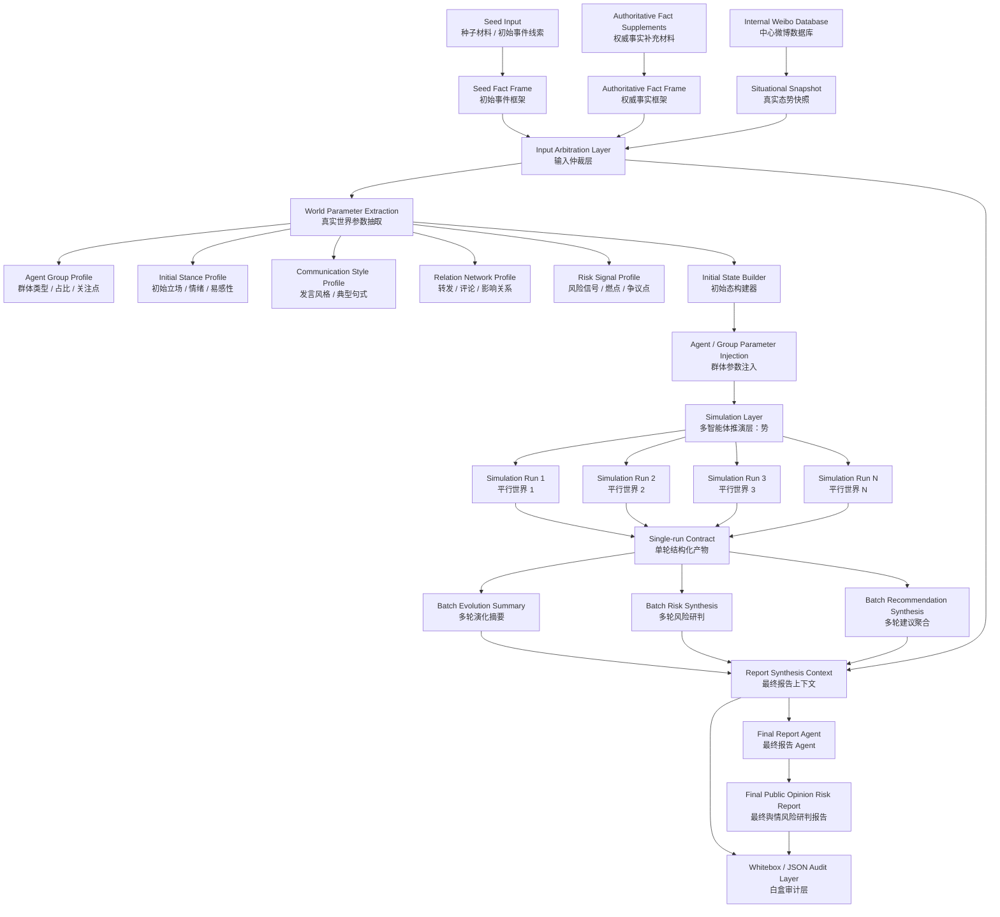

# Adarian 真实态势感知型舆情推演系统远期规划 v0.3（Phase 1 Draft Format 修订版）

> 文档类型：远期路线规划 / 系统架构设计 / 模块功能说明 / 阶段排期修订 / DS Team 审查候选稿  
> 适用项目：Adarian 多智能体舆情推演系统  
> 基于文档：`adarian_long_term_architecture_plan_v0.2_repaired.md`  
> 关联路线：Phase 4 Report Product Governance Track v0.2.1；Phase 1 Generation Governance Major Track v0.2  
> 当前状态：repaired draft / DS review ready  
> 生成日期：2026-05-14  
> Control 判断：保留真实态势感知远期方向；当前先修报告可信度与 Phase 1 生成稳定性；Phase 1 不做 JSON→YAML 全量迁移，而是新增 LLM-friendly draft format 收敛层。  

---

## 0. 本次修订摘要

v0.2 修复版已经解决了一个关键节奏问题：动态态势感知不应立即进入主链实现，应先修报告可信度债务与 Phase 1 生成稳定性债务。

本次 v0.3 在 v0.2 基础上进一步修订 Phase 1 规划：

```text
旧理解：
Phase 1 后续主要是修 JSON 解析与 Repair Loop。

新理解：
Phase 1 后续不是简单修 JSON，也不是把 JSON 全部换成 YAML；
而是建立 LLM-friendly draft format → Parser → Compiler → Validator → Repair Loop → canonical JSON 的收敛链路。
```

核心修订：

```text
1. 明确 JSON 仍是 runtime authority / canonical artifact。
2. 明确 YAML-like / Markdown structured block 只作为 LLM-facing draft format。
3. 新增 v1.2.9.1：LLM Draft Format Policy。
4. 新增 v1.2.9.2：Parser / Compiler / Validator Skeleton R0。
5. 新增 v1.2.9.3：ValidationReport Contract。
6. 后移 Targeted Repair Loop 至 v1.2.9.4。
7. 后移 Diff Guard & Fallback 至 v1.2.9.5。
8. 将 Weibo Data Capability Audit 后移为 v1.2.10，不抢占 Phase 1 稳定性债务。
9. 附录新增 DS Agent Team 审查 Prompt。
```

一句话：

```text
先补可信度，再补生成稳定性，再接真实世界；
Phase 1 先加治理层，不做格式大迁移。
```

---

## 1. 当前 Gate 判断

### 1.1 当前阶段

```text
阶段：planning / roadmap repair / DS review preparation
状态：dynamic situational awareness discovery ready，implementation hold
```

### 1.2 Gate

```text
Dynamic Situational Awareness 主链实现：HOLD
Weibo Data Capability Audit：GO later
Inflection Detection Logic Hardening：GO next
Phase 1 LLM Draft Format + P/C/V：GO after reality check
Phase 1 Targeted Repair Loop：HOLD until ValidationReport + rollback policy are frozen
```

### 1.3 决策理由

当前系统已经拿到微博推文表和微博用户表样本，说明动态态势感知层具备 R0 可行性。但主链仍有两个更紧迫的技术债：

```text
1. Phase 4 报告侧风险等级 / 拐点 / 指标解释需要 code-owned / deterministic / whitebox-verifiable。
2. Phase 1 仍缺少 LLM draft → canonical object 的治理链路，不能继续让 LLM 直接承担复杂 JSON 契约责任。
```

如果此时直接进入动态态势感知，会形成风险错配：

```text
上游输入更真实；
下游报告判断和 Phase 1 生成链路仍不够稳。
```

因此，动态态势感知进入版本池，但不立即进入 Codex 实现。

---

## 2. 系统总定位

Adarian 远期目标不是简单生成一份舆情报告，而是建立一套可解释、可复盘、可验证的真实态势感知型舆情推演系统。

系统核心转变：

```text
旧模式：
种子材料 → LLM 生成群体 → 多智能体推演 → 最终报告

新模式：
种子材料 + 权威事实补充 + 真实舆情数据
  ↓
输入仲裁
  ↓
真实世界参数抽取
  ↓
初始态建模
  ↓
多轮平行推演
  ↓
中间结构化研判
  ↓
最终业务报告
  ↓
Whitebox / JSON / 验收审计
```

核心产品叙事：

```text
传统舆情系统偏“态”；
Adarian 补“势”。

态 = 当前真实舆情状态。
势 = 基于多智能体推演得到的未来可能趋势。
```

---

## 3. 总体架构图



---

## 4. 输入体系设计

系统远期输入分为三类：

| 输入 | 中文名称 | 主要作用 | 权威边界 |
|---|---|---|---|
| `seed_input` | 种子材料 | 定义初始事件框架与任务边界 | 初始框架，不保证最新 |
| `authoritative_fact_frame` | 权威事实补充 | 修正和补全事实、时间线、主体关系、官方回应 | 事实补充优先源 |
| `situational_snapshot` | 真实态势快照 | 抽取当前舆情状态、群体、情绪、话题、网络和风格 | 当前舆情状态优先源 |

核心原则：

```text
种子材料定题；
权威材料补事实；
微博数据定状态；
输入仲裁分层；
推演系统补势；
中间研判筛风险；
最终报告解释判断。
```

---

## 5. Seed Input：种子材料层

### 5.1 职责

种子材料层负责回答：

```text
这个事件是什么？
本次系统要围绕什么事件进行推演？
初始叙事框架是什么？
涉及哪些核心主体？
核心矛盾是什么？
```

### 5.2 边界

种子材料不是绝对事实权威，而是：

```text
初始事件框架权威源。
```

如果种子材料滞后、信息缺失或存在理解偏差，需要进入输入仲裁层处理。

### 5.3 建议结构

```json
{
  "event_name": "",
  "event_summary": "",
  "core_conflict": "",
  "involved_entities": [],
  "seed_time": "",
  "seed_authority_level": "high / medium / low / unknown",
  "known_limitations": []
}
```

---

## 6. Authoritative Fact Frame：权威事实补充层

### 6.1 设计决策

当前阶段不引入 MCP / 开放联网检索。

事实补充优先使用：

```text
官方通报
权威媒体报道
政府公告
平台声明
企业致歉
行业协会通报
人工指定材料
```

### 6.2 为什么不做 MCP

MCP / Web Search 会引入：

```text
来源可信度问题
检索噪声
网页变动
引用漂移
联网不稳定
prompt 注入
事实冲突
结果不可复现
```

当前更稳的路径是：

```text
权威材料人工指定 / 内部整理
  ↓
结构化事实补充
  ↓
输入仲裁
```

### 6.3 输出产物

建议产物：

```text
authoritative_fact_frame.json
```

结构：

```json
{
  "source_type": "official / authoritative_media / enterprise_statement / association_notice",
  "source_title": "",
  "published_at": "",
  "source_url_or_ref": "",
  "confirmed_facts": [],
  "timeline_updates": [],
  "involved_entities": [],
  "official_responses": [],
  "open_questions": [],
  "conflicts_with_seed": [],
  "do_not_infer": []
}
```

---

## 7. Situational Awareness：真实态势感知层

### 7.1 核心定位

真实态势感知层不是给报告补一章现状分析，而是：

```text
真实世界到模拟世界的参数转译器。
```

它的首要任务是从真实微博数据中抽取可校准模拟世界的参数：

```text
群体
比例
初始立场
情绪
语言风格
关系网络
KOL
传播结构
风险信号
```

### 7.2 当前数据事实

当前已获得：

```text
微博推文.xlsx
微博用户.xlsx
```

这说明动态态势感知层具备 R0 可行性。两张表可支撑：

```text
1. 声量趋势
2. 时间切片
3. 热度排序
4. 用户画像
5. KOL 识别
6. 转发关系弱建模
7. 发言风格抽取
8. 群体类型归纳
9. situational_snapshot.json R0
```

但当前仍不进入主链实现。

### 7.3 R0 不做内容

```text
1. 不直接接数据库主链。
2. 不做实时滚动。
3. 不做完整传播树。
4. 不做跨平台融合。
5. 不做自动事实核验。
6. 不让微博舆论数据直接改写事件事实。
```

---

## 8. Situational Snapshot Contract

### 8.1 目标

`situational_snapshot.json` 是真实态势感知层的核心输出。

它不是最终报告正文，而是用于：

```text
输入仲裁；
初始态建模；
群体生成；
网络结构构建；
推演参数校准；
最终报告第二章现状数据分析。
```

### 8.2 R0 建议结构

```json
{
  "snapshot_meta": {
    "event_name": "",
    "data_source": ["weibo"],
    "time_window": {
      "start": "",
      "end": ""
    },
    "sample_size": 0,
    "generated_at": ""
  },
  "event_relevance": {
    "query_terms": [],
    "filter_strategy": "",
    "relevance_confidence": "high / medium / low"
  },
  "volume_profile": {
    "post_count": 0,
    "comment_count": 0,
    "repost_count": 0,
    "peak_time": "",
    "trend": "rising / stable / declining / unknown"
  },
  "topic_clusters": [],
  "sentiment_profile": {},
  "group_profiles": [],
  "network_profile": {},
  "risk_signal_candidates": [],
  "recommended_simulation_parameters": {}
}
```

### 8.3 R0 必须稳定输出

```text
1. volume_profile
2. topic_clusters
3. sentiment_profile
4. group_profiles
5. weak_network_profile
6. recommended_simulation_parameters
```

---

## 9. Input Arbitration Layer：输入仲裁层

### 9.1 职责

输入仲裁层负责处理：

```text
种子材料滞后；
种子材料缺失；
种子材料与权威材料冲突；
权威事实与舆论说法冲突；
微博数据中的谣言 / 情绪 / 公众归因；
真实态势数据与模拟参数之间的映射边界。
```

### 9.2 核心原则

```text
事实不能由舆论数据直接改写；
但当前态势必须由真实数据校正。
```

### 9.3 输出产物

```text
input_arbitration_report.json
```

结构：

```json
{
  "seed_authority_level": "medium",
  "seed_lag_detected": true,
  "event_frame": {
    "event_name": "",
    "core_conflict": "",
    "involved_entities": []
  },
  "timeline_snapshot": {
    "seed_time": "",
    "latest_data_time": "",
    "current_stage": "",
    "missing_updates": []
  },
  "confirmed_facts": [],
  "situational_claims": [],
  "public_reactions": [],
  "conflicts": [],
  "fallback_fields": [],
  "recommended_simulation_start_state": {}
}
```

---

## 10. Initial State Builder：初始态构建器

### 10.1 职责

初始态构建器负责把输入仲裁后的结果转译为模拟系统可消费的初始状态。

输入：

```text
input_arbitration_report.json
situational_snapshot.json
authoritative_fact_frame.json
seed_input
```

输出：

```text
phase1_input_bundle.json
phase2_graph_seed.json
phase3_simulation_config.json
```

### 10.2 三种模拟起点模式

| 模式 | 条件 | 说明 |
|---|---|---|
| Seed-only Mode | 没有真实态势数据 | 从种子材料定义的初始事件开始推演 |
| Situation-calibrated Mode | 有真实态势快照，但不滚动 | 从当前态势快照开始推演 |
| Rolling Situation Mode | 有多时间窗口数据 | 每个窗口重新校准态势，再做短程推演 |

---

## 11. Phase 1 Generation Governance：LLM Draft Format 收敛层

### 11.1 修订原因

v0.2 中 Phase 1 线仍主要表述为 JSON / schema / repair loop 技术债。这个判断不够完整。

当前更稳的设计是：

```text
LLM raw / draft output
  ↓
Draft Parser
  ↓
Compiler / Canonicalizer
  ↓
Validator
  ↓
Targeted Repair Loop
  ↓
Diff Guard / Fallback
  ↓
Accepted EntityExtractionOutput
  ↓
Canonical JSON artifacts
```

核心原则：

```text
LLM 不直接对最终 JSON 契约负责；
LLM 负责生成候选内容；
代码负责将候选内容收敛为 canonical object。
```

---

### 11.2 格式分层原则

```text
JSON remains the runtime authority.
YAML / Markdown may be used as LLM-facing draft format.
All LLM outputs must be parsed, compiled, validated, and persisted as canonical JSON artifacts.
```

中文：

```text
JSON 继续作为运行权威格式；
YAML-like / Markdown structured block 可作为 LLM 交互草稿格式；
所有 LLM 输出必须经过解析、编译、校验后，落为 canonical JSON 产物。
```

---

### 11.3 推荐格式分层

| 层级 | 推荐格式 | 说明 |
|---|---|---|
| LLM 输出草稿 | JSON candidate / YAML-like block / Markdown structured block | 降低 LLM 直接输出复杂 JSON 的失败率 |
| Parser 结果 | ParseResult / ParseError | 标准化解析结果 |
| Compiler 结果 | canonical payload | 字段别名归一、默认值补齐、legacy 兼容 |
| Validator 结果 | ValidationReport | deterministic pass/fail，不依赖 LLM 自判 |
| Runtime artifact | JSON | 可验收、可测试、可复盘 |
| 下游对象 | EntityExtractionOutput | Phase 1 canonical object |

---

### 11.4 明确不做

```text
1. 不做 JSON → YAML 全系统迁移。
2. 不把 YAML 作为 runtime authority。
3. 不改变 EntityExtractionOutput canonical object 地位。
4. 不改变 Phase 2 / Phase 3 / Phase 4 对 Phase 1 输出的依赖。
5. 不允许 LLM 自称通过 Validator。
6. 不允许 Repair Loop 无 pre_repair_snapshot。
7. 不允许 Diff Guard hard reject 后无 fallback。
```

---

## 12. Parallel Simulation Output Contract：平行模拟产物契约

### 12.1 修订原因

v0.1 只写了“单次推演结构化结果”，但没有明确每轮平行时空模拟与最终报告之间的权威关系。

修订后采用三层契约：

```text
Single Run Contract
Batch Synthesis Contract
Delivery Report Contract
```

核心原则：

```text
每轮都可以有完整产物；
但只有多轮聚合后的 final_report 才是最终交付物。
```

---

### 12.2 Single Run Contract：单轮产物契约

每个平行 run 建议产出：

```text
parallel_runs/run_001/
  run_meta.json
  simulation_config.json
  tick_logs.json
  agent_trajectories.json
  run_summary.json
  evolution_summary.json
  risk_assessment.json
  recommendation_candidates.json
  representative_comment_candidates.json
  run_report.md
  run_quality_check.json
```

其中：

```text
run_report.md 可以保留；
但它不是 final_report.md；
它只代表 single-run evidence，不代表最终交付判断。
```

---

### 12.3 Batch Synthesis Contract：多轮聚合契约

所有 run 完成后，batch 层产出：

```text
intermediate/
  batch_evolution_summary.json
  batch_risk_synthesis.json
  batch_recommendation_synthesis.json
  report_synthesis_context.json
  parallel_run_quality_report.json
```

作用：

```text
1. 聚合多轮稳定趋势。
2. 识别多轮反复出现风险。
3. 区分偶然风险与稳定风险。
4. 将单轮建议候选压缩为最终建议依据。
5. 向最终报告 Agent 提供唯一主上下文。
```

---

### 12.4 Delivery Report Contract：最终交付报告契约

最终报告只在 batch 聚合后生成：

```text
final_report.json
final_report.md
```

最终报告职责：

```text
1. 面向人读。
2. 服务政府 / 公安 / 监管 / 企业决策者。
3. 解释多轮稳定风险。
4. 明确模拟推演口径。
5. 不罗列每个 run 的过程。
6. 不把模拟结果写成现实事实。
```

---

## 13. Final Report Agent：最终报告 Agent

### 13.1 输入

最终报告 Agent 应消费：

```text
1. input_arbitration_report.json
2. situational_snapshot.json
3. batch_evolution_summary.json
4. batch_risk_synthesis.json
5. batch_recommendation_synthesis.json
6. authoritative_fact_frame.json
7. report_synthesis_context.json
```

### 13.2 不应直接消费

```text
未经聚合的所有原始微博；
未经筛选的单轮推演全部发言；
未经中间层处理的裸指标；
未经标注的公众传言；
单轮 run 的偶然风险。
```

### 13.3 职责边界

最终报告 Agent 只负责：

```text
面向人读报告组织表达；
解释风险判断；
区分事实、舆论、推演；
减少裸指标；
保证报告业务可读。
```

不负责：

```text
重新计算风险等级；
重新识别拐点；
重新发明风险标签；
把模拟结果写成现实事实；
把公众说法写成事实定责。
```

---

## 14. 最终报告结构

推荐结构：

```text
一、舆情概要
二、舆情数据分析
三、演化推演分析
四、风险研判
五、对策建议
附录：方法 / 参数 / 数据说明
```

章节职责：

| 章节 | 作用 | 主要输入 |
|---|---|---|
| 舆情概要 | 说明事件背景、事实框架、核心矛盾 | seed_input + authoritative_fact_frame |
| 舆情数据分析 | 描述当前态势，即“态” | situational_snapshot |
| 演化推演分析 | 描述模拟得到的未来可能趋势，即“势” | batch_evolution_summary |
| 风险研判 | 解释稳定风险与现实可能后果 | batch_risk_synthesis |
| 对策建议 | 给出面向决策者的处置建议 | batch_recommendation_synthesis |
| 附录 | 方法说明、数据说明、模拟边界 | whitebox / JSON artifacts |

---

## 15. Whitebox / JSON Audit Layer：白盒审计层

### 15.1 定位

Whitebox 层只做：

```text
观察；
检查；
汇总；
验证；
审计。
```

不做：

```text
生成；
决策；
改变模拟行为；
替代 RuntimeLogger；
成为 runtime authority。
```

### 15.2 远期产物

```text
input_arbitration_report.json
situational_snapshot.json
batch_evolution_summary.json
batch_risk_synthesis.json
batch_recommendation_synthesis.json
report_synthesis_context.json
final_report.json
final_report.md
whitebox_summary.json
report_product_acceptance.json
parallel_run_consistency_check.json
```

### 15.3 验收检查

Whitebox 应检查：

```text
1. 最终报告是否区分事实、舆论、推演。
2. 风险是否来自 batch_risk_synthesis。
3. 报告是否引用不存在的事实。
4. 是否把公众说法写成事实。
5. 是否把单轮过程指标当作最终结论。
6. 是否出现未授权的风险等级重算。
7. 是否缺少生成时间。
8. 是否缺少模拟口径说明。
9. run_report.md 是否被误标为 final_report.md。
10. batch-level synthesis 是否存在质量检查。
11. canonical JSON artifacts 是否由 draft parser / compiler / validator 收敛生成。
```

---

## 16. 修复后的版本路线

### 16.1 总体排序

```text
v1.2.8.1
拐点识别可信度修复

v1.2.8.2
单轮 / 多轮 / 最终报告通用产物契约

v1.2.9.0
Phase 1 P/C/V Reality Check

v1.2.9.1
LLM Draft Format Policy

v1.2.9.2
Parser / Compiler / Validator Skeleton R0

v1.2.9.3
ValidationReport Contract

v1.2.9.4
Targeted Repair Loop R0

v1.2.9.5
Diff Guard & Fallback R0

v1.2.10
微博数据能力审计 + situational_snapshot 契约

v1.2.11
Excel Fixture Situational Snapshot Builder R0

v1.2.12
Parallel Run Batch Synthesis Contract

v1.2.13
Phase 4 Report Architecture Hardening
```

一句话：

```text
先补可信度，再补生成稳定性，再接真实世界。
```

---

## 17. 各版本规划

## 17.1 v1.2.8.1 — Inflection Detection Logic Hardening

### 定位

```text
报告可信度补丁版本。
```

### 主目标

```text
让拐点识别从“LLM解释 / 报告表达不稳定”收口为 code-owned / deterministic / whitebox-verifiable 的产物。
```

### 范围

```text
1. 拐点计算逻辑。
2. 拐点候选输出。
3. 无显著拐点时的稳定表达。
4. Markdown 与 JSON 一致性。
5. whitebox 拐点检查。
6. fixture-based tests。
```

### 不做

```text
1. 不接微博数据。
2. 不做平行模拟。
3. 不改 Phase 1 Repair Loop。
4. 不重构整个 Phase 4。
5. 不做代表性发言完整 selector。
```

---

## 17.2 v1.2.8.2 — Run / Batch / Final Report Contract Design

### 定位

```text
平行模拟产物契约设计版。
```

### 主目标

```text
冻结三层产物权威关系：
Single Run Contract / Batch Synthesis Contract / Delivery Report Contract。
```

### 产物

```text
docs/contracts/parallel-run-output-contract-v1.2.8.2.md
docs/contracts/batch-synthesis-contract-v1.2.8.2.md
docs/contracts/delivery-report-contract-v1.2.8.2.md
```

### 执行方式

```text
文档优先；
可让产品侧参与结构映射；
可让 DS Team 做审查；
暂不 Codex 改源码。
```

---

## 17.3 v1.2.9.0 — Phase 1 P/C/V Reality Check

### 定位

```text
Phase 1 Repair Loop 前置审计 / reality check。
```

### 主目标

```text
确认当前 Phase 1 JSON parser、validator、schema、错误类型、fallback 的真实状态。
```

### 产物

```text
audit/phase1-generation-governance/v1.2.9.0-pcv-reality-check.md
```

### 重点检查

```text
1. 当前 JSON 解析失败类型矩阵。
2. 当前 parser / validator / repair 缺口。
3. 是否已有 ValidationReport 雏形。
4. Repair Loop R0 最小边界。
5. 是否需要先补 Parser / Compiler / Validator skeleton。
```

### 执行方式

```text
只读审计；
优先 DS Agent Team；
不改源码。
```

---

## 17.4 v1.2.9.1 — LLM Draft Format Policy

### 定位

```text
Phase 1 LLM-facing 格式策略冻结版。
```

### 主目标

```text
明确 Phase 1 允许 LLM 输出哪些 draft format，
以及这些 draft 如何收敛为 EntityExtractionOutput canonical JSON。
```

### 策略

```text
优先级 1：JSON candidate
优先级 2：YAML-like structured block
优先级 3：Markdown fenced structured sections
优先级 4：hard fail / repair request
```

### 产物

```text
docs/contracts/phase1-llm-draft-format-policy-v1.2.9.1.md
tests/fixtures/phase1_draft_format/
```

### 不做

```text
1. 不改 prompt 主语义。
2. 不改 EntityExtractionOutput。
3. 不改 Phase 2 / Phase 3 / Phase 4。
4. 不做 Repair Loop。
5. 不把 YAML 作为 runtime authority。
```

---

## 17.5 v1.2.9.2 — Parser / Compiler / Validator Skeleton R0

### 定位

```text
Phase 1 generation governance 正式骨架版本。
```

### 主目标

```text
建立 Draft Parser / Compiler / Validator 三层最小闭环。
```

### Parser R0

```text
1. extract_json_candidate
2. extract_yaml_like_candidate
3. extract_markdown_structured_candidate
4. 输出 ParseResult / ParseError
```

### Compiler R0

```text
1. canonicalize field aliases
2. normalize event_entities
3. normalize opinion_spreaders
4. normalize relations
5. 输出 canonical payload
```

### Validator R0

```text
1. deterministic pass/fail
2. 输出 ValidationReport draft
3. 不允许 LLM 自判通过
```

### 不做

```text
1. 不做 Repair Loop。
2. 不做 Diff Guard。
3. 不接外部输入。
4. 不改变 EntityExtractionOutput contract。
```

---

## 17.6 v1.2.9.3 — ValidationReport Contract

### 定位

```text
Repair Loop 前置契约冻结版。
```

### 主目标

```text
冻结 ValidationReport 最小字段、rule_id、failed_fields 与 object_key 定位方式。
```

### 最小字段

```text
passed
stage
rule_id
severity
message
failed_fields
expected
actual
repair_hint
repair_scope
object_key
```

### object_key 定位

```text
event_entities 使用 name；
opinion_spreaders 使用 group_name；
relations 使用 source + target + type。
```

### 不做

```text
1. 不做 LLM repair。
2. 不做 Diff Guard。
3. 不接外部输入。
4. 不改下游 Phase。
```

---

## 17.7 v1.2.9.4 — Targeted Repair Loop R0

### 定位

```text
生成稳定性债务修复版。
```

### 主目标

```text
让 Phase 1 的 JSON / schema / field-level 可修复错误进入 targeted repair，而不是整段重生成。
```

### R0 范围

```text
1. pre_repair_snapshot。
2. max_repair_attempts = 5。
3. repair_scope。
4. object_key。
5. failed_fields。
6. repair_attempts log。
7. final_repair_status。
8. repair 后重新 parse / compile / validate。
9. repair 失败 rollback。
```

### 不做

```text
1. 不做多模型路由。
2. 不做复杂 Diff Guard。
3. 不接外部输入。
4. 不做动态感知。
5. 不改 Phase 4 报告结构。
```

---

## 17.8 v1.2.9.5 — Diff Guard & Fallback R0

### 定位

```text
Repair Loop 防漂移保护。
```

### 主目标

```text
repair 后知道改了什么；越界时能拒绝并回滚。
```

### R0 范围

```text
1. old_object vs repaired_object diff。
2. DiffReport。
3. forbidden_changes 检查。
4. scope_creep 检查。
5. fallback_action。
6. explicit fail / pass_with_known_issues。
```

### 验收

```text
1. 每次 repair 有 DiffReport。
2. forbidden_changes 非空时拒绝 repaired_object。
3. forbidden_changes 后有 fallback，不死锁。
4. repair drift 被记录到 run artifact。
5. 下游契约不被破坏。
```

---

## 17.9 v1.2.10 — Weibo Data Capability Audit & Situational Snapshot Contract

### 定位

```text
动态态势感知 R0 前置契约。
```

### 主目标

```text
把 Excel 样本收口为 situational_snapshot.json R0 契约。
```

### 范围

```text
1. 字段能力矩阵。
2. 推文表 / 用户表 join 逻辑说明。
3. volume_profile。
4. topic_clusters。
5. sentiment_profile。
6. group_profiles。
7. network_profile R0。
8. recommended_simulation_parameters。
```

### 不做

```text
1. 不直接接数据库主链。
2. 不做实时滚动。
3. 不做完整传播树。
4. 不改 Phase 1-3。
5. 不让微博数据改写事件事实。
```

---

## 17.10 v1.2.11 — Excel Fixture Situational Snapshot Builder R0

### 定位

```text
Excel 样本到 situational_snapshot.json 的离线 builder。
```

### 主目标

```text
先用本地 Excel / CSV fixture 生成 situational_snapshot.json，不接真实数据库主链。
```

### 范围

```text
1. 读取微博推文样本。
2. 读取微博用户样本。
3. 输出 volume_profile。
4. 输出 user_group_profile。
5. 输出 weak_network_profile。
6. 输出 top_interaction_posts。
7. 输出 recommended_simulation_parameters 初版。
```

---

## 17.11 v1.2.12 — Intermediate Synthesis Contract & Parallel Run Batch Design

### 定位

```text
多轮平行模拟聚合层契约。
```

### 主目标

```text
建立 batch_evolution_summary / batch_risk_synthesis / batch_recommendation_synthesis。
```

### 范围

```text
1. 单轮 risk_assessment 到 batch_risk_synthesis。
2. 单轮 recommendation_candidates 到 batch_recommendation_synthesis。
3. 多轮稳定性字段。
4. run_frequency。
5. stability。
6. report_synthesis_context。
```

---

## 17.12 v1.2.13 — Phase 4 Report Architecture Hardening

### 定位

```text
Phase 4 架构收束。
```

### 主目标

```text
把 report_agent.py 中已经稳定的部分拆出去，形成可维护架构。
```

### 范围

```text
1. report_context_builder。
2. prompt_builder。
3. markdown_writer。
4. json_writer。
5. whitebox_checker。
```

### 禁止

```text
1. 不一次性重写 report_agent.py。
2. 不改 Phase 1-3。
3. 不接外部检索。
4. 不引入政策知识库。
5. 不新增复杂双输出模式。
```

---

## 18. 推荐两周档期

| 天数 | 版本 / 任务 | 交付物 | 执行主体 |
|---|---|---|---|
| Day 1-2 | v1.2.8.1 拐点识别逻辑修复 | 迭代文档、代码修复、targeted tests、whitebox check | Control + Codex + DS Verify |
| Day 3 | v1.2.8.2 产物契约设计 | 三层产物契约、产品端任务卡、DS 审查 Prompt | Control + 产品侧 + DS |
| Day 4 | v1.2.9.0 P/C/V Reality Check | DS Team 只读审计报告 | DS Team |
| Day 5 | v1.2.9.1 LLM Draft Format Policy | 格式策略文档、fixture 设计 | Control + DS |
| Day 6-7 | v1.2.9.2 P/C/V Skeleton R0 | Parser / Compiler / Validator 骨架、targeted tests | Control + Codex + DS Verify |
| Day 8 | v1.2.9.3 ValidationReport Contract | ValidationReport 契约、rule_id / object_key 规则 | Control + DS |
| Day 9-10 | v1.2.9.4 Targeted Repair Loop R0 | repair loop、snapshot、rollback | Control + Codex + DS Verify |
| Day 11 | v1.2.9.5 Diff Guard & Fallback | DiffReport、forbidden_changes、fallback | Control + Codex + DS Verify |
| Day 12-13 | v1.2.10 微博数据能力契约 | 字段能力矩阵、situational_snapshot R0 contract | Control + 产品侧 + DS |
| Day 14 | 缓冲 / closeout / smoke | TASK_LOG、CHANGELOG、smoke、closeout | Control + DS + Codex |

---

## 19. 产品端并行任务

产品端可以并行推进，但不阻塞当前技术债修复。

### 19.1 建议任务

```text
平行模拟单轮产物契约与最终报告映射规则设计
```

### 19.2 任务重点

```text
1. run_report.md 应该包含什么。
2. risk_assessment 与 batch_risk_synthesis 的区别。
3. recommendation_candidates 与最终建议的区别。
4. 哪些内容必须后台化。
5. 哪些内容必须多轮稳定后才能进入 final_report。
6. 最终报告如何表达“多轮推演显示”，而不是“现实已经发生”。
```

### 19.3 产品端不做

```text
1. 不设计 JSON 字段名。
2. 不设计代码模块。
3. 不设计 SQL。
4. 不写工程迭代文档。
5. 不把产品建议自动升级为工程范围。
```

---

## 20. 当前不做清单

当前阶段明确不做：

```text
1. MCP 联网检索 Agent。
2. 实时滚动推演。
3. 大规模并发 agent。
4. 强化学习参数优化。
5. 跨平台态势融合。
6. 完整传播树还原。
7. 自动事实核验。
8. 自动法律定性。
9. 让最终报告 Agent 重算风险。
10. 让微博舆论数据直接改写事件事实。
11. 直接接数据库主链。
12. 每轮平行 run 都输出 final_report.md。
13. JSON → YAML 全系统迁移。
14. 将 YAML 作为 runtime authority。
15. 让 LLM 直接对 canonical JSON 契约负责。
```

---

## 21. DS Team 审查重点

本文件进入 DS Team 审查时，重点不是重新设计系统，而是验证以下问题：

```text
1. v0.3 是否正确保留 v0.2 的动态态势感知远期方向。
2. Phase 1 Draft Format 分层是否合理。
3. JSON runtime authority + LLM-friendly draft format 是否存在冲突。
4. v1.2.9.1-v1.2.9.5 的拆分粒度是否合理。
5. Targeted Repair Loop 是否被过早执行。
6. Diff Guard 是否仍有 fallback，不会死锁。
7. Weibo Data Capability Audit 是否被正确后移。
8. 是否存在把产品端任务自动升级为工程范围的风险。
9. 是否存在越界到 MCP、外部检索、实时滚动或数据库主链接入。
```

DS 不负责：

```text
1. 不重新设计版本路线。
2. 不把建议项自动升级为 blocker。
3. 不替 Control Agent 做最终 gate。
4. 不要求 Codex 立即执行任何源码修改。
```

---

## 22. Closeout Judgment

v0.3 修订版的最终判断：

```text
Adarian 的远期方向仍然是 situation-calibrated simulation；
但当前阶段不能被动态态势感知的新能力牵引到主线漂移。
```

当前主线应收口为：

```text
先补报告可信度；
再补 Phase 1 生成稳定性；
再接真实态势；
最后推进平行模拟与滚动感知。
```

Phase 1 的关键修订是：

```text
不是把 JSON 换成 YAML；
而是增加 LLM draft → canonical JSON 的治理层。
```

最终产品故事：

```text
我们不是让大模型凭空想象舆情怎么发展；
也不是让大模型直接承担复杂 JSON 契约；
我们先用治理层把 LLM 草稿收敛为稳定对象，
再用真实微博数据库抽取当前舆论世界参数，
最后通过多智能体推演与中间结构化研判输出面向决策者的报告。
```

这就是后续系统建设的主线。

## 23. DS Review 后边界确认补充

基于 DS Agent Team 对本远期规划 v0.3 的审查反馈，当前路线判断补充确认如下：

```text
远期路线：通过。
建设顺序：合理。
动态态势感知方向：保留，但不立即进入主链实现。
Phase 1 Draft Format 收敛层：合理。
JSON runtime authority：继续保留。
当前优先级：先修报告可信度，再修 Phase 1 生成稳定性，再接真实态势。
本次审查确认，v0.3 的核心路线不需要重新设计。后续推进应避免将 DS finding 自动升级为新版本范围，也不应因为已获得微博数据样本而提前启动动态态势感知主链实现。

需要特别标注的边界如下：

1. Validator deterministic pass/fail 是目标能力，不代表当前代码已经完全实现。
   当前文档中关于 Parser / Compiler / Validator 的描述，均属于后续 Phase 1 Generation Governance 的规划能力。

2. YAML-like / Markdown structured block 只作为 LLM-facing draft format。
   JSON 仍是 runtime authority / canonical artifact。
   不做 JSON → YAML 全系统迁移。

3. v1.2.8.1 仍只聚焦拐点识别可信度修复。
   不扩展 InflectionPoint 完整 schema。
   不实现完整 5 型变化点框架。
   不进入 Phase 1 Repair Loop。
   不接微博数据、MCP、Web Search 或动态态势感知主链。

4. 产品侧 v0.3 中关于变化点类型、证据强度、指标解释的内容，可作为术语与设计参考。
   但不得直接作为 Codex 工程实现依据。
   任何产品侧建议进入工程前，必须由 Control Agent 转译为正式迭代文档和 scope。

5. 当前 whitebox 仍处于阶段性检查能力。
   远期 11 项 whitebox 检查属于目标清单，不代表当前 runtime artifact 已全部具备。

6. InflectionPoint schema 扩展、batch synthesis、situational_snapshot、parallel_runs 等能力，均按后续版本路线推进。
   不得回塞进 v1.2.8.1。

因此，本规划 v0.3 的最终状态更新为：

status: reviewed / route_validated / minor_boundary_notes_added
gate: PASS_WITH_MINOR_BOUNDARY_NOTES
next_action: return_to_v1.2.8.1_inflection_detection_logic_hardening

Control Agent closeout judgment：

本远期规划 v0.3 已完成路线合理性验证。
后续不再围绕主路线反复讨论。
当前主线回到 v1.2.8.1：拐点识别逻辑可信度修复。
```