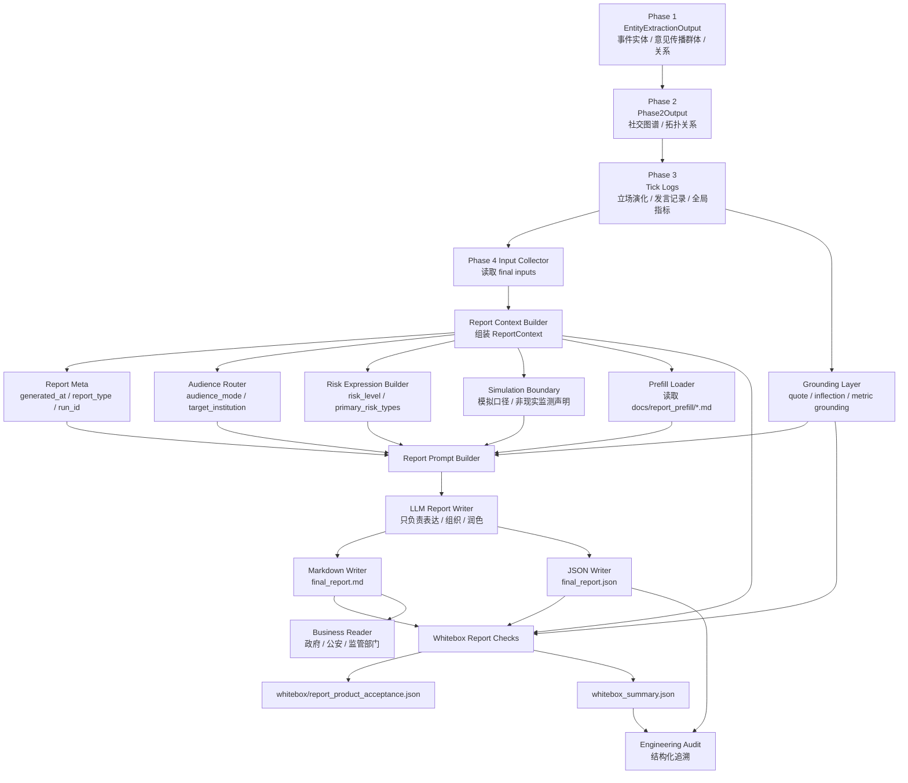

# Phase 4 Report Product Governance Track 路线图 v0.1

> 文档类型：阶段性建设路线图 / Report Governance Track Plan  
> 适用系统：Adarian 多智能体舆情推演系统  
> 当前基线：v1.2.6 Schema Split Governance & Contract Library Boundary 已收口  
> 前置 PRD：Adarian Report Product Contract PRD v0.1  
> 建议起始版本：v1.2.7 - Report Product Contract & Markdown Grounding  
> 文档状态：planning draft / ready for DS review  
> 生成日期：2026-05-11  

---

## 0. 阶段定位

本阶段建议命名为：

```text
Phase 4 Report Product Governance Track
```

阶段目标：

```text
把 Phase 4 从“报告生成器”升级为“可审计、可复盘、可产品化的报告交付层”。
```

当前系统已经完成 v1.2.6 Schema Split Governance，contract library 边界已经稳定。下一阶段可以在不破坏 Phase 1-3 主链的前提下，推进 Phase 4 报告产品治理。

---

## 1. 大阶段总目标

```text
在不破坏 Phase 1-3 主链行为的前提下，
让 final_report.md / final_report.json 从技术输出，
升级为面向政府、公安、监管部门可读、可审、可追溯的模拟推演型舆情风险研判报告。
```

---

## 2. 大阶段允许范围

本大阶段允许做：

```text
1. Phase 4 report context 增强
2. Markdown 报告表达治理
3. 风险等级与风险类型结构化
4. 阅读主体路由
5. generated_at / report_type / audience_mode 等元信息
6. Markdown prefill 接口
7. whitebox 报告验收
8. fixture-based report generation 测试
9. Phase 4 内部模块边界整理
```

---

## 3. 大阶段禁止范围

本大阶段暂不做：

```text
1. 外部检索
2. 政策知识库
3. 双输出模式正式实现
4. 复杂可视化
5. 完整风险分类器
6. 完整 representative comment selector
7. 完整 inflection detector 重构
8. Phase 1-3 主链行为修改
9. RuntimeLogger 职责变更
10. speaker selector 策略变更
```

---

# 4. 版本路线总览

建议路线：

```text
v1.2.7  - Report Product Contract & Markdown Grounding
v1.2.8  - Report Context Contract & Audience Routing
v1.2.9  - Risk Taxonomy & Risk Expression Governance
v1.2.10 - Markdown Prefill Interface & Report Asset Boundary
v1.2.11 - Representative Comment & Inflection Grounding
v1.2.12 - Report Whitebox Acceptance & Fixture Harness
v1.2.13 - Phase 4 Report Architecture Hardening
```

---

# 5. v1.2.7 — Report Product Contract & Markdown Grounding

## 5.1 定位

产品侧报告 contract 第一落地版。

## 5.2 既定目标

```text
把 PRD 中已冻结的报告产品规则落到 Phase 4 的 report context 和 Markdown 生成约束中。
```

## 5.3 核心任务

```text
1. 增加 report_meta：
   - generated_at
   - timezone
   - report_type
   - event_name
   - total_ticks
   - simulation_run_id

2. 增加 audience_mode：
   - generic_government
   - regulator_facing
   - law_enforcement_facing
   - public_management_facing

3. 增加风险表达结构：
   - risk_level
   - risk_level_label
   - primary_risk_types
   - risk_type_labels
   - risk_explanation

4. Markdown 正文改为：
   - 指标后台化
   - 判断前台化
   - 模拟推演口径
   - 不写现实事实化表达

5. 保持现有五章模板：
   - 一、舆情概要
   - 二、演化分析
   - 三、风险研判
   - 四、对策建议
   - 五、附录
```

## 5.4 禁止事项

```text
1. 不改 Phase 1-3。
2. 不做双输出模式。
3. 不接外部检索。
4. 不接政策知识库。
5. 不让 LLM 自行重算指标。
6. 不让 LLM 自由发明风险类型。
```

## 5.5 收口标准

```text
1. final_report.md 顶部包含 generated_at。
2. final_report.json 包含 generated_at。
3. Markdown 与 JSON 时间一致。
4. 报告明确是“模拟推演型舆情风险研判报告”。
5. 风险研判章节包含“风险等级 + 主要风险类型 + 风险解释”。
6. 正文不大面积裸露 event_scale / polarization_index 等技术指标。
7. 不出现“全网已经”“公众普遍认为”等现实事实化表达。
8. pytest / targeted report fixture 通过。
9. 最终 closeout 跑一次 smoke test。
```

## 5.6 预计产物

```text
src/phase4/report_agent.py
tests/test_report_product_contract.py
tests/test_report_markdown_grounding.py
whitebox/report_product_check.json
final_report.json 新增 report_meta / risk fields
final_report.md 新版表达
docs/iterations/v1.2.7 - Report Product Contract & Markdown Grounding.md
docs/iterations/TASK_LOG.md
docs/iterations/CHANGELOG.md
```

---

# 6. v1.2.8 — Report Context Contract & Audience Routing

## 6.1 定位

报告上下文契约稳定版。

## 6.2 既定目标

```text
把 Phase 4 输入上下文从“拼接材料”升级为稳定的 ReportContext Contract。
```

## 6.3 核心任务

```text
1. 建立 ReportContext 结构。
2. audience_mode 从 ad-hoc 逻辑收敛为可测试函数。
3. 承压主体识别进入 report context。
4. 生成 target_institution / institution_type / audience_reason。
5. 将 seed_input、event_entities、relations、risk_assessment 的消费关系显式化。
```

## 6.4 推荐字段

```json
{
  "report_context": {
    "report_meta": {},
    "audience_profile": {
      "audience_mode": "law_enforcement_facing",
      "target_institution": "某地公安机关",
      "institution_type": "police",
      "routing_reason": "种子材料中出现对执法程序的负面质疑"
    },
    "risk_assessment": {},
    "simulation_boundary": {}
  }
}
```

## 6.5 禁止事项

```text
1. 不把 audience routing 交给 LLM 自由判断。
2. 不引入复杂 NER 重构。
3. 不新增外部检索依赖。
4. 不改变 Phase 1 实体抽取 schema。
```

## 6.6 收口标准

```text
1. audience_mode 至少支持 4 类路由。
2. 给定 fixture seed，可以稳定识别监管 / 执法 / 公共管理 / 泛政府场景。
3. report context 可单独构建与测试。
4. LLM 只消费 audience_profile，不自行改写。
5. whitebox 能记录 audience routing 结果。
```

## 6.7 预计产物

```text
src/phase4/report_context.py
src/phase4/audience_router.py
tests/test_report_audience_router.py
tests/test_report_context_contract.py
whitebox/report_context_check.json
docs/contracts/report-context-contract-v1.2.8.md
```

---

# 7. v1.2.9 — Risk Taxonomy & Risk Expression Governance

## 7.1 定位

风险表达结构治理版。

## 7.2 既定目标

```text
把“风险等级 + 主要风险类型 + 风险解释”固化为可维护的 report risk taxonomy。
```

## 7.3 核心任务

```text
1. 建立风险类型白名单。
2. 建立 risk_level 中文 label 映射。
3. 建立 primary_risk_types 校验。
4. Markdown 只展示中文标签与解释。
5. JSON / whitebox 保留英文 key。
```

## 7.4 初始风险类型

```text
fact_dispute_risk               事实争议风险
procedure_dispute_risk          程序争议风险
regulatory_accountability_risk  监管责任质疑风险
law_enforcement_trust_risk      执法公信力风险
response_delay_risk             回应滞后风险
information_opacity_risk        信息不透明风险
negative_narrative_risk         负面叙事聚合风险
group_polarization_risk         群体对立风险
secondary_spread_risk           次生传播风险
overseas_amplification_risk     境外放大风险
rumor_spread_risk               谣言扩散风险
institution_image_risk          机构形象风险
local_governance_pressure_risk  属地治理压力风险
```

## 7.5 禁止事项

```text
1. 不让 LLM 自由发明风险类型。
2. 不做完整风险分类器。
3. 不引入机器学习分类模型。
4. 不把风险类型写死在 prompt 里。
```

## 7.6 收口标准

```text
1. risk_type key 必须来自白名单。
2. risk_type_label 必须与 key 匹配。
3. Markdown 中风险类型稳定呈现。
4. unknown risk type 会被 whitebox 标记。
5. 不影响原有 risk_level 输出兼容性。
```

## 7.7 预计产物

```text
src/phase4/risk_taxonomy.py
src/phase4/risk_expression.py
tests/test_report_risk_taxonomy.py
tests/test_report_risk_expression.py
whitebox/risk_taxonomy_check.json
docs/contracts/report-risk-taxonomy-v1.2.9.md
```

---

# 8. v1.2.10 — Markdown Prefill Interface & Report Asset Boundary

## 8.1 定位

说明性内容资产化接口版。

## 8.2 既定目标

```text
将项目说明、模拟口径、指标解释、公式依据、模型限制等说明性内容，
从 prompt 自由生成中剥离出来，改为 Markdown 文件注入。
```

## 8.3 核心任务

```text
1. 支持读取 docs/report_prefill/report_appendix_static.md。
2. 将 Markdown 片段注入 report context。
3. final_report.md 附录可插入 prefill 内容。
4. 文件不存在时 graceful degrade。
5. whitebox 记录 prefill 加载状态。
```

## 8.4 推荐目录

```text
docs/report_prefill/
  report_appendix_static.md
```

后续可扩展为：

```text
docs/report_prefill/
  project_intro.md
  simulation_scope.md
  data_source_note.md
  metric_explanation.md
  formula_note.md
  model_limitations.md
```

## 8.5 禁止事项

```text
1. 不在代码里硬编码说明性正文。
2. 不用假数据填充 prefill。
3. 不让 LLM 改写公式、指标定义和能力边界。
4. 不把 prefill 缺失作为主链失败。
```

## 8.6 收口标准

```text
1. prefill md 存在时可注入报告附录。
2. prefill md 不存在时主链不失败。
3. whitebox 记录 prefill_loaded / prefill_source_path。
4. LLM 不改写 prefill 中的指标定义。
5. final_report.md 附录结构稳定。
```

## 8.7 预计产物

```text
src/phase4/prefill_loader.py
docs/report_prefill/report_appendix_static.md
tests/test_report_prefill_loader.py
tests/test_report_prefill_graceful_degrade.py
whitebox/prefill_check.json
docs/contracts/report-prefill-interface-v1.2.10.md
```

---

# 9. v1.2.11 — Representative Comment & Inflection Grounding

## 9.1 定位

代表性发言与拐点解释治理版。

## 9.2 既定目标

```text
不是重构完整 selector / detector，
而是先治理报告中“代表性发言”和“拐点解释”的可信边界。
```

## 9.3 核心任务

```text
1. 代表性发言只能来自 tick_logs / code-owned candidates。
2. 不允许 LLM 虚构发言。
3. 代表性发言必须绑定 group / tick / risk_reason。
4. 拐点不存在时明确写“本轮模拟未发现显著拐点”。
5. 拐点解释只解释 code-owned inflection_points。
```

## 9.4 禁止事项

```text
1. 不做完整 representative selector。
2. 不做完整 inflection detector 重构。
3. 不用 LLM 自己找拐点。
4. 不用 LLM 自己生成代表性发言。
5. 不把单个极端发言包装成主流观点。
```

## 9.5 收口标准

```text
1. Markdown 中所有代表性发言能在 tick_logs 中追溯。
2. 每条代表性发言有 group_name / tick / source。
3. 如果 JSON 中无 inflection_points，Markdown 不得声称有显著拐点。
4. 如果 JSON 中有 inflection_points，Markdown 只能解释这些拐点。
5. whitebox 可检查 quote traceability。
```

## 9.6 预计产物

```text
src/phase4/quote_grounding.py
src/phase4/inflection_grounding.py
tests/test_representative_quote_grounding.py
tests/test_inflection_markdown_consistency.py
whitebox/quote_grounding_check.json
whitebox/inflection_grounding_check.json
docs/contracts/report-grounding-v1.2.11.md
```

---

# 10. v1.2.12 — Report Whitebox Acceptance & Fixture Harness

## 10.1 定位

报告验收基础设施版。

## 10.2 既定目标

```text
让 Phase 4 报告质量可以通过 fixture-based verification 验收，
而不是每次都跑完整 smoke test。
```

## 10.3 核心任务

```text
1. 建立 Phase 4 fixture 输入。
2. 建立 report generation targeted tests。
3. 建立 whitebox report acceptance checklist。
4. 检查 Markdown / JSON 一致性。
5. 检查模拟口径、生成时间、风险类型、指标裸露等风险。
```

## 10.4 重点检查项

```text
1. generated_at 一致性
2. report_type 是否存在
3. audience_mode 是否存在
4. risk_type 是否来自白名单
5. Markdown 是否出现现实事实化表达
6. Markdown 是否大面积裸露技术指标
7. 代表性发言是否可追溯
8. 拐点是否与 JSON 一致
9. prefill 是否正确加载或降级
10. 是否误触双模式输出
```

## 10.5 禁止事项

```text
1. 不要求每个 attempt 都跑完整 smoke。
2. 不把 Phase 4 fixture 测试扩展成端到端 benchmark。
3. 不引入外部服务依赖。
```

## 10.6 收口标准

```text
1. fixture-based report generation 通过。
2. whitebox report acceptance 通过。
3. targeted tests 可在无 LLM 或低 LLM 依赖场景下运行。
4. final closeout 可再跑一次完整 smoke。
```

## 10.7 预计产物

```text
tests/fixtures/report_context_basic.json
tests/fixtures/report_context_law_enforcement.json
tests/fixtures/report_context_regulator.json
tests/test_report_whitebox_acceptance.py
src/whitebox/report_product_acceptance.py
whitebox/report_product_acceptance.json
docs/contracts/report-whitebox-acceptance-v1.2.12.md
```

---

# 11. v1.2.13 — Phase 4 Report Architecture Hardening

## 11.1 定位

Phase 4 架构收口版。

## 11.2 既定目标

```text
把前面几个版本形成的 report context、risk taxonomy、prefill、grounding、whitebox acceptance
收束成稳定 Phase 4 架构。
```

## 11.3 核心任务

```text
1. 拆分 Phase 4 report_agent 中过重函数。
2. 明确 report_context_builder / prompt_builder / markdown_writer / json_writer / whitebox_checker 边界。
3. 把 prompt 语义和 data assembly 解耦。
4. 为后续 Prompt Registry / Report Template Registry 做接口准备。
5. 文档同步 Phase 4 架构图。
```

## 11.4 禁止事项

```text
1. 不重写 Phase 4 业务语义。
2. 不引入新报告模板。
3. 不实现双模式。
4. 不接外部检索。
5. 不改 Phase 1-3。
```

## 11.5 收口标准

```text
1. Phase 4 模块职责清晰。
2. report_agent 不再承担所有职责。
3. 所有现有 report tests 通过。
4. smoke test 通过。
5. dev_spec / PRD / iteration doc 同步。
```

## 11.6 预计产物

```text
src/phase4/report_context.py
src/phase4/report_prompt_builder.py
src/phase4/report_markdown_writer.py
src/phase4/report_json_writer.py
src/phase4/report_contract.py
src/phase4/report_agent.py
tests/test_phase4_architecture_imports.py
docs/dev_spec.md 更新
docs/architecture/phase4-report-architecture-v1.2.13.md
```

---

# 12. 大阶段总收口标准

整个 Phase 4 Report Product Governance Track 收口时，应满足：

```text
1. final_report.md 面向业务阅读，不再像技术测试报告。
2. final_report.json 保留结构化指标和追溯字段。
3. whitebox 能检查报告产品 contract。
4. 报告明确区分模拟推演结果与现实舆情事实。
5. 报告顶部有 generated_at。
6. 风险研判采用“风险等级 + 主要风险类型 + 风险解释”。
7. 阅读主体路由可验证。
8. 风险类型来自白名单。
9. 代表性发言和拐点可追溯。
10. Prefill 说明性内容可由外部 Markdown 维护。
11. Phase 4 架构边界清楚。
12. 后续可以安全进入双模式、外部检索、政策知识库等增强版本。
```

---

# 13. 推荐工期排布

## 13.1 第一周：v1.2.7

```text
Day 1：
v1.2.7 迭代文档 + DS Pre-Audit

Day 2：
v1.2.7 attempt-01
Report metadata / generated_at / report_type / audience_mode

Day 3：
v1.2.7 attempt-02
Risk expression / Markdown grounding / simulation wording

Day 4：
fixture-based tests + whitebox checks

Day 5：
DS Verify / Accept

Day 6：
小修补 + TASK_LOG / CHANGELOG / dev_spec 同步

Day 7：
Control Gate / closeout
```

## 13.2 后续节奏

```text
Week 2：
v1.2.8 + v1.2.9
Report Context Contract + Risk Taxonomy

Week 3：
v1.2.10 + v1.2.11
Prefill Interface + Quote / Inflection Grounding

Week 4：
v1.2.12 + v1.2.13
Whitebox Acceptance + Phase 4 Architecture Hardening
```

---

# 14. Phase 4 后续架构图



---

# 15. Phase 4 目标模块结构建议

后续收口后，Phase 4 可以演进为：

```text
src/phase4/
  __init__.py
  report_agent.py              # 对外入口，保持轻量编排
  report_context.py            # ReportContext 构建
  audience_router.py           # 阅读主体路由
  risk_taxonomy.py             # 风险类型白名单
  risk_expression.py           # 风险等级 + 风险类型表达
  prefill_loader.py            # Markdown prefill 注入
  quote_grounding.py           # 代表性发言追溯
  inflection_grounding.py      # 拐点一致性约束
  report_prompt_builder.py     # prompt 组装
  report_markdown_writer.py    # Markdown 输出
  report_json_writer.py        # JSON 输出
```

Whitebox 对应：

```text
src/whitebox/
  report_product_acceptance.py
  report_context_check.py
  risk_taxonomy_check.py
  prefill_check.py
  quote_grounding_check.py
  inflection_grounding_check.py
```

文档资产：

```text
docs/report_prefill/
  report_appendix_static.md

docs/contracts/
  report-context-contract-v1.2.8.md
  report-risk-taxonomy-v1.2.9.md
  report-prefill-interface-v1.2.10.md
  report-grounding-v1.2.11.md
  report-whitebox-acceptance-v1.2.12.md

docs/architecture/
  phase4-report-architecture-v1.2.13.md
```

---

## 16. Control Agent 建议

```text
v1.2.7 先别贪多，只打穿 Report Product Contract & Markdown Grounding。
```

理由：

```text
它是整个 Phase 4 产品化的第一颗钉子。
先钉稳 generated_at、report_type、audience_mode、风险等级、风险类型和模拟口径，
后面的 risk taxonomy、prefill、whitebox、架构拆分才会顺。
```
