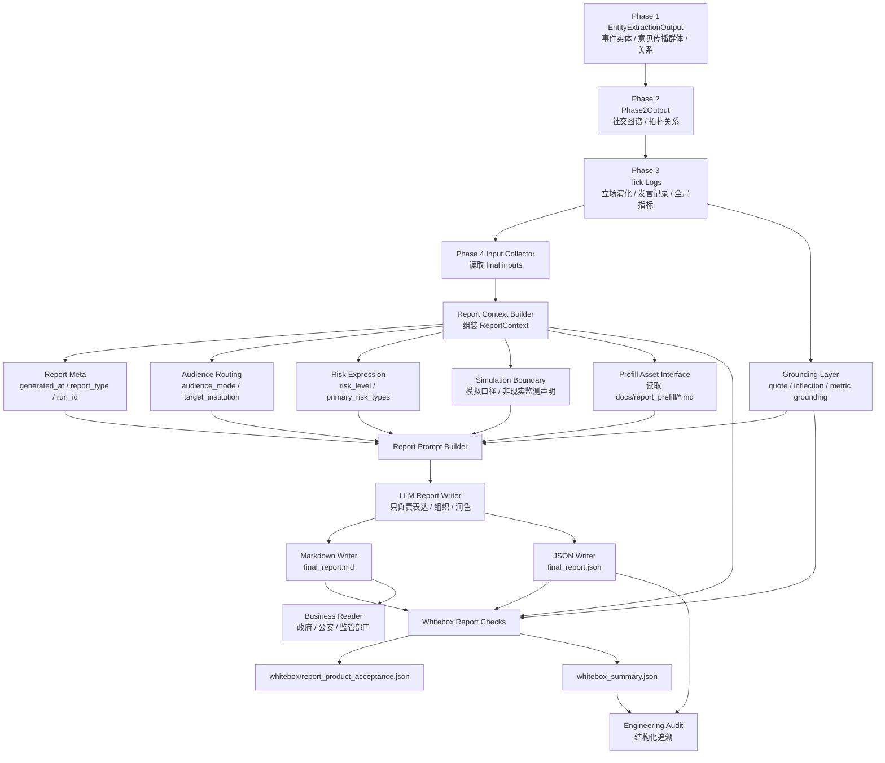

# Phase 4 Report Product Governance Track 路线图 v0.2

> 文档类型：阶段性建设路线图 / Report Governance Track Plan  
> 适用系统：Adarian 多智能体舆情推演系统  
> 当前基线：v1.2.6 Schema Split Governance & Contract Library Boundary 已收口  
> 前置 PRD：Adarian Report Product Contract PRD v0.1  
> 前置审查：DS Agent Team Review，verdict = CONDITIONAL_GO  
> 起始版本：v1.2.7 - Phase 4 Report Product Governance Sprint  
> 文档状态：v0.2.1 revised / prompt externalization amended  
> 生成日期：2026-05-11  

---

## 0. v0.2 修订说明

本路线图 v0.2 基于以下事实修订：

```text
1. v1.2.6 Schema Split Governance 已完成 closeout，acceptance_result = pass。
2. 原 v0.1 路线图按 v1.2.7-v1.2.13 慢拆方式规划。
3. Owner 当前目标调整为：一周内尽量完成 Phase 4 报告产品化 R0 闭环。
4. DS Agent Team 对 v0.1 路线图给出 CONDITIONAL_GO。
5. DS 明确指出：v1.2.7 一周可落地，但必须修正 9 项 must-fix。
```

因此 v0.2 的核心修订是：

```text
不再把 v1.2.7 设计成单一小版本；
而是压缩为一个 L-Level 一周冲刺版本：

v1.2.7 - Phase 4 Report Product Governance Sprint
```

本版本的“完整”定义为：

```text
Phase 4 报告产品化 R0 闭环完成。
```

而不是：

```text
理想态 Phase 4 架构全部完成。
```

---

## 1. 阶段定位

本阶段命名为：

```text
Phase 4 Report Product Governance Track
```

阶段目标：

```text
把 Phase 4 从“报告生成器”升级为“可审计、可复盘、可产品化的报告交付层”。
```

v0.2 修正后，本阶段先采用：

```text
一周冲刺 R0 闭环
+
后续能力延展
```

而不是一开始就执行完整架构拆分。

---

## 2. 大阶段总目标

```text
在不破坏 Phase 1-3 主链行为的前提下，
让 final_report.md / final_report.json / whitebox 从技术输出，
升级为面向政府、公安、监管部门可读、可审、可追溯的模拟推演型舆情风险研判报告。
```

---

## 3. v0.2 总边界

### 3.1 本阶段允许做

```text
1. Phase 4 report context 增强
2. Markdown 报告表达治理
3. 风险等级与风险类型结构化
4. 阅读主体路由最小实现
5. generated_at / report_type / audience_mode 等元信息
6. whitebox 报告验收对齐
7. fixture-based report generation 测试
8. Markdown prefill 接口预留
9. 后续 Phase 4 架构拆分准备
```

### 3.2 本阶段暂不做

```text
1. 外部检索
2. 政策知识库
3. 双输出模式正式实现
4. 复杂可视化
5. 完整 risk classifier
6. 完整 representative comment selector
7. 完整 inflection detector 重构
8. Phase 1-3 主链行为修改
9. RuntimeLogger 职责变更
10. speaker selector 策略变更
```

---

## 4. DS Review 采纳项

DS 原始审查给出 `CONDITIONAL_GO`，无 hard blocker，但要求在 v1.2.7 迭代文档前修正 9 项问题。

v0.2 全部采纳如下：

### 4.1 风险类型白名单前移

原路线问题：

```text
v1.2.7 使用 primary_risk_types；
但风险白名单在 v1.2.9 才建立。
```

v0.2 修正：

```text
v1.2.7 前移轻量内置风险类型白名单。
但不创建独立 risk_taxonomy.py。
不实现完整 risk classifier。
```

### 4.2 风险等级枚举保持当前 4 级

原路线问题：

```text
PRD 6 级 vs 当前代码 4 级存在冲突。
```

v0.2 修正：

```text
v1.2.7 沿用当前代码 4 级：
low / medium / high / critical

新增中文 label：
low      → 低风险
medium   → 中风险
high     → 高风险
critical → 重大风险

PRD 中“中低 / 中高”作为后续产品表达预留，不进入本轮底层 enum。
```

### 4.3 audience_mode 使用最小 deterministic 规则

v0.2 修正：

```text
v1.2.7 不创建 audience_router.py。
使用 report_agent.py 内最小关键词规则：

默认：
generic_government

公安 / 交警 / 派出所 / 执法 / 警方：
law_enforcement_facing

市监局 / 市场监督管理局 / 监管部门 / 食药监：
regulator_facing

教育局 / 卫健委 / 住建局 / 属地政府 / 街道办：
public_management_facing
```

### 4.4 禁止未实现能力伪装

v1.2.7 Markdown grounding 必须禁止：

```text
1. 综合全网信息显示
2. 依据相关法规建议
3. 系统已识别最具代表性观点
4. 全网舆情已经
5. 公众普遍认为
6. 现实中已经形成
```

### 4.5 对策建议边界纳入 prompt

v1.2.7 必须明确：

```text
系统输出的是舆情风险防范建议，
不是法律意见、行政处罚建议或正式决策指令。
```

### 4.6 五章模板对齐

v1.2.7 采用产品侧已通过的五章式模板：

```text
一、舆情概要
二、演化分析
三、风险研判
四、对策建议
五、附录
```

不新增“核心结论”第一章。

### 4.7 增加 Doc Patch 缓冲

v1.2.7 Codex attempt 前必须完成：

```text
1. Owner 审阅迭代文档。
2. 如 DS / Owner 提出边界修正，先 patch iteration doc。
3. 文档未冻结前，不得开始 Codex attempt。
```

### 4.8 拐点归属修正

v0.2 统一为：

```text
拐点由代码侧 / deterministic logic / whitebox 提供。
LLM 只负责解释 code-owned inflection_points。
无显著拐点时写：本轮模拟未发现显著拐点。
```

### 4.9 whitebox section headings 对齐

v1.2.7 必须更新 whitebox section matcher：

```text
旧：
事件概述 / 舆情态势 / 风险评估 / 处置建议

新：
舆情概要 / 演化分析 / 风险研判 / 对策建议 / 附录
```

---


# 4.10 Prompt 外置化补充

Owner 明确要求后续 Phase 4 prompt 应单独文件承载，方便 Prompt Governance / Prompt Registry / prompt 版本治理。

v0.2.1 修正：

```text
v1.2.7 允许新增 src/phase4/report_prompts.py，
用于承接 Phase 4 静态 prompt 文本和 Markdown grounding rules。
```

边界：

```text
1. 不创建完整 report_prompt_builder.py。
2. 不引入 Prompt Registry。
3. 不创建 docs/prompts/phase4/ 作为本轮硬目标。
4. 不新增双模板 / 双输出模式。
5. 不改变 Phase 4 报告生成主链语义。
```

后续演进：

```text
v1.2.7：
  src/phase4/report_prompts.py 承接静态 prompt 常量。

v1.2.12 或后续 Prompt Governance：
  再升级为 report_prompt_builder.py 或 docs/prompts/phase4/ 资产目录。
```


# 5. v1.2.7 — Phase 4 Report Product Governance Sprint

## 5.1 定位

一周冲刺版，Phase 4 报告产品化 R0 闭环。

## 5.2 主目标

```text
在一周内完成 Phase 4 报告产品化 R0 闭环：
让 final_report.md / final_report.json / whitebox 从技术输出升级为面向业务阅读、可追溯、可验收的模拟推演型舆情风险研判报告产物。
```

## 5.3 必须做

```text
1. report_meta
   - generated_at
   - timezone
   - report_type
   - event_name
   - total_ticks
   - simulation_run_id

2. audience_mode 最小实现
   - generic_government
   - regulator_facing
   - law_enforcement_facing
   - public_management_facing

3. risk expression
   - risk_level 沿用当前 4 级枚举
   - risk_level_label 中文映射
   - primary_risk_types
   - risk_type_labels
   - risk_explanation

4. Markdown grounding
   - 模拟推演口径
   - 禁止现实事实化表达
   - 指标后台化，判断前台化
   - 对策建议不越界
   - 禁止伪装外部检索 / 政策知识库 / 完整 selector

5. whitebox check 对齐
   - REQUIRED_SECTION_GROUPS 更新为五章模板
   - 检查 generated_at 一致性
   - 检查 report_type
   - 检查 audience_mode
   - 检查 risk_type 是否来自白名单
```

## 5.4 明确不做

```text
1. 不创建 audience_router.py
2. 不创建 risk_taxonomy.py
3. 不创建 prefill_loader.py
4. 不创建 quote_grounding.py
5. 不创建 inflection_grounding.py
6. 不创建完整 report_prompt_builder.py
7. 不创建 report_markdown_writer.py
8. 不创建 report_json_writer.py
9. 不拆 report_agent.py 大架构
10. 不实现双输出模式
11. 不接外部检索
12. 不接政策知识库
13. 不做完整 representative selector
14. 不重构完整 inflection detector
15. 不修改 Phase 1-3 主链
```

---

## 5.5 attempt 拆分

### attempt-v1.2.7-01：Report Contract Fields & Metadata Wiring

目标：

```text
1. 扩展 schemas/phase4.py 或现有 Phase4Output 相关结构。
2. 增加 report_meta。
3. 增加 audience_mode。
4. 增加 risk_level_label / primary_risk_types / risk_type_labels。
5. final_report.json 写入新字段。
6. final_report.md 顶部展示 generated_at。
```

允许修改：

```text
src/schemas/phase4.py
src/phase4/report_agent.py
tests/test_report_product_contract.py
```

验收：

```text
1. final_report.json 包含 report_meta。
2. final_report.md 顶部展示 generated_at。
3. generated_at 由代码侧生成，不由 LLM 生成。
4. audience_mode 可根据 fixture 稳定输出。
5. risk_level_label 映射稳定。
6. primary_risk_types 来自轻量白名单。
7. 不修改 Phase 1-3。
```

---

### attempt-v1.2.7-02：Markdown Grounding & Whitebox Alignment

目标：

```text
1. 风险研判采用“风险等级 + 主要风险类型 + 风险解释”。
2. Markdown 减少指标裸露。
3. Markdown 明确模拟推演口径。
4. 禁止现实事实化表达。
5. 禁止未实现能力伪装。
6. 对策建议不越界。
7. whitebox REQUIRED_SECTION_GROUPS 对齐五章模板。
8. 增加 targeted tests。
```

允许修改：

```text
src/phase4/report_agent.py
src/phase4/report_prompts.py  # 允许新增，承接静态 prompt 文本
src/whitebox/report_completeness.py
src/whitebox/report_observer.py  # 如确有必要
tests/test_report_markdown_grounding.py
```

验收：

```text
1. Markdown 风险章节结构稳定。
2. 不让 LLM 自由发明风险类型。
3. 不让 LLM 自行重算指标。
4. 不出现 forbidden phrases。
5. whitebox section headings 与五章模板一致。
6. targeted tests 通过。
```

---

### attempt-v1.2.7-closeout-patch：Docs + Smoke + Acceptance Evidence

目标：

```text
1. 修补 DS Verify 发现的小问题。
2. 同步 TASK_LOG / CHANGELOG / dev_spec。
3. 跑最终 smoke test。
4. 生成 closeout evidence。
```

验收：

```text
1. py_compile 通过。
2. targeted tests 通过。
3. smoke test1 通过。
4. final_report.md / final_report.json / whitebox 产物齐全。
5. TASK_LOG / CHANGELOG / dev_spec 同步。
```

---

## 5.6 v1.2.7 硬验收标准

```text
1. final_report.md 顶部包含 generated_at。
2. final_report.json 包含 generated_at。
3. generated_at 由代码侧生成，不由 LLM 生成。
4. Markdown 与 JSON generated_at 一致。
5. 报告明确为“模拟推演型舆情风险研判报告”。
6. 风险研判采用“风险等级 + 主要风险类型 + 风险解释”结构。
7. risk_level 沿用当前 4 级枚举，不擅自扩展底层 enum。
8. risk_level_label 映射正确。
9. primary_risk_types 来自轻量白名单。
10. audience_mode 存在且有默认值。
11. Markdown 不出现现实事实化表达。
12. Markdown 不出现未实现能力伪装表达。
13. 对策建议不越界。
14. 正文不大面积裸露技术指标。
15. whitebox section headings 与五章模板一致。
16. py_compile 通过。
17. targeted tests 通过。
18. closeout smoke test1 通过。
19. 未修改 Phase 1-3 主链。
20. 未创建禁止的新架构模块。
```

---

## 5.7 v1.2.7 预计产物

```text
src/schemas/phase4.py
src/phase4/report_agent.py
src/phase4/report_prompts.py  # 允许新增，承接静态 prompt 文本
src/whitebox/report_completeness.py
src/whitebox/report_observer.py  # 如确有必要
tests/test_report_product_contract.py
tests/test_report_markdown_grounding.py
docs/iterations/v1.2.7 - Phase 4 Report Product Governance Sprint.md
docs/iterations/TASK_LOG.md
docs/iterations/CHANGELOG.md
docs/dev_spec.md
final_report.json 新增 report_meta / audience_mode / risk expression
final_report.md 新版表达
whitebox/report_completeness.json 对齐五章模板
```

---

# 6. v1.2.8 — Report Context Contract & Audience Routing

## 6.1 定位

从 v1.2.7 的最小内嵌规则，升级为稳定的 ReportContext 与 audience routing 模块。

## 6.2 既定目标

```text
把 Phase 4 输入上下文从“临时拼接材料”升级为稳定的 ReportContext Contract。
```

## 6.3 核心任务

```text
1. 建立 ReportContext 结构。
2. audience_mode 从 report_agent.py 内嵌逻辑迁出为可测试函数。
3. 承压主体识别进入 report context。
4. 生成 target_institution / institution_type / audience_reason。
5. 将 seed_input、event_entities、relations、risk_assessment 的消费关系显式化。
```

## 6.4 预计产物

```text
src/phase4/report_context.py
src/phase4/audience_router.py
tests/test_report_audience_router.py
tests/test_report_context_contract.py
whitebox/report_context_check.json
docs/contracts/report-context-contract-v1.2.8.md
```

---

# 7. v1.2.9 — Risk Taxonomy & Risk Expression Governance

## 7.1 定位

从 v1.2.7 的轻量内置白名单，升级为可维护的 report risk taxonomy。

## 7.2 既定目标

```text
把“风险等级 + 主要风险类型 + 风险解释”固化为可维护、可校验、可扩展的风险表达接口。
```

## 7.3 核心任务

```text
1. 将 v1.2.7 内置白名单迁出为 risk_taxonomy.py。
2. 建立 risk_level 中文 label 映射。
3. 建立 primary_risk_types 校验。
4. Markdown 只展示中文标签与解释。
5. JSON / whitebox 保留英文 key。
```

## 7.4 预计产物

```text
src/phase4/risk_taxonomy.py
src/phase4/risk_expression.py
tests/test_report_risk_taxonomy.py
tests/test_report_risk_expression.py
whitebox/risk_taxonomy_check.json
docs/contracts/report-risk-taxonomy-v1.2.9.md
```

---

# 8. v1.2.10 — Report Asset Interface & Whitebox Harness

## 8.1 v0.2 修正

原 v0.1 中：

```text
v1.2.10 = Markdown Prefill Interface
v1.2.12 = Report Whitebox Acceptance
```

DS 指出 v1.2.10 偏薄、v1.2.12 单独存在偏薄。

v0.2 修正为：

```text
v1.2.10 - Report Asset Interface & Whitebox Harness
```

合并内容：

```text
1. Markdown Prefill Interface
2. Report Whitebox Acceptance
3. Fixture Harness
```

## 8.2 既定目标

```text
将说明性内容资产化接口与报告验收基础设施合并推进，
让报告附录说明、whitebox 检查、fixture-based verification 形成稳定闭环。
```

## 8.3 核心任务

```text
1. 支持读取 docs/report_prefill/report_appendix_static.md。
2. 将 Markdown 片段注入 report context。
3. 文件不存在时 graceful degrade。
4. whitebox 记录 prefill 加载状态。
5. 建立 Phase 4 fixture 输入。
6. 建立 report generation targeted tests。
7. 检查 Markdown / JSON 一致性。
8. 检查模拟口径、生成时间、风险类型、指标裸露等风险。
```

## 8.4 禁止事项

```text
1. 不在代码里硬编码说明性正文。
2. 不用假数据填充 prefill。
3. 不让 LLM 改写公式、指标定义和能力边界。
4. 不把 prefill 缺失作为主链失败。
5. 不要求每个 attempt 都跑完整 smoke。
6. 不引入外部服务依赖。
```

## 8.5 预计产物

```text
src/phase4/prefill_loader.py
src/whitebox/report_product_acceptance.py
tests/fixtures/report_context_basic.json
tests/fixtures/report_context_law_enforcement.json
tests/fixtures/report_context_regulator.json
tests/test_report_prefill_loader.py
tests/test_report_prefill_graceful_degrade.py
tests/test_report_whitebox_acceptance.py
docs/report_prefill/report_appendix_static.md
docs/contracts/report-asset-and-whitebox-harness-v1.2.10.md
```

---

# 9. v1.2.11 — Representative Comment & Inflection Grounding

## 9.1 定位

代表性发言与拐点解释治理版。

## 9.2 既定目标

```text
不是重构完整 selector / detector，
而是治理报告中“代表性发言”和“拐点解释”的可信边界。
```

## 9.3 核心任务

```text
1. 代表性发言只能来自 tick_logs / code-owned candidates。
2. 不允许 LLM 虚构发言。
3. 代表性发言必须绑定 group / tick / risk_reason。
4. 拐点不存在时明确写“本轮模拟未发现显著拐点”。
5. 拐点解释只解释 code-owned inflection_points。
```

## 9.4 预计产物

```text
src/phase4/quote_grounding.py
src/phase4/inflection_grounding.py
tests/test_representative_quote_grounding.py
tests/test_inflection_markdown_consistency.py
whitebox/quote_grounding_check.json
whitebox/inflection_grounding_check.json
docs/contracts/report-grounding-v1.2.11.md
```

---

# 10. v1.2.12 — Phase 4 Report Architecture Hardening

## 10.1 v0.2 修正

原 v0.1 中 v1.2.13 偏厚，DS 建议不要一次性做 5+ 模块大拆分。

v0.2 修正为：

```text
v1.2.12 - Phase 4 Report Architecture Hardening
```

且要求：

```text
渐进拆分，不一次性重写。
```

## 10.2 既定目标

```text
把前面版本形成的 report context、audience routing、risk taxonomy、prefill、grounding、whitebox acceptance，
收束为稳定 Phase 4 架构。
```

## 10.3 核心任务

```text
1. 拆分 report_agent.py 中最重且最稳定的部分。
2. 明确 report_context_builder / prompt_builder / markdown_writer / json_writer / whitebox_checker 边界。
3. 把 prompt 语义和 data assembly 解耦。
4. 为后续 Prompt Registry / Report Template Registry 做接口准备。
5. 文档同步 Phase 4 架构图。
```

## 10.4 禁止事项

```text
1. 不重写 Phase 4 业务语义。
2. 不引入新报告模板。
3. 不实现双模式。
4. 不接外部检索。
5. 不改 Phase 1-3。
6. 不一次性重写 report_agent.py。
```

## 10.5 预计产物

```text
src/phase4/report_context.py
src/phase4/report_prompt_builder.py       # 如已稳定
src/phase4/report_markdown_writer.py      # 如已稳定
src/phase4/report_json_writer.py          # 如已稳定
src/phase4/report_contract.py             # 如确有必要
src/phase4/report_agent.py                # 保持对外入口，轻量编排
tests/test_phase4_architecture_imports.py
docs/dev_spec.md 更新
docs/architecture/phase4-report-architecture-v1.2.12.md
```

---

# 11. 后续增强版本池

以下内容不进入 v1.2.7-v1.2.12，但可作为后续增强：

```text
1. 双输出模式
   - 简洁版汇报
   - 详尽版研判

2. 外部检索
   - Web Search
   - RAG
   - MCP
   - 外部态势感知

3. 政策知识库
   - 依据条款
   - 政策口径
   - 法规解释
   - 注意：必须先有合规边界，不得让报告输出法律意见

4. 复杂可视化
   - 关系网络图
   - 风险矩阵图
   - 群体立场演化图

5. 完整 risk classifier
   - 当前阶段只做白名单与轻量候选
   - 后续才考虑更复杂分类

6. 完整 representative comment selector
   - 当前阶段只做追溯边界
   - 后续再做 selector

7. 完整 inflection detector
   - 当前阶段只做一致性约束
   - 后续再做 detector 重构
```

---

# 12. 大阶段总收口标准

整个 Phase 4 Report Product Governance Track 收口时，应满足：

```text
1. final_report.md 面向业务阅读，不再像技术测试报告。
2. final_report.json 保留结构化指标和追溯字段。
3. whitebox 能检查报告产品 contract。
4. 报告明确区分模拟推演结果与现实舆情事实。
5. 报告顶部有 generated_at。
6. 风险研判采用“风险等级 + 主要风险类型 + 风险解释”。
7. 阅读主体路由可验证。
8. 风险类型来自白名单。
9. 代表性发言和拐点可追溯。
10. Prefill 说明性内容可由外部 Markdown 维护。
11. Phase 4 架构边界清楚。
12. 后续可以安全进入双模式、外部检索、政策知识库等增强版本。
```

---

# 13. 推荐工期排布

## 13.1 第一周：v1.2.7

```text
Day 1：
Owner 审阅 v1.2.7 迭代文档
必要时做 Doc Patch

Day 2：
attempt-01
Report contract fields / metadata / generated_at / audience_mode

Day 3：
attempt-01 收口 + targeted tests
如有溢出，进入 Day4 上午

Day 4：
attempt-02
Markdown grounding / risk expression / forbidden phrases / whitebox headings

Day 5：
attempt-02 tests + DS Verify

Day 6：
closeout patch
TASK_LOG / CHANGELOG / dev_spec 同步
最终 smoke test

Day 7：
Control Gate / closeout
```

## 13.2 第二周：v1.2.8 + v1.2.9

```text
v1.2.8：
Report Context Contract & Audience Routing

v1.2.9：
Risk Taxonomy & Risk Expression Governance
```

## 13.3 第三周：v1.2.10 + v1.2.11

```text
v1.2.10：
Report Asset Interface & Whitebox Harness

v1.2.11：
Representative Comment & Inflection Grounding
```

## 13.4 第四周：v1.2.12

```text
Phase 4 Report Architecture Hardening
```

---

# 14. Phase 4 后续架构图



---

# 15. Phase 4 目标模块结构建议

v1.2.7 允许新增 report_prompts.py，但不创建完整 prompt builder。以下是后续收口后的目标结构：

```text
src/phase4/
  __init__.py
  report_agent.py              # 对外入口，保持轻量编排
  report_context.py            # ReportContext 构建
  audience_router.py           # 阅读主体路由
  risk_taxonomy.py             # 风险类型白名单
  risk_expression.py           # 风险等级 + 风险类型表达
  prefill_loader.py            # Markdown prefill 注入
  quote_grounding.py           # 代表性发言追溯
  inflection_grounding.py      # 拐点一致性约束
  report_prompt_builder.py     # prompt 组装
  report_markdown_writer.py    # Markdown 输出
  report_json_writer.py        # JSON 输出
```

Whitebox 对应：

```text
src/whitebox/
  report_product_acceptance.py
  report_context_check.py
  risk_taxonomy_check.py
  prefill_check.py
  quote_grounding_check.py
  inflection_grounding_check.py
```

文档资产：

```text
docs/report_prefill/
  report_appendix_static.md

docs/contracts/
  report-context-contract-v1.2.8.md
  report-risk-taxonomy-v1.2.9.md
  report-asset-and-whitebox-harness-v1.2.10.md
  report-grounding-v1.2.11.md

docs/architecture/
  phase4-report-architecture-v1.2.12.md
```

---

# 16. Control Agent 建议

v1.2.7 的成功标准不是“Phase 4 架构拆得漂亮”，而是：

```text
Phase 4 报告产品化 R0 闭环完成。
```

因此 v1.2.7 应坚持：

```text
1. 少拆模块。
2. 先打通产物。
3. 先保证报告能读、能验、能追溯。
4. 把完整架构拆分留给 v1.2.12。
```

一句话：

```text
v1.2.7 钉产品 contract；
v1.2.8-v1.2.11 补治理能力；
v1.2.12 收 Phase 4 架构。
```
