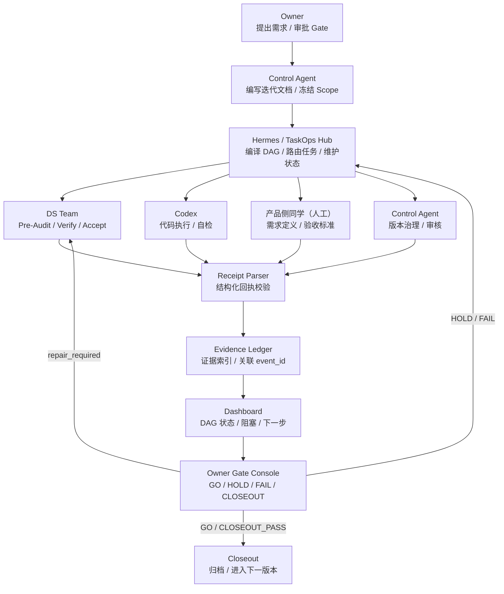
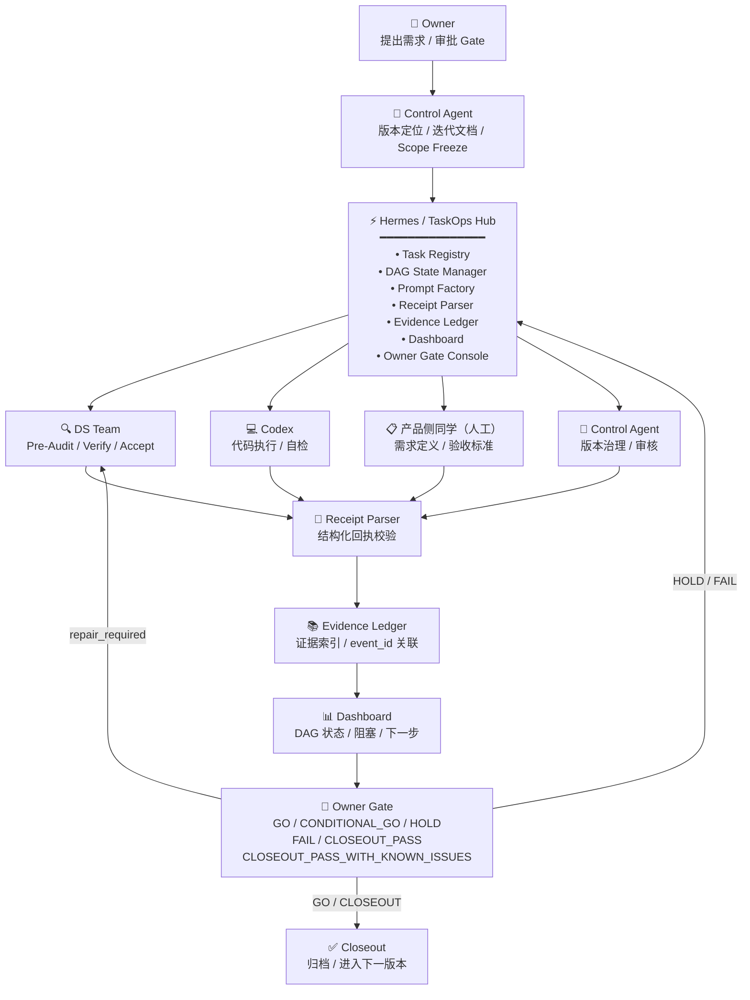
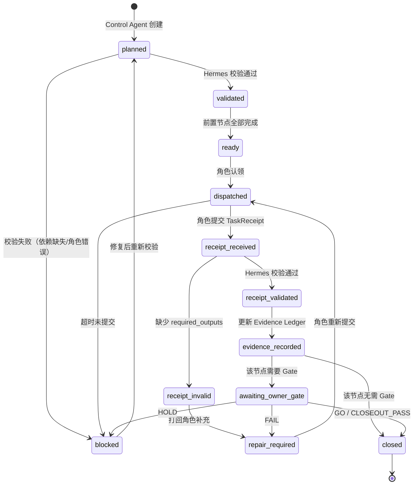
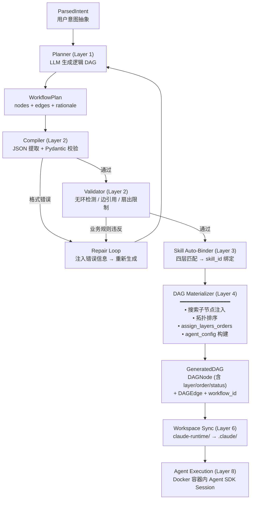
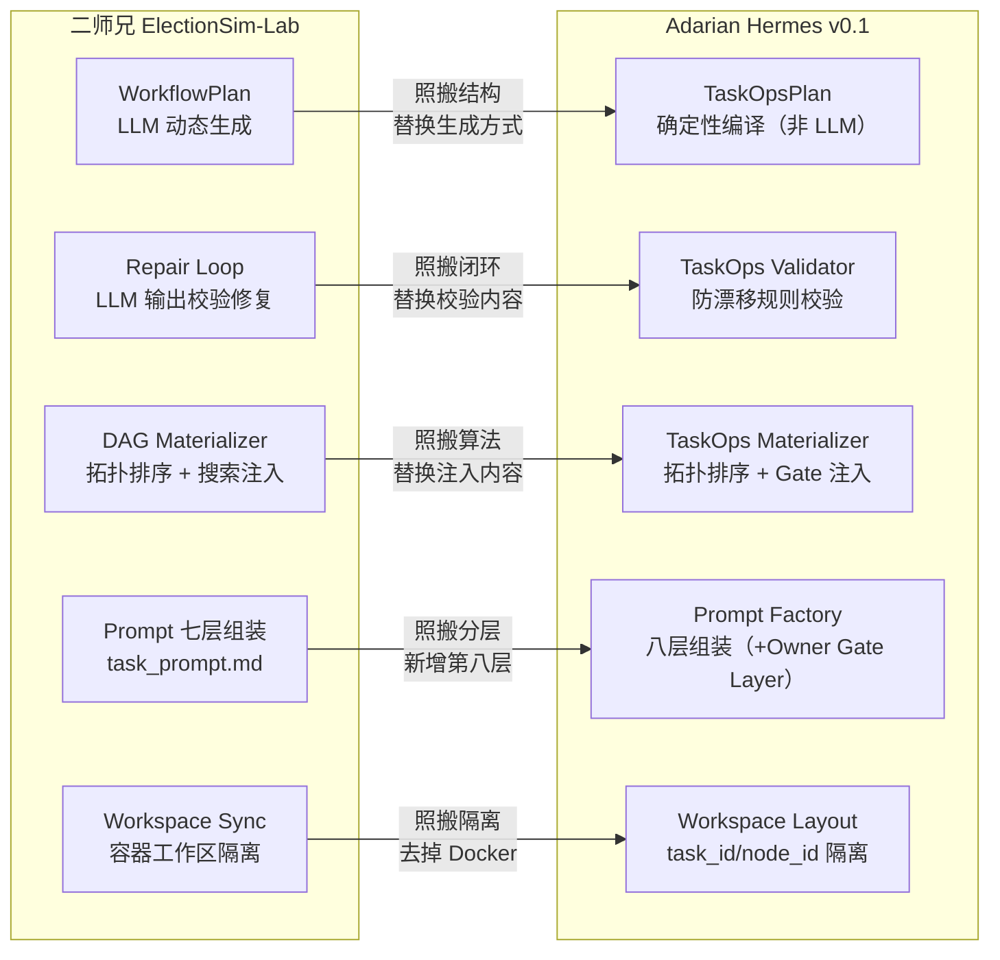

# Adarian 项目推进计划与二师兄 DAG 工作流深度审查报告 v0.1

> 审查日期：2026-05-15
> 审查团队：DS Agent Team（6 Agent 并行协作）
> 报告性质：只读研究任务，不修改源码/文档/测试

---

## 1. 执行摘要

### 1.1 本次审查对象

本次审查以 Adarian 项目 `learning/` 文件夹下的"项目推进计划"为核心审查对象，同时深度研究"二师兄"（ElectionSim-Lab）10 层 DAG 流水线架构，结合 Adarian 当前实际工作流（`workflow_core.md` v3.0），输出从"文档驱动"走向"系统治理"的 Hermes / TaskOps Hub 中台化方案。

### 1.2 核心结论

1. **当前项目推进计划存在结构性断层**：`learning/项目推进计划/` 描述的"GenFlow 平台解耦 + Agent 工厂架构"两期计划与 `workflow_core.md` 定义的"四角色版本推进流水线"之间缺少连接组织。前者是产品/架构蓝图，后者是开发流程规则，两者在角色分工、阶段定义、Gate 机制上存在概念缝隙。

2. **Adarian 当前工作流对 Owner 的认知负担过高**：Gary 同时承担 User、Owner、DS Agent Team 成员、Codex 监督者、任务协调员五重角色。Control Agent 由独立的网页端 ChatGPT 实例运行（带完整 system prompt），但 Control Agent 产出的迭代文档、Gate 判断、Scope Freeze 仍需 Gary 审阅和确认。版本推进的上下文（审计报告、源码状态、产品输入、历史决策）在 ChatGPT 和 Claude Code 两个对话系统之间通过 Markdown 文件传递，Gary 是两者之间的唯一信息转运枢纽。

3. **二师兄 DAG 工作流提供了系统性的工程答案**：`ParsedIntent → WorkflowPlan → Repair/Validate → Materializer → GeneratedDAG → Workspace → Agent Execution` 的 10 层流水线，将 LLM 的"创造性不确定性"通过层层校验、编译、物化、约束收敛为"确定性可执行产物"。这套机制不是为特定领域设计的，而是一个通用的长程任务治理方法论。

4. **Hermes / TaskOps Hub 值得启动，但必须以最小闭环方式切入**：v0.1 目标是对**一个**既有迭代版本做到端到端的长程任务治理——从 Control Agent 产出迭代文档到 closeout 的完整 DAG 状态管理和证据追溯。是否扩展到跨版本多任务编排，在单版本跑通后再评估。

### 1.3 当前 Adarian 工作流最大痛点（排序）

| 优先级 | 痛点 | 影响 |
|--------|------|------|
| P0 | **Gary 是唯一的中枢节点**：版本状态、审计结果、Gate 决策全部依赖 Gary 人肉记忆和手动推进 | 单点瓶颈，无法并行，容易遗漏 |
| P0 | **上下文爆炸风险**：每次版本迭代需要在 Claude Code 对话中手动加载大量上下文（迭代文档、审计报告、源码状态） | 多版本交错时上下文严重超载 |
| P1 | **DS Verify 完全手动执行**：6 阶段验证（含 Environment Preflight）需要人工逐条运行 shell 命令并解读结果 | 耗时、不可复用、容易遗漏 |
| P1 | **产品侧与技术侧对接不成熟**：产品侧风险清单 v0.2 已产出，但技术侧 `select_primary_risk_types()` 仍依赖 keyword matching | 产品输入未充分工程化利用 |
| P2 | **迭代文档写作成本高**：每个版本需要人工填写 12 章节迭代文档 | Control Agent 负担 |

### 1.4 二师兄工作流最值得学习的地方

1. **Plan-Runtime 分离**：先用低成本 LLM 调用生成结构化的逻辑计划，通过确定性的校验/修复/物化将其加工为可执行 DAG
2. **校验+修复闭环**：LLM 输出验证失败不放弃，而是将错误信息注入下一轮 prompt 引导收敛
3. **Schema 先行 + extra forbid**：Pydantic 模型严格约束，杜绝 LLM "好心加了不该加的字段"
4. **搜索与推理分离**：通过 DAG 子节点注入将"数据获取"和"分析推理"分离为独立节点
5. **SCOPE_LINES 行为约束**：每种节点类型有精确的行为边界声明
6. **input/meta/output/debug 工作区分层**：清晰的产物边界，防止角色越界和交叉污染

### 1.5 Hermes / TaskOps Hub 是否值得启动

**是，但以正确的定位启动**。Hermes 不是另一个"自动开发平台"，而是一个轻量级的任务治理中台。v0.1 只需做到：有 DAG 状态视图、有任务回执模板、有 Evidence Ledger 索引、有 Gate Console——其复杂度远低于二师兄的完整流水线（不需要 Docker、不需要 Redis、不需要 LLM DAG 生成）。

### 1.6 推荐下一步

1. 完成 Hermes v0.1 规格文档（范围：单版本端到端）
2. 定义 TaskReceipt / EvidenceLedger / Dashboard 最小模板
3. 选一个低风险版本（如 v1.3.0），手动按 Hermes 流程跑一轮——目标是这一个版本从 Control Agent 产出迭代文档到 closeout 全程有 DAG 状态追踪和证据落盘
4. 基于单版本的实际体验，再决定是否扩展到多版本编排、是否写 CLI/接 DS API

---

## 2. 当前项目推进计划审查

### 2.1 推进计划当前结构

`learning/项目推进计划/` 由三层文档构成：

```
项目推进计划/
├── README.md                    ← 总览：GenFlow 项目两期计划
├── 平台解耦方案/                  ← 第一期：脱选举化 + 领域包加载
│   ├── 01-项目现状与耦合分析.md
│   ├── 02-目标架构.md
│   ├── 03-技术方案.md
│   ├── 04-演进路线与任务清单.md
│   └── 05-风险与验收.md
├── Agent工厂架构/                ← 第二期：模型入驻 + 自我进化
│   ├── 01-核心思想.md
│   ├── 02-三层架构.md
│   ├── 03-世界模型入驻机制.md
│   ├── 04-自我迭代闭环.md
│   └── 05-Factory基建与工具链.md
└── 流水线分层架构/               ← 二师兄 10 层 DAG 详解（参考资料）
    ├── 第0层 ~ 第9层/
    └── 总结/
```

**目标**：将 GenFlow（二师兄的 DAG 引擎）从选举领域解耦为通用平台，使之可承载 Adarian 舆情预判等新领域。

**两期划分**：

- **第一期（平台解耦）**：4 阶段 × (2+4+5+7=18 天)，目标是把 6 个选举耦合点拔出来变成可插拔领域包
- **第二期（Agent 工厂架构）**：模型入驻 → 孵化新领域 Agent 社会 → 元模式反哺基座

### 2.2 阶段划分

推进计划按"Phase 1→2→3→4"表述（注意：这里的 Phase 指推进计划的阶段，不是 Adarian 代码的 Phase 0/1/2/3/4 管线阶段）：

| 推进计划 Phase | 内容 | 预计时间 | 里程碑 |
|---------------|------|---------|--------|
| Phase 1 | 脱选举化 | 2 天 | GenFlow 核心模块对选举零引用 |
| Phase 2 | 包加载机制 | 4 天 | 领域包可插拔、动态加载 |
| Phase 3 | Agent/数据解耦 | 5 天 | 全模块解耦完成 |
| Phase 4 | 第二领域包验证 | 7 天 | 用一个新领域验证解耦有效性 |

### 2.3 角色分工

推进计划中隐含的角色分工：

| 角色 | 在推进计划中的职责 | 在 workflow_core.md 中的对应 |
|------|-------------------|---------------------------|
| **平台工程师** | 执行解耦重构、编写加载机制 | ≈ Codex |
| **领域专家** | 提供新领域的需求定义、验证标准 | ≈ 产品侧同学（人工，非 AI Agent） |
| **架构决策者** | 判断解耦方向、裁决耦合点取舍 | ≈ Control Agent / Owner |
| **Agent 工厂运维** | 管理模型入驻、监控自我迭代 | 无对应（新角色） |

**关键发现**：推进计划中的角色分工与 `workflow_core.md` 定义的四角色（Owner/Control Agent/DS Team/Codex）存在概念层面的未对齐。推进计划用"平台工程师/领域专家/架构决策者"的通用角色，而 workflow_core.md 用 Adarian 项目特定的审计-执行-治理三角。这种差异意味着：**如果 GenFlow 解耦完成后要接入 Adarian 的开发流程，需要一个明确的角色映射层**——而这正是 Hermes 应该提供的。

### 2.4 版本推进方式

推进计划没有定义版本号规范——它用的是 Phase 1/2/3/4 的线性推进，假设每个阶段顺序完成。

对比 Adarian 实际的版本推进（v1.1.0 → v1.2.9，共 30+ 个迭代版本），实际开发是高度迭代式的：修补、回退、并行 attempt、closeout with known issues 是常态而非例外。**推进计划的线性阶段模型与实际开发的迭代现实之间存在张力**。

### 2.5 文档驱动机制

推进计划自身的文档组织是优秀的：方案文档结构清晰、每份文件有明确职责。但它与 Adarian 当下的文档驱动机制（迭代文档 → TASK_LOG → CHANGELOG → Audit Reports）是**两套独立的文档体系**，目前通过人工引用关联。

### 2.6 审计与验收机制

推进计划的验收定义在 `05-风险与验收.md` 中，是"平台解耦"层面的验收（"核心模块对选举零引用"），而非 Adarian 版本迭代层面的验收（"Hard/Soft Target 对照"）。两者不矛盾但不在同一抽象层。

### 2.7 当前优点

1. **架构蓝图清晰**：两期计划的目标、路径、关键技术决策均有明确描述
2. **解耦思路正确**：将平台与领域分离是支撑 Adarian 长期演进的关键方向
3. **文档组织完善**：`learning/项目推进计划/` 的目录结构和文档拆分逻辑合理
4. **二师兄流水线资料详尽**：10 层 × 3-5 份文档，覆盖了从用户输入到前端可视化的完整链路，对学习和迁移极具价值
5. **Agent 工厂架构具有前瞻性**：元模式驱动多领域 Agent 社会共生进化的愿景清晰
6. **workflow_core.md v3.0 规范严谨**：角色分工、Event ID 体系、Closeout Gate、防漂移规则定义完整且可执行
7. **Control Agent 已有独立 system prompt**：网页端 ChatGPT 运行 Control Agent，含角色分工、Execution Lock 条件、防漂移规则、Whitebox 边界、S/M/L 三级任务粒度控制——这意味着 Control Agent 的"治理逻辑"已经形式化，不是纯人工操作

### 2.8 当前缺口

1. **缺少连接层**：推进计划（架构蓝图）与 workflow_core.md（开发流程）之间缺少一个"长程任务治理"的连接层——这正是 Hermes 的定位
2. **不支持多版本并行**：推进计划和 workflow_core.md 都假设单版本线性推进，实际已出现 v1.2.8.1 和 v1.2.9 交错执行
3. **没有任务状态机**：迭代文档的五阶段（exploration/audit/execution/validation/closeout）有定义但无法机器查询——只能人工阅读文档判断状态
4. **没有 evidence/receipt 的机器可读版本**：审计报告是 Markdown，虽然有结构化字段但解析依赖人工
5. **没有自动化 Gate 触发**：Gate 判断完全依赖人工记忆（"这个版本的 DS Accept 做完了吗？我记得做完了..."）
6. **产品侧对接未标准化**：产品侧产出散落在 `audit/productside_review/`、`docs/product_inputs/` 等路径，技术侧未系统性接入
7. **缺少 Workspace 隔离**：不同版本的审计报告、Codex 交付散落在同一目录树，容易交叉引用错误
8. **没有 DAG 状态仪表盘**：无法一眼看清"当前哪些版本在进行、各处于什么阶段、谁被阻塞、需要什么"
9. **迭代文档模板随 workflow 演进但未同步更新**：`_template_v3.md` 的字段与 `workflow_core.md` v3.0 的要求已基本对齐，但 "Audit Summary" 节的结构仍不统一
10. **上下文爆炸风险未解决**：每次新版本启动，Agent 需要加载的上下文包括：workflow_core.md + 上版本 closeout + 当前源码状态 + 产品侧输入 + 之前所有相关审计报告

### 2.9 任务流转痛点

以下是当前一次版本迭代中实际的"任务接力"过程：

```
1. Gary（作为 User）在 ChatGPT 网页端向 Control Agent 描述需求
2. Control Agent（ChatGPT，带 system prompt）编写迭代文档
3. Control Agent（ChatGPT）判断是否需要 DS Pre-Audit，输出 Gate 决策
4. Gary（在 Claude Code）启动 DS Agent Team 执行 Pre-Audit
5. DS Agent（Claude Code）读取源码、运行检查、输出审计报告
6. Gary 将审计报告传递给 ChatGPT 端的 Control Agent
7. Control Agent（ChatGPT）基于审计结果更新迭代文档、冻结 Scope
8. Gary（在 Claude Code）启动 Codex，传递迭代文档
9. Codex（Claude Code）执行代码修改、运行自检、回传 report
10. Gary（在 Claude Code）启动 DS Agent Team 执行 Verify
11. DS Agent（Claude Code）运行 6 阶段验证、输出报告
12. Gary（在 Claude Code）启动 DS Agent Team 执行 Accept
13. Gary 将验收报告传递给 ChatGPT 端的 Control Agent
14. Control Agent（ChatGPT）做出 closeout 判断
15. Gary（在 Claude Code）更新 TASK_LOG、CHANGELOG、迭代文档状态
```

**这个流程中，Gary 出现在 15 个步骤中的 9 个**——他是在 ChatGPT（Control Agent）和 Claude Code（DS Team/Codex）之间的唯一信息转运枢纽。Control Agent 有自己的 system prompt 和 Gate 判断能力，但它的输入（审计报告、源码状态）和它的输出（迭代文档、Scope Freeze、closeout 决策）都必须通过 Gary 的复制粘贴在两个系统之间传递。

**重要发现——Control Agent 已有 S/M/L 三级任务粒度控制**：Control Agent 的 system prompt 定义了三个任务等级：
- **S-Level**：小治理/只读审计/文档轻修，不要求完整迭代文档，不要求 smoke test，优先交给 DS Team
- **M-Level**：普通版本迭代，需要版本号/scope/allowed-forbidden files，Codex 执行，需 TASK_LOG/CHANGELOG 同步
- **L-Level**：架构版本/schema/source tree/runtime contract 等底座变更，必须完整迭代文档 + DS 前置审计 + Codex 分 attempt 执行 + closeout 后才能开下一版本

这一机制已经解决了报告关注的核心问题之一——"简单任务走轻量流程，复杂任务走完整流程"——在 Control Agent 层面已有规则定义。Hermes 不需要"重新设计"三级复杂度，而需要"工程化落地"这一已有规则：将 S/M/L 的流程差异从 Control Agent system prompt 的文字描述，转化为 DAG 中不同的节点拓扑。

### 2.10 上下文爆炸风险

一次版本迭代涉及的信息量估计：

| 信息来源 | 估计大小 | 是否必须加载到对话 |
|---------|---------|------------------|
| workflow_core.md | ~40KB | 是（流程规则） |
| 迭代文档 | ~5-10KB | 是（任务定义） |
| DS Pre-Audit Report | ~10-20KB | 是（审计结果） |
| Codex Attempt Report | ~2-5KB | 是（交付确认） |
| DS Verify Report | ~5-10KB | 是（验证结果） |
| DS Accept Report | ~3-5KB | 是（验收结论） |
| 源码 diff | 不定 | 是（具体修改） |
| TASK_LOG + CHANGELOG | ~5KB | 部分 |
| 产品侧输入 | ~10-20KB | 按需 |
| **总计** | **~80-115KB** | — |

在 Claude Code 中，这些信息随着对话推进逐步加载，上下文窗口持续承压。当 v1.2.8.1 尚未 closeout 而 v1.2.9 已开始时，两个版本的上下文叠加会导致严重的信息过载。

### 2.11 对 Owner 的认知负担

Gary 作为 Owner 需要同时掌握：
- 每个活跃版本的状态（当前阶段、阻塞点、下一步）
- 每个 Audit Report 的核心发现和 verdict
- 每个 Codex Attempt 的实际修改范围和遗留问题
- 产品侧的最新输入和期望
- workflow_core.md 的规则变化
- 推进计划的长期方向

**这些信息当前没有任何机器辅助聚合——全部依赖 Gary 的人肉记忆和手动文档翻阅。**

### 2.12 痛点清单

| 编号 | 痛点 | 严重程度 | 影响范围 |
|------|------|---------|---------|
| W1 | Gary 是唯一中枢节点 | 严重 | 所有版本推进 |
| W2 | 版本状态无法机器查询 | 严重 | 多版本管理 |
| W3 | DS Verify 完全手动 | 中等 | 每次 Codex 交付 |
| W4 | 审计报告散落、人工索引 | 中等 | 审计追溯 |
| W5 | 产品侧输入未工程化接入 | 中等 | 需求对齐 |
| W6 | 上下文爆炸 | 严重 | 对话质量 |
| W7 | Gate 判断无辅助决策支持 | 中等 | 决策质量 |
| W8 | 迭代文档写作成本高 | 轻微 | Control Agent 效率 |
| W9 | 缺少幂等性检查 | 中等 | 重复执行风险 |
| W10 | 没有版本间 carry-over 追踪 | 轻微 | 技术债管理 |

### 2.13 人工依赖清单

以下工作当前由 Gary 人肉执行，存在中台化机会：

| 工作 | 频率 | 自动化潜力 | 中台化方案 |
|------|------|----------|----------|
| 编写迭代文档 | 每版本 | 中 | Control Prompt 模板 + 半自动填充 |
| 判断是否需要 DS Pre-Audit | 每版本 | 高 | 规则引擎（7 类触发条件） |
| 阅读 DS Audit Report 提取关键事实 | 每版本 | 中 | EvidenceLedger 自动索引 + 关键字段解析 |
| 判断 Codex 交付是否完整 | 每 attempt | 高 | TaskReceipt Schema 校验 |
| 启动 DS Verify | 每 attempt | 高 | DAG 自动流转 |
| 判断是否可以 closeout | 每版本 | 中 | Gate Console + 证据聚合 |
| 更新 TASK_LOG / CHANGELOG | 每版本 | 中 | 从 EvidenceLedger 自动生成 changelog entry |
| 查找"上次的审计报告在哪里" | 频繁 | 高 | Workspace + EvidenceLedger 索引 |
| 判断"这个版本现在处于什么阶段" | 频繁 | 高 | Dashboard 状态视图 |
| 编写给 Codex 的执行指令 | 每版本 | 中 | Prompt Factory 模板渲染 |

---

## 3. 二师兄 DAG 工作流总体拆解

### 3.1 系统定位

ElectionSim-Lab（"二师兄"）是一个基于 Claude Agent SDK 的选举分析多 Agent 系统。它的核心能力是：用户输入一句自然语言问题（如"分析 2026 台北市长选举"），系统自动将其分解为一个 DAG 结构的多节点工作流，每个节点在独立 Docker 容器中由 Claude Agent 执行，最终产出包含数据、分析、可视化的完整报告。

**这不是一个传统的固定流水线**。整个工作流的拓扑结构是**运行时由 LLM 动态生成**的，而非编译时预定义。这引出了二师兄架构要回答的核心问题：**当一个系统的执行结构本身是不确定的，如何保证它稳定、可校验、可调度、可观测？**

答案是 10 层分层架构——每一层解决一个特定的工程挑战，层层递进，将 LLM 的"创造性不确定性"收敛为"确定性可执行产物"。

### 3.2 10 层流水线定位

```
Layer 0: 规划代理与意图路由
    ↓  用户自然语言 → ParsedIntent (action/targets/time_range/output_format)
Layer 1: Planner — DAG 拓扑生成
    ↓  ParsedIntent → LLM 生成 WorkflowPlan (nodes/edges/rationale)
Layer 2: 计划修复与验证循环
    ↓  WorkflowPlan JSON → Compile → Validate → Repair → CompiledWorkflowPlan
Layer 3: Skill 自动绑定
    ↓  semantic node_id → 四层匹配 → 注册表 skill_id 绑定
Layer 4: DAG 物化器
    ↓  WorkflowPlan → 搜索注入 → 拓扑排序 → assign_layers_orders → GeneratedDAG
Layer 5: 启动提示词组装
    ↓  每个 DAGNode → 七层 prompt → task_prompt.md
Layer 6: 工作区同步
    ↓  claude-runtime/ → 扁平化投影 → 容器内 .claude/
Layer 7: Docker 容器启动
    ↓  GeneratedDAG + task_prompt → 长生命周期容器 + 卷挂载
Layer 8: Agent 会话执行
    ↓  Agent SDK Session → 推理循环(max_turns=300) → result.json + report.md
Layer 9: 事件流回传
    ↓  sdk_messages.jsonl → Redis Streams → SSE → 前端 ReactFlow
```

### 3.3 ParsedIntent → WorkflowPlan → GeneratedDAG 链路

这是二师兄最核心的三层数据转换：

**ParsedIntent**（Layer 0）：从用户自然语言中提取的结构化意图。包含 `action`（analyze/query/export）、`targets`（具体分析对象）、`time_range`、`output_format`。这是"用户想做什么"的抽象。

**WorkflowPlan**（Layer 1）：LLM 生成的逻辑 DAG 描述。包含 `nodes`（每个节点的 id/label/description/kind）、`edges`（data_dependency/reference/conditional 依赖关系）、`rationale`（规划思路）。关键约束：Planner 输出阶段最多 30 个节点、200 条边。

**GeneratedDAG**（Layer 4）：经过编译、校验、物化的可执行数据结构。包含 `DAGNode`（含 layer/order/agent_config/block_profile/status）、`DAGEdge`、`workflow_id`、`estimated_duration`。运行时上限放宽到 200 节点、2000 条边（以容纳系统注入的搜索子节点）。

### 3.4 SDK 通道和 LLM 通道

Planner 生成 WorkflowPlan 有两种通道：

| 维度 | SDK 通道 | LLM 通道 |
|------|---------|---------|
| 调用方式 | Claude Agent SDK (`ClaudeSDKClient`) | httpx POST LLM Gateway |
| 工具 | 仅允许 Skill 工具（读取 dag-planner Skill） | 无工具 |
| 结构化输出 | SDK 内部闭环 | OpenAI-compatible `json_schema` |
| thinking | 不支持 | 支持（anthropic-beta） |
| 选择逻辑 | `workflow_planner_mode` 配置 | 同上 |

两通道共享同一个 prompt 构建、repair loop、compiler 和 validator——仅 transport 层不同。这种设计体现了**策略模式**在 AI 系统中的最佳实践：核心逻辑统一，传输层可替换。

### 3.5 Repair Loop

Repair Loop（`WorkflowPlanningRepairLoop`）是二师兄中最关键的可靠性机制。其流程为：

```
for attempt in 1..max_attempts:
    1. transport(prompt) → 调用 LLM/SDK 获取原始文本
    2. compiler.compile(raw_text) → 提取 JSON → Pydantic 校验 → Skill 白名单 → 规模校验 → 业务校验
    3. 如果校验通过 → materialize → 返回 GeneratedDAG
    4. 如果校验失败 → 构建 repair_prompt → 将校验错误原文 + 上次输出前缀注入 prompt → 重试
```

**为什么存在**：LLM 的结构化输出失败率在复杂 Schema 下可达 10-30%。Repair Loop 将单次成功率从 70-90% 提升到 3 轮内的 98%+。它的设计哲学是**"校验失败不是错误，而是下一轮 LLM 调用的 context"**。

**max_attempts 的设计考量**：
- 默认值 2（即初次 + 最多 2 次修复），范围 1-5
- 90%+ 的失败在第一次修复中解决（主要是格式问题）
- 超过 3 次重试的边际成功率急剧下降

**Repair Prompt 的关键构造**：
- 注入 `dag-planner` Skill 的 `rules-and-examples.md`（含负面范例）
- 注入拓扑修复指导（node_count/parallel_layers/max_width）
- 强制输出约束："回复首字符必须是 `{`，不要输出任何解释文字"

### 3.6 Compiler / Validator

两层校验架构：

1. **Pydantic Schema 校验**（`plan_compiler.py`）：类型、必填、长度、正则匹配。`extra="forbid"` 确保任何 LLM 擅自添加的字段在校验阶段暴露。
2. **业务语义校验**（`plan_validator.py` + `workflow_validation.py`）：无环检测（Kahn 算法）、唯一 node_id、边引用完整性、Skill 白名单、扇出限制（`_MAX_BLOCKING_FAN_OUT=10`）、agenda_setter 扇出限制、master_analyst 强制存在（节点 >= 10 时必须包含）。

### 3.7 Skill Registry 与四层匹配

35+ Skill 的元数据注册表。Auto-Binder 通过四层优先级递减规则将 semantic node_id 映射到注册表：

1. **Layer 1**：显式赋值 skill_id → 直接采用
2. **Layer 1b**：注册表精确匹配 → `node.id` 恰好在注册表中
3. **Layer 2**：双下划线前缀匹配 → `family__detail` 提取 family 前缀查询
4. **Layer 3**：关键词正则降级 → 21 条中英文规则

全部未命中时 → 兜底降级为 `__generic__`。

**为什么用纯正则而非 LLM**：这是一个确定性映射问题。正则规则引擎带来三个优势：确定性（不受 LLM 温度影响）、低延迟（微秒级 vs 秒级）、零 token 成本。

### 3.8 Prompt 七层组装

`build_node_prompt()` 按七层顺序组装每个节点的 `task_prompt.md`：

| 层 | 内容 | 解决的模糊性问题 |
|----|------|----------------|
| Layer 1 | 任务描述 + 执行权威层级（EXECUTION_AUTHORITY_LINES） | Agent 的核心使命是什么 |
| Layer 2 | 上游产物摘要（upstream_file_map） | Agent 可以读什么（已验证绝对路径） |
| Layer 3 | 资源提示（seed_paths，最多 6 条） | Agent 从哪里开始找数据 |
| Layer 4 | 数据读取协议（READ_PROTOCOL_LINES） | Agent 怎么读数据 |
| Layer 5 | 工具调用纪律（TOOL_SEARCH_LINES） | Agent 怎么用工具 |
| Layer 6 | 节点级 SCOPE_LINES | Agent 不能做什么（行为边界） |
| Layer 7 | 输出合约（required_outputs） | Agent 怎样才算完成 |

每一层不是"越多越好"——每层解决一个特定的指令模糊性问题。

### 3.9 planning_richness

用户可选的复杂度档位，在规划阶段控制 DAG 的规模和结构深度：

| Richness | 节点范围 | 结构要求 | Planner 超时 |
|----------|---------|---------|-------------|
| minimal | 2-4 | 无并行要求 | — |
| standard | 5-8 | 至少 1 次轻并行 + 1 个汇聚 | 120s |
| detailed | 10-16 | 必须 10+ 节点、至少 1 次汇聚 | 180s |
| comprehensive | 15-25 | 并行层>=2、汇聚>=2、宽-窄-宽结构 | 480s |

**控制维度**：拓扑目标、组装规则、反模板警告、Planner 超时、多轮澄清 max_rounds、自动降级（检测到"最小冒烟"关键词时自动降为 minimal）。

### 3.10 DAG Materializer

物化过程（5 个阶段）：

```
WorkflowPlan
  → 1. Auto-Bind (可选) → skill_id/skill/skills 填充
  → 2. 搜索子节点注入 → external_search/requires_knowledge_search 展开
  → 3. 全面校验 → validate_plan_dag() 10 项检查
  → 4. 物化 → assign_layers_orders() + _materialize_node()
  → 5. 装配 → GeneratedDAG
```

**拓扑排序**（Kahn BFS 变体）：只统计 blocking 边（非 reference 边），同层内按原始顺序稳定排序。输出 `{node_id: (layer, order)}` 直接决定调度器的批次并发策略。

**_materialize_node() 的关键转换**：每个 `WorkflowPlanNode` 被转换为 `DAGNode`，新增 `layer`/`order`/`agent_config`/`block_profile`/`status`/`critical` 字段。

### 3.11 搜索子节点注入

当 Planning Agent 生成的节点标记了 `external_search=true` 或 `requires_knowledge_search=true`，Materializer 在 DAG 中注入专门的搜索前置子节点：

```
注入前: upstream → target(external_search=true) → downstream
注入后: upstream → target__ext_search → target(external_search=false) → downstream
```

**为什么存在**：搜索（机械的信息检索）和推理（语义分析综合）是两种完全不同性质的工作。将搜索展开为独立的前置子节点，实现了"职责分离"——搜索节点的产物（清洗后的结构化结果）流入推理节点，上下文更干净。

### 3.12 Workspace Sync

宿主机 `claude-runtime/` 到容器内 `.claude/` 的文件投影：

```
宿主机 claude-runtime/              容器内 .claude/
  skills/dag/entry/agenda_setter/      skills/agenda_setter/   (扁平化)
    SKILL.md                      →     SKILL.md
  agents/                          →   agents/                 (全量)
  settings.json                    →   settings.json
```

**扁平化投影**：宿主机按层次存放（便于人类维护），容器内扁平化为单层（符合 SDK 规范）。扁平化的 key 是 SKILL.md 的 frontmatter `name` 字段。

**全量覆盖策略**：每次 sync 前 `shutil.rmtree` 清理旧投影，再用 `shutil.copytree` 全量复制。对于几十个文件的配置规模，全量同步的简单性和可靠性远优于增量同步。

### 3.13 容器工作区布局

容器内 `/workspace/<run_id>/` 的四层划分：

| 目录 | 内容 | 职责 |
|------|------|------|
| `input/` | task_prompt.md | Agent 启动后读取的第一份指令 |
| `meta/` | node_context.json, time_context.json | 运行时元数据 |
| `output/` | result.json, report.md, artifacts/ | Agent 产物 |
| `.claude/` | skills/, agents/, settings.json | 从 claude-runtime/ 投影 |

### 3.14 每个机制解决什么工程问题（总结）

| 机制 | 解决的核心问题 | 没有它会怎样 |
|------|--------------|------------|
| WorkflowPlan 先行生成 | LLM 执行结构不确定性 | Agent 边执行边决策，任务漂移、不可调度、不可审计 |
| Repair Loop | LLM 结构化输出不可靠（10-30% 失败率） | 系统可靠性极差，一个 JSON 格式错误就整个失败 |
| Schema + extra forbid | LLM 擅自添加未定义字段 | 静默数据损坏在下游以隐蔽方式爆发 |
| DAG Materializer | 逻辑计划缺少运行时信息 | 无法调度（不知道哪些节点可并行）、无法分配资源 |
| 搜索子节点注入 | 搜索和推理职责混合 | 上下文膨胀、无法复用、并发控制缺失 |
| Workspace Sync | 开发环境配置与运行时配置冲突 | 容器内找不到 Skill 文件或使用了开发者个人配置 |
| MCP 模板渲染 | 工具名硬编码导致无法跨 provider 复用 | 切换搜索引擎需要修改所有 Skill 文档 |
| Skill Registry | Agent 可用能力无单一权威源 | LLM 生成不存在的 Skill 名称，运行时崩溃 |
| Prompt 七层组装 | Agent 指令模糊、不完整、自相矛盾 | Agent 行为不可预测（"我以为你要我做 X..."） |
| SCOPE_LINES | 多 Agent 职责渗透 | Agent A 越界执行了 Agent B 的工作，结果不一致 |
| planning_richness | 不同需求对 DAG 复杂度要求差异巨大 | 简单查询消耗与深度分析相同的资源 |
| 事件三态持久化 | 单一存储无法同时满足"实时低延迟"和"完整历史可回溯" | 要么实时性差，要么历史丢失 |

---

## 4. 二师兄工作流中的关键设计思想

### 思想 1：Plan-Runtime 分离 —— 把不确定性收敛在最便宜的层级

**设计意图**：LLM 的创造性是价值来源，但也带来不确定性。系统的策略不是消除不确定性，而是将不确定性**前置**到成本最低的 Plan 阶段（Layer 0-4），通过确定性的校验、编译、物化将其收敛为确定的 Runtime 指令。

**解决的问题**：避免"边执行边决策"导致的不可预测性——Plan 阶段的错误只消耗 LLM token（便宜），Runtime 阶段的错误消耗 Docker 容器 + Agent 推理时间 + 下游等待（昂贵）。

**对 Adarian 的启发**：Adarian 的风险评估流程应该在每条用户请求处理时，先让 LLM 生成完整的"分析任务清单"（类似 WorkflowPlan），校验通过后再执行，而非即时思考即时执行。

### 思想 2：校验 + 修复闭环 —— 不放弃不可靠的输出，而是引导它收敛

**设计意图**：LLM 输出的结构化文本天然不可靠。但放弃意味着整个系统不可用。Repair Loop 将校验错误转化为下一轮 LLM 调用的 context，提供了"自我修正"的路径。

**解决的问题**：单次 LLM 调用的结构化输出成功率不足以支撑生产系统。

**对 Adarian 的启发**：Adarian 的 LLM 调用（风险分类、信号映射等）应该在遇到 Pydantic ValidationError 时自动重试并携带错误信息，而非直接报错。

### 思想 3：逻辑到可执行的渐进物化 —— 四阶段数据转换链

**设计意图**：`ParsedIntent → WorkflowPlan → CompiledWorkflowPlan → GeneratedDAG` 每个阶段增加一层运行时信息，逐步将 LLM 的抽象描述转化为机器可执行的指令。

**解决的问题**：如果从 LLM 输出直接跳到执行，中间缺失了拓扑排序、层级分配、搜索注入、agent_config 构建等必要步骤。渐进物化确保每个转换阶段的责任单一、可测试。

**对 Adarian 的启发**：Adarian 当前缺少中间表示层。建议在"意图"和"执行"之间增加编译和物化步骤。

### 思想 4：Schema 约束先行 —— Pydantic extra=forbid 是主动防御

**设计意图**：LLM 可能在 JSON 中添加未定义的额外字段，这些字段可能在下游被误解析。`extra="forbid"` 让任何意外字段在 Pydantic 校验阶段就暴露。

**对 Adarian 的启发**：Adarian 的 Pydantic 模型应该全面启用 `extra="forbid"` 和严格的正则约束，并增加业务语义校验层。

### 思想 5：搜索与推理分离 —— 用 DAG 拓扑表达职责边界

**设计意图**：搜索（机械的信息检索）和推理（语义的分析综合）是两种完全不同性质的工作。通过将搜索展开为独立的前置子节点，系统在 DAG 结构层面表达了这种职责分离。

**对 Adarian 的启发**：Adarian 的信号映射中涉及外部数据源查询。建议采用相同的"搜索前置"模式——将数据获取和分析分离为独立节点。

### 思想 6：节点职责分离 —— SCOPE_LINES 即 Agent 宪法

**设计意图**：每种节点类型有专属的行为边界声明——说明 Agent "只能做什么"和"绝对不能做什么"。配合 `EXECUTION_AUTHORITY_LINES` 声明信息源的优先级链。

**解决的问题**：多 Agent 系统中最大的风险之一是"职责渗透"——一个 Agent 越界执行了另一个 Agent 的工作。

**对 Adarian 的启发**：Adarian 的 Subagent 应该引入 SCOPE_LINES 体系，明确声明每个 Agent 的输入边界、输出边界、禁止操作。

### 思想 7：配置外置与确定性注入 —— 区分"什么可变"与"什么不可变"

**设计意图**：系统的可变部分（Skill 定义、Agent 角色、MCP 配置、拓扑模板）全部外置，不可变部分（DAG 引擎、编译校验、容器调度）内聚在引擎核心。两者之间通过确定的"注入"机制连接——启动前一次性投影，而非运行时查询。

**对 Adarian 的启发**：Adarian 的 Phase 1-4 目标正是"平台解耦"。建议将当前的选举分析逻辑外置为可配置的"领域包"。

### 思想 8：全量同步 + 不可变投影 —— 用简单换可靠

**设计意图**：文件投影采用"全量清理 + 全量复制"策略，消除增量同步的所有脏状态风险。

**对 Adarian 的启发**：在设计数据同步/配置分发机制时，当数据量小（几十到几百 KB），优先选择全量覆盖而非增量同步。

### 思想 9：事件三态持久化 —— 热数据、温数据、冷数据分离

**设计意图**：Agent 执行日志同时存储在 jsonl（原始记录）、Redis Streams（实时热数据）、SQLite（冷数据持久化）三个位置。三种存储各司其职，不是冗余而是分层。

**对 Adarian 的启发**：Adarian 的执行日志目前较为单一。建议引入三态持久化——实时 UI 用轻量级通道、历史审计用结构化存储、调试用原始日志。

### 思想 10：幂等性执行 —— 同一输入总是产生相同结果

**设计意图**：通过检查 Evidence Ledger 中是否已有对应记录来决定跳过还是执行。

**对 Adarian 的启发**：在 Hermes 工作流中，如果 DS Pre-Audit 已经针对同一 task_id 输出过报告，应自动跳过而非重新执行。

### 思想 11：双模式架构 —— DAG 调度 vs 单 Agent

**设计意图**：简单任务走轻量单 Agent 模式，复杂任务走完整 DAG 调度。避免"杀鸡用牛刀"。

**对 Adarian 的启发**：Control Agent 的 system prompt 已定义 S/M/L 三级任务粒度（S=小治理/只读审计，M=普通版本迭代，L=底座变更）。Hermes 不需要重新设计复杂度体系，而是将这一已有规则从 system prompt 文字描述工程化为 DAG 节点的拓扑差异——S 级压缩为 2 节点 DAG、M 级用标准六节点、L 级在关键点插入额外 Gate。

### 思想 12：Richness 控制复杂度 —— 用户可控的分析深度

**设计意图**：不同用户需求对 DAG 的复杂度要求差异巨大。`planning_richness` 提供了一个用户可选的复杂度档位。

**对 Adarian 的启发**：Adarian 的风险评估可以在用户层面引入"分析深度"参数——"快速扫描"vs"深度分析"vs"全面审计"。

---

## 5. Adarian 当前工作流与二师兄工作流对照

| 二师兄机制 | 作用 | Adarian 当前是否有类似机制 | 当前缺口 | 可迁移方式 |
|-----------|------|--------------------------|---------|----------|
| **WorkflowPlan** | LLM 生成的逻辑 DAG 描述 | 部分有（迭代文档的流程描述） | 迭代文档是自然语言，不是结构化 DAG | 将迭代文档的流程部分结构化编译为 TaskOpsPlan |
| **GeneratedDAG** | 可执行的物化 DAG | 无 | 缺少拓扑排序、节点状态机、层级分配 | 基于 iteration doc 确定性编译 TaskOpsDAG |
| **Repair Loop** | LLM 输出校验失败 → 携带错误重试 | 无 | DS Verify 发现失败后人工判断下一步 | 对 Pydantic Schema 校验失败自动重试 |
| **validate_plan_dag** | 无环检测 + 业务规则校验 | 部分有（workflow 防漂移规则） | 防漂移规则由人手动检查 | 用防漂移规则做 DAG 编译时自动校验 |
| **Prompt 七层组装** | 结构化分层生成 Agent prompt | **部分有**（`src/phase1/prompts.py`、`src/phase4/report_prompts.py`、`profiling/prompts.py` 已有 13 个 prompt family 的模板化体系，含分层策略和禁用词表） | 工作流治理层 prompt（DS/Codex/Control 指令）尚未模板化；缺少 SCOPE_LINES 行为边界声明 | 将现有 prompt 工程能力从"模拟管线层"延伸到"工作流治理层" |
| **Skill Registry** | 35+ Skill 元数据 + 四层匹配 | 部分有（ds_pre_audit/ds_verify/ds_accept Skills） | 仅 3 个 Skill，无注册表和自动匹配 | 角色路由表（task_type → role dispatch） |
| **Materializer** | 拓扑排序 + 搜索注入 + agent_config 构建 | 无 | 执行顺序完全人工决定 | 保留拓扑排序逻辑，替换搜索注入为 Gate 注入 |
| **Workspace Sync** | 宿主机配置投影到运行时环境 | 无 | 审计报告/交付物散落，无隔离 | 按 task_id/node_id 隔离的 Workspace Layout |
| **MCP 模板渲染** | 工具名模板变量替换 | 无 | 切换 LLM provider 需改代码 | Prompt 中 API/工具引用模板化 |
| **input/meta/output/debug** | 四层工作区分层 | 无 | 产物散落在 audit/docs/outputs 等目录 | 每个节点的 input/meta/output/debug |
| **Receipt / result.json** | 结构化执行回执 | 部分有（attempt report / audit report 的字段约定） | 字段不统一、路径不固定、无法机器解析 | 统一 TaskReceipt Schema |
| **Dashboard / generation_details** | DAG 状态可视化和生成元数据 | 无 | 版本状态完全无法一眼看清 | Markdown/文本 Dashboard |

---

## 6. Adarian Hermes / TaskOps Hub 应该是什么

### 6.1 定位声明

**Hermes 不是自动开发平台**：不写代码、不跑测试、不部署服务。它的职责是**确保正确的任务在正确的时间以正确的信息交给正确的角色执行**。

**Hermes 是长程任务治理中台**：治理版本从 exploration 到 closeout 的状态流转——哪些前置条件已满足、当前阻塞是谁的责任、下游角色需要等待什么。

**Hermes 是 Relay Hub**：将角色间的交接（handoff）标准化为可追踪的 Task Relay——每个交接点建模为 DAG 中的一条边，包含 from_role、to_role、deliverable、gate 条件。

**Hermes 是 DAG State Manager**：维护全局 DAG 状态——哪些节点前置条件已满足、哪些正在执行、哪些已完成、哪些失败需要 repair。

**Hermes 是 Prompt Factory**：为 DS Team、Codex、Control Agent 生成结构化的任务 prompt；为产品侧同学生成辅助设计文档（任务卡、验收标准）。

**Hermes 是 Evidence Ledger**：将分散的审计证据统一收集、索引、关联到对应的 task_id/audit_id/attempt_id/acceptance_id。

**Hermes 是 Owner Gate Console**：将 Gate 决策形式化为结构化选项（而非自然语言），Owner 通过选项做出 Gate 决策，决策结果自动记录。

### 6.2 角色职责边界

| 角色 | 负责 | 不负责 |
|------|------|--------|
| **Hermes** | DAG 状态管理、Task Relay 流转、Prompt 生成、Evidence Ledger 维护、Gate Console 呈现 | 不执行审计、不写代码、不做 Gate 决策、不定义版本范围 |
| **DS Team** | 执行 Pre-Audit / Verify / Accept、生产审计事实 | 不做版本方向决策、不替 Control Agent 做最终 Gate、不扩大架构 |
| **Control Agent** | 版本定位与治理、编写迭代文档、冻结 Scope、最终 closeout | 不落盘代码、不执行测试、不把 Gate 判断交给 DS |
| **Codex** | 按迭代文档执行代码修改、运行自检、回传 attempt report | 不自行决定范围、不越界设计 |
| **产品侧同学（人工）** | 辅助 Owner 进行版本产品能力设计、提供需求定义和验收标准 | 不干预技术实现方案、不参与代码审计 |
| **Owner** | 最终方向判断与审批权、重大 Gate 决策 | 不直接执行、不承担测试流水线 |

---

## 6.5 【纠偏】Hermes ≠ 自研中台，Hermes = Nous Research 现成 Agent

> 本章节为 DS Team 纠偏说明，来自 Owner 对 Hermes 定位的根本性澄清。此前报告中"自研 Hermes / TaskOps Hub"的方案是基于对 Owner 意图的误解。以下为正确方向。

### 6.5.1 核心纠偏

**我们不是要把二师兄 DAG 系统复制到 Adarian；我们是要用 Hermes 的原生 memory/skills/session 能力，减少 Gary 在 Control Agent、DS Team、Codex 之间做人肉中转。**

此前仓库中出现的 `taskops/`、`taskops/hermes.py`、本地 DAG CLI、workspace 模板等，是对 Owner 意图的误解：Gary 不是要新造一个"任务治理中台"，而是想评估和接入 **Nous Research 的现成 Hermes Agent**，让它承担 Adarian 多 Agent 工作流中的长期记忆、技能沉淀、交接 prompt 生成和流程提醒职责。

### 6.5.2 Hermes Agent（Nous Research）当前能力

Hermes Agent 是一个已可用的终端交互型 AI Agent，类似 Claude Code 的终端交互形态。其当前核心能力：

| 能力 | 说明 | Adarian 可用的场景 |
|------|------|-------------------|
| **终端交互** | `hermes` 或 `hermes --tui` 启动 | 在终端中直接与 Hermes 交互 |
| **模型/provider 管理** | `hermes model`，可切换 OpenRouter、OpenAI、Anthropic、Nous 等 | 灵活切换底层模型 |
| **Skills** | 把反复出现的工作流经验沉淀成可复用技能 | 沉淀 DS 审计 checklist、Codex 交付模板、Control 决策框架 |
| **Memory** | 跨会话记住项目偏好、工作流规则、用户习惯 | 记住 v1.2.x 的 known issues、carry-over、每个版本的流程经验 |
| **Sessions** | 保存、恢复、搜索历史会话 | 每次版本迭代的上下文可恢复，不再从零开始 |
| **Tools/toolsets** | 启用文件、shell、浏览器、MCP 等工具能力 | 读取迭代文档、检查文件状态、运行简单验证 |
| **Cron** | 定时任务 | 每日状态摘要、每周工作流检查 |
| **Gateway** | 未来可通过 Telegram/Slack/Discord/WhatsApp 等入口召唤 | 移动端查看版本状态 |
| **Profiles** | 可为 Adarian 建独立 profile | 避免和其他项目记忆混杂 |

### 6.5.3 Hermes 在 Adarian 工作流中的正确位置

```
Gary / Owner
  ↓
Control Agent（ChatGPT，决策与治理）
  → 版本方向、Gate、Scope Freeze、Closeout 裁决
  ↓
Hermes（Nous Agent，记忆与交接）
  → 上下文整理、流程提醒、交接 prompt 生成、memory/skill 沉淀
  ↓
DS Team（Claude Code + DS API，审计与验证）
  → pre-audit / verify / accept
  ↓
Codex（Claude Code，代码落盘与自检）
  → 按冻结 scope 执行代码修改、自检、回传 attempt report
```

角色定位一句话版：

| 角色 | = 什么 | ≠ 什么 |
|------|--------|--------|
| **Control Agent** | 决策与治理 | 不写代码、不跑审计 |
| **DS Team** | 审计与验证 | 不做 Gate、不定方向 |
| **Codex** | 代码落盘与自检 | 不定范围、不越界设计 |
| **Hermes** | 记忆、交接、流程秘书、prompt 工厂 | 不替代上述三者 |

### 6.5.4 Hermes 应该做什么（应该做清单）

- 读取/学习 `docs/skills/workflow_core.md`
- 读取/学习 `ds_pre_audit.md`、`ds_verify.md`、`ds_accept.md`
- 根据当前迭代文档判断下一步该叫 DS、Codex 还是 Control
- 生成交接 prompt：给 DS Team / Codex / Control Agent
- 检查 Gate、Scope Freeze、Closeout 是否被跳过
- 记住 v1.2.x 的 known issues、carry-over、流程经验
- 将重复经验沉淀成 Hermes skill/memory

### 6.5.5 Hermes 不应该做什么（禁止清单）

- 不替代 Control Agent 做 Gate
- 不替代 DS Team 做审计结论
- 不替代 Codex 修改 Adarian 主代码
- 不自研 DAG engine
- 不创建新的 TaskOps CLI
- 不要求重构 Adarian `workflow_core`

### 6.5.6 第一阶段目标修正

**原目标（误）**："实现 Hermes v0.1，自研 TaskOps Hub"

**正确目标**：**Hermes-Adarian Integration R0** —— 让现成 Hermes Agent 学会 Adarian 的 `workflow_core`，并稳定扮演跨 Agent 交接助手。

### 6.5.7 第一阶段交付物修正

| 原交付物（误） | 正确交付物 |
|--------------|-----------|
| Hermes v0.1 规格文档 | Adarian Hermes **profile** 设计 |
| TaskOpsPlan / TaskOpsDAG Schema | Adarian **workflow skill** 草案（给 Hermes 学） |
| Prompt Factory 八层组装代码 | Hermes **启动 prompt / project context** 文件 |
| Workspace Layout 目录结构 | **DS/Codex/Control handoff prompt 模板** |
| Dashboard + Gate Console | 不继续推进 `taskops/` 自研目录 |

### 6.5.8 对后续章节的影响

本报告第 7-16 章中关于"自研 Hermes v0.1 / TaskOps Hub"的 Schema 设计、DAG 编译、Workspace Layout 等内容，**在工程层面上仍有参考价值，但不应作为"交付物清单"来执行**。具体来说：

- **第 7 章（最小闭环）**：流程设计有参考价值，但执行者不是自研代码，而是配置 Hermes Agent 的 skill 和 memory
- **第 8 章（Schema 草案）**：数据结构思路可用于设计 Hermes Agent 的 memory/skill 存储格式，而非新建一个 Python 项目
- **第 9 章（Prompt Factory）**：handoff prompt 模板可以直接转化为 Hermes skill 的内容，是最有价值的部分
- **第 10 章（Workspace Layout）**：保留作为文件组织建议，但通过 Hermes Agent 的文件读取能力实现，而非新建目录结构
- **第 11 章（Dashboard）**：简化为 Hermes session 查询 + 定期 cron 推送状态摘要
- **第 12-16 章**：作为背景参考保留，但不应作为第一阶段工程任务

**一句话纠偏**：我们没有也不需要自研一个 TaskOps Hub；我们有一个现成的 Hermes Agent，它的 memory、skills、sessions 能力正好可以解决 Adarian 当前最痛的"Gary 在两个系统之间人肉转运信息"的问题。

---

**v0.1 范围**：对**一个**既有迭代版本做到端到端的长程任务治理——从 Control Agent 产出迭代文档到 closeout 的完整 DAG 状态管理和证据落盘。多版本编排、跨版本任务队列等不在 v0.1 范围。

### 7.1 完整闭环流程（单版本）

```
Register Task（Control Agent 创建迭代文档）
  ↓
Generate TaskOpsPlan（Hermes 从迭代文档确定性编译 DAG 结构）
  ↓
Validate TaskOpsPlan（Hermes 校验：无环、角色分配正确、event_id 完整）
  ↓
Materialize TaskOpsDAG（拓扑排序 → 分配 layer/order → 注入 Gate 节点）
  ↓
Generate Current Node Prompt（Prompt Factory 八层组装）
  ↓
Dispatch to DS / Codex / Product / Control（角色认领并执行）
  ↓
Receive TaskReceipt（结构化回执）
  ↓
Validate Receipt（校验 required_outputs 是否完整）
  ↓
Update EvidenceLedger（索引 receipt + 关联 event_id）
  ↓
Update Dashboard（状态变更可见）
  ↓
Owner Gate（如需 Gate）
  ↓
Closeout / Next Node
```

### 7.2 Mermaid 流程图



---

## 8. TaskOps 核心 Schema 草案

### 8.1 TaskOpsPlan

顶层计划模型，对应二师兄的 `WorkflowPlan`。

| 字段 | 用途 | 来源 | 消费者 | 缺失风险 |
|------|------|------|--------|---------|
| `plan_id` | 计划唯一标识 `plan-vX.Y.Z-{topic}` | Control Agent 创建迭代文档时生成 | Hermes、Dashboard | 缺失则无法关联任务到版本 |
| `version` | Adarian 版本号如 `v1.3.0` | Control Agent | 所有角色 | 缺失则 Evidence Ledger 无法按版本索引 |
| `nodes` | `list[TaskOpsNode]` | Control Agent 定义流程 | Hermes 调度、Dashboard 展示 | 缺失则无任务可执行 |
| `edges` | `list[TaskOpsEdge]` | Control Agent 定义依赖 | Hermes 拓扑排序 | 缺失允许（单一任务） |
| `status` | `draft / active / completed / failed / closed` | Hermes 状态机 | Dashboard | 缺失则无法判断是否进行中 |
| `complexity` | `simple / standard / complex` | Control Agent 设定 | Hermes 选择执行模式 | 缺失默认 standard |
| `created_at` | 创建时间 | Hermes 自动 | Evidence Ledger | 低风险 |
| `closed_at` | closeout 时间 | Hermes 记录 | Evidence Ledger | 低风险 |

### 8.2 TaskOpsNode

| 字段 | 用途 | 来源 | 消费者 | 缺失风险 |
|------|------|------|--------|---------|
| `node_id` | 唯一标识如 `audit-v1.3.0-01` | Control Agent | Hermes 调度、Evidence Ledger 索引 | 严重：所有关联断裂 |
| `task_type` | `pre_audit / verify / accept / codex_attempt / control_review / owner_gate` | Control Agent | Prompt Factory 选择模板 | 严重：无法生成正确 prompt |
| `assigned_role` | `ds_team / codex / control_agent / owner` | Hermes 根据 task_type 自动分配 | Hermes 路由、Dashboard | 严重：任务无人认领 |
| `status` | `pending / claimed / in_progress / completed / failed / skipped` | 执行角色更新 | Hermes 拓扑推进 | 严重：DAG 调度停滞 |
| `critical` | 失败后是否阻塞下游 | Control Agent | Hermes 阻塞传播 | 低：默认 true |
| `layer` | 拓扑层级 | Hermes 物化时计算 | Hermes 并行调度 | 低：物化时自动计算 |
| `input_artifacts` | 上游产物引用列表 | Hermes 从 edges 推导 | Prompt Factory、执行角色 | 中：执行角色缺少上下文 |
| `required_outputs` | 必须产出的文件/报告清单 | Control Agent | Hermes 验收、执行角色 | 严重：无法判断节点是否完成 |
| `gate` | 是否需要 Owner Gate | Control Agent | Gate Console | 低：默认无 Gate |

### 8.3 TaskOpsEdge

| 字段 | 用途 | 来源 | 消费者 |
|------|------|------|--------|
| `from_node` | 上游节点 ID | Control Agent | Hermes 拓扑排序 |
| `to_node` | 下游节点 ID | Control Agent | Hermes 拓扑排序 |
| `edge_type` | `blocking / reference / conditional`（默认 blocking） | Control Agent | Hermes 阻塞判断 |
| `condition` | 条件表达式（仅 conditional 使用） | Control Agent | Hermes 条件评估 |
| `deliverable` | 上游完成后的具体产物引用 | Control Agent | Hermes 验证、下游角色 |

### 8.4 TaskReceipt

| 字段 | 用途 | 来源 | 消费者 |
|------|------|------|--------|
| `receipt_id` | 回执唯一标识 | Hermes 自动 | Evidence Ledger |
| `node_id` | 关联的任务节点 | Hermes | Evidence Ledger |
| `role` | 执行角色 | 执行角色自报 | Evidence Ledger |
| `status` | `success / partial_fail / hard_fail / blocked` | 执行角色 | Hermes 状态推进 |
| `artifacts` | 产出物文件路径列表 | 执行角色 | 下游节点、Evidence Ledger |
| `warnings` | 执行中的警告/已知问题 | 执行角色 | Control Agent |
| `duration_seconds` | 执行耗时 | Hermes 自动 | Dashboard |
| `submitted_at` | 提交时间 | Hermes 自动 | Evidence Ledger |

### 8.5 EvidenceLedger

| 字段 | 用途 | 来源 | 消费者 |
|------|------|------|--------|
| `ledger_id` | 账本条目标识 | Hermes 自动 | — |
| `plan_id` | 关联 TaskOpsPlan | Hermes 自动 | 版本复盘 |
| `event_type` | `pre_audit / verify / accept / codex_attempt / owner_gate / closeout` | Hermes 自动 | Dashboard 事件时间线 |
| `event_ids` | task_id/audit_id/attempt_id/acceptance_id | 各角色遵循 workflow_core 格式 | 交叉验证 |
| `source_file` | 证据源文件路径 | Hermes 从命名规范推断 | 人工复查 |
| `key_facts` | 关键事实摘要（verdict、risk list、blockers） | Hermes 解析或角色手动填写 | Dashboard 快速概览 |
| `gate_decision` | 关联的 Gate 决策（如有） | Owner / Control Agent | 版本复盘 |
| `recorded_at` | 记录时间 | Hermes 自动 | 时间线展示 |

### 8.6 OwnerGate

| 字段 | 用途 | 来源 | 消费者 |
|------|------|------|--------|
| `gate_id` | Gate 唯一标识 | Hermes 自动 | Evidence Ledger |
| `node_id` | 触发 Gate 的任务节点 | Hermes 自动 | 上下文展示 |
| `gate_type` | `scope_freeze / pre_audit / codex_start / closeout` | Control Agent 预设 | Owner 理解决策影响 |
| `options` | `GO / CONDITIONAL_GO / HOLD / FAIL / CLOSEOUT_PASS / CLOSEOUT_PASS_WITH_KNOWN_ISSUES` | Control Agent | Owner 决策输入 |
| `evidence_summary` | 决策所需证据摘要 | Hermes 自动聚合 | Owner 决策依据 |
| `decision` | Owner 的选择 | Owner | Hermes 推进 DAG |
| `decided_by` | 决策人标识 | Owner | 审计追踪 |
| `decided_at` | 决策时间 | Hermes 自动 | Evidence Ledger |
| `rationale` | 决策理由 | Owner | 版本复盘 |

### 8.7 TaskWorkspace

```
taskops/workspaces/{task_id}/{node_id}/
  input/
    task_prompt.md           ← Hermes 生成的完整 prompt
    upstream_manifest.json   ← 上游产物文件路径索引
  meta/
    node_context.json        ← 节点上下文（task_id, node_id, role, edges, gate_config）
    time_context.json        ← 时间基准
    scope.json               ← 允许/禁止的操作范围
  output/
    ...                      ← 执行角色的交付物
  debug/
    execution.log            ← 可选执行日志
  upstream/
    {upstream_node_id}/      ← 上游节点 output/ 的符号链接
```

---

## 9. Prompt Factory 设计

### 9.0 已有基础：Adarian 当前的 Prompt 工程能力

**Hermes Prompt Factory 不是从零造轮子。** Adarian 项目已经有一套成熟的 prompt 模板化体系：

| 现有资产 | 位置 | 内容 |
|---------|------|------|
| **Prompt Inventory** | `docs/prompt_inventory.md` | 13 个 prompt family 的完整登记（P1-A 到 PR-V），含 source/task_family/output_type/complexity/layering_candidates |
| **Phase 1 Prompts** | `src/phase1/prompts.py` | `ANALYZER_SYSTEM_PROMPT`、`GENERATOR_SYSTEM_PROMPT` 等分层常量，含角色定义、输出 Schema、约束条件 |
| **Phase 4 Prompts** | `src/phase4/report_prompts.py` | 五章标题、免责声明、多组禁用词表（`FORBIDDEN_REALITY_PHRASES`、`POLICY_BOUNDARY_FORBIDDEN_PHRASES`）、内部标签体系 |
| **Profiling Prompts** | `profiling/prompts.py` | PR-S/PR-G/PR-V 三条 profiling 链路 prompt |
| **Probe Scripts** | `scripts/probes/p1g_prompt_probe.py` 等 | prompt 探测和分层测试 |
| **Skill 文件** | `docs/skills/ds_pre_audit.md`、`ds_verify.md`、`ds_accept.md` | 每个审计阶段的输入/步骤/输出规范（已承担"工作流 prompt 模板"角色） |

**关键区分**：上述体系覆盖的是 **模拟管线 prompt**（实体抽取、人格生成、tick 模拟、报告产出）和 **审计 Skill 定义**。Hermes Prompt Factory 要做的是将这些已有的 prompt 工程经验**延伸到工作流治理层**——为 DS Team 的审计指令、Codex 的执行指令、Control Agent 的 Gate 判断上下文生成结构化的 prompt，并统一管理其版本、变量和边界约束。

换句话说：**prompt 模板化的能力已经存在，模板化的范围需要从"产品 prompt"扩展到"流程 prompt"。**

### 9.1 八层结构

借鉴二师兄七层组装，Hermes 扩展为八层（新增 Owner Gate Policy Layer）：

```
Layer 1: Role Layer — 角色身份声明与权威边界
Layer 2: Task Context Layer — 当前任务在整体 DAG 中的位置
Layer 3: Scope Boundary Layer — 明确"做什么/不做什么"
Layer 4: Input Artifact Layer — 上游产物引用与读取指引
Layer 5: Execution Requirement Layer — 具体执行步骤与约束
Layer 6: Evidence & Acceptance Layer — 交付物清单与验收标准
Layer 7: Receipt Schema Layer — 回执需要填写的结构化字段
Layer 8: Owner Gate Policy Layer — 是否需要 Gate、可用选项
```

### 9.2 四种核心 Prompt 的生成差异

**DS Prompt**（Pre-Audit / Verify / Accept）：
- Role Layer 注入 DS Team 身份声明 + 禁止越权规则（不替 Control Agent 做最终 Gate）
- Scope Boundary 明确：可以做（源码检查、风险评估）和不可以做（重新设计版本范围）
- Execution Requirement 注入具体审计步骤和命令

**Codex Prompt**（Execution Attempt）：
- Scope Boundary 是重点：明确列出 allowed files / forbidden files
- Execution Requirement 注入具体执行顺序和自检命令
- Evidence Layer 注入交付说明模板

**产品侧任务卡**（给产品侧同学的人工说明）：
- 不含技术实现细节（py_compile、import 路径）
- 使用产品语言而非工程语言
- 聚焦用户可感知的功能和验收条件
- 注意：产品侧是人工角色，非 AI Agent——Hermes 生成的是"给产品同学看的设计辅助文档"，而非自动分发给 AI 执行的 prompt

**Control Prompt**（版本治理）：
- Layer 8（Owner Gate Policy）是重点：展示当前 Gate 状态、DS Accept 结果、可用选项
- 注入完整的证据摘要供 Control Agent 判断

### 9.3 Prompt 模板的维护策略

- 规则性约束（如"DS 不得替 Control Agent 做最终 Gate"）以**引用而非硬编码**方式注入：模板只写 `{{WORKFLOW_CORE_DS_RULES}}`，实际内容从 workflow_core.md 指定段落动态渲染
- Prompt 模板版本号：每次修改递增，并在生成的 prompt 末尾打印"本 prompt 基于模板 vX"
- 每个版本 closeout 时，Hermes 对比本版本使用的 prompt 模板与最新 workflow_core.md 的一致性

---

## 10. Workspace Layout 设计

### 10.1 设计原则

- **隔离**：每个版本的每个任务有独立目录，永不交叉
- **不可变**：上游产物通过只读引用（符号链接）传递给下游
- **可追溯**：任何时候可以回溯"当时收到了什么输入、产出了什么"

### 10.2 各目录用途

| 目录 | 写入者 | 读取者 | 内容 | 为什么需要隔离 |
|------|--------|--------|------|--------------|
| `input/` | Hermes | 执行角色（只读） | task_prompt.md + upstream_manifest.json | 防止角色在执行中修改任务定义，确保可追溯"当时收到的任务是什么" |
| `meta/` | Hermes | Hermes、执行角色 | node_context.json、time_context.json、scope.json | 将"关于任务的任务"与任务输入分离 |
| `output/` | 执行角色 | Hermes（事后只读）、下游角色 | 交付物（Audit Report / Code Diff） | 清晰的产出边界，下游通过 upstream/ 引用 |
| `debug/` | 执行角色（可选） | 问题排查 | 执行日志、中间产物 | 不影响 output/ 的验收判断 |
| `upstream/` | Hermes（自动挂载） | 执行角色（只读） | 上游节点 output/ 的符号链接 | 防止角色修改上游产物（审计证据不可篡改） |

### 10.3 为什么不要让所有 Agent 直接读全仓库

当前 Adarian 的协作模式中，DS Team 和 Codex 都可以直接访问整个仓库的所有文件。这导致三个问题：
1. **信息过载**：Agent 不知道哪些文件是"我需要关心的"，可能读了无关文件导致上下文膨胀
2. **修改风险**：Codex 可能误操作 forbidden files
3. **审计困难**：无法精确追踪"Codex 在做出决策时读取了哪些文件"

通过 Workspace Layout，每个角色只看到 Hermes 在 `input/` 和 `upstream/` 中投放的必要文件，而非全仓库。

---

## 11. Dashboard 与 Owner Gate 设计

### 11.1 Dashboard 展示内容（v0.1 Markdown 版本）

```
==================================================================
  Hermes TaskOps Dashboard — Plan v1.3.0-realtime-risk-signal
  Status: ACTIVE | Created: 2026-05-15 10:30 | Owner Gate: PENDING
==================================================================

DAG Topology:
  [audit-v1.3.0-01] DS Pre-Audit ........... COMPLETED (success)
       |
       v
  [attempt-v1.3.0-01] Codex Execution ..... IN_PROGRESS (Codex)
       |
       v
  [verify-v1.3.0-01] DS Verify ............. PENDING
       |
       v
  [accept-v1.3.0-01] DS Accept ............. PENDING
       |
       v
  [gate-v1.3.0-01] OWNER GATE .............. BLOCKED

Evidence Ledger (latest):
  [10:35] Pre-Audit: GO → audit/.../v1.3.0-pre-audit-2026-05-15.md
    Risks: 3 | Blockers: 0

Active Blockers: NONE
Next Action: Wait for Codex to complete attempt-v1.3.0-01
==================================================================
```

### 11.2 Owner Gate 选项

| 选项 | 含义 | 后续行为 | 使用场景 |
|------|------|---------|---------|
| `GO` | 无条件通过 | 自动推进到下一节点 | 所有条件满足 |
| `CONDITIONAL_GO` | 有条件通过 | 推进但标记条件，条件不满足时自动 HOLD | "可以开始 Codex，但如果在执行中发现新问题必须暂停" |
| `HOLD` | 暂停等待 | DAG 冻结当前节点 | 等待更多证据、等待外部确认 |
| `FAIL` | 不通过 | 标记节点为 failed，触发 repair loop | 审计发现关键问题 |
| `CLOSEOUT_PASS` | 版本关闭（全通过） | 标记 plan 为 closed，归档 workspace | 正常 closeout |
| `CLOSEOUT_PASS_WITH_KNOWN_ISSUES` | 版本关闭（带技术债） | carry-over 写入下一版本迭代文档 | 软目标未全满足但可接受 |

### 11.3 三种流转决策

**必须停（HOLD/FAIL）**：
- DS Pre-Audit verdict 为 FAIL
- DS Verify 发现 hard_fail（forbidden files 被修改）
- Acceptance hard target 不满足
- Codex 回报无法在允许范围内完成
- 任何角色越权（Hermes 检测到 drift 并自动 HOLD）

**可以自动继续**：
- DS Pre-Audit verdict 为 GO/CONDITIONAL_GO → 自动流转到 Scope Freeze
- DS Verify 结果为 all_pass → 自动流转到 DS Accept
- DS Accept 结果为 pass → 自动流转到 Closeout Gate
- 非关键节点（critical=false）失败 → 自动跳过

**打回 repair**：
- DS Verify 发现 partial_fail → 自动打回 Codex
- Codex attempt 自检失败 → Codex 自己发起 re-attempt
- Control Agent 发现证据不完整 → 打回对应角色

---

## 12. 流程图

### 12.1 Adarian Hermes 总体架构图



### 12.2 TaskOps DAG 节点状态流转图



### 12.3 二师兄 WorkflowPlan → GeneratedDAG 流程



### 12.4 二师兄机制 → Adarian Hermes 迁移映射



---

## 13. 迁移优先级建议

### P0：最先做（不做就无法减负）

| 机制 | 理由 | 预计工作量 |
|------|------|----------|
| **TaskReceipt Schema** | 统一回执格式，是所有自动化的基础 | 0.5 天 |
| **EvidenceLedger** | 将散落的审计证据集中索引 | 1 天 |
| **Dashboard（Markdown 版）** | 一眼看清版本状态，最大痛点 | 0.5 天 |
| **DS / Codex Prompt 模板** | 减少 Control Agent 的 prompt 编写成本 | 1 天 |
| **Owner Gate 状态枚举** | 形式化已有的 Gate 判断 | 0.5 天 |

### P1：提升稳定性

| 机制 | 理由 | 预计工作量 |
|------|------|----------|
| **TaskOpsPlan Schema** | 结构化 DAG 描述 | 1 天 |
| **TaskOpsDAG 编译** | 确定性拓扑排序 + 阻塞检测 | 1.5 天 |
| **Receipt Validation** | 自动校验 required_outputs | 1 天 |
| **Prompt Factory 完整实现** | 基于已有 prompt_inventory + prompts.py 资产，扩展变量渲染 + 工作流层模板 | 1 天 |
| **Workspace Layout** | 按 task_id/node_id 隔离 | 1 天 |

### P2：后续增强

| 机制 | 理由 |
|------|------|
| **CLI Runner** | 自动化程度提升后需要 |
| **自动调用 DS API** | 需要 DS 远程执行能力就绪 |
| **Web UI Dashboard** | v0.1 Markdown 版足够验证价值 |
| **自动 Mermaid 渲染** | Dashboard 可视化增强 |
| **多任务队列** | 当前单版本 DAG 就够 |
| **权限隔离** | 当前角色分工已通过 workflow_core 规范约束 |

---

## 14. 第一版不做清单

1. **不做 Docker 容器隔离**：v0.1 所有角色在同一文件系统中操作，通过 Workspace Layout 实现逻辑隔离
2. **不做实时 Dashboard（ReactFlow 可视化）**：使用 Markdown/文本输出的 DAG 状态报告
3. **不做 LLM 驱动的 DAG 自动生成**：DAG 由 Control Agent 从迭代文档确定性编译，不引入 LLM 生成的不确定性
4. **不做 Redis Streams 事件管道**：通过轮询 workspace 目录中的状态文件判断进展
5. **不做 Subagent 委派通信协议**：角色间通过 workspace 文件交换完成通信
6. **不做多版本并行 DAG 调度**：同一时间只运行一个版本的 DAG
7. **不做自动化证据解析（NLP 提取 Audit Report 关键事实）**：EvidenceLedger 的 key_facts 由角色手动填写
8. **不做 Web 前端**：所有交互通过 CLI 和文件系统完成
9. **不做 Skill Registry / Auto-Binder**：任务到角色的路由是固定的 6 种映射
10. **不做 MCP 工具集成（Knowledge / Web Search）**：Hermes 自身不需要外部知识检索
11. **不做 Slack/钉钉/飞书通知**：状态变更不推送外部通知
12. **不做跨项目/多仓库支持**：v0.1 仅支持单个 Adarian 项目仓库

---

## 15. 风险与防漂移策略

### 风险 1：Hermes 自身变成新的复杂系统

**描述**：为治理复杂度而引入的工具本身变成最复杂的部分。

**防护策略**：
- v0.1 必须是"文件系统 + Markdown + 手动触发"的最简形态，不引入任何持久化数据库、消息队列、Web 服务
- 每个新增功能必须通过"这能减少 Gary 的什么工作？"测试
- 复杂度上限：Hermes 的代码量不得超过 Adarian 主项目的 20%

### 风险 2：DS API 摘要漂移

**描述**：如果未来 DS Team 的分析通过 API 摘要传递给 Hermes，摘要可能丢失关键细节。

**防护策略**：
- EvidenceLedger 的每个 entry 必须包含 `source_file` 字段指回完整报告
- 关键决策（FAIL、HOLD）不允许仅依赖摘要——必须读取完整报告
- 摘要字段限定为结构化数据（verdict、score、counts），不做语义压缩

### 风险 3：Codex 被误用为 Control

**描述**：如果 Codex 通过 Hermes 接收到过于宽泛的 prompt，可能越界执行 Control Agent 的职责。

**防护策略**：
- Codex Prompt 的 Scope Boundary Layer 必须严格声明禁做事项
- Hermes 在路由任务时增加 `assigned_role` 校验——Codex 不能提交 task_type=control_review 的回执

### 风险 4：Prompt Factory 生成过度任务

**描述**：如果 Prompt Factory 的模板对每个边缘情况都生成独立节点，DAG 可能膨胀到不可管理。

**防护策略**：
- 对接 Control Agent 已有的 S/M/L 三级任务粒度，限制 DAG 节点数
- S-Level 模式：最多 3 节点（DS Verify → Accept → Closeout，无需 Codex）
- M-Level 模式：最多 8 节点（标准六节点链路）
- L-Level 模式：最多 15 节点（关键点插入额外 Gate）

### 风险 5：回执格式不稳定

**描述**：不同角色可能以不同格式提交 TaskReceipt，导致 Hermes 解析失败。

**防护策略**：
- TaskReceipt 必须是结构化 JSON（或 YAML），不接受纯自然语言回执
- Hermes 对每个回执执行 Schema 校验，不合法则退回要求重新填写
- 提供 CLI 命令 `hermes submit-receipt --node-id=xxx --status=success --artifacts=...`

### 风险 6：evidence 路径不真实

**描述**：角色可能在 TaskReceipt 中声明产物路径，但实际文件不存在或内容不对。

**防护策略**：
- Hermes 在接收回执时执行文件存在性检查（`os.path.exists`）
- 对关键产物（Audit Report）做最小内容校验（如必须包含 `verdict:` 行）
- 不存在的路径 → 回执状态自动降级为 `partial_fail`，触发补充

### 风险 7：Owner Gate 被绕过

**描述**：长时间使用后，Owner 可能在 Gate Console 中形成"快速点击"习惯，跳过实质审查。

**防护策略**：
- Gate Console 中只展示最近 3 条证据和总体摘要，完整证据通过链接展开
- 每个 Gate Option 旁显示风险指示灯（绿/黄/红）
- 如果 Owner 在 30 秒内做出 Gate 决策，弹出二次确认

### 风险 8：工作流过度工程化

**描述**：一个改一行代码的 hotfix 走完整六节点 DAG 是极大的浪费。

**防护策略**：
- S-Level 任务压缩为 2-3 节点 DAG（对接 Control Agent 已有粒度定义）
- Control Agent 已在 system prompt 中定义 S/M/L 三级，Hermes 只需落地执行
- 定期审计：统计 S/M/L 比例，如果 S 占比 < 20% 则可能过度工程化

### 风险 9：与现有迭代文档冲突

**描述**：Hermes 的 Evidence Ledger 可能与 TASK_LOG.md、CHANGELOG.md 产生功能重叠。

**防护策略**：
- TASK_LOG.md 和 CHANGELOG.md 仍然是人工可读的权威记录
- Hermes 的 Evidence Ledger 是机器索引和快捷查询层，**不替代** TASK_LOG.md
- 每个 entry 必须包含 `source_file` 字段指回原始记录
- 如果 TASK_LOG.md 和 EvidenceLedger 不一致，以 TASK_LOG.md 为准

---

## 16. 建议下一步

### Step 1：完成 Hermes v0.1 规格文档（1-2 天）

**范围约束**：仅设计单版本端到端流程。不涉及多版本编排、任务队列、跨版本依赖。

基于本报告的 Schema 草案，编写一份精简的 Hermes v0.1 规格文档。包含：
- 数据模型定义（6 个 Schema）
- 目录结构约定（Workspace Layout）
- Prompt 模板（DS/Codex/Control 三种角色 × 8 层结构）
- 状态机规则（节点状态流转 + Gate 判断逻辑）

### Step 2：定义 TaskReceipt / EvidenceLedger / Dashboard 最小模板（0.5 天）

创建三个模板文件：
- `taskops/templates/task_receipt.yaml`：回执模板
- `taskops/templates/evidence_ledger_entry.yaml`：证据条目模板
- `taskops/templates/dashboard.md`：Dashboard 模板

### Step 3：选一个低风险版本做样例 DAG（0.5 天）

选取一个即将开始的版本（如 v1.3.0），手动创建**这一个版本**的 TaskOpsPlan + TaskOpsDAG。不需要任何自动化——在文本编辑器中写好 DAG 结构，手动创建 workspace 目录，手动填写 prompt 文件。

### Step 4：用手动方式跑一轮（1-2 天）

按 Hermes 定义的流程手动执行 v1.3.0 的**所有节点**——目标是这一个版本从 Control Agent 产出迭代文档到 closeout 全程有 DAG 状态追踪和证据落盘：
- 手动将 prompt 复制给 DS Team
- 手动接收 Audit Report 并填写 TaskReceipt
- 手动更新 Dashboard
- 如果 Gate 需要，手动展示 Gate Console 给 Owner

**这轮手动跑的体验会揭示所有规格设计中的实际问题**——哪些字段多余、哪些缺失、哪些流程过于繁琐。

### Step 5：再决定是否写 CLI / 接 DS API

基于 Step 4 的手动体验：
- 如果流程被验证有效但手动开销太大 → 写 CLi 工具自动化
- 如果流程本身有问题 → 修改规格，再手动跑第二轮
- 如果流程价值不明确 → 暂停，重新评估

---

## 17. 附录

### 17.1 参考文件列表

**项目推进计划：**
- `learning/项目推进计划/README.md`
- `learning/项目推进计划/平台解耦方案/` (01-05)
- `learning/项目推进计划/Agent工厂架构/` (01-05 + README)

**二师兄工作流：**
- `learning/项目推进计划/流水线分层架构/README.md`
- `learning/项目推进计划/流水线分层架构/第0层~第9层/` (共 34 份 .md)
- `learning/项目推进计划/流水线分层架构/总结/` (01-03)

**Adarian 当前工作流：**
- `docs/skills/workflow_core.md` (v3.0, 2026-05-06)
- `CLAUDE.md`
- `docs/skills/ds_pre_audit.md`
- `docs/skills/ds_verify.md`
- `docs/skills/ds_accept.md`
- `docs/skills/iteration_execution_guard.md`
- `docs/skills/main_agent_delivery.md`
- `docs/iterations/_template_v3.md`
- `docs/iterations/TASK_LOG.md`
- `docs/iterations/CHANGELOG.md`
- `docs/iterations/v1.2.9-Phase-4-Report-Agent-Decoupling-R0.md`
- `audit/phase1大版本审计/Phase 1 Generation Governance Major Track 整体规划 v0.2.md`
- `audit/adarian_long_term_architecture_plan_v0.2_repaired.md`

**产品侧：**
- `audit/product_side_structured_delivery_protocol_v0.1_revised.md`
- `audit/技术任务卡_风险类型信号映射与风险-对策映射表_v0.2.md`
- `audit/productside_review/政府治理视角舆情风险分层与等级映射清单_v0.2.md`
- `docs/product_inputs/optimized_inflection_point_definition_and_calculation_v0.1.md`

### 17.2 术语表

| 术语 | 含义 | 来源 |
|------|------|------|
| **二师兄** | ElectionSim-Lab 的昵称，选举分析多 Agent 系统 | learning/ |
| **GenFlow** | 二师兄的 DAG 引擎代号 | 项目推进计划 |
| **WorkflowPlan** | LLM 生成的逻辑 DAG 描述（节点+边+理由） | 二师兄 Layer 1 |
| **GeneratedDAG** | 经过编译、校验、物化的可执行 DAG | 二师兄 Layer 4 |
| **Repair Loop** | 校验失败后携带错误信息重新调用 LLM 的循环 | 二师兄 Layer 2 |
| **DAG Materializer** | 将逻辑计划编译为可执行 DAG 的确定性过程 | 二师兄 Layer 4 |
| **SCOPE_LINES** | 每种节点类型的精确行为边界声明 | 二师兄 Layer 5 |
| **Hermes** | Adarian 的长程任务治理中台（本报告提案） | 本报告 |
| **TaskOpsPlan** | Hermes 的任务计划模型（对应 WorkflowPlan） | 本报告 |
| **TaskOpsDAG** | Hermes 的可执行任务 DAG（对应 GeneratedDAG） | 本报告 |
| **TaskReceipt** | Hermes 的结构化任务回执 | 本报告 |
| **EvidenceLedger** | Hermes 的证据索引账本 | 本报告 |
| **Control Agent** | Adarian 的版本治理角色 | workflow_core.md |
| **DS Team** | Adarian 的审计与验收角色 | workflow_core.md |
| **Codex** | Adarian 的代码执行角色 | workflow_core.md |
| **workflow_core.md** | Adarian 的唯一流程规则权威源 | docs/skills/ |
| **task_id / audit_id / attempt_id / acceptance_id** | Adarian 的四类事件 ID | workflow_core.md |
| **Closeout Gate** | 版本完成的最终审批关卡 | workflow_core.md §17 |

### 17.3 二师兄核心机制摘要

| 机制 | 层 | 一句话描述 |
|------|----|-----------|
| Planning Agent | 0 | 用户自然语言 → ParsedIntent |
| WorkflowPlanGenerator | 1 | ParsedIntent → LLM 生成 WorkflowPlan JSON |
| PlanCompiler + PlanValidator | 2 | JSON 提取 + Pydantic 校验 + 业务规则校验 |
| PlanRepairLoop | 2 | 校验失败 → 注入错误 → 重新生成 |
| SkillAutoBinder | 3 | 四层正则匹配 → Skill 注册表绑定 |
| WorkflowMaterializer | 4 | 搜索注入 + 拓扑排序 + agent_config 构建 |
| LauncherPrompt | 5 | 七层组装 → task_prompt.md |
| WorkspaceSkills | 6 | claude-runtime/ → .claude/ 扁平化投影 |
| ContainerLauncher | 7 | Docker 容器启动 + 卷挂载 |
| ElectionAgent | 8 | Agent SDK Session 执行 |
| EventRecorder | 9 | sdk_messages.jsonl → Redis → SSE → 前端 |

### 17.4 Adarian 可迁移机制总表

| 二师兄机制 | 迁移优先级 | 迁移方式 | 改动量 |
|-----------|----------|---------|--------|
| WorkflowPlan Schema | P0 | 照搬结构，替换内容为 TaskOpsPlan | 小 |
| Repair Loop | P0 | 照搬闭环，替换校验内容为 workflow_core 规则 | 中 |
| Prompt 七层组装 | P0 | 已有资产（prompt_inventory + phase1/phase4 prompts.py + Skill 文件），扩展到工作流治理层 | 小 |
| Workspace 隔离 | P0 | 照搬 input/meta/output/debug/upstream | 小 |
| DAG Materializer | P1 | 保留拓扑排序算法，替换搜索注入为 Gate 注入 | 中 |
| Skill Registry / Auto-Binder | P2 | 暂不做，角色路由固定 | — |
| MCP 模板渲染 | P2 | 暂不做，未来如需换工具链再加 | — |
| Docker 容器 | 不做 | 不需要沙箱隔离 | — |
| Redis Streams | 不做 | 文件轮询足够 | — |

### 17.5 可选 Mermaid 图源码

本报告第 12 章包含 4 张 Mermaid 图：
1. 图 1（12.1）：Adarian Hermes 总体架构图
2. 图 2（12.2）：TaskOps DAG 节点状态流转图
3. 图 3（12.3）：二师兄 WorkflowPlan → GeneratedDAG 流程
4. 图 4（12.4）：二师兄机制 → Adarian Hermes 迁移映射

所有图的源码已内嵌在 Markdown 中，可在支持 Mermaid 的渲染器中直接查看。

---

> **报告结束**
>
> 本报告由 DS Agent Team 6 Agent 并行协作完成：
> - Agent A：项目推进计划审查员
> - Agent B：二师兄工作流架构研究员
> - Agent C：Adarian 现有工作流映射员
> - Agent D：Hermes / TaskOps Hub 迁移方案设计员
> - Agent E：流程图与结构化表达员
> - Agent F：长报告写作统筹员
>
> 报告版本：v0.1 | 日期：2026-05-15 | 性质：只读研究
