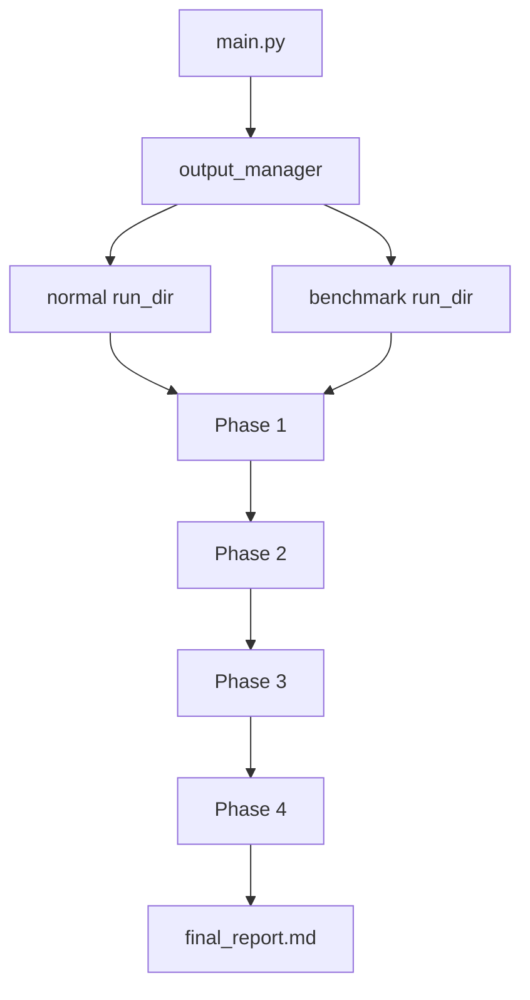
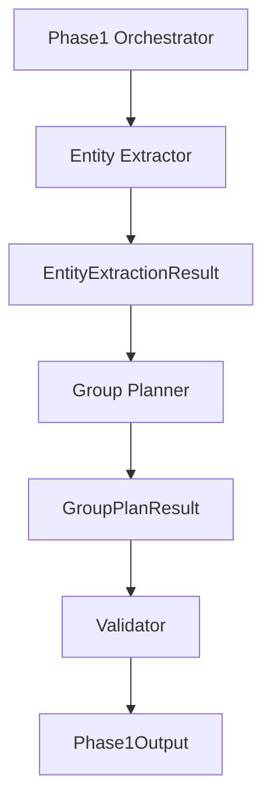
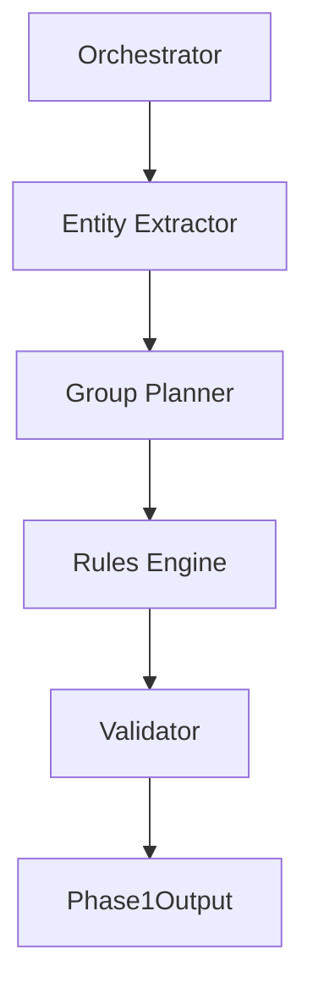
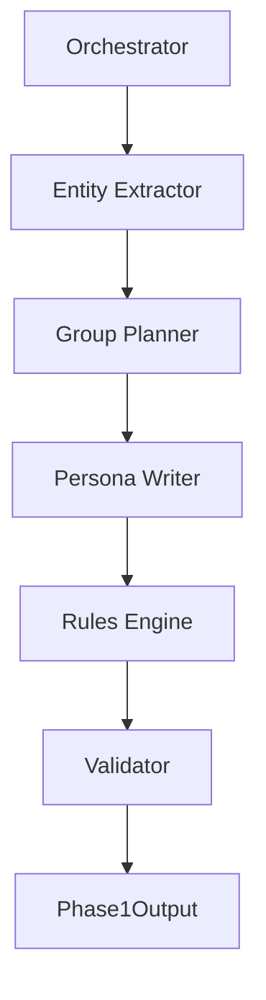

---

# 📄 项目阶段汇报（v1.1.13 → v1.1.16）

---

# 一、总体目标（开场一句话）

当前这一轮迭代的核心目标是：

👉 **把原本“单体黑盒的 Phase 1 生成器”，升级为“可控、可扩展的多层生成流水线”，为后续规模化（百级/千级 agent）和预测能力打基础。**

---

# 二、为什么要做这一轮重构（问题背景）

当前系统的核心问题集中在 Phase 1：

### 1️⃣ Generator 职责过载

一个模块同时负责：

* 事实提取
* 群体生成
* 人设生成
* 参数分配（I / P / percentage）
* 结构校验

👉 **问题：不可维护 + 不可控**

---

### 2️⃣ 规则分裂在多个地方

* Prompt 中一部分
* Validator 中一部分
* Postprocess 中一部分

👉 **问题：一致性差、难调试**

---

### 3️⃣ 不该由 LLM 生成的字段仍在生成

例如：

* `P`
* `estimated_percentage`

👉 **问题：不稳定、难收口**

---

### 4️⃣ 表达层（persona）侵入结构层

👉 **问题：结构与表达耦合，无法扩展**

---

# 三、版本演进总览

| 版本      | 核心能力       | 本质变化                          |
| ------- | ---------- | ----------------------------- |
| v1.1.13 | 输出治理       | 建立 run-based 输出与 benchmark 体系 |
| v1.1.14 | 架构解耦       | Phase 1 拆为多模块                 |
| v1.1.15 | 规则收口       | 从 LLM → Code                  |
| v1.1.16 | 表达层独立 + 并发 | 支撑规模化                         |

---

# 四、v1.1.13（输出治理）

## 📁 文件名

```
docs/iterations/v1.1.13_output_governance_and_log_split.md
```

---

## 架构图



---

## 设计目的

解决：

* 输出文件混乱
* 无法回溯
* benchmark 与开发日志混在一起

---

## 核心改动

* 引入：

  * `outputs/normal/`
  * `outputs/benchmark/`
* 每次运行 = 一个 run_dir
* 新增：

  * `run_meta.json`
  * `BENCHMARK_LOG.md`

---

## 价值

👉 **建立“可观测系统”**
为后续架构改动提供 baseline 和回归判断能力

---

# 五、v1.1.14（Phase 1 解耦）

## 📁 文件名

```
docs/iterations/v1.1.14_phase1_decoupling.md
```

---

## 架构图



---

## 设计目标

👉 **把 Phase 1 从“单体黑盒”拆成可维护模块**

---

## 模块划分

### Layer 1：Entity Extractor

* 只负责事实
* 不生成 agent

### Layer 2：Group Planner

* 只负责群体结构
* 暂时保留字段生成

### Orchestrator

* 负责编排流程

---

## 关键设计原则

* 不改对外 schema
* 不动 Phase 2/3/4
* 不收规则（留给下一版）

---

## 价值

👉 **第一次建立清晰的职责边界**
为规则收口和并发打基础

---

# 六、v1.1.15（Rules Engine 收口）

## 📁 文件名

```
docs/iterations/v1.1.15_rules_engine_refactor.md
```

---

## 架构图



---

## 设计目标

👉 **把“结构性规则”从 LLM 拿回代码**

---

## 核心改动

### 从 LLM 移出：

* `P`
* `percentage`

### Rules Engine 负责：

* P 推导
* 分布归一
* 合法性校验
* 去重

---

## 设计原则

👉 LLM 只负责：

* 语义生成

👉 Code 负责：

* 一致性
* 数值约束
* 结构合法性

---

## 价值

👉 **系统从“生成驱动”升级为“生成 + 控制系统”**

---

# 七、v1.1.16（Persona + 并发）

## 📁 文件名

```
docs/iterations/v1.1.16_persona_parallelization.md
```

---

## 架构图



---

## 设计目标

👉 **把表达层彻底从结构层剥离，并支持并发**

---

## Persona Writer 职责

只负责：

* personality
* phrases
* communication style

---

## 并发能力

* 每个 group persona 可独立生成
* 可并发执行

---

## 价值

👉 **系统具备规模化能力基础**

* 支持更多 agent
* 提高生成效率
* 提高多样性

---

# 八、三次演进的本质变化

## 从：

👉 单体 Generator（不可控）

---

## 到：

👉 分层流水线（可控）

---

## 再到：

👉 LLM + Code 协同系统

---

## 最终：

👉 可扩展的生成系统（支持并发 + 规模化）

---

# 九、关于规模化（导师可能会问）

## 当前策略

不是：
❌ 1000 个 agent = 1000 个 LLM

而是：

### 分层模型

* 群体模板（LLM）
* agent 实例（代码扩展）
* 少量代表发言（LLM）
* 大量数值更新（代码）

---

## 结论

👉 **架构已经为百级/千级 agent 做好前置准备**

---

# 十、关于知识库 / RAG（导师很可能会问）

## 当前决策

👉 不接 RAG（阶段性决策）

---

## 原因

* 当前重点是链路稳定
* JSON 本地记忆足够
* 避免引入检索复杂度

---

## 未来规划

👉 v1.2.x 引入：

* 案例知识库（校准层）
* 优先接入 Entity Extractor
* 作用：事件烈度/争议性校准

---

# 十一、最终结论（汇报收尾）

## 这轮重构的意义

👉 不在于“立刻变快”，而在于：

* 架构可维护
* 行为可控
* 规则可收口
* 系统可扩展

---

## 当前阶段定位

👉 **从 Demo 系统 → 工程化系统 的关键跃迁**

---

## 下一步方向

* 完成 v1.1.14 解耦
* 推进 v1.1.15 规则收口
* 推进 v1.1.16 并发能力
* v1.2.x 引入案例校准层

---

# 🧠 最后给你一句可以用来收尾的话

你可以跟导师这样总结：

> 当前这轮迭代的核心不是功能扩展，而是把系统从一个不可控的单体生成器，重构为一个分层、可控、可扩展的生成流水线，为后续规模化模拟和预测能力打基础。

---

