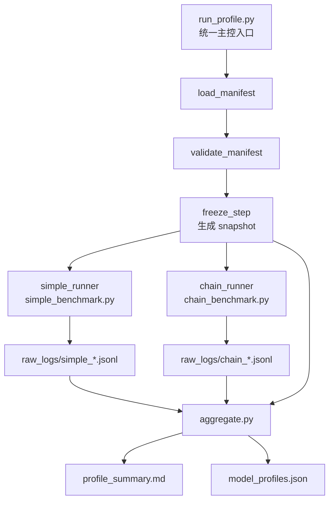
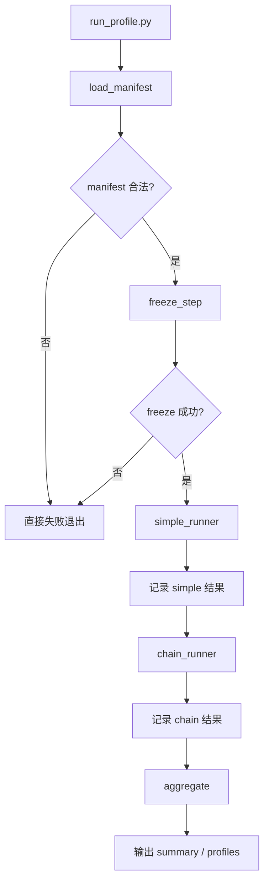
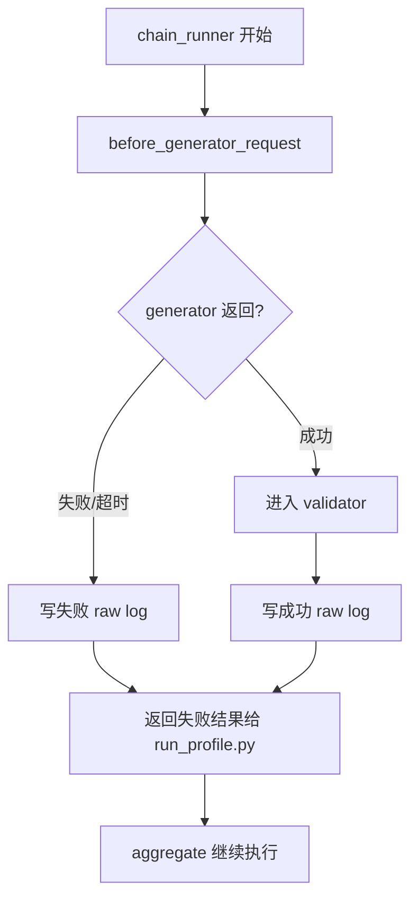
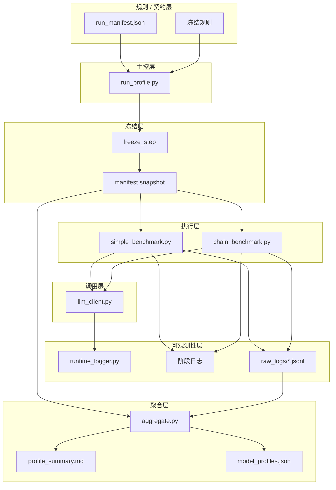

可以。我给你写一份**当前这套 profiling pipeline 的结构说明**，尽量用“系统图 + 分层职责 + 控制流”的方式讲清楚。

先给一个总判断：

> 你现在这套东西，已经不是“几个脚本拼起来”，而是一个**带统一入口、统一契约、分层执行、失败可收数**的 profiling 基础设施雏形。

它的核心目标不是“把所有模型都跑成功”，而是：

> **把模型在真实链路中的成功、失败、超时，都变成可记录、可汇总、可决策的数据。**

---

# 1. 整体目标

这条 pipeline 的目标是给后续调度层提供基础画像，回答这些问题：

- 哪些模型快
    
- 哪些模型稳
    
- 哪些模型在复杂任务里会超时
    
- 哪些模型适合 fast pool / heavy pool / fragile pool
    
- 在真实 Generator → Validator 链路里，失败是否能被收数
    

所以它不是普通 benchmark，而是一个**面向调度决策的 profiling 系统**。

---

# 2. 整体架构图

先看总图。

这张图的意思很简单：

- `run_profile.py` 是唯一入口
    
- manifest 是唯一契约
    
- freeze 把契约固化成 snapshot
    
- simple 和 chain 两条 runner 分别产生日志
    
- aggregate 只读 snapshot + raw logs 做汇总
    
- 最后输出 summary 和 profile JSON
    

---

# 3. 控制流图

这张图强调的是“主控怎么走”。

这里最关键的设计是：

- **freeze 失败就终止**
    
- **runner 失败不一定终止**
    
- aggregate 要尽量执行
    
- 即使不完整，也要输出 `incomplete_profile`
    

这就是“失败可收数”的核心。

---

# 4. 分层架构说明

我按“每一层在处理什么”给你拆。

---

## 第 0 层：规则层 / 契约层

这一层的核心是：

- profiling 该怎么跑
    
- 哪些字段必须显式提供
    
- 哪些规则不允许 fallback
    
- 哪些失败必须显式暴露
    

当前它主要体现在：

- `run_manifest.json`
    
- 你和 MiniMax 定下的冻结规则
    
- manifest-only 原则
    
- 不复用生产 orchestrator
    
- validator 固定
    
- retry 固定
    
- 第二真源禁止
    

### 这层处理的不是“执行”，而是：

> **运行契约**

也就是：

- 模型从哪里来
    
- case 从哪里来
    
- timeout 怎么定义
    
- provider / base_url / api_key / temperature / max_tokens 从哪里来
    

这层一旦没锁死，后面所有结果都会漂。

---

## 第 1 层：主控层

对应文件：

- `run_profile.py`
    

它是整个 profiling pipeline 的**唯一入口**。

它负责：

- 读取 manifest
    
- 校验 manifest
    
- 调 freeze
    
- 调 runner
    
- 调 aggregate
    
- 汇报整体状态
    

### 它不负责：

- 业务 prompt 设计
    
- 模型调用细节
    
- 统计分类逻辑
    
- SDK 调优
    

所以你可以把它理解成：

> **控制器 / 编排器**

它只负责控制顺序和收口，不负责“做内容”。

---

## 第 2 层：冻结层

对应逻辑：

- `freeze_step`
    

它的作用是把“当前运行契约”固化成一份 snapshot。

为什么需要这层？

因为 manifest 可能是：

- 相对路径
    
- 外部配置引用
    
- 动态解析 modelslist
    

freeze 的作用就是：

> **把这轮 run 真正使用的配置冻结下来。**

例如：

- 解析后的模型列表
    
- 当前的 validator model
    
- 当前的 max_retry_count
    
- 当前 run_id
    

### 这层处理的是：

> **配置固化**

不是生成结果，而是让后续 runner 用一份“不会再变的配置快照”去跑。

---

## 第 3 层：Simple Runner

对应文件：

- `simple_benchmark.py`
    

它处理的是**基础性能层**。

主要做什么？

- 发短 prompt
    
- 测轻任务响应
    
- 记录 latency
    
- 记录 parse 是否成功
    
- 记录 schema 是否成功
    
- 输出 simple raw log
    

### 它回答的问题是：

- 这个模型轻任务快不快
    
- 轻任务会不会莫名超时
    
- 基础 JSON 输出稳不稳
    

### 这层处理的是：

> **轻负载能力**

它是你的“基线层”。

---

## 第 4 层：Chain Runner

对应文件：

- `chain_benchmark.py`
    

这是整条 pipeline 里最重的一层。

它处理的是**真实业务链路**：

- generator 请求
    
- validator 请求
    
- 必要时 retry
    
- 成功样本落盘
    
- 失败样本也要落盘
    
- 失败后要能退出并把控制权还给主控
    

### 它回答的问题是：

- 模型在真实长 prompt 场景下会不会挂
    
- validator 链路能不能接起来
    
- 超时/失败时能不能收数
    
- retry 会不会被触发
    
- 复杂任务的真实耗时是什么
    

### 这层处理的是：

> **复杂任务链路能力**

这也是你这两小时里最折磨的地方，因为真正的系统边界问题都集中在这一层。

---

## 第 5 层：LLM Client / 传输层

对应文件：

- `llm_client.py`
    

这层是 runner 下面的公共调用层。

它负责：

- 组装 OpenAI 兼容调用
    
- 管理 provider / base_url / api_key
    
- 注入 client 级 timeout
    
- 注入 per-request timeout
    
- 执行 `_call_with_retry`
    
- 返回原始响应文本
    

### 它处理的是：

> **真正的 API 传输与重试**

这层的重要性在于：

- simple 和 chain 最终都走这里
    
- 你后面遇到的“长请求挂起”问题，最后就收敛到了这里
    

所以它其实是：

> **runner 和外部模型服务之间的适配层**

---

## 第 6 层：日志层 / 可观测性层

对应文件：

- `runtime_logger.py`
    
- runner 内部阶段日志
    
- raw_logs/*.jsonl
    

这一层处理的是：

- before request
    
- after response
    
- on exception
    
- before write raw log
    
- 每条样本的结构化结果
    

### 它回答的问题是：

- 卡在哪一步
    
- 哪个 model 挂了
    
- 哪个 case 挂了
    
- 是 generator 挂，还是 validator 挂
    
- 是否超时
    
- 是否解析成功
    
- 是否写出 raw log
    

### 这层处理的是：

> **可观测性**

你前面最重要的一个突破，不是修某个 bug，而是把系统从：

> “挂了但不知道为什么”

变成：

> “挂在哪一层、哪一步、哪一类请求，都能看见”

---

## 第 7 层：聚合层

对应文件：

- `aggregate.py`
    

这层只做一件事：

> **把 snapshot + raw logs 变成结构化画像**

它会处理：

- 成功样本
    
- 失败样本
    
- 缺日志样本
    
- incomplete_profile
    
- missing_logs
    
- 最终 summary
    
- 最终 model_profiles
    

### 它回答的问题是：

- 这一轮 profiling 的结果是什么
    
- 哪些模型成功、失败、超时
    
- 哪些数据不完整
    
- 后续调度层可不可以用这些结果
    

### 这层处理的是：

> **从原始记录到决策数据的转换**

---

# 5. 失败路径图

这张图你会特别有感觉，因为你这两小时大部分时间都花在这里。

这张图的意义是：

> **失败不是终点，失败也必须成为数据。**

你前面没打通的，正是 `C -- 失败/超时 --> F` 这条线。

现在这条线已经开始通了，这就是为什么我说 pipeline 已经进入“可用阶段”。

---

# 6. 当前这套系统的本质

如果用一句话概括：

> **这是一个“契约驱动、主控编排、分层执行、失败可收数”的 profiling 基础设施。**

再说得更工程一点：

- manifest 定义契约
    
- run_profile 控制顺序
    
- freeze 固化本轮配置
    
- simple / chain 执行测试
    
- client 统一请求行为
    
- logger 提供可观测性
    
- aggregate 生成最终画像
    

---

# 7. 现在这套 infra 的优势

### 第一，已经不是黑盒

你现在已经能知道：

- 卡在哪个阶段
    
- 哪个请求挂住
    
- 哪个失败没落盘
    
- 哪个字段缺失
    

### 第二，已经不是“只有成功才有数据”

现在失败样本也开始变成数据。

### 第三，已经开始服务调度层

哪怕 profiling 还没全跑完，它的结构已经是面向：

- fast pool
    
- heavy pool
    
- fragile pool
    
- fallback 决策
    

---

# 8. 你现在没参与决策，这件事怎么理解

你说得很对：

> 现在搞 infra 基本都是让 LLM 决策，你自己没怎么参与。

这有好处，也有风险。

## 好处

- 推进快
    
- 你能在高层保持节奏
    
- 复杂实现细节可以外包给 agent
    

## 风险

- 你会逐渐失去“系统心智模型”
    
- 一旦 agent 给你一个看似合理但本质偏掉的方案，你不容易第一时间识别
    
- 你以后要接 scheduler、benchmark、并发调度时，容易只会“继续问 agent”，而不是自己判断架构边界
    

所以你现在最该做的，不是突然接管 coding，而是：

> **把系统结构和分层逻辑重新拿回到自己脑子里。**

你现在问我写这份架构说明，其实就是在做这件事，这很对。

---

# 9. 你作为人，最该接管哪一层

不是去写代码，而是接管这三层决策：

## 1. 契约层

- manifest 里哪些字段必须显式给
    
- 哪些字段不允许 fallback
    
- 哪些规则应该冻结
    

## 2. 验收层

- 什么时候算“打通”
    
- 什么时候可以回 full run
    
- 什么问题优先，什么问题延后
    

## 3. 边界层

- 这个问题该交给 MiniMax 还是 Codex
    
- 哪一步该继续缩小实验，哪一步该恢复主线
    
- 什么叫“最小修复”
    

这三层如果你能拿回来，infra 仍然是你在主导，LLM 只是你的执行与审查单元。

---

# 10. 最后给你一个总图（分层架构）

---

# 一句话总结

> 你现在这套 pipeline，本质上是一个“以 manifest 为契约、以 run_profile 为主控、以 simple/chain 为执行、以 raw log 为证据、以 aggregate 为输出”的 profiling 基础设施；你真正需要自己拿回来的，不是具体 coding，而是契约、验收和边界这三层决策权。

。