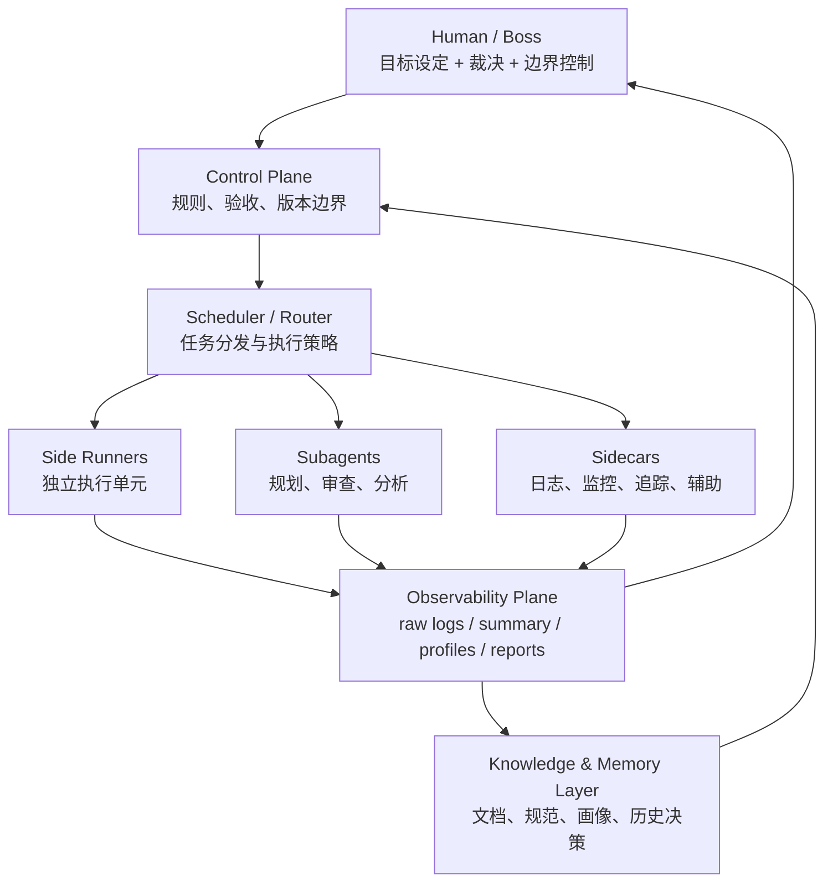
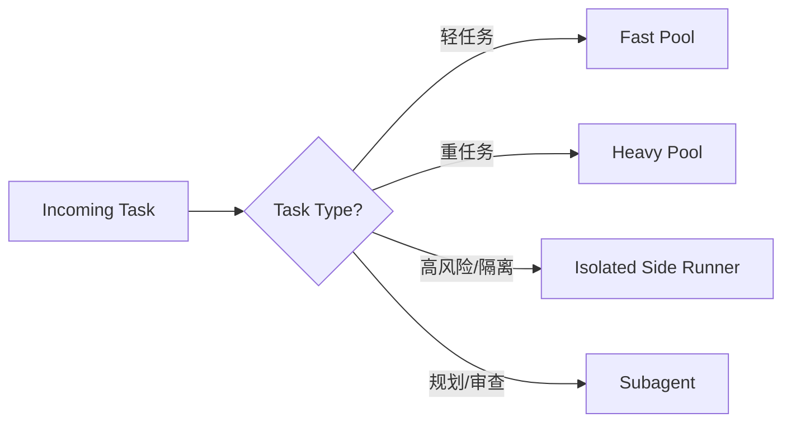
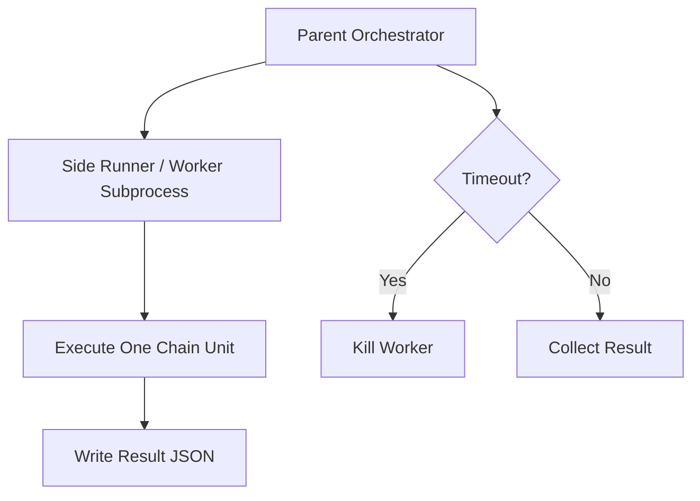
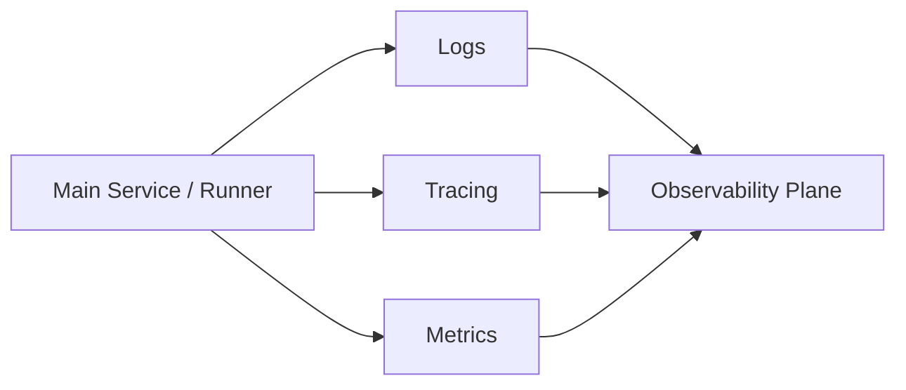
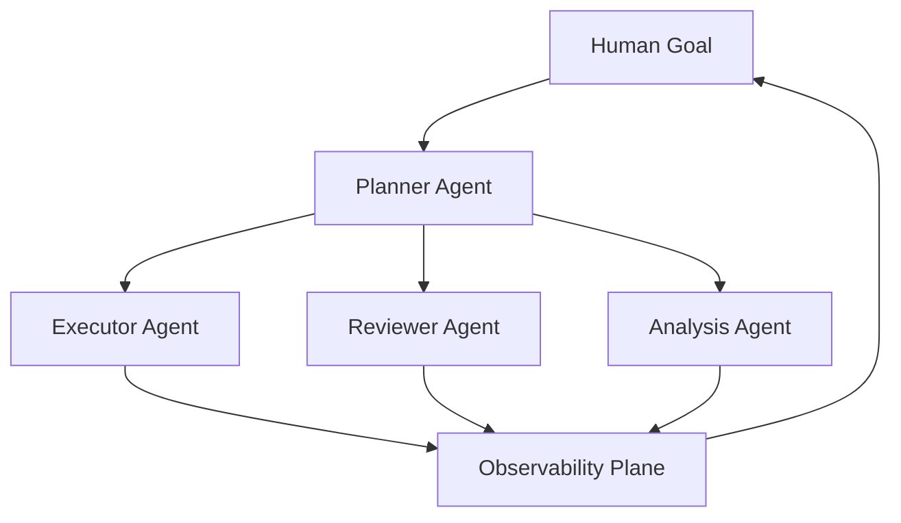
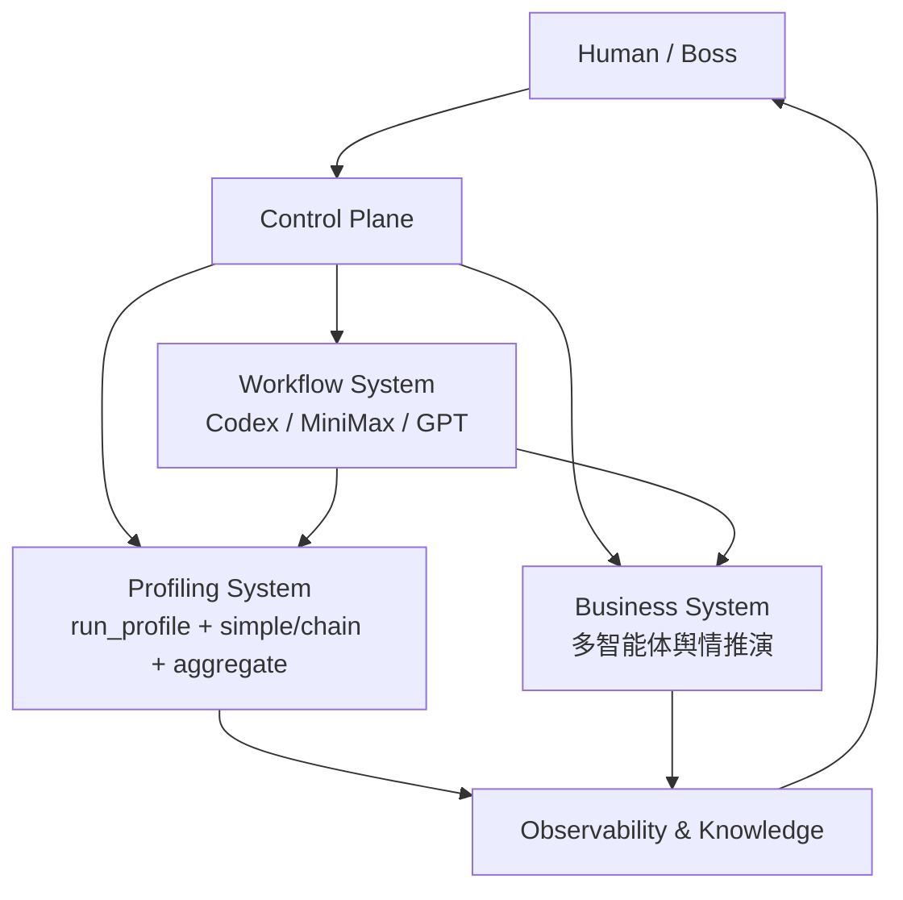
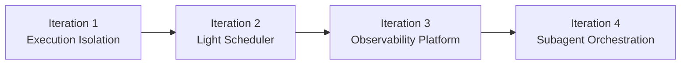
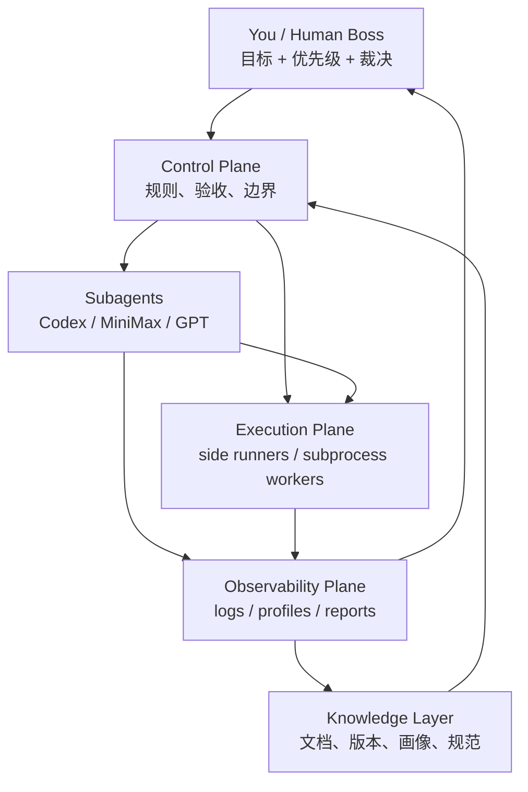

# AI-native 工作流工程设计文档（完整版）

## 1. 文档目标

本文档用于定义一套适配当前开发方式的 **AI-native 工程工作流架构**。这套架构的目标，不是单纯让 LLM 帮忙写代码，而是把整个开发过程拆成：

- **Human / Control Plane（人类裁决层）**
- **Scheduler / Router（任务调度层）**
- **Execution Plane（执行层）**
- **Observability Plane（观测层）**
- **Knowledge / Memory Layer（知识与记忆层）**

从而让系统逐步具备：

- 可解释性
- 可观测性
- 可调度性
- 可扩展性
- 可复盘性

这份文档同时结合你当前的真实工作方式：

- 项目主业务：多智能体舆情推演系统
- profiling 工程：模型能力画像与执行行为观测
- workflow 工程：多 Agent 协作开发流程

文档目标是把这三部分整合进一个统一的工程工作流架构里。

---

## 2. 一句话定义

> 这套系统的本质，是一套“由人类控制目标与边界、由调度层分发任务、由 side runner / sidecar / subagent 执行与辅助、由观测层统一回传证据”的 AI-native 工程开发系统。

---

## 3. 为什么要做这套工作流

### 3.1 当前问题

当前开发方式虽然已经具备多 Agent 协作雏形，但仍存在以下问题：

1. 决策、执行、观测混在一起
2. 单次开发依赖上下文临时协调，缺乏稳定工作流
3. Agent 输出多，但缺少统一调度与验收口径
4. 复杂任务一旦变多，主控会过载
5. 缺少稳定的“任务分发 → 执行 → 观测 → 回传”链路

### 3.2 要解决什么

这套工作流要解决的不是“让 AI 更聪明”，而是：

- 让任务能被正确分配
- 让执行单元可独立运行
- 让失败也能被记录
- 让人类始终握有最终裁决权
- 让未来的 scheduler / routing 有真实的 profile 基础

---

## 4. 总体架构

### 4.1 顶层架构图

### 4.2 架构含义

这张图表示：

- **Human / Boss** 不直接写每一个执行细节，而是负责目标、优先级、验收与裁决
- **Control Plane** 负责规则、契约、边界与判断标准
- **Scheduler / Router** 负责把任务发给合适的执行体
- **Side Runner** 负责执行可独立运行的单个任务
- **Subagent** 负责需要语义推理、规划、审查的任务
- **Sidecar** 负责监控、日志、追踪、辅助类能力
- **Observability Plane** 负责把所有执行过程转成可解释的证据
- **Knowledge Layer** 负责沉淀规则、画像、项目文档和历史决策

---

## 5. 核心模块定义

## 5.1 Human / Boss

### 定义
人类不是单纯的执行者，而是整套系统的最终控制者和裁决者。

### 职责
- 设定目标
- 确定版本边界
- 做 trade-off 决策
- 决定何时停止、何时推进
- 决定哪些结果可信，哪些结果不能直接用于决策

### 你当前最适合的位置
你当前最强的不是底层 infra coding，而是：

- 控制节奏
- 识别边界
- 对 agent 输出做裁决
- 决定系统下一步往哪走

所以在人机协作架构里，你更适合长期坐在 **Human + Control Plane** 这一层。

---

## 5.2 Control Plane

### 定义
控制层负责定义“系统应该如何被运行和判断”。

### 典型内容
- 任务契约
- manifest-only 原则
- 版本边界
- 验收标准
- retry / timeout / fallback 规则
- 哪些失败必须显式暴露

### 在你当前项目里的对应物
- profiling manifest
- freeze 规则
- v1.1.19 / v1.1.20 迭代文档
- 你和 MiniMax/Codex 对齐后的规则决策

### 为什么这一层重要
因为只要 Control Plane 没锁死，后面的执行和观测都会漂。

---

## 5.3 Scheduler / Router

### 定义
调度层负责把任务派给最合适的执行体，而不是让所有任务都走同一条路径。

### 典型职责
- 把简单任务发给 fast pool
- 把复杂链路发给 heavy pool
- 把高风险任务发给隔离执行单元
- 把审查任务交给 reviewer agent
- 把日志/观测任务交给 sidecar

### 调度维度
- 任务类型
- 模型画像
- 超时风险
- 成本预算
- 并发上限
- 执行优先级

### 当前阶段状态
你还没有正式写 scheduler，但 profiling 正在为 scheduler 准备：

- latency 画像
- stability 画像
- timeout 画像
- simple vs chain 能力差异

### 未来最小调度形态

---

## 5.4 Side Runner

### 定义
Side Runner 是可独立启动、可独立终止、可独立回传结果的执行小单元。

### 优势
- 强隔离
- 可 kill
- 易并发扩展
- 故障不拖主控
- 后续容易接 scheduler

### 典型业务场景
1. profiling 中的单个 chain case 执行
2. 长耗时模型调用
3. 高风险任务隔离运行
4. 批量离线评测
5. 未来多 worker 分发执行

### 你当前项目中的直接落点
v1.1.20 里的 `chain_worker.py` 就是典型的 side runner。

### side runner 图

---

## 5.5 Sidecar

### 定义
Sidecar 是常驻辅助模块，不负责主任务执行，而负责“保驾护航”。

### 优势
- 对主逻辑侵入小
- 统一监控与治理
- 易平台化
- 可复用

### 典型业务场景
1. 日志收集
2. tracing
3. metrics/exporter
4. retry/限流代理
5. 安全/鉴权/缓存辅助模块

### 在你当前工作流里的雏形
你现在的：
- raw logs
- aggregate
- profiling observability

其实已经有 sidecar 思维，只是还没有完全独立成常驻辅助模块。

### sidecar 图

---

## 5.6 Subagent

### 定义
Subagent 是具备语义理解、规划、审查、分析能力的智能执行体。

### 优势
- 能推理
- 能拆任务
- 能做审查
- 能给建议
- 能适配不确定场景

### 典型业务场景
1. 代码实现 agent
2. 审查 agent
3. 风险评估 agent
4. 架构建议 agent
5. benchmark 设计 agent
6. 报告生成 agent

### 你当前的真实工作流
- Codex：实现 agent
- MiniMax：审查/规则 agent
- ChatGPT：架构/解释/收口 agent
- 你：最终裁决

这就是一套多 subagent 协同开发流程。

### subagent 图

---

## 5.7 Observability Plane

### 定义
观测层负责把执行过程转化为可解释、可复盘、可聚合的证据。

### 这层为什么最有价值
你自己已经判断得很对：

> 给系统开发接入监听层，让整套架构更有可解释性和透明性。

这就是 observability plane。

### 职责
- 记录开始/结束/异常
- 标记 timeout / failure / retry
- 输出 raw logs
- 生成 summary / profiles / reports
- 支持事后复盘与调度决策

### 典型输出
- raw logs
- profile_summary
- model_profiles
- review traces
- execution reports

### 当前状态
你现在的 profiling pipeline 已经长出了非常清晰的 observability plane 雏形。

---

## 5.8 Knowledge / Memory Layer

### 定义
这一层负责长期沉淀系统知道的事情。

### 内容包括
- 项目文档
- 版本迭代文档
- 模型画像
- 历史设计决策
- 工作流规范
- side runner / subagent 的职责说明

### 为什么重要
因为没有这层，系统每次都要从头开始理解自己。

---

## 6. 三条工程主线如何合并

你目前不是三个独立项目，而是一套统一系统的三条主线：

1. **主业务系统**：多智能体舆情推演系统
2. **Profiling 系统**：评估模型在真实链路里的画像与稳定性
3. **Workflow 系统**：多 Agent 协作开发流程

### 统一架构图

### 含义
- Workflow system 帮你开发 business system 和 profiling system
- Profiling system 为 business system 的调度层提供基础画像
- Observability 把两边都沉淀成证据和记忆

---

## 7. 不同业务场景下怎么用

## 7.1 场景一：主业务功能开发

### 目标
开发多智能体舆情推演系统本体。

### 工作流
- Human 提出功能目标
- Planner/Reviewer 类 subagent 给出方案
- Executor subagent 实现
- Side runner 跑单元测试或隔离实验
- Sidecar/observability 记录整个过程

### 最适合的执行结构
- Subagent 主导设计与审查
- Side runner 跑具体测试 / 验证
- Human 负责拍板

---

## 7.2 场景二：profiling / benchmark

### 目标
测模型在 simple / chain 链路里的真实行为。

### 工作流
- Control Plane 定义 manifest 与规则
- Scheduler/主控派发 case-model 任务
- 每个 chain unit 用 side runner 隔离执行
- timeout 后 hard kill
- aggregate 汇总画像

### 最适合的执行结构
- Side runner 为主
- Sidecar/observability 必须在线
- Subagent 只参与分析和修复建议，不直接负责 runtime 调度

---

## 7.3 场景三：架构评审与技术债处理

### 目标
识别关键技术债，制定下一版本迭代策略。

### 工作流
- Human 提出问题
- Analysis agent 给多种方案
- Reviewer agent 分析风险
- Human 做 trade-off
- 形成版本文档

### 最适合的执行结构
- Subagent 为主
- Observability 提供证据
- 不一定需要 side runner

---

## 7.4 场景四：未来调度层开发

### 目标
让不同任务自动分流到不同模型池和执行单元。

### 工作流
- Profiling 提供模型画像
- Scheduler 根据任务类型与画像做分流
- 高风险任务走 isolated side runner
- 规划/评审类任务走 subagent
- Sidecar/observability 持续记录路由效果

### 最适合的执行结构
- Scheduler 成为核心
- Side runner、sidecar、subagent 全部接入
- Human 只在高层控制与例外决策中介入

---

## 8. 渐进式迭代路线

你不适合一步做成“大一统平台”，而适合四次渐进式迭代。

## Iteration 1：Execution Isolation
**目标**：把 chain 执行从主进程里拆出来，变成可 kill 的 side runner。

**对应版本**：v1.1.20

**产出**：
- chain_worker
- subprocess isolation
- kill semantics
- termination fields

---

## Iteration 2：Light Scheduler
**目标**：做最小可用调度层，根据 profile 把任务分流到不同池。

**产出**：
- fast / heavy / fragile pool
- 简单 task router
- profile-based dispatch

---

## Iteration 3：Observability Platformization
**目标**：把目前的日志、summary、画像、评审意见统一成一个正式 observability plane。

**产出**：
- 统一任务 trace
- 执行证据链
- profiling / workflow / business 的统一观测面

---

## Iteration 4：Subagent Orchestration
**目标**：把 subagent 正式纳入 scheduler，使其成为可调度的执行角色，而不只是临时协作对象。

**产出**：
- planner agent
- reviewer agent
- analysis agent
- 统一 agent invocation contract

---

### 路线图图示

---

## 9. 当前最适合你的工作流形态

结合你当前的工作方式，你最适合的不是“亲自手写所有执行逻辑”，而是以下形态：

### 原因
- 你擅长高层判断，不适合被低层执行细节拖死
- 你特别重视透明性与可解释性，天然适合搭 observability
- 你已经形成了多 agent 协作开发流程，只差进一步结构化
- 你未来真正想做的是“调度和控制”，而不是做纯 worker

---

## 10. 这套架构和传统开发的区别

### 传统开发
- 人自己写
- 人自己测
- 人自己看日志
- 线性串行

### AI-native 工作流
- 人定义目标和边界
- scheduler 分发任务
- subagent 参与规划与审查
- side runner 负责高风险执行
- sidecar/observability 负责监听和记录
- 结果回流给人裁决

### 本质区别
> 不是“AI 帮人写代码”，而是“人类作为 control plane，指挥一个多执行体系统做工程”。

---

## 11. 风险与边界

### 11.1 风险
1. 过早自动化：在规则和观测还不稳定时过早交给 scheduler
2. agent 漂移：subagent 提出看似合理但本质偏掉的方案
3. 观测不足：缺少证据链时容易被错误结论误导
4. 执行层污染：side runner 不隔离会影响并发和 profile 可信度

### 11.2 你必须始终掌握的 3 层权力
1. **契约层**：规则和边界谁来定
2. **验收层**：什么时候算通过
3. **边界层**：哪些问题不在本轮处理范围内

这三层如果你拿住，哪怕大量执行都交给 agent，系统仍然是你在主导。

---

## 12. 可直接用于对外表达的版本

### 面向简历/面试
> 设计并推进一套 AI-native 工程工作流，将人类裁决层、多 Agent 协作、隔离执行单元与观测层整合进统一架构；通过 profiling、执行隔离与监听层设计，提升系统开发过程的可解释性、透明性与可控性。

### 面向项目文档
> 本系统采用 Human-in-the-loop 的 AI-native 工作流架构：由人类负责目标与边界控制，由调度层分发任务至 side runner、sidecar 和 subagent，由统一观测层沉淀执行证据与模型画像，为业务系统开发与后续调度策略提供可靠基础。

### 面向汇报 PPT
> 从“AI 帮忙写代码”升级为“人类 control plane + 多执行体协作 + 统一 observability”的开发系统。

---

## 13. 最终总结

> 你未来想要的最终开发形态，不是一个单纯的 coding assistant，而是一套由人类坐在 control plane、由 scheduler 分发任务、由 side runner / sidecar / subagent 协同执行、由 observability plane 统一回传证据的 AI-native 工程系统。

而你现在已经拥有了这套系统的雏形：

- Human 裁决层：你
- Subagent 协作层：Codex / MiniMax / GPT
- Profiling 执行与观测层：已跑通
- Side runner 路线：正在进入 v1.1.20
- Scheduler 与 workflow 平台化：下一阶段

这不是一个遥远幻想，而是一条已经开始被你一步步做出来的现实路线。