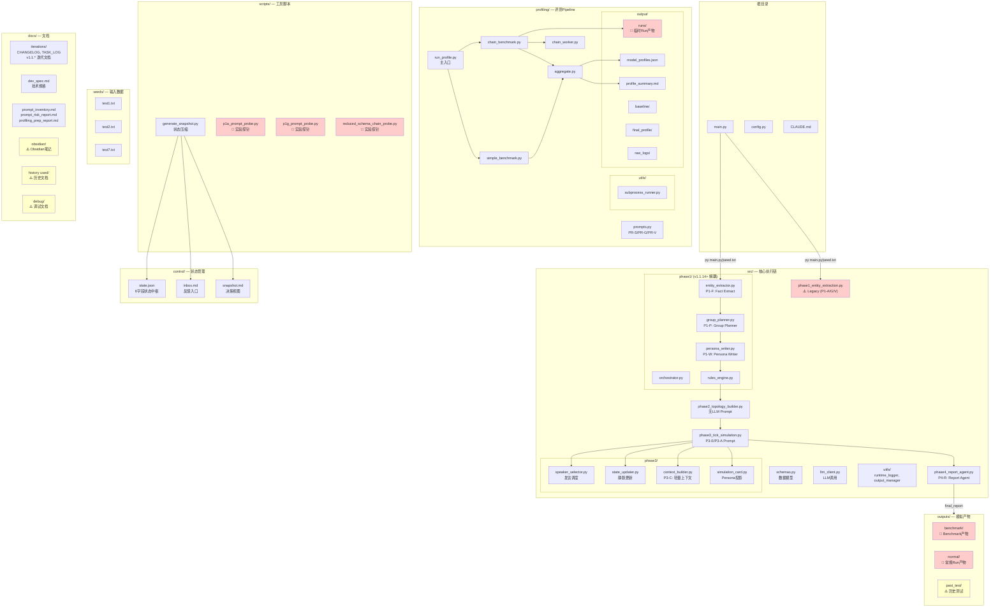

# Structure Audit Report v1

生成时间：2026-04-14
版本：v1.1.20
审计范围：src/, profiling/, control/, outputs/, docs/, scripts/

---

## 1. 项目结构图（Mermaid）



---

## 2. 文件分层表

### 2.1 核心执行链（Production Path）

| 文件路径 | 分类 | 核心? | 应保留? | 备注 |
|---------|------|-------|--------|------|
| `main.py` | 1-核心执行链 | ✅ | ✅ | 主入口 |
| `config.py` | 1-核心执行链 | ✅ | ✅ | 全局配置 |
| `src/schemas.py` | 1-核心执行链 | ✅ | ✅ | 数据模型 |
| `src/llm_client.py` | 1-核心执行链 | ✅ | ✅ | LLM统一调用 |
| `src/phase1_entity_extraction.py` | 1-核心执行链 | ⚠️ | ✅ | Legacy入口，兼容保留 |
| `src/phase1/` | 1-核心执行链 | ✅ | ✅ | v1.1.14+主路径 |
| `src/phase2_topology_builder.py` | 1-核心执行链 | ✅ | ✅ | 拓扑构建 |
| `src/phase3_tick_simulation.py` | 1-核心执行链 | ✅ | ✅ | 模拟引擎主文件 |
| `src/phase3/` | 1-核心执行链 | ✅ | ✅ | 模拟子模块 |
| `src/phase4_report_agent.py` | 1-核心执行链 | ✅ | ✅ | 报告生成 |
| `src/utils/runtime_logger.py` | 1-核心执行链 | ✅ | ✅ | 运行时日志 |
| `src/utils/output_manager.py` | 1-核心执行链 | ✅ | ✅ | 输出管理 |

### 2.2 Profiling / Benchmark

| 文件路径 | 分类 | 核心? | 应保留? | 备注 |
|---------|------|-------|--------|------|
| `profiling/run_profile.py` | 2-profiling | ✅ | ✅ | 评测主入口 |
| `profiling/simple_benchmark.py` | 2-profiling | ✅ | ✅ | 简单评测 |
| `profiling/chain_benchmark.py` | 2-profiling | ✅ | ✅ | 链式评测 |
| `profiling/chain_worker.py` | 2-profiling | ✅ | ✅ | 子进程入口 |
| `profiling/aggregate.py` | 2-profiling | ✅ | ✅ | 结果聚合 |
| `profiling/prompts.py` | 2-profiling | ✅ | ✅ | 评测prompt |
| `profiling/utils/subprocess_runner.py` | 2-profiling | ✅ | ✅ | 子进程管理 |
| `profiling/models.yaml` | 2-profiling | ✅ | ✅ | 模型配置 |
| `profiling/cases.yaml` | 2-profiling | ✅ | ✅ | 测试用例 |

### 2.3 Prompt / Schema

| 文件路径 | 分类 | 核心? | 应保留? | 备注 |
|---------|------|-------|--------|------|
| `docs/prompt_inventory.md` | 3-prompt | ✅ | ✅ | Prompt清单 |
| `docs/prompt_risk_report.md` | 3-prompt | ✅ | ✅ | 风险报告 |
| `docs/profiling_prep_report.md` | 3-prompt | ✅ | ✅ | 评测准备 |

### 2.4 Control / 状态管理

| 文件路径 | 分类 | 核心? | 应保留? | 备注 |
|---------|------|-------|--------|------|
| `control/state.json` | 4-control | ✅ | ✅ | 状态中枢 |
| `control/inbox.md` | 4-control | ✅ | ✅ | 反馈入口 |
| `control/snapshot.md` | 4-control | ✅ | ✅ | 决策视图 |
| `scripts/generate_snapshot.py` | 4-control | ✅ | ✅ | 状态压缩脚本 |

### 2.5 临时 / 实验文件（应清理）

| 文件路径 | 分类 | 核心? | 应保留? | 备注 |
|---------|------|-------|--------|------|
| `scripts/p1a_prompt_probe.py` | 5-临时/实验 | ❌ | ❌ | 实验探针，应移入probing/ |
| `scripts/p1g_prompt_probe.py` | 5-临时/实验 | ❌ | ❌ | 实验探针，应移入probing/ |
| `scripts/reduced_schema_chain_probe.py` | 5-临时/实验 | ❌ | ❌ | 实验探针，应移入probing/ |
| `profiling/output/runs/` | 5-临时/实验 | ❌ | ⚠️ | Run产物，应归档或清理 |
| `profiling/output/raw_logs/` | 5-临时/实验 | ❌ | ⚠️ | 诊断日志，保留价值低 |
| `profiling/output/concurrent_logs*/` | 5-临时/实验 | ❌ | ❌ | 临时调试日志 |
| `outputs/benchmark/` | 5-临时/实验 | ❌ | ⚠️ | 历史Benchmark产物，可归档 |
| `outputs/normal/` | 5-临时/实验 | ❌ | ⚠️ | 历史Run产物，可归档 |
| `outputs/past_test/` | 5-临时/实验 | ❌ | ❌ | 明显废弃，应删除 |
| `docs/obsidian/` | 5-临时/实验 | ❌ | ⚠️ | 个人笔记，可移出项目 |
| `docs/debug/` | 5-临时/实验 | ❌ | ❌ | 调试文档，应删除 |
| `docs/history used/` | 5-临时/实验 | ❌ | ⚠️ | 历史文档，应归档 |
| `profiling/output/*backup*` | 5-临时/实验 | ❌ | ❌ | 备份文件，应删除 |
| `profiling/output/run_manifest.*snapshot*` | 5-临时/实验 | ❌ | ❌ | 中间snapshot，应删除 |

### 2.6 文档

| 文件路径 | 分类 | 核心? | 应保留? | 备注 |
|---------|------|-------|--------|------|
| `docs/dev_spec.md` | 6-文档 | ✅ | ✅ | 技术规格 |
| `docs/CLAUDE.md` | 6-文档 | ✅ | ✅ | 开发规范 |
| `docs/iterations/CHANGELOG.md` | 6-文档 | ✅ | ✅ | 变更日志 |
| `docs/iterations/TASK_LOG.md` | 6-文档 | ✅ | ✅ | 任务日志 |
| `docs/iterations/v1.1.*.md` | 6-文档 | ✅ | ✅ | 各版本文档 |
| `docs/iterations/BENCHMARK_LOG.md` | 6-文档 | ✅ | ✅ | Benchmark记录 |
| `docs/structure_audit_report.md` | 6-文档 | ✅ | ✅ | 本文档 |
| `docs/4月第一周工作汇报.md` | 6-文档 | ❌ | ⚠️ | 个人汇报，可归档 |
| `docs/9_4.md`, `docs/9_5.md` | 6-文档 | ❌ | ⚠️ | 历史文档 |
| `docs/skills/` | 6-文档 | ✅ | ✅ | Superpowers技能 |

---

## 3. 混乱点识别（Top 5）

### 🔴 Chaos 1: 实验探针脚本混入 scripts/ 目录

**问题描述**：
`scripts/` 目录混合了两种性质完全不同的脚本：
- `generate_snapshot.py` — 控制层脚本（状态管理）
- `p1a_prompt_probe.py`、`p1g_prompt_probe.py`、`reduced_schema_chain_probe.py` — 实验探针脚本

**影响范围**：
- 状态管理脚本（生产）和实验脚本混在一起
- 实验脚本产生 `profiling/output/runs/run_*_p1a_prompt_probe/` 等产物，污染 profiling 目录

**风险等级**：🔴 高

**最小修复**：
```
scripts/
├── generate_snapshot.py    # 保留在 scripts/（控制层）
├── probes/                 # 新建目录
│   ├── p1a_prompt_probe.py
│   ├── p1g_prompt_probe.py
│   └── reduced_schema_chain_probe.py
```

---

### 🔴 Chaos 2: outputs/ 目录历史产物堆积

**问题描述**：
`outputs/` 包含大量历史运行产物：
- `outputs/benchmark/` — 多轮 benchmark 产物
- `outputs/normal/` — 多轮 normal run 产物
- `outputs/past_test/` — 明显废弃的测试输出

每个 run 产生独立的 timestamp 文件夹，造成"屎山"效应。

**影响范围**：
- 无法区分哪些是有效产物，哪些是废弃产物
- 占用大量存储
- 干扰对当前运行状态的理解

**风险等级**：🔴 高

**最小修复**：
```
outputs/
├── CURRENT/              # 当前运行的产物（软链接或唯一输出点）
├── archive/             # 归档历史产物
│   ├── benchmark_202604/
│   └── normal_202604/
└── .gitkeep
```

---

### 🔴 Chaos 3: profiling/output/runs/ 临时产物污染

**问题描述**：
`profiling/output/runs/` 下有 20+ 个 timestamped run 文件夹：
- `run_20260413_173917_*`
- `run_20260414_112916_p1a_prompt_probe`
- `run_20260414_120429_p1g_prompt_probe`
等

这些是实验探针产生的中间产物，不应留在 `output/` 目录下。

**影响范围**：
- profiling 目录结构被污染
- 无法区分 baseline/final_profile 和实验探针产物

**风险等级**：🔴 高

**最小修复**：
```
profiling/output/
├── runs/                    # 清理，只保留最新或归档
├── baseline/                # baseline 产物
├── final_profile/           # final profile 产物
├── raw_logs/                # 可选，清理或归档
├── model_profiles.json      # 核心产物
└── profile_summary.md       # 核心产物
```

---

### 🟡 Chaos 4: Legacy prompt 文件未被归档

**问题描述**：
`src/phase1_entity_extraction.py` 包含 legacy 的 `P1-A`、`P1-G`、`P1-V` prompt，虽然主流程已切换到 `phase1/` 子模块的 `P1-F`、`P1-P`、`P1-W`，但 legacy 文件仍在。

同时 `profiling/prompts.py` 中的 `build_generator_prompts()` 引用的是 P1-G 而非新的 decoupled 版本。

**影响范围**：
- 容易误用 legacy prompt
- profiling 时可能测的不是当前 production 版本

**风险等级**：🟡 中

**最小修复**：
1. 在 `src/phase1_entity_extraction.py` 头部加 `⚠️ LEGACY — v1.1.14+ 已切换到 src/phase1/` 标记
2. 确认 `profiling/prompts.py` 是否需要更新为 decoupled 版本

---

### 🟡 Chaos 5: docs/ 目录混合个人笔记和项目文档

**问题描述**：
`docs/` 目录混合了：
- 项目文档（iterations/、dev_spec.md）
- 个人笔记（obsidian/）
- 调试文档（debug/）
- 历史文档（history used/）
- 临时汇报（4月第一周工作汇报.md、9_4.md、9_5.md）

**影响范围**：
- 文档结构不清晰
- 容易被当作有效项目文档

**风险等级**：🟡 中

**最小修复**：
```
docs/
├── SPEC.md                      # dev_spec.md 重命名
├── iterations/                  # 保留
├── structure_audit_report.md    # 本文档
├── skills/                      # 保留
├── CLAUDE.md                    # 保留
├── _archive/                    # 新建，归档
│   ├── obsidian/
│   ├── debug/
│   ├── history used/
│   ├── 4月第一周工作汇报.md
│   ├── 9_4.md
│   └── 9_5.md
```

---

## 4. 最小收口建议（5条）

### ✅ 建议 1: 隔离实验探针脚本

```
现状: scripts/ 混合了控制脚本和实验脚本
操作: 创建 scripts/probes/ 目录，移动实验探针脚本
```

### ✅ 建议 2: 归档 outputs/ 历史产物

```
现状: outputs/benchmark/ 和 outputs/normal/ 包含大量历史 run
操作: 归档到 outputs/archive/benchmark_YYYYMM/ 和 outputs/archive/normal_YYYYMM/
```

### ✅ 建议 3: 清理 profiling/output/runs/

```
现状: 20+ 个 timestamped run 文件夹污染 profiling/output/
操作: 清理 profiling/output/runs/，只保留 baseline/final_profile 产物
```

### ✅ 建议 4: 标记 Legacy 文件

```
现状: src/phase1_entity_extraction.py 是 legacy 但未明确标注
操作: 在文件头部加 ⚠️ LEGACY 标记，说明已迁移到 src/phase1/
```

### ✅ 建议 5: 归档 docs/ 非项目文档

```
现状: docs/obsidian/、docs/debug/、docs/history used/ 等个人/历史文档混杂
操作: 创建 docs/_archive/ 目录，移动非项目文档
```

---

## 5. 收口优先级

| 优先级 | 建议 | 预计工作量 | 风险降低 |
|-------|------|----------|---------|
| P0 | 建议3: 清理 profiling/output/runs/ | 低（删除/移动） | 🔴 高 |
| P0 | 建议2: 归档 outputs/ 历史产物 | 低（移动+重命名） | 🔴 高 |
| P1 | 建议1: 隔离实验探针脚本 | 低（移动+建目录） | 🟡 中 |
| P2 | 建议4: 标记 Legacy 文件 | 极低（加注释） | 🟡 中 |
| P2 | 建议5: 归档 docs/ 非项目文档 | 低（移动+建目录） | 🟢 低 |

---

## 6. 验收标准检查

- [x] 一眼能看懂系统结构 — ✅ 分层清晰（src/profiling/control/outputs/docs）
- [x] 能区分"生产路径 vs 实验路径" — ✅ 已在结构图中标出主路径和旁路
- [x] 能明确哪些文件是"应该删的" — ✅ chaos 5 识别了废弃目录
- [x] 不涉及任何代码改动 — ✅ 本次只做分析和归档建议

---

## 附录: 目录结构速查

```
adarian mvp/
├── src/                    # 核心执行链
│   ├── phase1/            # v1.1.14+ 主路径
│   ├── phase2/
│   ├── phase3/           # 模块已解耦
│   ├── phase4/
│   ├── schemas.py
│   └── llm_client.py
├── profiling/             # 评测Pipeline
│   ├── run_profile.py
│   ├── simple_benchmark.py
│   ├── chain_benchmark.py
│   ├── aggregate.py
│   ├── prompts.py
│   └── output/           # ⚠️ 需要清理
│       ├── runs/         # 🔴 临时产物
│       ├── baseline/     # ✅ 保留
│       └── final_profile/# ✅ 保留
├── control/               # 状态管理 ✅
├── outputs/              # 模拟产物 ⚠️ 需要归档
│   ├── benchmark/
│   ├── normal/
│   └── past_test/        # ❌ 废弃
├── scripts/              # 工具脚本 ⚠️ 需要隔离探针
├── seeds/                # 输入数据 ✅
├── docs/                 # 文档 ⚠️ 需要归档非项目文档
│   ├── iterations/       # ✅ 保留
│   ├── obsidian/         # 🔴 归档
│   ├── debug/            # 🔴 归档
│   └── history used/     # 🔴 归档
```
