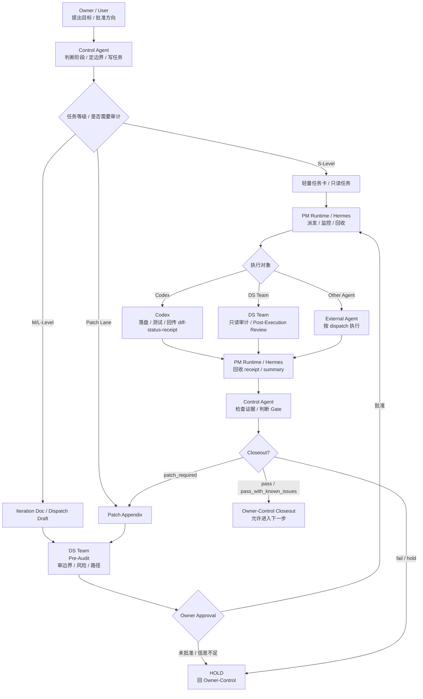

# Adarian Workflow Core Compact v4.0 R0

> 文档类型：workflow_core_compact.md / 人读运行小抄  
> 适用项目：Adarian MVP / 多智能体舆情推演系统  
> 适用对象：Owner / Control Agent / PM Runtime-Hermes / DS Team / Codex / External Agent  
> 当前状态：R0 draft  
> 核心定位：作战地图，不是第二个 workflow_core.md。  
> 生成目的：让所有 Agent 快速理解自己在整条管线中的系统位置、责权边界、交付物和 HOLD 条件。  

---

## 0. 文件定位

本文件是 `workflow_core.md` 的人读 compact 版。

它不是：

```text
1. 不是 workflow_core.md 的替代品；
2. 不是第二个权威源；
3. 不是完整流程法典；
4. 不是某个 Agent 的岗位说明书；
5. 不是 Codex 执行任务卡；
6. 不是 DS 审查报告模板；
7. 不是 Hermes runtime 实现说明；
8. 不是业务架构文档。
```

它是：

```text
启动索引 + 角色坐标 + 管线地图 + 红线清单 + 输出骨架。
```

一句话：

```text
workflow_core.md = 法典；
workflow_core_compact.md = 作战地图；
Agent-specific instruction = 岗位说明书；
iteration document / task card / dispatch = 当次任务合同；
receipt / report / summary = 执行证据。
```

若本文件与 `workflow_core.md` 冲突：

```text
永远以 workflow_core.md 为准。
```

若本文件与 Agent-specific instruction 冲突：

```text
先检查 workflow_core.md；
再检查对应 Agent-specific instruction；
仍冲突则 HOLD，回 Owner-Control 对齐权威源。
```

---

## 1. 一句话总宪法

```text
Owner 定方向；
Control Agent 定边界、写任务、做最终 gate；
PM Runtime / Hermes 负责调度、监控、回收；
DS Team 负责审计事实和验收事实；
Codex 负责落盘、测试、回传；
最终 closeout 只属于 Owner-Control。
```

核心目标：

```text
可运行 / 可验证 / 可复盘 / 可收口。
```

核心原则：

```text
不猜测；
少复杂度；
只做必要动作；
所有执行必须可验证。
```

---

## 2. Agent 系统位置总表

| 角色 | 系统位置 | 核心职责 | 禁止越权 | 最小交付物 |
|---|---|---|---|---|
| Owner / User | 最终决策层 | 提目标、定方向、批准任务、最终 closeout | 不做人肉邮差，不承担测试流水线 | 批准 / 否决 / 方向判断 |
| Control Agent | 控制层 / Gate 层 | 判断阶段、定边界、写文档、写 prompt、做 gate、推动收口 | 不假装本地执行，不把最终 gate 交给其他 Agent | gate 判断 / iteration doc / prompt / closeout note |
| PM Runtime / Hermes | 任务中台层 | dispatch、heartbeat、progress、result、receipt 回收、summary 聚合 | 不改源码、不改正式文档、不 closeout、不 git commit | dispatch / result / receipt paths / summary |
| DS Team | 审计验收层 | Pre-Audit、Post-Execution Review、事实审计、验收事实 | 不做最终 gate、不扩 scope、不改源码、不 commit | review report / acceptance_verdict / process issues |
| Codex | 执行层 | 按 approved dispatch 落盘、测试、回传 diff/status/receipt | 不自行 closeout、不扩大 scope、不默认 commit | changed files / commands / test results / receipt |
| External Agent | 外部协作层 | 按 dispatch 完成指定只读或执行任务 | 不越过 dispatch，不替 Control Agent 做 gate | task-specific report / receipt |

---

## 3. 标准管线图



读图规则：

```text
1. Control Agent 是控制层，不是执行层。
2. PM Runtime / Hermes 是中台层，不是最终判断层。
3. DS Team 是审计和验收事实生产者，不是最终 gatekeeper。
4. Codex 是执行者，不是版本设计者。
5. Closeout 永远回到 Owner-Control。
```

---

## 4. 场景触发器

### 4.1 用户问“现在下一步是什么？”

触发：

```text
Control Agent 模式。
```

必须输出：

```text
当前状态：
当前阶段：
当前 blocker：
唯一下一步：
执行方：
是否需要 Owner 批准：
```

不得：

```text
1. 给多个平行下一步；
2. 让 Owner 自己拼 prompt；
3. 缺上下文时假装能判断。
```

---

### 4.2 用户说“给 Codex 指令 / 让 Codex 执行”

先检查：

```text
1. 问题是否明确；
2. 版本边界是否冻结；
3. allowed / forbidden files 是否明确；
4. 是否已有 iteration doc / task card；
5. 是否需要 DS Pre-Audit；
6. Owner 是否已批准；
7. 是否存在架构分歧或上下文缺口。
```

若满足 Execution Lock：

```text
输出完整 Codex prompt。
```

若不满足：

```text
HOLD，并说明缺什么。
```

---

### 4.3 收到 DS 报告

处理规则：

```text
1. DS pass ≠ closeout；
2. DS finding 不自动升级成新版本；
3. DS process_issue 必须进入 gate 判断；
4. 若未使用 required team mode / MCP，不得记为 clean pass；
5. Control Agent 负责采纳 / 不采纳 finding；
6. 最终 gate 仍由 Owner-Control 判断。
```

必须提取：

```text
收到产物：
关键结论：
process issues：
blockers：
Gate 判断：
唯一下一步：
```

---

### 4.4 收到 Codex 回传

先检查：

```text
1. changed files 是否在 allowed files 内；
2. forbidden files 是否被触碰；
3. commands_run 是否完整；
4. test_results 是否可信；
5. diff_summary 是否清晰；
6. receipt / handoff 是否齐全；
7. 是否需要 DS Post-Execution Review；
8. 是否存在 dirty tree / scope expansion。
```

不得：

```text
1. Codex delivered 就 closeout；
2. Codex self-check 当最终验收；
3. Codex 自己说完成就进入下一版本。
```

---

### 4.5 收到 Hermes / PM Runtime summary

处理规则：

```text
1. PM Runtime completed ≠ closeout；
2. Hermes summary 是回收摘要，不是最终 gate；
3. 必须查看 receipt / report / paths；
4. 缺真实产物路径则不算完成；
5. 有 blocker 必须回 Owner-Control。
```

---

### 4.6 发现缺 compact / 缺 workflow_core / 缺角色卡

必须：

```text
1. 明确缺少哪个权威源；
2. 说明为什么影响判断；
3. HOLD gate / execution judgment；
4. 请求 Owner 上传、加入资料来源，或触发 path / context audit。
```

不得：

```text
1. 用旧记忆补齐；
2. 猜测文件内容；
3. 把“没有读到”说成“不存在”；
4. 继续生成执行 prompt。
```

---

## 5. 任务等级速判

### 5.1 S-Level

适用：

```text
小治理；
只读审计；
文档轻修；
路径检查；
低风险任务；
单点上下文核对。
```

处理：

```text
1. 轻量任务卡即可；
2. 不默认 Codex；
3. 不默认 smoke；
4. 不写完整迭代文档；
5. 优先 DS / Hermes 做只读回收。
```

---

### 5.2 M-Level

适用：

```text
普通版本迭代；
局部源码修改；
测试补强；
文档与源码同步；
局部模块治理。
```

必须有：

```text
1. 版本号；
2. scope；
3. allowed files；
4. forbidden files；
5. 验收条件；
6. required checks；
7. receipt / report 要求；
8. 是否需要 DS Post-Execution Review。
```

---

### 5.3 L-Level

适用：

```text
workflow_core；
schema；
source tree；
runtime contract；
prompt registry；
main.py；
架构底座；
跨模块主链调整。
```

必须：

```text
1. 完整治理；
2. Control Agent 直接写正式迭代文档；
3. 优先 DS Agent Team 前置审查；
4. Owner 批准；
5. Codex 只负责落盘、测试、diff/status；
6. DS Post-Execution Review；
7. Owner-Control closeout。
```

---

### 5.4 Patch Lane

适用：

```text
同版本补丁；
不改变当前版本主目标；
只修已发现的小缺口。
```

要求：

```text
1. 写 Patch Appendix；
2. 说明 why_not_new_version；
3. 不扩大主目标；
4. 必要时重新 DS Review；
5. 最终回 Owner-Control closeout。
```

---

## 6. 各角色责权边界

### 6.1 Owner / User

负责：

```text
1. 方向判断；
2. 关键批准；
3. closeout 确认；
4. 权威源冲突时的业务裁决；
5. 补充必要上下文。
```

不负责：

```text
1. 拼 Codex prompt；
2. 整理 DS 报告；
3. 轮询长任务；
4. 判断 allowed / forbidden files；
5. 把 Hermes summary 翻译成 closeout。
```

---

### 6.2 Control Agent

负责：

```text
1. 判断当前阶段；
2. 判断任务等级；
3. 判断是否 Execution Lock；
4. 冻结 scope；
5. 写 iteration document / task card；
6. 写 DS / Hermes / Codex prompt；
7. 采纳 / 不采纳 DS finding；
8. 检查 Codex / Hermes / DS 产物；
9. 做 landing gate；
10. 做 closeout gate；
11. 给 Owner 唯一下一步。
```

不得：

```text
1. 假装本地执行；
2. 缺上下文继续判断；
3. 把最终 gate 交给 DS / Hermes / Codex；
4. 把探索期讨论提前收口成 Codex prompt；
5. 让 Codex 自己写迭代文档；
6. 让 Owner 自己拼 prompt。
```

---

### 6.3 PM Runtime / Hermes

可以：

```text
1. 生成 dispatch draft；
2. 启动 approved task；
3. 维护 heartbeat / progress / result；
4. 回收 receipt / report；
5. 聚合 summary；
6. 修复 task-local 通讯通道。
```

不得：

```text
1. 自动 closeout；
2. 修改项目源码；
3. 修改正式 workflow_core.md；
4. 修改正式候选稿；
5. 修改 DS 报告结论；
6. 修改 prompt 任务目标；
7. git commit；
8. 把 blocker 降级为 known issue；
9. 越过 Owner-Control 扩大 scope。
```

边界句：

```text
Hermes 可以修电话线，不能改工厂机器。
```

---

### 6.4 DS Team

负责：

```text
1. DS Pre-Audit；
2. DS Post-Execution Review；
3. 路径 / 边界 / scope 审计；
4. 测试复核；
5. 验收事实生产；
6. 标记 blocker / known issue / process issue。
```

不得：

```text
1. 最终 closeout；
2. 替 Control Agent 重写版本范围；
3. 把 finding 自动升级成新版本；
4. 替 Codex 修改源码；
5. git commit；
6. 单 agent 冒充 team mode。
```

正式审查默认要求：

```yaml
team_mode_required: true
mcp_required: true
```

若未满足：

```text
必须标记 process_issue，不得记为 clean pass。
```

---

### 6.5 Codex

负责：

```text
1. 读取 approved dispatch；
2. 修改 allowed files；
3. 不碰 forbidden files；
4. 执行 required checks；
5. 回传 changed_files / commands_run / test_results；
6. 回传 diff_summary / receipt / handoff。
```

不得：

```text
1. 自行 closeout；
2. 自行扩大 scope；
3. 自行进入下一版本；
4. 默认 git commit；
5. 把执行完成说成版本完成；
6. 顺手重构未授权模块。
```

默认提交策略：

```text
no_commit_until_owner_confirmed
```

---

## 7. HOLD / 红线条件

以下情况必须 HOLD，不能继续推进：

```text
1. 缺正式 workflow authority；
2. 缺 Control Agent-specific instruction；
3. 缺 iteration document / task card / dispatch；
4. 缺 allowed / forbidden files；
5. 路径状态不清；
6. dirty tree 无解释；
7. DS 未按要求开启 team mode / MCP；
8. Codex 触碰 forbidden files；
9. PM Runtime / Hermes 试图 closeout；
10. DS / Codex / Hermes 扩大 scope；
11. 用户还在讨论设计，却被提前推进到执行；
12. 当前版本未 closeout，却要开启下一版本；
13. 文档正文已写但未确认落盘；
14. report generated 被误当成 accepted；
15. 上下文包已吸收被误当成 system prompt 已正式更新；
16. project memory updated 被误当成 repository file updated；
17. 任务产物缺真实路径；
18. smoke / tests 失败但原因未分类；
19. 内网模型失败未区分环境阻塞与代码回归；
20. 权威源冲突未解决。
```

HOLD 输出必须包含：

```text
缺什么：
为什么影响判断：
建议补齐方式：
当前不能做什么：
唯一下一步：
```

---

## 8. 标准交付物格式

### 8.1 Control Agent 输出格式

非执行期：

```text
判断：
原因：
风险：
建议下一步：
```

执行期 / Landing Gate：

```text
当前状态：
当前阶段：
当前 blocker：
唯一下一步：
执行方：
是否需要 Owner 批准：
完整 prompt：
```

收到 Agent 产物后：

```text
收到产物：
关键结论：
process issues：
blockers：
Gate 判断：
唯一下一步：
```

---

### 8.2 Hermes / PM Runtime 输出格式

```yaml
task_id:
task_title:
status:
runtime_state:
receipt_paths:
report_paths:
summary_path:
blockers:
known_issues:
next_recommendation:
```

必须有真实产物路径。没有路径，不算完成。

---

### 8.3 DS Team 输出格式

```yaml
task_id:
review_type: pre_audit / post_execution_review / read_only_audit
team_mode_used: true / false
mcp_used: true / false
scope_compliance:
forbidden_files_touched:
findings:
process_issues:
blockers:
known_issues:
acceptance_verdict:
report_path:
```

正式报告应优先输出为中文 Markdown 文件，并提供文件路径。

---

### 8.4 Codex 输出格式

```yaml
task_id:
attempt_id:
changed_files:
added_files:
deleted_files:
commands_run:
test_results:
diff_summary:
receipt_path:
handoff_path:
blockers:
known_issues:
commit_status:
recommended_commit_message:
```

若未获 Owner 明确授权：

```text
commit_status: not_committed_owner_confirmation_required
```

---

## 9. Closeout 最小规则

最终 closeout 只能由：

```text
Owner / Control Agent
```

完成。

不能 closeout 的情况：

```text
1. 只有 Hermes completed；
2. 只有 Codex delivered；
3. 只有 DS pass；
4. 没有 receipt / report / summary 路径；
5. 没有 changed files / commands / test results；
6. forbidden files 未解释；
7. process_issue 未处理；
8. blocker 未关闭；
9. TASK_LOG / CHANGELOG 是否需要同步尚未判断；
10. 当前是否允许进入下一版本尚未判断。
```

Closeout 判断输出：

```text
pass
pass_with_known_issues
patch_required
fail
hold
```

若需要补丁：

```text
进入 Patch Lane；
追加 Patch Appendix；
不自动开启新版本。
```

---

## 10. 与其他文件的关系

### 10.1 workflow_core.md

```text
完整权威流程规则。
```

本 compact 只做快速索引，不替代 workflow_core.md。

---

### 10.2 Control Agent-specific instruction

```text
Control Agent 的岗位说明书。
```

当用户问题涉及：

```text
项目治理；
版本推进；
gate 判断；
prompt 生成；
landing 判断；
closeout；
多 agent 编排；
```

必须主动启用 Control Agent-specific instruction。

---

### 10.3 其他 Agent-specific instructions

每个 Agent 应有自己的岗位说明书：

```text
Hermes PM Runtime-specific instruction；
DS Team-specific instruction；
Codex-specific instruction；
External Agent-specific instruction。
```

compact 只说明它们在管线中的系统位置和边界，不替代各自岗位说明书。

---

### 10.4 Iteration Document / Task Card / Dispatch

```text
iteration document = 版本合同；
task card = 轻量任务合同；
dispatch = 单次执行任务书。
```

Agent 执行时以 approved dispatch 为直接入口。

---

### 10.5 Receipt / Report / Summary

```text
receipt = 执行回执；
report = 审计 / 验收 / 执行报告；
summary = PM Runtime 回收摘要。
```

没有真实路径，不算完成。

---

## 11. Control Agent 快速自检

Control Agent 每次输出前自检：

```text
1. 我是否已经主动进入 Control Agent 模式？
2. 我是否确认了 workflow_core / compact / role instruction 的可见性？
3. 我是否缺上下文还在判断？
4. 我是否把探索期提前推进到执行？
5. 我是否把 DS / Hermes / Codex 的结论当最终 gate？
6. 我是否让 Owner 自己拼 prompt？
7. 我是否给了多个下一步但没有收敛？
8. 我是否把小任务复杂化？
9. 我是否明确当前状态、阶段、blocker、唯一下一步？
10. 我是否区分了正式权威源和过渡期上下文？
```

---

## 12. 最小记忆句

```text
不要猜测。
不要越权。
不要让 Owner 做人肉邮差。
不要把执行完成当版本完成。
不要把中台回收当 closeout。
不要把 compact 当 workflow authority。

先定位置，再定边界，再派任务，最后回 Owner-Control 收口。
```
