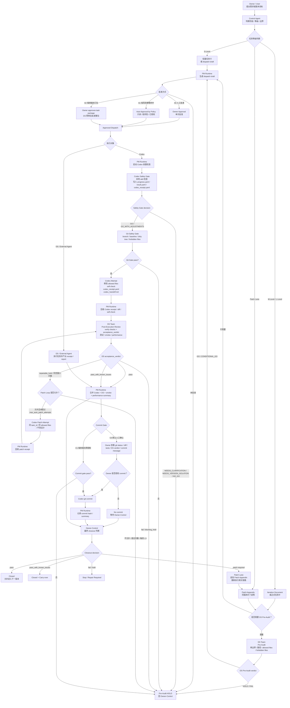
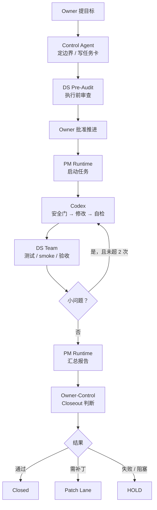

# Adarian MVP 核心开发工作流 v4.0（Workflow Core）草案

> 文档类型：workflow_core.md v4.0 草案  
> 当前范围：§0–§16
> 状态：draft / consistency-repaired snapshot  
> 生成日期：2026-05-19  
> 用途：保存已完成一致性修复后的 workflow_core v4.0 草案，供 DS 审查与 Codex 落盘参考  
> 注意：本文不是最终落盘版；后续仍需逐节审核、整体验收、再决定是否写入 `docs/skills/workflow_core.md`。

---

# §0 文档定位与唯一权威源

本文件是 Adarian MVP / 多智能体舆情推演系统项目的核心流程规则文件。

当前唯一权威路径为：

```text
docs/skills/workflow_core.md
```

历史上曾存在旧副本：

```text
docs/workflow_core.md
```

该旧副本已删除。后续如果再次出现 `docs/workflow_core.md`，应视为 workflow authority drift，必须先暂停处理，完成路径核查后再继续推进。

本文件定义：

```text
1. 项目角色分工；
2. 版本推进流程；
3. Owner / Control Agent / PM Runtime / DS Team / Codex 的边界；
4. 人类批准下的 Agent Relay 工作流；
5. DS Pre-Audit / DS Post-Execution Review 职责；
6. Codex 执行、safety gate、git gate 与 commit gate 职责；
7. Iteration Document / Task Card / Dispatch / Receipt 的关系；
8. TASK_LOG / CHANGELOG 极简记录规则；
9. Attempt / Patch Loop / Patch Lane / Closeout 规则；
10. Milestone Reset / Archive / Delete Candidates 规则；
11. Workflow Artifact Governance 与任务目录生命周期；
12. Path Drift / Authority Drift 处理规则；
13. workflow_core.md / compact.md / compact.yaml / Agent-specific instructions 的权威关系；
14. Hook / MCP / Skill 工具地图与使用边界；
15. 长程任务中台执行、任务回执、产物回收和失败处理规则；
16. 防漂移边界与最终 closeout 规则。
```

本文件不定义业务架构，不替代 `docs/dev_spec.md`，不替代具体版本的 iteration document。

后续允许新增精简运行版：

```text
docs/skills/workflow_core_compact.md
```

但 compact 版不是第二个权威源。若 compact 版与本文件冲突，永远以 `docs/skills/workflow_core.md` 为准。

---

# §1 v4.0 核心目标

v4.0 的目标不是增加流程复杂度，而是减少人工传话成本，让项目推进更可追踪、更可恢复、更可验收。

核心目标：

```text
Owner 不再做人肉邮差；
任务必须有明确入口和出口；
Agent 可以执行，但不能越权；
自动化必须经过验证。
```

v4.0 引入的新位置是：

```text
PM Runtime
```

中文可以理解为：

```text
任务中台 / 项目推进运行器
```

PM Runtime 的职责是：

```text
1. 接收 Owner / Control Agent 的目标；
2. 根据 iteration document 或 workflow 规则生成任务书草案；
3. 等待 Owner 明确批准，或匹配已授权的低风险自动批准策略；
4. 启动已批准任务；
5. 维持任务状态跟踪；
6. 回收报告、任务回执和摘要；
7. 把执行事实交回 Owner-Control 判断。
```

PM Runtime 不是最终决策者，不是自动修复器，不是自动 closeout 机器。

v4.0 的核心变化可以概括为：

```text
旧工作流：
Owner 人工复制任务 → DS / Codex 执行 → Owner 人工回收 → Control Agent 判断

新工作流：
Owner-Control 判断
→ PM Runtime 生成任务书草案
→ Owner 批准或命中低风险授权策略
→ PM Runtime 启动任务
→ 执行方产出报告和任务回执
→ PM Runtime 回收和摘要
→ Owner-Control 做最终判断
```

---

# §2 核心原则

Adarian MVP 当前采用文档驱动、审计优先、最小落地的开发模式。

核心原则仍然是：

```text
慢审计，快落地。
```

v4.0 在 v3 基础上新增一条原则：

```text
人类批准，Agent 执行，中台回收，Owner 收口。
```

含义：

```text
1. 方案进入执行前必须先明确版本边界。
2. 重大结构变更必须经过 DS Agent Team 前置审计。
3. PM Runtime 可以生成任务书草案，但不能自行批准高风险任务。
4. PM Runtime 只能执行 approved dispatch。
5. PM Runtime 可以调度和回收，不可以替 Owner 做最终判断。
6. DS Team 负责审计与验收，不负责最终 Gate。
7. Codex 负责落盘、执行、自检、回传 diff/status。
8. Control Agent 负责版本定位、范围收口、迭代文档和最终 Gate 建议。
9. User / Owner 保留最终方向判断与审批权。
```

本工作流必须持续防止以下漂移：

```text
1. 结构漂移；
2. 过度设计；
3. 无限分析；
4. 多路径分叉；
5. 文档与源码不一致；
6. 文档正文已写但未落盘；
7. 文档路径与真实仓库文件名不一致；
8. DS 通过但 execution readiness 未确认；
9. Codex 混入非当前 attempt diff；
10. 版本未 closeout 就开启下一版本；
11. PM Runtime 回收成功被误当成 closeout；
12. compact 版被误当成权威源。
```

---

# §3 角色分工

| 角色 | 职责 | 不负责 |
|---|---|---|
| User / Owner | 提出需求、确认方向、批准任务、最终方向判断、批准 closeout | 不承担人工传话和测试流水线 |
| Control Agent | 版本定位、Gate 判断、范围收口、迭代文档、DS / Codex / PM Runtime 任务规则、最终 closeout 判断 | 不落盘源码、不执行测试、不把最终判断交给 DS |
| PM Runtime | 生成任务书草案、启动已批准任务、维持长程任务状态、回收报告和回执、生成摘要 | 不自行批准高风险任务、不自行 closeout、不自动修复业务失败 |
| DS Team | 前置审查、只读审计、后置验证、验收判定、低风险文档对齐 | 不重新设计版本范围、不替 Control Agent 做最终 Gate |
| Codex | 按迭代文档执行源码修改、测试、自检、diff/status 回传 | 不自行决定范围、不自行 closeout、不越界重构 |

---

## 3.1 User / Owner

Owner 是项目方向与最终审批权威。

Owner 负责：

```text
1. 提出项目目标或版本需求；
2. 判断是否接受 Control Agent 的推进方案；
3. 审阅 PM Runtime 提出的任务书草案；
4. 明确批准高风险任务；
5. 为低风险重复任务建立自动批准策略；
6. 审阅关键文档和 closeout 判断；
7. 对方向、边界、节奏作最终决策。
```

Owner 不需要继续承担：

```text
1. 人工复制长任务书给每个 Agent；
2. 人工轮询长任务进度；
3. 人工整理 DS / Codex 产物路径；
4. 人工把报告再压缩给 Control Agent。
```

但 Owner 的明确批准仍是高风险任务硬门槛。

以下情况不得视为批准：

```text
1. Owner 沉默；
2. Owner 超时未回复；
3. Owner 模糊表达；
4. 历史偏好；
5. PM Runtime 自行判断“应该可以”。
```

---

## 3.2 Control Agent

Control Agent 是版本治理中枢。

Control Agent 必须完成：

```text
1. 判断当前阶段：exploration / audit / execution / validation / closeout；
2. 判断任务等级：S-Level / M-Level / L-Level；
3. 判断是否进入 Execution Mode；
4. 编写正式迭代文档或轻量任务卡；
5. 冻结版本目标、禁止范围、允许修改文件；
6. 决定是否需要 DS Agent Team 前置审查；
7. 采纳 / 不采纳 DS 建议；
8. 向 PM Runtime / DS Team / Codex 提供完整任务上下文；
9. 基于 DS Post-Execution Review、acceptance_verdict、Codex receipt、smoke / performance evidence 与实际产物做最终 closeout 判断。
```

Control Agent 不得：

```text
1. 把最终 Gate 判断交给 DS；
2. 把迭代文档写作责任交给 Codex；
3. 在探索期过早 Execution Lock；
4. 未 closeout 当前版本就开启下一版本；
5. 把 review findings 自动升级为下一版本任务；
6. 把 PM Runtime 的成功执行误判为版本 closeout。
```

---

## 3.3 PM Runtime

PM Runtime 是任务中台，不是新的权威角色。

当前已验证实现：

```text
Hermes-PM Runtime
```

但 v4.0 不绑定 Hermes。未来可以替换为：

```text
Claude Code PM
OpenCode PM
其他中台 Agent / Runtime
```

v4.0 要保护的是：

```text
PM Runtime 这个中台位置
```

不是保护 Hermes 这个具体产品。

PM Runtime 可以做：

```text
1. 根据 Owner / Control Agent 目标生成任务书草案；
2. 根据 iteration document 生成 attempt 级任务书草案；
3. 执行 Owner 明确批准或命中自动批准策略的任务；
4. 通过 runner / subprocess / relay 启动长程任务；
5. 记录 heartbeat / progress / result；
6. 回收 receipt / report / summary 等产物；
7. 向 Owner-Control 汇总任务状态和产物路径。
```

PM Runtime 不得做：

```text
1. 未经批准启动高风险任务；
2. 自动扩大任务权限；
3. 自动绕过失败；
4. 自动关闭安全扫描器；
5. 自动 closeout；
6. 自动回滚；
7. 自动修复业务失败；
8. 把执行摘要伪装成最终 Gate。
```

---
## 3.4 DS Team

DS Team 是审计事实生产者和验收事实生产者。

DS Team 负责两类工作：

```text
1. DS Pre-Audit：执行前审查；
2. DS Post-Execution Review：执行后验收。
```

DS Verify 和 DS Accept 不再作为两个额外流程节点。

```text
verify checks
  执行后验收中的检查动作。

acceptance_verdict
  DS Post-Execution Review 报告中的结论字段。
```

因此，执行后验收应写成一份 DS Post-Execution Review，而不是额外拆成：

```text
DS Verify → DS Accept
```

DS Team 的定位：

```text
审计事实生产者；
验收事实生产者；
不是版本方向决策者；
不是最终 Gatekeeper。
```

正式审计或验收任务中，DS Team 应优先开启：

```text
1. Agent Team / 多 reviewer；
2. MCP；
3. 文件读取工具；
4. 搜索工具。
```

如果任务明确要求开启 team mode 或 MCP，而当前环境无法开启，DS Team 必须停止并说明原因，不能用单 Agent 简单审查替代。

DS Team 的任务回执必须记录：

```yaml
team_mode_used: true / false
mcp_used: true / false
```

若 `team_mode_used=false`，必须解释：

```text
1. 为什么没有开启；
2. 是否违反任务要求；
3. 本次报告是否只能作为 process_issue / partial_audit 使用。
```

DS Team 不负责：

```text
1. 最终 closeout；
2. 替 Owner 决定方向；
3. 替 Control Agent 重写版本范围；
4. 替 Codex 修改源码；
5. 把 finding 自动升级成新版本；
6. 在任务卡外自行扩大审计范围；
7. git commit。
```

---

## 3.5 Codex

Codex 是执行 Agent。

Codex 必须：

```text
1. 严格读取 iteration document；
2. 只修改允许文件；
3. 不触碰 forbidden files；
4. 不自行扩大版本范围；
5. 不自行重写架构；
6. 不跳入下一版本任务；
7. 执行声明的自检级测试命令；
8. 回传 attempt report。
```

Codex 自检级测试的目标是：

```text
确认本轮修改没有明显崩溃；
确认自身交付具备进入 DS Post-Execution Review 的最低条件。
```

Codex 不得：

```text
1. 自行 closeout；
2. 自行改变 prompt / schema / selector / report generation 等禁止区域；
3. 发现问题后擅自进入大重构；
4. 以“顺手修复”为理由扩大 diff；
5. 在未声明情况下同时修改多个版本范围。
```

---

# §4 标准流程

v4.0 标准流程的目标是：

```text
Owner 不再做人肉传话；
Control Agent 负责版本判断；
PM Runtime 负责任务中台执行；
Codex 负责代码执行；
DS Team 负责前置审计和执行后验收；
Owner-Control 负责最终 closeout。
```

## 4.1 总体流程

本流程不要求每个小步骤都回到 Owner 批准。

但凡涉及以下事项，必须回到 Owner-Control：

```text
1. 扩大 scope；
2. 修改 forbidden files；
3. 改变架构设计；
4. 改变文档设计；
5. 改变 schema / prompt / main.py / report_agent 等高风险文件；
6. DS verdict 为 FAIL 或 blocking_hold；
7. DS verdict 为 repairable_hold 但超过 Patch Loop 允许范围；
8. smoke test 连续失败；
9. git safety gate 未通过；
10. 需要 closeout；
11. 需要进入下一版本。
```
本流程支持三种批准模式：

```text
A0：单次人工批准
  每个高风险任务单独由 Owner 明确批准。

A1：低风险自动批准
  Owner 预先授权的低风险、重复性、只读任务，命中策略后可自动批准。

A2：DS 预审后的端到端执行包批准
  Control Agent 写清 iteration document / 任务卡；
  DS Team 完成 Pre-Audit；
  Owner 看过任务卡和 DS 预审结论后明确批准推进；
  PM Runtime 可以在任务卡声明范围内连续推进 Codex attempt、Codex self-check、DS Post-Execution Review、smoke test、performance summary 和 PM Runtime summary。
```

A2 的关键边界：

```text
1. DS 先审边界；
2. Owner 批准任务卡；
3. PM Runtime 才能连续推进；
4. 包内可以连续执行；
5. 触发红线必须 HOLD；
6. closeout 必须回到 Owner-Control。
```

---

## 4.2 标准流程图

### 4.2.1 全量流程图


### 4.2.2 简化流程图

---

## 4.3 Codex 执行子流程

Codex 不直接改文件。

Codex 执行入口必须是：

```text
approved dispatch
  ↓
Codex safety gate
  ↓
git safety gate
  ↓
Codex attempt
  ↓
Codex self-check
  ↓
codex_receipt.yaml / codex_handoff.md
  ↓
DS Post-Execution Review
```

Codex safety gate 结果不单独生成新文件，写入：

```text
progress.yaml
result.yaml
codex_receipt.yaml
```

如果安全门输出：

```text
NEEDS_CLARIFICATION
NEEDS_VERSION_ISOLATION
NO_GO
```

PM Runtime 必须 HOLD，并向 Owner 打印阻塞摘要。

Codex completed 只表示：

```text
Codex 完成了一次 attempt，并交付了 diff / receipt / self-check。
```

它不表示：

```text
版本通过；
DS 验收通过；
可以 closeout；
可以进入下一版本。
```

---

## 4.4 Codex ↔ DS Post-Execution Loop

Codex 完成 attempt 后，PM Runtime 应自动派发 DS Post-Execution Review，除非任务卡明确豁免。

DS Post-Execution Review 是一次执行后验收，不拆成 Verify 和 Accept 两个额外环节。

它包含：

```text
verify checks
acceptance_verdict
```

其中：

```text
verify checks = 检查动作；
acceptance_verdict = 验收结论字段。
```

DS Team 负责：

```text
1. 检查 Codex diff 是否符合任务卡；
2. 检查 changed files 是否仍在 allowed files 内；
3. 检查 forbidden files 是否被触碰；
4. 检查 Codex receipt / handoff / self-check 是否齐全；
5. 执行或复核 py_compile / pytest / contract test；
6. 执行或复核 smoke test；
7. 汇报 performance / runtime；
8. 检查 required artifacts；
9. 输出 acceptance_verdict；
10. 标记 blocker / known issue / process issue / recommendation。
```

如果 DS Team 发现同范围小问题，可以触发 Codex patch loop。

默认 patch loop：

```yaml
post_execution_loop:
  enabled: true
  max_auto_patch_attempts: 2
```

允许自动 patch 的条件：

```text
1. 仍在同一 task_id；
2. 仍在 allowed files 内；
3. 不改变任务目标；
4. 不改变架构设计；
5. 不改变文档设计；
6. 不改变 schema / prompt 语义；
7. 不扩大读写范围；
8. 不需要新版本；
9. DS finding 是小范围修复项或 repairable_hold。
```

必须回到 Owner-Control 的情况：

```text
1. 需要改变文档设计；
2. 需要改变架构；
3. 需要扩大 scope；
4. 需要修改 forbidden files；
5. 需要改 schema / prompt / main.py 主链；
6. 需要超过 max_auto_patch_attempts；
7. DS verdict 为 FAIL；
8. DS verdict 为 blocking_hold；
9. repairable_hold 已超过 Patch Loop 允许范围；
10. smoke test 连续失败；
11. required artifacts 缺失；
12. 需要 closeout；
13. 需要进入下一版本。
```

## 4.5 Smoke test 与 performance 汇报

Smoke test 最佳执行方是：

```text
DS Team
```

原因：

```text
Codex 是修改方；
DS Team 是外部验收方；
smoke test 作为最终运行证据，更适合由 DS Team 执行或复核。
```

只要任务卡要求 smoke test，DS Team 或被授权执行方必须汇报：

```text
1. smoke command；
2. exit code；
3. run_dir；
4. total runtime；
5. Phase 1 runtime；
6. Phase 2 runtime；
7. Phase 3 runtime；
8. Phase 4 runtime；
9. 是否超过允许时间；
10. final_report.md 是否生成；
11. final_report.json 是否生成；
12. whitebox_summary.json 是否生成；
13. artifact_check 是否通过；
14. 是否存在环境阻塞。
```

如果 smoke test 因内网模型、endpoint、权限、认证或模型不可用失败，必须标记为：

```text
environment_blocked
```

不得直接判定为代码失败。

---

## 4.6 Commit Gate

Git commit 有两种模式：

```text
C0：默认人工确认提交
C1：端到端执行包授权提交
```

### C0：默认人工确认提交

默认模式下，Codex 完成修改后只能准备提交材料，不得直接提交。

Codex / PM Runtime 必须向 Owner 提供：

```yaml
git_status:
changed_files:
diff_summary:
test_results:
ds_acceptance_verdict:
smoke_result:
performance_summary:
recommended_commit_message:
```

Owner 显式确认后，Codex 才能执行：

```bash
git commit
```

Owner 未确认时，不得提交。

### C1：端到端执行包授权提交

如果 DS Pre-Audit 已通过，Owner 已批准端到端执行包，并在任务卡中明确授权：

```yaml
commit_mode: codex_commit_after_gate
owner_commit_authorized: true
```

则 Codex 可以在 commit gate 通过后提交。

commit gate 必须满足：

```text
1. git safety gate 已通过；
2. Codex diff 只包含 allowed files；
3. forbidden files 未被修改；
4. DS Post-Execution Review 已通过；
5. smoke test 已完成，或任务卡明确声明不需要 smoke；
6. performance / runtime 汇报已完成；
7. TASK_LOG / CHANGELOG 已按简短规则同步；
8. PM Runtime summary 已生成；
9. recommended_commit_message 已记录。
```

禁止：

```text
1. PM Runtime 直接 git commit；
2. DS Team git commit；
3. DS pass 后自动 commit；
4. smoke pass 后自动 commit；
5. 未经 Owner 授权让 Codex commit；
6. Codex 在 hard blocker / forbidden diff / dirty tree 未解释时 commit。
```

---

## 4.7 Closeout Gate

PM Runtime completed 不等于 closeout。

Codex completed 不等于 closeout。

DS acceptance_verdict 不等于 closeout。

PM Runtime summary 不等于 closeout。

最终 closeout 只能由：

```text
Owner / Control Agent
```

完成。

Closeout 判断可以输出：

```text
pass
pass_with_known_issues
patch_required
fail
hold
```

如果需要 Patch Lane：

```text
1. 在当前 iteration document 末尾追加 Patch Appendix；
2. 说明 patch_id、patch_reason、why_not_new_version；
3. 重新执行必要的 Codex / DS / smoke 链路；
4. 再回到 Owner-Control closeout。
```

---

## 4.8 本章硬规则

```text
1. PM Runtime 可以生成任务书草案，但不能自行批准高风险任务。
2. 自动批准只来自 Owner 预先授权的低风险策略。
3. A2 端到端执行包必须先经过 DS Pre-Audit 和 Owner 明确批准。
4. Codex 执行前必须经过 Codex safety gate 和 git safety gate。
5. Codex completed 不等于版本通过。
6. DS Post-Execution Review 的 acceptance_verdict 不等于最终 closeout。
7. PM Runtime summary 不等于最终 Gate。
8. Codex → DS → Codex patch loop 默认最多 2 次。
9. 改变文档设计、架构、scope、版本边界，必须回 Owner-Control。
10. Smoke test 优先由 DS Team 执行或复核。
11. PM Runtime 和 DS Team 不得 git commit。
12. Codex 只有在 Owner 显式确认或端到端执行包授权后，才能在 commit gate 通过后提交。
13. 最终 closeout 只能由 Owner-Control 完成。
14. 触发 FAIL / blocking_hold / forbidden files / scope expansion / closeout / next version 时，必须停止自动推进。
15. repairable_hold 只有在同 task_id、同 allowed files、同任务目标且未超过 max_auto_patch_attempts 时，才允许进入 Patch Loop。
```


---

# §5 任务书、任务回执、任务目录结构

本章规定外部任务如何交出去、如何回收、如何追溯。

这里的外部任务包括：

```text
1. DS Team 审计 / 验收任务；
2. Codex 源码修改 / 测试任务；
3. PM Runtime relay 任务；
4. 其他需要报告、回执、摘要的 Agent 任务。
```

核心原则：

```text
没有任务书，不启动；
没有批准，不执行；
没有回执，不验收；
没有真实产物路径，不算完成；
任务目录采用最小充分原则。
```

---

## 5.1 task_id 命名规则

所有正式任务必须有 `task_id`。

`task_id` 的目标不是制造新的缩写体系，而是让任务能被快速记住、快速检索、快速追溯。

推荐格式：

```text
v<version>-<compressed-iteration-title>-<seq>
```

示例：

```text
v4.0-workflow-section5-01
v4.0-workflow-review-01
v1.2.9-report-decoupling-01
v1.2.9-report-patch-01
v1.2.8.1-markdown-guard-01
v1.2.5.1-source-tree-cleanup-01
```

命名规则：

```text
1. 必须以版本号开头。
2. 中间短名来自英文迭代标题或任务标题。
3. 不维护固定缩写表。
4. 不新增中文 alias。
5. 短名只保留关键词，建议控制在 2–5 个词。
6. 序号用于区分同一版本下的多个任务。
7. 完整标题写入 task_title，不塞进 task_id。
```

推荐字段：

```yaml
task_id: v4.0-workflow-section5-01
task_title: Workflow Core v4.0 Section 5 Dispatch Receipt Directory
task_date: 2026-05-19
```

不推荐：

```text
v4.0-wf-01
v1.2.9-p4-01
v1.2.9-wb-01
```

原因：

```text
这些缩写短期方便，长期会形成新的内部黑话。
```

也不推荐：

```text
task-v1.2.9-phase4-report-agent-decoupling-and-prompt-registry-preparation-r0
```

原因：

```text
太长，不方便口头沟通和目录追溯。
```

---

## 5.2 任务书 Dispatch

任务书，也可以在文件名中称为 `dispatch`。

所有交给 DS Team、Codex、PM Runtime 或其他外部 Agent 的任务，都必须有任务书。

任务书分为两种状态：

```text
proposed dispatch
  任务书草案。可以审查，不可直接执行。

approved dispatch
  已批准任务书。可以被 PM Runtime 执行。
```

任务书可以由 Control Agent 起草，也可以由 PM Runtime 根据 Owner 目标、Control Agent 指令或 iteration document 生成草案。

但 PM Runtime 只能生成草案，不能自行批准高风险任务。

任务书的作用不是写得漂亮，而是把任务边界锁死：

```text
谁来做；
做什么；
不能做什么；
能读什么；
能写什么；
产出什么；
失败后怎么办。
```

任务书至少包含：

```yaml
task_id:
task_title:
task_date:
task_type:
owner:
executor:
status: proposed / approved / running / completed / failed / hold
created_at:

goal:
scope:
allowed_actions:
forbidden_actions:
allowed_read_paths:
allowed_write_paths:
expected_outputs:
acceptance_criteria:
failure_policy:
```

其中 `failure_policy` 默认必须写成：

```text
失败后 HOLD，不允许自动扩大权限，不允许自动改任务范围。
```

对于 DS Team 任务，任务书必须额外声明：

```yaml
team_mode_required: true / false
mcp_required: true / false
report_required: true / false
receipt_required: true
```

对于 Codex 任务，任务书必须额外声明：

```yaml
allowed_files:
forbidden_files:
required_commands:
diff_report_required: true
```

对于 PM Runtime 任务，任务书必须额外声明：

```yaml
runtime_allowed_level: L0 / L1 / L2 / L3
heartbeat_required: true / false
progress_required: true / false
result_required: true
receipt_required: true
```

PM Runtime 默认只允许到：

```text
L2：同权限重试
```

任何需要改变任务目标、权限、执行对象、读写范围的动作，都属于 L3，必须回到 Owner 重新批准。

---

## 5.3 任务回执 Receipt

所有外部任务完成后，必须提供任务回执。

任务回执的作用是让 Owner-Control 快速判断：

```text
它到底做了什么；
有没有按任务书执行；
有没有用 team mode；
有没有用 MCP；
产物在哪里；
有没有 blocker；
能不能进入下一步。
```

回执必须是可读、可检查、可追溯的结构化文本，推荐使用 YAML。

最小字段：

```yaml
task_id:
task_title:
executor:
started_at:
completed_at:
elapsed_sec:

status: completed / failed / hold
verdict: pass / pass_with_known_issues / fail / hold

team_mode_used: true / false / N/A
mcp_used: true / false / N/A

input_files:
  - path

output_files:
  - path

modified_files:
  - path

commands_run:
  - command:

known_issues:
  - item

blockers:
  - item

next_recommendation:
```

如果任务书要求：

```yaml
team_mode_required: true
```

但回执中出现：

```yaml
team_mode_used: false
```

则本任务不得记为 clean pass，只能进入以下状态之一：

```text
process_issue
partial_audit
hold
```

如果任务书要求：

```yaml
mcp_required: true
```

但回执中出现：

```yaml
mcp_used: false
```

也必须说明原因，不能默认通过。

回执不得只写：

```text
已完成。
```

也不得只写：

```text
看起来没问题。
```

必须列出真实产物路径。

没有产物路径，就不算完成。

---

## 5.4 任务目录结构：最小充分原则

PM Runtime 或外部任务执行时，应有独立任务目录。

任务目录用于存放：

```text
任务书；
执行状态；
任务回执；
必要报告；
中台摘要；
过程日志。
```

新任务统一使用 canonical path：

```text
audit/tasks/active/<task_id>/
```

任务完成后，根据生命周期迁移为：

```text
audit/tasks/closed/<task_id>/
```

被 Milestone Reset 吸收后，迁移为：

```text
audit/tasks/archive/<milestone_id>/<task_id>/
```

历史 Hermes relay 产物可保留在 legacy / transitional path：

```text
audit/hermes_tasks/<task_id>/
audit/pm_runtime_tasks/<task_id>/
```

但新任务不得继续以 `audit/hermes_tasks/` 或 `audit/pm_runtime_tasks/` 作为 canonical path。

示例：

```text
audit/tasks/active/v4.0-workflow-section5-01/
```

任务目录采用最小充分原则：

```text
不得为每个动作默认新增独立文件；
状态类信息优先进入 YAML；
长文本说明优先进入 summary；
只有正式审计、复杂 attempt、端到端执行包才生成独立报告文件。
```

### S-Level / 短任务目录

```text
audit/tasks/active/<task_id>/
  task/
    dispatch.md
    approval.yaml

  runtime/
    result.yaml

  summary/
    pm_runtime_summary.md
```

如果有 DS 轻量审查，可增加：

```text
  ds/
    ds_receipt.yaml
```

S-Level 不强制生成：

```text
heartbeat.json
progress.yaml
codex/
ds_post_execution_review.md
logs/
```

### M-Level / 标准执行目录

```text
audit/tasks/active/<task_id>/
  task/
    dispatch.md
    approval.yaml

  runtime/
    progress.yaml
    result.yaml

  codex/
    codex_receipt.yaml
    codex_handoff.md

  ds/
    ds_receipt.yaml

  summary/
    pm_runtime_summary.md
```

如果需要正式 DS Review，可增加：

```text
  ds/
    ds_post_execution_review.md
```

如果 attempt 复杂，可增加：

```text
  codex/
    codex_attempt_report.md
```

### L-Level / 长程任务 / 端到端执行包目录

```text
audit/tasks/active/<task_id>/
  task/
    dispatch.md
    approval.yaml

  runtime/
    heartbeat.json
    progress.yaml
    result.yaml

  codex/
    codex_receipt.yaml
    codex_handoff.md
    codex_attempt_report.md

  ds/
    ds_pre_audit.md
    ds_post_execution_review.md
    ds_receipt.yaml

  summary/
    pm_runtime_summary.md

  logs/
    runtime.log
```

以下文件不是默认必需文件：

```text
owner_approval.md
codex_attempt_report.md
ds_post_execution_review.md
```

它们只有在任务卡明确要求、任务复杂度较高、或需要正式审计证据时才生成。

默认批准记录文件是：

```text
task/approval.yaml
```

默认不单独生成：

```text
owner_approval.md
```

### 主要文件职责

```text
task/dispatch.md
  任务书。说明任务目标、边界、输入、输出、失败策略。

task/approval.yaml
  Owner 明确批准记录。没有批准记录，不得启动高风险任务。
  如果命中自动批准策略，应记录 approval_policy 和 policy_matched。

runtime/heartbeat.json
  心跳状态。主要用于长程任务、端到端执行包和需要持续监控的任务。

runtime/progress.yaml
  当前进度。由 PM Runtime / relay_runner 写入为主，执行 Agent 可补充简短阶段说明。

runtime/result.yaml
  最终状态。由 PM Runtime / relay_runner 在任务结束后生成。

codex/codex_receipt.yaml
  Codex 执行回执。

codex/codex_handoff.md
  Codex 面向 DS / PM Runtime 的交接说明。

codex/codex_attempt_report.md
  复杂 Codex attempt 的补充报告。
  默认不生成，只有复杂 attempt 或任务卡明确要求时生成。

ds/ds_receipt.yaml
  DS 审计或验收回执。

ds/ds_pre_audit.md
  正式 DS Pre-Audit 报告。
  轻量审查不强制生成。

ds/ds_post_execution_review.md
  正式 DS Post-Execution Review 报告。
  轻量审查不强制生成。

summary/pm_runtime_summary.md
  PM Runtime 回收后的摘要，供 Owner-Control 快速判断。

logs/runtime.log
  过程日志，只用于排查，不作为最终结论。
```

硬规则：

```text
1. 新任务统一进入 audit/tasks/active/<task_id>/。
2. audit/hermes_tasks/ 与 audit/pm_runtime_tasks/ 只作为 legacy / transitional path。
3. 任务目录按 task / runtime / codex / ds / summary / logs 分层。
4. 默认批准记录写入 task/approval.yaml。
5. 默认不生成 owner_approval.md。
6. 默认不生成 codex_attempt_report.md。
7. lightweight DS review 不强制生成 ds_post_execution_review.md。
8. 状态类信息优先进入 runtime/*.yaml 或 runtime/*.json。
9. 长文本汇总优先进入 summary/pm_runtime_summary.md。
10. 不为每个动作默认新增独立文件。
```
---

## 5.5 PM Runtime 状态模型

`heartbeat / progress / result` 是 PM Runtime 的基础状态模型，不是长程任务专属能力。

所有进入 PM Runtime 的任务都必须能回答：

```text
任务是否还活着？
当前跑到哪一步？
最终结果是什么？
是否需要 HOLD？
```

但是否独立落盘为 `heartbeat.json / progress.yaml / result.yaml`，取决于任务等级、运行时长和是否跨 Agent。

规则：

```text
状态模型始终存在；
状态文件按需持久化。
```

### heartbeat

`heartbeat` 用于判断任务是否仍在运行。

```text
高频机器状态用 JSON；
heartbeat 由 PM Runtime / relay_runner 自动写入；
不依赖 AI 自行判断。
```

L-Level、长程任务、端到端执行包必须持久化为：

```text
heartbeat.json
```

### progress

`progress` 用于记录当前进度。

```text
由 PM Runtime / relay_runner 写入为主；
执行 Agent 可补充简短阶段说明；
必须结构化，不得写成自由文本总结。
```

M-Level 建议持久化为：

```text
progress.yaml
```

L-Level、长程任务、端到端执行包必须持久化为：

```text
progress.yaml
```

### result

`result` 用于记录最终状态。

```text
由 PM Runtime / relay_runner 在任务结束后生成；
必须基于退出码、必需产物和 receipt 检查；
AI 可以提供摘要，但不得单独宣布任务成功。
```

所有 PM Runtime 任务都应至少持久化：

```text
result.yaml
```

### 分档规则

```text
S-Level：
  状态可压缩写入 result.yaml 或 pm_runtime_summary.md。

M-Level：
  建议持久化 progress.yaml / result.yaml；
  如进入 Codex / DS loop，必须持久化。

L-Level / 长程任务 / 端到端执行包：
  必须完整持久化 heartbeat.json / progress.yaml / result.yaml。
```

一句话：

```text
heartbeat / progress / result 是 PM Runtime 的底座能力；
长程任务只是要求把这套状态完整落盘、可恢复、可审计。
```

---

## 5.6 任务目录与运行产物目录分离

任务目录和运行产物目录不能混用。

任务目录用于项目协作治理：

```text
audit/tasks/active/<task_id>/
audit/tasks/closed/<task_id>/
audit/tasks/archive/<milestone_id>/<task_id>/
```

运行产物目录用于系统实际运行结果：

```text
outputs/runs/<run_id>/
```

二者关系：

```text
任务目录回答：谁执行了什么任务？
运行产物目录回答：系统实际跑出了什么结果？
```

不得把 `outputs/runs/` 当成任务回执目录。

不得把 `audit/tasks/` 当成业务运行产物目录。

任务证据可以引用 `outputs/runs/<run_id>/`，但默认不得复制整个 run_dir。

示例：

```yaml
smoke_result:
  command: ".venv/bin/python main.py seeds/test8.txt"
  exit_code: 0
  run_dir: outputs/runs/test8_20260519_183000
  total_runtime_sec: 428.24
```

历史路径说明：

```text
audit/hermes_tasks/<task_id>/
audit/pm_runtime_tasks/<task_id>/
```
只作为 legacy / transitional path 保留，不再作为新任务 canonical path。

---

## 5.7 task_id 与其他 ID 的关系

v4.0 中保留多个 ID，但职责不同。

```text
task_id
  任务级 ID。最重要，用于人类快速记忆和目录追溯。

attempt_id
  Codex 执行尝试 ID。用于区分同一任务下第几次代码交付。

audit_id
  DS Pre-Audit 记录 ID。用于区分同一任务下第几次执行前审计。

review_id
  DS Post-Execution Review 记录 ID。用于区分同一任务下第几次执行后验收。

acceptance_id
  DS Post-Execution Review 的验收结论记录 ID。
  用于兼容历史 TASK_LOG / CHANGELOG 记录。
  它不代表存在独立 DS Accept 阶段。

run_id
  系统运行产物 ID。来自 outputs/runs/<run_id>/。
```

示例：

```yaml
task_id: v1.2.9-report-decoupling-01
attempt_id: v1.2.9-report-decoupling-01-a1
audit_id: v1.2.9-report-decoupling-01-ds-pre-1
review_id: v1.2.9-report-decoupling-01-ds-post-1
acceptance_id: v1.2.9-report-decoupling-01-acc1
run_id: test1_20260520_182539
```

规则：

```text
1. task_id 必须带版本号。
2. task_id 必须短。
3. task_id 不写完整标题。
4. 完整标题写 task_title。
5. attempt / audit / review / acceptance 都挂在 task_id 下面。
6. acceptance_id 只用于追溯验收结论，不恢复 DS Accept 独立阶段。
7. run_id 不替代 task_id。
8. 同一版本同一主题多个任务，用 01 / 02 / 03 区分。
```
---

## 5.8 与 iteration document / TASK_LOG / CHANGELOG 的关系

关系定义：

```text
iteration document = 版本合同
dispatch = 单次执行任务书
receipt / report / summary = 执行事实证据
TASK_LOG = 简短任务台账
CHANGELOG = 简短版本变化摘要
```

执行链路：

```text
iteration document 规定版本边界
  ↓
dispatch 规定单次任务怎么执行
  ↓
receipt / report / summary 证明任务实际做了什么
  ↓
TASK_LOG 记录任务台账和证据路径
  ↓
CHANGELOG 记录版本对外变化
```

硬规则：

```text
1. dispatch 必须从 iteration document、task card 或 Owner-Control 目标派生。
2. dispatch 不得静默扩大 iteration document 范围。
3. task card / dispatch 如与 iteration document 不一致，必须先进入 Change Advisory。
4. 只有被记录为 approved_override、Patch Appendix 或 iteration document amendment 后，dispatch 才能执行变更内容。
5. 未批准、未记录的冲突，以 iteration document 为准。
6. TASK_LOG / CHANGELOG 只写简短索引和版本摘要。
7. 不得把 audit_report、receipt、pm_runtime_summary 的正文复制进 TASK_LOG / CHANGELOG。
8. 如需查看细节，通过 TASK_LOG 中的证据路径追溯。
```

TASK_LOG 只写：

```text
1. task_id；
2. task_title；
3. dispatch / receipt / summary 路径；
4. executor；
5. result；
6. closeout 状态；
7. carry_over 简短列表。
```

CHANGELOG 只写：

```text
1. 新增了什么规则；
2. 改了什么流程；
3. 废弃了什么旧设计；
4. 最终采用了什么方案；
5. 有什么 known issue。
```

---

## 5.9 本章硬规则

```text
1. 没有 dispatch，不启动任务。
2. 没有 Owner 明确批准或 approval policy 命中，不启动高风险任务。
3. 没有 receipt，不进入验收。
4. 没有真实产物路径，不记为完成。
5. task_id 必须带版本号、简短、稳定、可追溯。
6. task_id 不承载完整标题，完整标题写 task_title。
7. 新任务统一使用 audit/tasks/active/<task_id>/ 作为 canonical task path。
8. audit/hermes_tasks/ 与 audit/pm_runtime_tasks/ 只作为 legacy / transitional path。
9. 任务目录与运行产物目录必须分离。
10. DS Team / Codex / PM Runtime 的实际动作必须能从 receipt 追溯。
11. 任务目录采用最小充分原则，不为每个动作默认新增独立文件。
12. 状态模型始终存在，状态文件按任务等级和长程需求持久化。
13. heartbeat 使用 JSON，由 runner 自动写入。
14. progress / result / receipt 使用 YAML，便于 AI、人类和 PM Runtime 共同审查。
15. task/approval.yaml 是默认批准记录文件，不默认生成 owner_approval.md。
16. acceptance_id 只用于兼容历史验收记录，不代表独立 DS Accept 阶段。
17. result 可以包含 AI 摘要，但最终状态必须基于退出码、必需产物和 receipt 检查。
18. 长程任务失败后默认 HOLD，不自动扩大权限。
19. PM Runtime 只能在同权限范围内做有限重试，不能自动改任务目标。
20. task card / dispatch 与 iteration document 不一致时，必须先走 Change Advisory。
21. 未批准、未记录的冲突，以 iteration document 为准。
22. TASK_LOG / CHANGELOG 只记录简短索引和版本摘要，不复制完整任务证据。
```

---

# §6 PM Runtime 执行边界

本章规定 PM Runtime 能做什么、不能做什么、什么时候需要 Owner 重新批准。

PM Runtime 可以理解为任务中台。它的价值是减少人工传话、维持任务状态、回收执行产物，而不是替代 Owner 或 Control Agent 做最终判断。

核心原则：

```text
PM Runtime 可以提出；
Owner 才能批准；
PM Runtime 可以执行已批准任务；
PM Runtime 不能自行扩大任务。
```

## 6.1 PM Runtime 定位

PM Runtime 是人类批准下的任务运行器。

它不是自治项目经理，也不是最终决策者。

当前已经验证过的实现是：

```text
Hermes PM Runtime
```

但 v4.0 不绑定 Hermes。未来如果 Hermes 不稳定，PM Runtime 可以替换为：

```text
Claude Code PM
OpenCode PM
其他任务中台 Agent
```

因此，本工作流保护的是：

```text
PM Runtime 这个任务中台位置
```

而不是某个具体工具。

PM Runtime 的职责是：

```text
1. 根据 Owner / Control Agent 的目标生成任务书草案。
2. 根据已批准任务书启动执行方。
3. 维护任务状态。
4. 回收 receipt / report / summary。
5. 检查任务产物是否齐全。
6. 把执行事实交回 Owner-Control 判断。
```

PM Runtime 不负责：

```text
1. 最终 Gate 判断。
2. 版本 closeout。
3. 替 DS Team 做审计。
4. 替 Codex 做源码实现。
5. 替 Owner 批准高风险任务。
```

一句话：

```text
PM Runtime 是派工单起草员 + 任务中台，不是老板。
```

## 6.2 任务书草案生成权

PM Runtime 可以生成任务书草案。

任务书草案可来自：

```text
1. Owner 的明确目标；
2. Control Agent 的推进指令；
3. iteration document 中的 attempt / verification / acceptance 要求；
4. 已批准的 workflow 规则。
```

任务书草案的状态必须是：

```text
proposed
```

也就是：

```text
可审查，但不可直接执行。
```

PM Runtime 生成任务书草案时，必须明确：

```text
1. task_id；
2. task_title；
3. 任务目标；
4. 执行对象；
5. 允许动作；
6. 禁止动作；
7. 允许读取路径；
8. 允许写入路径；
9. 预期产物；
10. 验收条件；
11. 失败策略；
12. runtime_allowed_level。
```

如果任务来自 iteration document，PM Runtime 生成的任务书草案不得扩大 iteration document 的范围。

硬规则：

```text
dispatch draft 与 iteration document 冲突时，以 iteration document 为准。
```

PM Runtime 不得：

```text
1. 凭空生成新版本范围；
2. 把 review finding 自动变成新任务；
3. 把只读审计任务改成写文件任务；
4. 把文档任务改成源码任务；
5. 把低风险任务扩展成架构任务。
```

## 6.3 Owner Approval 与自动批准策略

PM Runtime 不能自行批准任务。

任务书草案必须经过批准，才能变成正式任务书。

任务书状态流转：

```text
proposed
  ↓ Owner 明确批准 / approval policy 命中
approved
  ↓ PM Runtime 执行
running
  ↓ 执行完成 / 失败 / 中止
completed / failed / hold
```

默认模式是：

```text
A0：每次人工批准
```

适用范围：

```text
1. 新流程首次执行；
2. 架构版本；
3. 源码修改；
4. workflow_core.md 修改；
5. iteration document 正文修改；
6. 权限变化；
7. 长程任务；
8. 任何 Owner 尚未授权自动批准的任务类型。
```

后续可以建立低风险自动批准策略：

```text
A1：同类低风险任务自动批准
```

A1 只适用于 Owner 明确授权过的任务类型，例如：

```text
1. 只读审计；
2. 不改源码；
3. 不改文档正文；
4. 不删除文件；
5. 不联网或只使用已批准 MCP；
6. 失败默认 HOLD；
7. runtime_allowed_level 不超过 L2；
8. 必须生成 receipt / summary。
```

自动批准任务必须记录：

```yaml
approval_mode: auto_by_policy
approval_policy:
policy_matched: true
matched_conditions:
risk_level:
why_safe_to_auto_approve:
```

以下任务永远不得自动批准：

```text
1. 修改源码；
2. 修改 workflow_core.md；
3. 修改 iteration document 正文；
4. 修改 schema / prompt / main.py / report_agent；
5. 改变任务权限；
6. 从只读变成写入；
7. 开启联网；
8. 删除文件；
9. closeout；
10. 回滚；
11. 自动修复失败任务；
12. 改变版本边界。
```

核心规则：

```text
自动批准只能来自 Owner 预先授权的 policy；
不能来自 PM Runtime 自己判断“应该可以”。
```

## 6.4 PM Runtime 允许能力

PM Runtime 允许执行以下动作：

```text
1. 根据 Owner 目标或 iteration document 生成任务书草案。
2. 检查任务书草案是否缺少必要字段。
3. 将任务书草案交给 Owner / Control Agent 审核。
4. 执行已批准任务书。
5. 启动已批准的 DS Team / Codex / 外部 Agent 任务。
6. 维护 heartbeat / progress / result 状态。
7. 回收 receipt.yaml。
8. 回收 audit_report.md / attempt evidence / pm_runtime_summary.md。
9. 检查 task_id 是否一致。
10. 检查必需产物是否存在。
11. 检查 receipt 是否包含 team_mode_used / mcp_used。
12. 检查任务是否命中 approval policy。
13. 在同权限范围内重试执行方式。
```

PM Runtime 可以检查执行事实，例如：

```text
1. 文件是否存在；
2. exit code 是否为 0；
3. task_id 是否一致；
4. receipt 是否缺字段；
5. team_mode_required=true 时，team_mode_used 是否为 true；
6. mcp_required=true 时，mcp_used 是否为 true；
7. 任务是否超时；
8. 任务是否停在 running 状态过久。
```

但 PM Runtime 不能把这些检查结果直接升级为最终 Gate。

它只能输出：

```text
execution fact
runtime summary
recommended next action
```

最终判断仍由 Owner-Control 完成。

## 6.5 PM Runtime 禁止能力

PM Runtime 不得执行以下动作：

```text
1. 未经批准启动任务。
2. 自动扩大任务范围。
3. 自动扩大读写权限。
4. 自动从只读任务变成写入任务。
5. 自动修改任务书。
6. 自动修改源码。
7. 自动修改 workflow_core.md。
8. 自动修改 iteration document 正文。
9. 自动修改 TASK_LOG / CHANGELOG，除非任务书明确授权。
10. 自动修复测试失败。
11. 自动 closeout。
12. 自动回滚。
13. 自动删除文件。
14. 自动关闭或绕过安全扫描。
15. 自动把 blocker 降级为 known issue。
16. 自动把失败任务拆成新任务继续执行。
17. 自动开启下一版本。
```

PM Runtime 发现问题时，默认动作是：

```text
HOLD + 报告原因
```

而不是：

```text
自行修复 + 继续推进
```

## 6.6 PM Runtime 自我修复等级

PM Runtime 可以有有限自我修复能力，但必须分级。

### L0：只读回收

PM Runtime 只能读取任务目录并汇总已有产物。

允许：

```text
1. 读取 dispatch.md；
2. 读取 receipt.yaml；
3. 读取 audit_report.md；
4. 读取 result.yaml；
5. 生成 pm_runtime_summary.md。
```

禁止：

```text
1. 启动新任务；
2. 重试执行；
3. 修改任务书；
4. 改变任务状态。
```

适用场景：

```text
任务已经完成，只需要回收和摘要。
```

### L1：状态修复

PM Runtime 可以修复任务状态记录，但不能重新执行任务。

允许：

```text
1. 将超时任务标记为 stalled；
2. 将缺少必需产物的任务标记为 incomplete；
3. 将明显失败的任务标记为 failed / hold；
4. 生成缺失原因说明；
5. 生成 pm_runtime_summary.md。
```

适用场景：

```text
1. heartbeat 长时间未更新；
2. receipt 缺失；
3. audit_report 缺失；
4. task_id 不一致；
5. result.yaml 未生成。
```

禁止：

```text
1. 自动重跑；
2. 自动补写执行方 receipt；
3. 自动替 DS / Codex 生成验收结论；
4. 自动把 failed 改成 completed。
```

### L2：同权限重试

PM Runtime 可以在不改变任务目标、不改变权限、不改变执行对象、不改变读写范围的前提下重试执行方式。

允许示例：

```text
terminal 长中文 pipe 失败
  → 改用已批准的 runner / subprocess 方案

命令执行中断但任务书不变
  → 使用同一任务书、同一权限重新启动

receipt 写入失败
  → 要求执行方在同一任务目录补交 receipt
```

L2 的前提：

```text
1. task_id 不变；
2. 任务目标不变；
3. 执行对象不变；
4. 读写权限不变；
5. 输出产物不变；
6. failure_policy 不变；
7. 不绕过安全扫描。
```

L2 不等于自动修复业务问题。

它只允许修复：

```text
执行通道问题；
状态文件问题；
同权限运行失败问题。
```

### L3：任务方案变更

凡是需要改变任务方案的动作，都是 L3。

包括：

```text
1. 改任务目标；
2. 改执行对象；
3. 改允许读取路径；
4. 改允许写入路径；
5. 改 forbidden files；
6. 改验收条件；
7. 改 failure_policy；
8. 从只读变成写入；
9. 从 DS Team 改成 Codex；
10. 从本地文件审计改成联网检索；
11. 从文档修补改成源码修改。
```

L3 必须回到 Owner 重新批准。

硬规则：

```text
PM Runtime 默认上限是 L2。
任何 L3 动作必须重新批准。
```

## 6.7 PM Runtime 成功不等于项目收口

PM Runtime 的 completed 只表示：

```text
任务运行完成，且产物回收完成。
```

它不表示：

```text
版本已经通过；
DS 已经验收；
Codex 修改正确；
Owner 已经 closeout。
```

必须区分：

```text
PM Runtime completed ≠ DS verdict
DS verdict ≠ Control closeout
Codex delivered ≠ version closed
receipt present ≠ acceptance passed
summary generated ≠ final gate
```

PM Runtime 可以给出：

```text
recommended_next_action
```

但不能给出最终 closeout。

最终 closeout 只能由：

```text
Owner / Control Agent
```

完成。

## 6.8 本章硬规则

```text
1. PM Runtime 可以生成任务书草案，但不能自行批准高风险任务。
2. 任务书草案必须先处于 proposed 状态。
3. PM Runtime 只能执行 approved dispatch。
4. 自动批准只适用于 Owner 预先授权的低风险重复任务。
5. 修改源码、修改 workflow_core.md、修改 iteration document、删除文件、closeout、回滚，永远不得自动批准。
6. PM Runtime 默认恢复能力上限是 L2。
7. 任何 L3 任务方案变更必须重新获得 Owner 批准。
8. PM Runtime 可以检查事实，但不能替代 DS / Codex / Owner-Control。
9. PM Runtime completed 不等于版本 closeout。
10. 失败默认 HOLD，不得自动扩大范围继续推进。
```

---

# §7 长程任务 Relay 与失败 HOLD

本章规定长程任务如何执行、如何记录状态、失败后如何停住，以及哪些情况必须回到 Owner 重新批准。

本章重点不是让 PM Runtime 变得更“自主”，而是让长程任务更可控、可恢复、可追溯。

核心原则：

```text
状态模型始终存在；
长程任务完整持久化；
失败默认 HOLD；
可恢复只限同权限范围；
不能把失败自动修成新任务。
```

## 7.1 长程任务定义

长程任务指执行时间较长、过程不可一次性在聊天中稳定完成、需要状态跟踪和产物回收的任务。

典型包括：

```text
1. DS Team 多 Agent 审计；
2. 大范围路径盘点；
3. 长上下文文档审查；
4. Codex 多步骤执行；
5. 多命令测试链；
6. 需要等待外部 Agent 返回报告的任务；
7. 需要 PM Runtime 中途轮询状态的任务。
```

长程任务不得依赖：

```text
1. Owner 人工守终端；
2. Owner 人工复制多轮上下文；
3. 一条超长命令传完整中文任务书；
4. 聊天窗口里的临时记忆；
5. 执行 Agent 自己口头说“完成了”。
```

长程任务必须依赖：

```text
1. 固定任务目录；
2. approved dispatch；
3. 完整持久化状态；
4. 任务回执；
5. 真实产物路径；
6. PM Runtime summary；
7. Owner-Control 最终判断。
```

## 7.2 Relay 执行模式

长程任务应采用 relay 模式。

推荐链路：

```text
approved dispatch
  ↓
PM Runtime / relay_runner
  ↓
external agent executor
  ↓
report / receipt / artifacts
  ↓
PM Runtime recovery
  ↓
Owner-Control review
```

分工原则：

```text
AI Agent 负责内容判断；
runner 负责执行事实；
PM Runtime 负责回收摘要；
Owner-Control 负责最终判断。
```

relay_runner 不应承担业务判断。

它主要检查：

```text
1. 进程是否启动；
2. 进程是否结束；
3. 是否超时；
4. exit code 是多少；
5. 必需文件是否生成；
6. task_id 是否一致；
7. result / receipt 是否存在；
8. 是否需要 HOLD。
```

## 7.3 状态文件与产物检查

PM Runtime 的状态模型包括：

```text
heartbeat
progress
result
```

这三类状态是 PM Runtime 的基座能力，不是长程任务专属能力。

但长程任务必须完整持久化：

```text
heartbeat.json
progress.yaml
result.yaml
receipt.yaml
```

### heartbeat.json

`heartbeat.json` 用于判断任务是否仍在运行。

规则：

```text
1. 由 PM Runtime / relay_runner 自动写入；
2. 高频更新；
3. 使用 JSON；
4. 不依赖 AI 自行判断；
5. 不写自由文本长总结。
```

### progress.yaml

`progress.yaml` 用于记录当前进度。

规则：

```text
1. 由 PM Runtime / relay_runner 写入为主；
2. 执行 Agent 可以补充简短阶段说明；
3. 使用 YAML；
4. 必须结构化；
5. 不得写成散文式总结。
```

### result.yaml

`result.yaml` 用于记录任务结束后的最终执行状态。

规则：

```text
1. 由 PM Runtime / relay_runner 在任务结束后生成；
2. 使用 YAML；
3. 必须基于退出码、必需产物和 receipt 检查；
4. 可以包含 AI 摘要；
5. 不得由 AI 单独宣布任务成功。
```

### receipt.yaml

`receipt.yaml` 是执行方任务回执。

规则：

```text
1. 由执行方提供；
2. 用于说明实际做了什么；
3. 必须记录输入、输出、动作、结论、阻塞；
4. DS Team 任务必须记录 team_mode_used / mcp_used；
5. Codex 任务必须记录实际修改文件和测试命令。
```

必需产物缺失时，任务不得标记为 completed。

缺少以下任一文件时，默认进入 HOLD 或 incomplete：

```text
1. receipt.yaml；
2. result.yaml；
3. 任务书要求的 audit_report / attempt evidence；
4. pm_runtime_summary.md；
5. 任务书声明的 expected_outputs。
```

## 7.4 失败分类

长程任务失败时，必须先分类，不得直接扩大权限或继续执行。

常见失败类型：

```text
permission_failure
  权限失败。例如 Read / Write / MCP / tool permission 被拒绝。

path_failure
  路径失败。例如任务书中路径不存在、文件名错误、权威源冲突。

tool_failure
  工具失败。例如 terminal、runner、MCP、Claude Code、Codex 调用失败。

agent_failure
  执行 Agent 失败。例如 DS Team 没有启动 team mode，Codex 未按任务书执行。

task_failure
  任务本身失败。例如测试失败、审计发现 hard blocker、验收目标未满足。

artifact_missing
  产物缺失。例如没有 receipt、没有 audit_report、没有 summary。

identity_mismatch
  身份不一致。例如 dispatch / receipt / result 中 task_id 不一致。

process_violation
  流程违规。例如要求 team_mode_required=true，但 team_mode_used=false。

timeout_or_stalled
  长时间无 heartbeat 更新，或任务停留在 running 状态过久。
```

失败分类必须写入：

```text
result.yaml
pm_runtime_summary.md
```

如果失败原因不明确，应标记为：

```text
hold_needs_manual_review
```

而不是自动猜测并继续推进。

## 7.5 HOLD 规则

长程任务失败后默认进入：

```text
HOLD
```

HOLD 的含义是：

```text
任务停止推进；
保留现有证据；
等待 Owner-Control 判断下一步。
```

进入 HOLD 后，PM Runtime 不得：

```text
1. 自动扩大权限；
2. 自动改任务目标；
3. 自动重写任务书；
4. 自动把只读任务改成写任务；
5. 自动更换执行方；
6. 自动删除或覆盖已有产物；
7. 自动 closeout；
8. 自动开启下一版本；
9. 自动把 blocker 降级成 known issue；
10. 自动把失败任务拆成新任务继续跑。
```

进入 HOLD 后，PM Runtime 应该做：

```text
1. 写入 result.yaml；
2. 写入 pm_runtime_summary.md；
3. 标明 failure_type；
4. 标明已有产物；
5. 标明缺失产物；
6. 标明是否触及 L3；
7. 给出 recommended_next_action；
8. 等待 Owner-Control 判断。
```

HOLD 不是失败收口。

HOLD 是防漂移保护。

## 7.6 可恢复与不可恢复

长程任务恢复必须遵守 §6 的 L0–L3 规则。

### 可自动恢复的情况

以下情况通常属于 L0 / L1 / L2，可由 PM Runtime 在既有权限内处理：

```text
1. 只需要回收已有产物；
2. heartbeat 停止，需要标记 stalled；
3. result.yaml 缺失，需要根据退出码和产物补状态；
4. receipt 缺字段，需要要求执行方在同目录补交；
5. terminal pipe 失败，但可改用已批准 runner；
6. 命令中断，但任务目标、权限、执行对象不变；
7. summary 缺失，需要根据已有 report / receipt 生成摘要。
```

这些动作不得改变：

```text
1. task_id；
2. 任务目标；
3. 任务权限；
4. 执行对象；
5. allowed_read_paths；
6. allowed_write_paths；
7. expected_outputs；
8. acceptance_criteria；
9. failure_policy。
```

### 必须重新批准的情况

以下情况属于 L3，必须回到 Owner 重新批准：

```text
1. 改任务目标；
2. 改执行对象；
3. 改读写范围；
4. 从只读改成写入；
5. 从 DS Team 改成 Codex；
6. 从文档审计改成源码修改；
7. 开启联网；
8. 删除文件；
9. 修改 workflow_core.md；
10. 修改 iteration document；
11. 修改 schema / prompt / main.py / report_agent；
12. 自动修复测试失败；
13. 自动 closeout 或回滚。
```

一句话：

```text
同权限恢复可以自动；
任务方案变化必须重新批准。
```

## 7.7 DS 预审后的端到端执行包

DS 预审后的端到端执行包，是指：

```text
iteration document / 任务卡已经完成；
DS Team 已完成前置审核；
Owner 已看过任务卡和 DS 预审结论；
Owner 明确批准推进；
PM Runtime 在任务卡声明范围内连续执行后续链路。
```

该模式解决的问题是：

```text
Owner 不需要每一个小步骤都重新批准；
但 PM Runtime 也不能脱离任务卡自行发挥。
```

核心原则：

```text
DS 先审边界；
Owner 批准任务卡；
PM Runtime 才能连续推进。
```

### 7.7.1 启动条件

端到端执行包必须同时满足以下条件，才能启动：

```text
1. iteration document / 任务卡已写清楚；
2. DS Team 已完成前置审核；
3. DS Pre-Audit verdict 为 GO / CONDITIONAL_GO；
4. Owner 已看过任务卡和 DS 预审结论；
5. Owner 明确批准推进；
6. 任务卡中已声明 Codex 执行范围；
7. 任务卡中已声明 DS Post-Execution Review 范围；
8. 任务卡中已声明 smoke test 要求；
9. 任务卡中已声明 performance / runtime 汇报要求；
10. 任务卡中已声明 stop conditions。
```

未满足上述任一条件，不得进入端到端执行包。

### 7.7.2 标准执行链路

端到端执行包的标准链路为：

```text
Control Agent iteration doc / 任务卡
  ↓
DS Team Pre-Audit
  ↓
Owner approval
  ↓
PM Runtime git safety gate
  ↓
Codex attempt
  ↓
Codex self-check + receipt
  ↓
PM Runtime 自动派发 DS Post-Execution Review
  ↓
DS Team 测试 / 验收 / smoke / performance check
  ↓
PM Runtime 汇总 Codex + DS + smoke + performance
  ↓
Owner-Control closeout decision
```

A2 模式启动后，PM Runtime 不需要每一步都重新询问 Owner。

但 PM Runtime 只能在任务卡声明范围内推进。

### 7.7.3 Git 安全门

启动 Codex 前，PM Runtime 必须先执行 git safety gate。

至少检查：

```text
1. 当前分支；
2. 当前 commit / baseline；
3. git status；
4. 是否存在未声明 dirty files；
5. 是否存在与本任务无关的改动；
6. 是否触碰 forbidden files；
7. 是否需要创建 backup branch / patch snapshot；
8. 当前工作区是否允许 Codex 执行。
```

如果存在未解释 dirty tree，PM Runtime 必须 HOLD，不得启动 Codex。

只有以下情况可以继续：

```text
1. dirty files 已在任务卡中声明；
2. dirty files 已被 Owner 明确接受；
3. dirty files 与本任务无关且已隔离；
4. 当前任务本身就是处理 dirty tree。
```

Git 安全门结果必须写入：

```text
progress.yaml
result.yaml
pm_runtime_summary.md
```

### 7.7.4 Codex 执行阶段

Owner 批准端到端执行包后，PM Runtime 可以启动 Codex 执行任务卡中声明的 Codex attempt。

Codex 必须回传：

```yaml
task_id:
attempt_id:
baseline_commit:
actual_modified_files:
actual_added_files:
actual_deleted_files:
commands_run:
test_results:
diff_summary:
known_issues:
blockers:
receipt_path:
```

Codex 必须执行任务卡中声明的自检命令。

常见自检包括：

```text
1. py_compile；
2. import check；
3. targeted pytest；
4. contract test；
5. fixture-based verification；
6. 必要时轻量 smoke。
```

Codex completed 只表示：

```text
代码执行方完成了一次 attempt，并交付了 diff / receipt / 自检结果。
```

不表示版本通过。

### 7.7.5 自动派发 DS Post-Execution Review

Codex attempt 完成后，只要满足以下条件，PM Runtime 应自动派发 DS Post-Execution Review：

```text
1. Codex receipt 存在；
2. Codex 未报告 hard blocker；
3. git diff 范围可读取；
4. Codex 修改未明显触碰 forbidden files；
5. DS Post-Execution Review 已包含在端到端任务包 approved_steps 中。
```

DS Post-Execution Review 任务书必须根据以下内容生成：

```text
1. 原 iteration document / 任务卡；
2. DS Pre-Audit 结论；
3. Codex receipt；
4. Codex diff summary；
5. 本轮 acceptance criteria。
```

DS Post-Execution Review 必须检查：

```text
1. scope compliance；
2. file diff compliance；
3. forbidden files；
4. import / compile；
5. targeted tests；
6. required artifacts；
7. behavior preservation；
8. TASK_LOG / CHANGELOG 是否只做简短记录；
9. 是否存在 process issue；
10. 是否满足 smoke / performance 汇报要求。
```

如果任务卡要求 DS Agent Team，则 DS receipt 必须记录：

```yaml
team_mode_used: true / false
mcp_used: true / false
```

若 team mode 或 MCP 未满足，不得记为 clean pass。

### 7.7.6 Smoke test 与系统效率汇报

端到端执行包如果涉及以下任一内容，必须包含 smoke test：

```text
1. main.py 主链；
2. Phase 1–4 主流程；
3. schema / contract；
4. prompt / report generation；
5. runtime artifact contract；
6. whitebox；
7. final_report.md / final_report.json；
8. 任务卡明确要求。
```

Smoke test 最佳执行方是：

```text
DS Team
```

Smoke test 至少汇报：

```text
1. smoke command；
2. exit code；
3. run_dir；
4. total runtime；
5. Phase 1 runtime；
6. Phase 2 runtime；
7. Phase 3 runtime；
8. Phase 4 runtime；
9. 是否超过允许时间；
10. final_report.md 是否生成；
11. final_report.json 是否生成；
12. whitebox_summary.json 是否生成；
13. artifact_check 是否通过；
14. 是否存在环境阻塞。
```

如果系统效率是本轮关注点，还必须汇报：

```text
1. 总耗时变化；
2. 各 Phase 耗时变化；
3. LLM 调用次数；
4. 最慢调用位置；
5. 是否出现明显性能回退；
6. 是否需要标记 performance known issue。
```

任务卡中应声明：

```yaml
smoke_test_required: true
smoke_timeout_sec: 900
performance_report_required: true
```

如果 smoke test 超过允许时间，但功能通过，应标记为：

```text
functional_pass_with_performance_issue
```

不能记为 clean pass。

如果 smoke test 因内网模型、endpoint、权限、认证或模型不可用失败，必须标记为：

```text
environment_blocked
```

不得直接判定为代码失败。

### 7.7.7 汇总交付给 Owner

DS Post-Execution Review 完成后，PM Runtime 必须一次性汇总：

```text
1. Codex attempt evidence；
2. Codex receipt；
3. git diff summary；
4. DS Post-Execution Review / DS receipt；
5. smoke test result；
6. performance / runtime summary；
7. blocker / known issues；
8. recommended next action。
```

汇总文件建议为：

```text
pm_runtime_summary.md
```

Owner 最终看到的应是一份合并摘要，而不是一堆散乱报告。

合并摘要必须回答：

```text
Codex 做了什么；
DS 测了什么；
smoke 是否通过；
系统耗时是多少；
是否超过允许时间；
产物是否齐全；
有没有性能问题；
有没有 blocker；
是否建议进入 closeout。
```

但 PM Runtime summary 仍不是最终 Gate。

最终 closeout 只能由：

```text
Owner / Control Agent
```

完成。

### 7.7.8 Git Commit Gate

Git commit 有两种模式：

```text
C0：默认人工确认提交
C1：端到端执行包授权提交
```

#### C0：默认人工确认提交

默认模式下，Codex 完成修改后只能准备提交材料，不得直接提交。

Codex / PM Runtime 必须向 Owner 提供：

```yaml
git_status:
changed_files:
diff_summary:
test_results:
ds_acceptance_verdict:
smoke_result:
performance_summary:
recommended_commit_message:
```

Owner 显式确认后，Codex 才能执行：

```bash
git commit
```

Owner 未确认时，不得提交。

#### C1：端到端执行包授权提交

如果 DS Pre-Audit 已通过，Owner 已批准端到端执行包，并在任务卡中明确授权：

```yaml
commit_mode: codex_commit_after_gate
owner_commit_authorized: true
```

则 Codex 可以在 commit gate 通过后提交。

commit gate 必须满足：

```text
1. git safety gate 已通过；
2. Codex diff 只包含 allowed files；
3. forbidden files 未被修改；
4. DS Post-Execution Review 已通过；
5. smoke test 已完成，或任务卡明确声明不需要 smoke；
6. performance / runtime 汇报已完成；
7. TASK_LOG / CHANGELOG 已按简短规则同步；
8. PM Runtime summary 已生成；
9. recommended_commit_message 已记录。
```

禁止：

```text
1. PM Runtime 直接 git commit；
2. DS Team git commit；
3. DS pass 后自动 commit；
4. smoke pass 后自动 commit；
5. 未经 Owner 授权让 Codex commit；
6. Codex 在 hard blocker / forbidden diff / dirty tree 未解释时 commit。
```

一句话：

```text
默认看完再提交；
端到端包可以预授权 Codex 在过门后提交；
PM Runtime 和 DS 永远不提交。
```

### 7.7.9 停止条件

端到端执行包遇到以下情况必须停止，并回到 Owner-Control：

```text
1. git safety gate 未通过；
2. Codex 需要修改 forbidden files；
3. Codex 需要扩大 scope；
4. Codex 出现 hard blocker；
5. Codex receipt 缺失；
6. DS Post-Execution Review 结果为 FAIL 或 blocking_hold；
7. repairable_hold 超出 Patch Loop 条件或次数限制；
8. DS 发现 hard blocker；
9. smoke test 失败且非环境阻塞；
10. smoke test 超过允许时间且任务卡将该时间设为硬门槛；
11. required artifacts 缺失；
12. task_id 不一致；
13. team_mode_required=true 但 team_mode_used=false；
14. mcp_required=true 但 mcp_used=false；
15. 需要 closeout；
16. 需要进入下一版本。
```

一句话：

```text
DS 预审 + Owner 批准后，包内可以连续推进；
触发红线必须停；
closeout 必须回到 Owner-Control。
```

## 7.8 长程任务验收检查

PM Runtime 回收长程任务后，必须进行最小一致性检查。

检查项：

```text
1. dispatch 是否存在；
2. dispatch 状态是否 approved 或命中 approval policy；
3. receipt 是否存在；
4. result 是否存在；
5. pm_runtime_summary 是否存在；
6. task_id 是否在 dispatch / receipt / result / summary 中一致；
7. expected_outputs 是否生成；
8. git safety gate 是否通过；
9. Codex receipt 是否完整；
10. DS receipt 是否完整；
11. team_mode_required=true 时，team_mode_used 是否为 true；
12. mcp_required=true 时，mcp_used 是否为 true；
13. smoke test 是否完成；
14. smoke test 是否汇报 run_dir 和耗时；
15. performance report 是否完成；
16. 是否存在 blocker；
17. 是否存在 process_violation；
18. 是否触及 L3；
19. 是否需要 Owner-Control 判断。
```

默认输出应为：

```yaml
runtime_check: pass / pass_with_notes / hold
requires_owner_control_review: true
```

PM Runtime 可以说：

```text
运行链路完整；
产物齐全；
未发现明显流程阻塞；
建议 Owner-Control 审阅 closeout。
```

但不能说：

```text
版本通过；
可以 closeout；
可以进入下一版本。
```

## 7.9 本章硬规则

```text
1. 长程任务必须有固定任务目录。
2. 长程任务必须从 approved dispatch 或 auto-approved dispatch 启动。
3. heartbeat / progress / result 是 PM Runtime 基座能力。
4. 长程任务必须完整持久化 heartbeat.json / progress.yaml / result.yaml / receipt.yaml。
5. heartbeat 由 runner 高频自动写入，不由 AI 自行判断。
6. result 必须基于退出码、必需产物和 receipt 检查，不得由 AI 单独宣布成功。
7. 必需产物缺失时，不得标记 completed。
8. 失败后默认 HOLD。
9. HOLD 是防漂移保护，不是失败收口。
10. 同权限恢复可自动；任务方案变化必须重新批准。
11. PM Runtime 可以检查执行事实，但不能宣布版本通过。
12. PM Runtime summary 是回收摘要，不是最终 Gate。
13. 长程任务完成后仍必须回到 Owner-Control 判断。
14. DS 预审后的端到端执行包必须先经过 DS Pre-Audit 和 Owner 明确批准。
15. 经 Owner 批准后，PM Runtime 可以在任务包内连续推进 Codex attempt → Codex self-check → DS Post-Execution Review → smoke test → performance summary → PM summary。
16. Codex 执行前必须通过 git safety gate。
17. Codex 完成后，如果 DS Post-Execution Review 已包含在 approved_steps 中，PM Runtime 应自动派发 DS 测试与验收任务。
18. 涉及主链、schema、prompt、report generation、runtime artifact 或任务卡要求的端到端执行包必须包含 smoke test。
19. smoke test 必须汇报 run_dir、总耗时、各 Phase 耗时、是否超过允许时间、产物是否齐全。
20. PM Runtime 最终交付给 Owner 的必须是 Codex + DS + smoke + performance 的合并摘要。
21. 端到端执行包不允许自动 closeout，不允许自动进入下一版本。
```

---

# §8 任务等级与推进模式

本章规定不同任务应该走多重的流程，防止小任务被过度治理，也防止大任务被轻率执行。

核心原则：

```text
小任务轻处理；
普通版本按边界执行；
架构版本完整治理；
同版本补丁允许收口，但不得借补丁扩范围。
```

## 8.1 为什么要分级

不是所有任务都需要完整流程。

如果所有任务都走完整链路，会出现：

```text
1. 小文档修正被拖成大版本；
2. 只读审计被升级成源码修改；
3. 每个小问题都要求 smoke test；
4. Owner 被频繁打断；
5. PM Runtime 失去端到端推进价值。
```

但如果所有任务都轻处理，又会出现：

```text
1. 架构变更缺少 DS 前置审查；
2. Codex 执行边界不清；
3. schema / prompt / main.py 被误改；
4. 文档和源码不同步；
5. 版本未 closeout 就进入下一版本。
```

因此，v4.0 采用任务等级控制：

```text
S-Level：小治理 / 只读审计 / 文档轻修
M-Level：普通版本迭代
L-Level：架构版本 / 底座治理 / contract 变更
Patch Lane：同版本补丁
```

任务等级由 Control Agent 判断，Owner 可以修正。

## 8.2 S-Level：小治理 / 只读审计 / 文档轻修

S-Level 适用于低风险、范围清楚、不涉及源码主链的任务。

典型任务：

```text
1. 只读审计；
2. 小型文档对齐；
3. closeout record 修正；
4. TASK_LOG / CHANGELOG 简短补记；
5. scope matrix 输出；
6. acceptance note 输出；
7. 路径核查；
8. 文档命名一致性检查；
9. 不涉及源码修改的治理任务。
```

S-Level 规则：

```text
1. 不要求完整迭代文档；
2. 不要求 smoke test；
3. 不默认动用 Codex；
4. 优先交给 DS Team；
5. 可以使用轻量任务卡；
6. 可以由 PM Runtime 生成任务书草案；
7. 可以进入低风险自动批准策略；
8. 不进入 Execution Lock，除非 Owner 明确要求落盘。
```

S-Level 禁止：

```text
1. 不得修改源码；
2. 不得修改 schema / prompt / main.py；
3. 不得修改 workflow_core.md 权威正文，除非任务卡明确声明；
4. 不得删除文件；
5. 不得扩大到新版本范围；
6. 不得把只读审计升级成 Codex 执行。
```

S-Level 验收方式：

```text
1. report / receipt；
2. 简短 summary；
3. 必要时由 Owner-Control 直接判断；
4. TASK_LOG / CHANGELOG 只做简短记录，或不记录。
```

## 8.3 M-Level：普通版本迭代

M-Level 适用于边界明确、风险中等、需要 Codex 执行或测试补强的普通版本任务。

典型任务：

```text
1. 明确版本号的小版本实现；
2. 单模块源码修改；
3. 测试补强；
4. 文档与源码同步；
5. 运行产物 contract 小幅调整；
6. report generation 局部治理；
7. whitebox 局部补强；
8. fixture-based verification。
```

M-Level 规则：

```text
1. 必须有版本号；
2. 必须有任务卡或轻量 iteration document；
3. 必须声明 allowed files；
4. 必须声明 forbidden files；
5. 必须声明 acceptance criteria；
6. 可根据风险决定是否需要 DS Pre-Audit；
7. Codex 可负责执行；
8. DS Post-Execution Review 可作为端到端执行包的一部分；
9. TASK_LOG / CHANGELOG 必须同步，但保持简短。
```

M-Level 验证方式根据任务性质选择：

```text
1. py_compile；
2. import check；
3. targeted pytest；
4. contract test；
5. fixture-based verification；
6. 必要时 smoke test。
```

M-Level 不默认要求完整 smoke test。

以下情况才需要 smoke test：

```text
1. 涉及 main.py；
2. 涉及 Phase 1–4 主链；
3. 涉及 schema / contract；
4. 涉及 prompt / report generation；
5. 涉及 runtime artifact contract；
6. 涉及 final_report.md / final_report.json；
7. 当前任务卡明确要求。
```

## 8.4 L-Level：架构版本 / 底座治理 / contract 变更

L-Level 适用于影响系统底座、版本路线、主链行为或核心契约的任务。

典型任务：

```text
1. schema / contract 调整；
2. source tree governance；
3. runtime artifact contract；
4. report contract；
5. prompt registry；
6. main.py 主链调整；
7. R1 / R2 / R3 架构阶段；
8. workflow_core.md 这类流程权威文件；
9. PM Runtime 工作流规则变更；
10. 端到端执行包规则变更。
```

L-Level 规则：

```text
1. 必须由 Control Agent 直接撰写完整迭代文档或正式章节草案；
2. 必须冻结版本边界；
3. 必须声明 allowed / forbidden files；
4. 必须声明 DS Pre-Audit scope；
5. 优先执行 DS Agent Team 前置审查；
6. Owner 必须审核任务卡或迭代文档；
7. Codex 执行前必须过 git safety gate；
8. 如进入端到端执行包，必须声明 smoke / performance / stop conditions；
9. 最终由 Owner-Control 做 closeout；
10. 必须 closeout 后才能开启下一版本。
```

L-Level 禁止：

```text
1. 不得用 S-Level 轻量任务卡替代完整边界；
2. 不得跳过 DS 前置审查；
3. 不得让 Codex 自己设计版本范围；
4. 不得把 PM Runtime summary 当成最终 Gate；
5. 不得在未 closeout 时开启下一版本；
6. 不得把 review finding 自动升级为新版本。
```

L-Level 验证方式通常包括：

```text
1. py_compile；
2. import check；
3. targeted tests；
4. contract tests；
5. artifact check；
6. 必要时 full smoke test；
7. performance / runtime summary；
8. DS Post-Execution Review。
```

## 8.5 Patch Lane：同版本补丁

Patch Lane 用于同一版本内的补丁收口。

它适用于 Owner 对当前版本结果不满意，或 DS / Owner 发现小范围修补点时，在不扩大原版本目标的前提下追加补丁。

Patch Lane 不是新版本。

Patch Lane 的目标是：

```text
在当前版本边界内修补问题；
避免为小问题反复新开版本；
保持补丁可追踪、可审核、可收口。
```

### 8.5.1 适用范围

Patch Lane 适用于：

```text
1. 同一版本内的小修补；
2. 文档补充；
3. closeout 记录修正；
4. TASK_LOG / CHANGELOG 简短补记；
5. 单点测试补强；
6. 同一模块内的小范围修复；
7. 当前版本内的小功能补齐；
8. 当前版本内的局部结构调整；
9. 当前版本内的局部 schema / prompt / main.py / report_agent 补丁；
10. Owner 对当前版本结果不满意后的收口修补；
11. DS Review 发现的低风险修正；
12. 端到端执行包后的轻量修正。
```

### 8.5.2 不适用范围

Patch Lane 不适用于：

```text
1. 改变当前版本主目标；
2. 引入新的独立产品方向；
3. 需要重新设计 iteration document 主体；
4. 让原 acceptance criteria 失效；
5. 需要重写版本边界；
6. Owner-Control 判断应新开版本；
7. 未 closeout 就开启下一个版本。
```

高风险 Patch Lane 可以承载当前版本内的小功能、局部结构调整和局部主链补丁，但必须显式批准、写入 Patch Appendix、重新 DS Review，并在必要时重新 smoke test。

如果补丁需要改变原版本主目标，应停止 Patch Lane，回到 Owner-Control 判断是否新开版本。

### 8.5.3 patch_id 命名

Patch Lane 必须有 `patch_id`。

推荐格式：

```text
v<version>-patch-<seq>
```

示例：

```text
v1.2.9-patch-01
v1.2.9-patch-02
v4.0-patch-01
```

如果补丁性质很明确，也可以使用压缩短名：

```text
v1.2.9-report-patch-01
v4.0-section7-patch-01
```

但不应新造固定缩写表。

### 8.5.4 Patch Appendix 规则

Patch Lane 的说明必须追加在当前 iteration document 末尾，作为：

```text
Patch Appendix / 补丁附录
```

不得把补丁内容分散插入原正文。

原因：

```text
1. 便于审计；
2. 便于回看版本边界；
3. 便于判断补丁是否越界；
4. 便于 TASK_LOG / CHANGELOG 简短记录；
5. 避免原始版本设计被补丁污染。
```

Patch Appendix 至少包含：

```yaml
patch_id:
patch_title:
patch_reason:
belongs_to_version:
why_not_new_version:
allowed_files:
forbidden_files:
required_checks:
ds_review_required: true / false
smoke_required: true / false
acceptance_criteria:
```

### 8.5.5 Patch 执行规则

Patch Lane 执行必须满足：

```text
1. Patch 必须声明 patch_id；
2. Patch 必须说明为什么仍属于当前版本；
3. Patch 必须声明 allowed files / forbidden files；
4. Patch 必须声明是否需要 DS Review；
5. Patch 不得改变原版本主目标；
6. Patch 不得扩大到下一版本任务；
7. Patch 完成后 TASK_LOG / CHANGELOG 只做简短记录；
8. Patch 若涉及源码，仍需 Codex 执行和 DS Post-Execution Review；
9. Patch 若涉及主链或任务卡要求，仍需 smoke test；
10. Patch closeout 后才能判定当前版本最终收口。
```

一句话：

```text
Patch Lane 允许同版本内补丁收口，但不得借补丁名义开启新版本范围。
```

## 8.6 任务等级与 PM Runtime 的关系

PM Runtime 可以参与不同等级任务，但权限不同。

### S-Level

S-Level 中，PM Runtime 可以：

```text
1. 生成轻量任务书草案；
2. 匹配低风险自动批准策略；
3. 派发 DS 只读审计；
4. 回收 receipt / report / summary；
5. 生成简短 summary。
```

S-Level 中，PM Runtime 不得：

```text
1. 自动改源码；
2. 自动改 workflow_core.md；
3. 自动扩大任务；
4. 自动 closeout。
```

### M-Level

M-Level 中，PM Runtime 可以：

```text
1. 根据 iteration document 生成 Codex dispatch；
2. 执行 git safety gate；
3. 启动 Codex；
4. 回收 Codex receipt；
5. 自动派发 DS Post-Execution Review；
6. 回收 smoke / performance summary；
7. 生成 PM Runtime summary。
```

前提是：

```text
1. DS Pre-Audit 已完成，或任务卡明确不需要；
2. Owner 已批准任务卡；
3. Codex / DS / smoke 都在 approved_steps 中；
4. stop_conditions 已声明。
```

### L-Level

L-Level 中，PM Runtime 只能在 Owner 批准后执行。

L-Level 不得自动批准。

L-Level 中，PM Runtime 可以：

```text
1. 生成任务书草案；
2. 维护任务状态；
3. 回收执行证据；
4. 检查产物一致性；
5. 生成 summary。
```

但不得：

```text
1. 自行决定是否进入执行；
2. 自行决定是否 closeout；
3. 自行扩大范围；
4. 自行将 DS finding 升级为新版本；
5. 自动进入下一阶段。
```

## 8.7 任务等级与 smoke test 的关系

smoke test 有价值，但不应滥用。

默认规则：

```text
S-Level 不要求 smoke test；
M-Level 根据风险决定；
L-Level 是否需要 smoke test，取决于是否触碰主链、schema、prompt、report generation、runtime artifact、whitebox 或最终运行产物契约。
```

smoke test 不因“closeout”自动触发，而因“改动风险”触发。

### 不需要 smoke test 的情况

```text
1. 只读审计；
2. 小型文档对齐；
3. TASK_LOG / CHANGELOG 简短补记；
4. closeout record 小修；
5. 不触碰源码的路径审查；
6. 不触碰主链的说明性文档更新。
```

### 需要 smoke test 的情况

```text
1. 修改 main.py；
2. 修改 Phase 1–4 主链；
3. 修改 schema / contract；
4. 修改 prompt / report generation；
5. 修改 runtime artifact contract；
6. 修改 whitebox 与报告验收；
7. 影响 final_report.md / final_report.json；
8. 当前版本改动级别要求以 smoke test 作为 closeout 证据；
9. 任务卡明确声明需要 smoke。
```

### smoke test 汇报要求

只要运行 smoke test，必须汇报：

```text
1. smoke command；
2. exit code；
3. run_dir；
4. total runtime；
5. Phase 1 runtime；
6. Phase 2 runtime；
7. Phase 3 runtime；
8. Phase 4 runtime；
9. 是否超过允许时间；
10. 关键产物是否齐全；
11. 是否存在环境阻塞。
```

如果是端到端执行包，还必须纳入 PM Runtime summary。

## 8.8 防升级规则

防升级规则用于阻止任务漂移。

硬规则：

```text
1. 不得把 S-Level 小治理升级为完整版本工程。
2. 不得把只读审计升级为源码修改。
3. 不得把产品侧脑暴直接升级为 Codex 执行。
4. 不得因为 DS finding 自动开启下一版本。
5. 不得为了流程完整性强制运行无必要 smoke test。
6. 不得把 Patch Lane 变成新功能开发。
7. 不得把 PM Runtime summary 当成 closeout。
8. 不得把 Codex delivered 当成版本完成。
9. 不得把 DS pass 当成 Owner-Control 最终批准。
10. 不得未 closeout 当前版本就开启下一版本。
```

如果任务过程中出现新问题，必须先判断：

```text
1. 是否属于当前版本主目标；
2. 是否可以作为 patch；
3. 是否只是 known issue；
4. 是否需要新版本；
5. 是否必须 HOLD。
```

默认策略：

```text
当前版本能收就收；
不能收则记录 known issue；
不要自动开新版本。
```

## 8.9 本章硬规则

```text
1. 每个任务必须先判断 S / M / L / Patch Lane。
2. S-Level 轻量处理，优先 DS，不默认 Codex，不要求 smoke。
3. M-Level 必须声明版本号、allowed files、forbidden files、acceptance criteria。
4. L-Level 必须完整治理、优先 DS Pre-Audit、Owner 批准后执行。
5. Patch Lane 只能用于同版本补丁收口，不得改变原版本主目标。
6. Patch 说明必须追加在 iteration document 末尾，作为 Patch Appendix。
7. TASK_LOG / CHANGELOG 对 patch 只做简短记录。
8. smoke test 按风险触发，不按流程洁癖触发。
9. 端到端执行包必须在任务等级和 stop conditions 明确后才能启动。
10. 任何任务都不得因为执行方便而自动扩大范围。
```

---

# §9 DS Team 审计与验收规则

本章规定 DS Team 什么时候介入、审什么、怎么验收、怎么出报告，以及 DS finding 如何进入后续决策。

核心原则：

```text
DS Team 是事实审计方和验收事实生产者；
不是版本方向决策者；
不是最终 Gatekeeper。
```

DS Team 的价值是把问题审清楚、证据留下来、风险说具体，而不是替 Owner-Control 决定版本怎么走。

## 9.1 DS Team 定位

DS Team 负责两类工作：

```text
1. DS Pre-Audit：执行前审查。
2. DS Post-Execution Review：执行后验收。
```

DS Verify 和 DS Accept 不应被拆成两个额外环节。

```text
Verify 是执行后验收中的检查动作；
Accept 是执行后验收报告中的结论字段。
```

因此，执行后验收应写成一份 DS Post-Execution Review，而不是额外拆成 Verify → Accept 两个任务。

DS Team 的主要职责：

```text
1. 审查任务边界是否清楚；
2. 审查文件路径和权威源是否一致；
3. 审查 allowed files / forbidden files 是否合理；
4. 审查 Codex 是否按任务卡执行；
5. 审查测试和产物是否满足验收条件；
6. 输出报告和 receipt；
7. 标注 blocker / known issue / process issue；
8. 给出 acceptance_verdict。
```

DS Team 不负责：

```text
1. 最终 closeout；
2. 替 Owner 决定方向；
3. 替 Control Agent 重写版本范围；
4. 替 Codex 修改源码；
5. 把 finding 自动升级成新版本；
6. 在任务卡外自行扩大审计范围。
```

一句话：

```text
DS Team 负责“查清楚”，不负责“拍板”。
```

## 9.2 DS Pre-Audit：执行前审查

DS Pre-Audit 在执行前进行。

适用场景：

```text
1. L-Level 架构版本；
2. source tree / schema / contract / prompt / report contract 变更；
3. main.py 主链调整；
4. workflow_core.md 这类流程权威文件变更；
5. 端到端执行包启动前；
6. Owner 或 Control Agent 判断需要先审边界的任务。
```

DS Pre-Audit 主要审查：

```text
1. 任务目标是否清楚；
2. 当前文件路径是否真实存在；
3. 权威源是否唯一；
4. iteration document / 任务卡是否存在路径漂移；
5. allowed files 是否过宽或过窄；
6. forbidden files 是否明确；
7. 验收条件是否可执行；
8. smoke / performance 要求是否合理；
9. 是否存在阻止 Codex 执行的 hard blocker；
10. 是否可以进入端到端执行包。
```

DS Pre-Audit 输出结论：

```text
GO
CONDITIONAL_GO
HOLD
FAIL
```

含义：

```text
GO
  可以进入执行。

CONDITIONAL_GO
  满足列出的条件后可以执行。

HOLD
  当前不应执行，需要 Owner-Control 处理阻塞。

FAIL
  当前方案不成立，需要重写任务卡或迭代文档。
```

DS Pre-Audit 不是执行结果验收。

它只回答：

```text
这个任务现在能不能交给执行方做？
```

## 9.3 DS Post-Execution Review：执行后验收

DS Post-Execution Review 在 Codex、PM Runtime 或其他执行方完成任务后进行。

它是一次执行后验收，不拆成 Verify 和 Accept 两个额外环节。

DS Post-Execution Review 包含两部分：

```text
verify checks
acceptance_verdict
```

其中：

```text
verify checks = 检查动作；
acceptance_verdict = 验收结论字段。
```

DS Post-Execution Review 主要检查：

```text
1. scope compliance；
2. file diff compliance；
3. forbidden files 是否被触碰；
4. allowed files 是否符合任务卡；
5. import / compile 是否通过；
6. targeted tests 是否通过；
7. smoke test 是否按要求执行；
8. performance / runtime 是否按要求汇报；
9. required artifacts 是否生成；
10. TASK_LOG / CHANGELOG 是否只做简短记录；
11. 是否存在 process issue；
12. 是否存在 blocker；
13. 是否存在越界实现。
```

如果是 Codex 执行任务，DS Post-Execution Review 还必须检查：

```text
1. Codex receipt 是否存在；
2. actual_modified_files 是否完整；
3. diff_summary 是否和实际 diff 一致；
4. test_results 是否可追溯；
5. baseline_commit 是否记录；
6. git safety gate 是否通过；
7. Codex 是否混入非本任务改动。
```

如果是端到端执行包，DS Post-Execution Review 还必须检查：

```text
1. DS Pre-Audit 是否存在；
2. Owner approval 是否存在；
3. Codex attempt 是否完成；
4. DS Post-Execution Review 是否在 approved_steps 内；
5. smoke test 是否完成；
6. run_dir 是否存在；
7. total runtime / Phase runtime 是否汇报；
8. PM Runtime summary 是否合并 Codex + DS + smoke + performance。
```

DS Post-Execution Review 不做最终 closeout。

它只回答：

```text
执行结果是否符合任务卡和验收条件？
```

## 9.4 Acceptance Verdict：验收结论字段

`acceptance_verdict` 是 DS Post-Execution Review 里的结论字段，不是额外流程节点。

可选值：

```text
pass
pass_with_known_issues
fail
hold
```

含义：

```text
pass
  硬验收目标满足，未发现需要阻塞收口的问题。

pass_with_known_issues
  硬验收目标满足，但存在可记录的非阻塞问题。

fail
  硬验收目标未满足，或出现明确失败。

hold
  证据不足、流程违规、环境阻塞或需要 Owner-Control 判断。
```

DS Post-Execution Review 必须说明：

```text
1. hard targets 是否满足；
2. soft targets 是否满足；
3. blocker 有无；
4. known issues 有无；
5. process issue 有无；
6. 是否建议进入 Owner-Control closeout。
```

DS 可以给出建议：

```text
closeout_recommendation: allow_closeout / hold / require_fix
```

但该建议不是最终 Gate。

最终 Gate 仍由：

```text
Owner / Control Agent
```

完成。

如果 Owner-Control 对结果不满意，或发现同版本内可修小问题，可以进入 Patch Lane。

Patch Lane 修改了执行产物、文档或代码后，必须重新进行 DS Post-Execution Review。

## 9.5 DS Agent Team / MCP 要求

正式 DS 审计或验收任务，默认应使用 DS Agent Team / 多 reviewer。

尤其是以下任务：

```text
1. L-Level 架构版本；
2. workflow_core.md；
3. source tree；
4. schema / contract；
5. report contract；
6. prompt governance；
7. main.py 主链；
8. 端到端执行包；
9. closeout 前关键验收。
```

任务卡如果声明：

```yaml
team_mode_required: true
```

则 DS receipt 必须记录：

```yaml
team_mode_used: true / false
```

任务卡如果声明：

```yaml
mcp_required: true
```

则 DS receipt 必须记录：

```yaml
mcp_used: true / false
```

如果未能开启 team mode 或 MCP，DS Team 必须说明原因。

如果任务明确要求 team mode / MCP，但实际未满足，则不得记为 clean pass。

可选状态：

```text
process_issue
partial_audit
hold
```

DS 主控只负责：

```text
1. 分派 reviewer；
2. 汇总发现；
3. 消解冲突；
4. 输出最终 DS verdict。
```

DS 主控不得用单 Agent 简单阅读替代多 reviewer 审查。

## 9.6 DS 报告与 receipt 要求

DS Team 不应为每一次轻量任务都生成厚重验收报告。

DS Review 分为两档：

```text
lightweight review
formal post-execution review
```

### Lightweight Review

适用：

```text
1. S-Level；
2. 小文档补丁；
3. TASK_LOG / CHANGELOG 简短补记；
4. 单文件小改；
5. Codex 已有清晰 receipt；
6. 不涉及主链、不涉及 smoke、不涉及 contract。
```

产物：

```text
ds_receipt.yaml
pm_runtime_summary.md 中的 DS verdict 摘要
```

不强制单独写 `ds_post_execution_review.md`。

### Formal Post-Execution Review

适用：

```text
1. M-Level 源码改动；
2. L-Level；
3. 端到端执行包；
4. 主链改动；
5. schema / prompt / report / whitebox；
6. smoke test；
7. performance 汇报；
8. closeout 前关键验收。
```

产物：

```text
ds_post_execution_review.md
ds_receipt.yaml
```

### DS 内部沟通规则

DS Team reviewer 之间的分歧、补充、证据核查，应优先在 DS review 文档中完成。

不得把所有中间问题抛给 Owner。

Owner 只在以下情况介入：

```text
1. 出现 blocker；
2. 需要扩大 scope；
3. 需要 Patch Lane；
4. 需要 closeout；
5. DS verdict 为 FAIL 或 blocking_hold；
6. PM Runtime 判断触及 L3。
```

### DS receipt 最小字段

DS receipt 必须包含：

```yaml
task_id:
executor: DS Team
review_type: pre_audit / lightweight_review / post_execution_review
started_at:
completed_at:
elapsed_sec:

team_mode_used: true / false
mcp_used: true / false

input_files:
  - path

output_files:
  - path

verdict:

blockers:
  - item

known_issues:
  - item

process_issues:
  - item

next_recommendation:
```

聊天窗口里只需要返回摘要：

```text
1. verdict；
2. blocker；
3. known issue；
4. process issue；
5. 报告路径；
6. receipt 路径。
```

不要把完整 DS 报告全部塞进聊天上下文。

## 9.7 DS 不得做什么

DS Team 不得：

```text
1. 替 Owner-Control 做最终 Gate；
2. 替 Control Agent 重写版本范围；
3. 擅自扩大审计范围；
4. 把 finding 自动升级为新版本；
5. 要求 Codex 做任务卡外的修改；
6. 自行修改源码；
7. 自行 git commit；
8. 自行 closeout；
9. 自行进入下一版本；
10. 因为流程洁癖要求无必要 smoke test；
11. 把建议项包装成 hard blocker；
12. 用单 Agent 审查伪装成 Agent Team 审查。
```

DS Team 可以指出：

```text
建议修复；
建议补丁；
建议后续版本；
建议 hold。
```

但这些都必须回到 Owner-Control 判断。

## 9.8 DS finding 的处理规则

DS finding 分为四类：

```text
blocker
known_issue
process_issue
recommendation
```

### blocker

blocker 指会阻止当前任务继续推进的问题。

例如：

```text
1. forbidden files 被修改；
2. hard acceptance 未满足；
3. task_id 不一致；
4. required artifact 缺失；
5. smoke test 失败且不是环境阻塞；
6. DS Pre-Audit 发现任务边界不存在。
```

处理方式：

```text
进入 HOLD 或 require_fix；
不得 closeout。
```

### known_issue

known_issue 指不阻止当前版本收口，但需要记录的问题。

例如：

```text
1. 非主链性能轻微回退；
2. 文档表达可进一步优化；
3. 后续版本可改进的结构问题；
4. 已知环境限制；
5. 非阻塞技术债。
```

处理方式：

```text
可 pass_with_known_issues；
进入 carry_over；
不得自动开启新版本。
```

### process_issue

process_issue 指流程执行不干净，但不一定代表业务失败。

例如：

```text
1. team_mode_required=true 但 team_mode_used=false；
2. MCP 要求未满足；
3. receipt 缺字段；
4. PM Runtime summary 缺少证据路径；
5. TASK_LOG / CHANGELOG 写得过长。
```

处理方式：

```text
视严重程度进入 pass_with_process_issue / hold；
不得记为 clean pass。
```

### recommendation

recommendation 指 DS 的建议项。

例如：

```text
1. 建议后续拆模块；
2. 建议增加测试；
3. 建议未来优化命名；
4. 建议下版本处理技术债。
```

处理方式：

```text
由 Control Agent / Owner 判断是否采纳；
不得自动升级为 blocker；
不得自动升级为新版本。
```

## 9.9 DS 与 Patch Lane 的关系

DS Review 发现小问题时，不一定要新开版本。

可进入 Patch Lane 的情况：

```text
1. 同版本内的小修补；
2. 文档补充；
3. TASK_LOG / CHANGELOG 简短补记；
4. 单点测试补强；
5. 同一模块内的小范围修复；
6. 当前版本内的小功能补齐；
7. 当前版本内的局部结构调整；
8. 当前版本内的局部 schema / prompt / main.py / report_agent 补丁；
9. Owner 对当前版本结果不满意后的收口补丁。
```

不得进入 Patch Lane 的情况：

```text
1. 改变当前版本主目标；
2. 引入新的独立产品方向；
3. 需要重新设计 iteration document 主体；
4. 让原 acceptance criteria 失效；
5. 需要重写版本边界；
6. Owner-Control 判断应新开版本；
7. 自动开启下一版本。
```

高风险 Patch Lane 可以承载当前版本内的小功能、局部结构调整和局部主链补丁，但必须显式批准、写入 Patch Appendix、重新 DS Review，并在必要时重新 smoke test。

DS 可以建议 Patch Lane，但不能直接决定。

Patch Lane 是否启动，由 Owner-Control 判断。

## 9.10 本章硬规则

```text
1. DS Team 是审计事实生产者，不是最终 Gatekeeper。
2. L-Level 和端到端执行包优先要求 DS Pre-Audit。
3. DS Pre-Audit 回答“能不能执行”，不回答“是否 closeout”。
4. DS Post-Execution Review 回答“执行是否符合任务卡”，不回答“是否最终通过”。
5. acceptance_verdict 是 DS Post-Execution Review 的结论字段，不是额外流程节点。
6. 正式 DS 任务默认应开启 Agent Team / 多 reviewer。
7. team_mode_required=true 但 team_mode_used=false，不得 clean pass。
8. mcp_required=true 但 mcp_used=false，必须记录 process issue 或 hold。
9. DS 报告按任务等级分轻重；轻量任务不强制 ds_post_execution_review.md。
10. DS 能在文档里解决的问题，不打扰 Owner。
11. DS finding 不得自动升级为新版本。
12. DS recommendation 不得自动升级为 blocker。
13. DS 不得修改源码、不得 git commit、不得 closeout。
14. DS 发现小问题可建议 Patch Lane，但是否启动由 Owner-Control 判断。
15. Patch Lane 修改后，必须重新进行 DS Post-Execution Review 或 lightweight review。
```

---

# §10 Codex 执行规则

本章规定 Codex 在版本推进中的职责、执行前安全门、长程上下文管理、自检、文档同步、与 DS Team 的测试验收 loop，以及 git commit 边界。

核心原则：

```text
Codex 是执行方，不是版本设计方；
Codex 负责改和自检；
DS Team 负责外部测试和验收；
PM Runtime 负责串联 loop；
Owner-Control 负责最终收口。
```

## 10.1 Codex 定位

Codex 是源码和执行任务的落地方。

Codex 负责：

```text
1. 按 approved dispatch / iteration document 修改 allowed files；
2. 新增任务卡允许的新文件；
3. 执行自检命令；
4. 生成执行回执；
5. 写明 diff summary；
6. 给 DS Team 和下一次 attempt 留下 handoff；
7. 按授权写入简短 TASK_LOG / CHANGELOG 条目；
8. 按授权准备或执行 git commit。
```

Codex 不负责：

```text
1. 自己决定版本范围；
2. 自己扩大 scope；
3. 自己重写 iteration document 的设计；
4. 自己决定 closeout；
5. 自己开启下一版本；
6. 自己把 DS finding 变成新任务；
7. 自己绕过 DS Post-Execution Review。
```

一句话：

```text
Codex 写代码和执行事实，不写版本方向。
```

## 10.2 Codex 本地安全门

Codex 在版本迭代、架构变更、schema / prompt / pipeline 修改、多文件编辑前，必须先执行本地安全门。

当前安全门路径：

```text
~/.codex/skills/adarian-iteration-safety-gate/SKILL.md
```

Codex 动手前必须执行本地安全门，并将安全门结果写入：

```text
progress.yaml
result.yaml
codex_receipt.yaml
```

不得默认新增独立安全门报告文件。

安全门结果建议字段：

```yaml
codex_safety_gate:
  status: checking / passed / blocked
  skill_path: ~/.codex/skills/adarian-iteration-safety-gate/SKILL.md
  decision: GO / GO_WITH_ADJUSTMENTS / NEEDS_CLARIFICATION / NEEDS_VERSION_ISOLATION / NO_GO
  dirty_tree_checked: true / false
  forbidden_files_checked: true / false
  version_isolation_required: true / false
  blockers:
    - item
  notes:
    - item
```

安全门决策包括：

```text
GO
GO_WITH_ADJUSTMENTS
NEEDS_CLARIFICATION
NEEDS_VERSION_ISOLATION
NO_GO
```

处理规则：

```text
GO
  可以进入 Codex attempt。

GO_WITH_ADJUSTMENTS
  先调整任务卡 / allowed files / stop conditions，再执行。

NEEDS_CLARIFICATION
  回到 Owner-Control 澄清。

NEEDS_VERSION_ISOLATION
  必须先处理 dirty tree / 分支 / patch snapshot / 版本隔离。

NO_GO
  不得执行。
```

如果安全门输出：

```text
NEEDS_CLARIFICATION
NEEDS_VERSION_ISOLATION
NO_GO
```

PM Runtime 必须立即 HOLD，并向 Owner 打印阻塞摘要。

阻塞摘要应包含：

```text
1. gate decision；
2. blockers；
3. dirty tree / forbidden files / scope conflict 情况；
4. recommended next action。
```

硬规则：

```text
Codex 不得在未完成安全门检查前修改文件；
Codex 不得在未确认前 git commit、stash、清理 dirty tree 或删除文件；
Codex 本地安全门与 iteration document 冲突时，以更严格者为准；
安全门状态写进 YAML，重大阻塞直接向 Owner 打印 HOLD 摘要。
```

## 10.3 Codex 执行前条件

Codex 启动前必须具备：

```text
1. iteration document / 任务卡；
2. approved dispatch；
3. task_id；
4. attempt_id；
5. allowed files；
6. forbidden files；
7. acceptance criteria；
8. stop conditions；
9. git safety gate；
10. Codex 本地安全门结果；
11. Owner 批准，或端到端执行包授权。
```

如果是 DS 预审后的端到端执行包，还必须具备：

```text
1. DS Pre-Audit 已完成；
2. DS Pre-Audit verdict 为 GO / CONDITIONAL_GO；
3. Owner 已批准任务卡；
4. Codex attempt 已列入 approved_steps；
5. DS Post-Execution Review 已列入 approved_steps；
6. smoke test / performance 汇报要求已声明；
7. max_auto_patch_attempts 已声明。
```

未满足执行前条件，Codex 不得动手。

## 10.4 Codex allowed / forbidden 边界

Codex 允许：

```text
1. 修改任务卡声明的 allowed files；
2. 新增任务卡声明的 allowed new files；
3. 执行 required commands；
4. 生成 codex_receipt.yaml；
5. 生成 codex_handoff.md；
6. 按任务卡需要生成 codex_attempt_report.md；
7. 准备 recommended_commit_message；
8. 在授权范围内同步极简 TASK_LOG / CHANGELOG 条目。
```

Codex 禁止：

```text
1. 修改 forbidden files；
2. 修改未声明文件；
3. 顺手重构；
4. 顺手优化；
5. 进入下一版本；
6. 删除文件，除非任务卡明确允许；
7. 修改 workflow_core.md / schema / prompt / main.py 等高风险文件，除非任务卡明确允许；
8. 自行 git commit，除非 commit gate 已授权；
9. 自行扩大 patch loop 范围；
10. 自行把 DS finding 升级为架构调整。
```

如果 Codex 认为必须修改 forbidden files 或扩大 scope，必须停止并回报：

```text
HOLD，需要 Owner-Control 判断。
```

## 10.5 Codex attempt 规则

一次 Codex 执行等于一个 attempt。

每个 attempt 必须有：

```yaml
task_id:
attempt_id:
goal:
allowed_files:
forbidden_files:
required_commands:
expected_outputs:
stop_conditions:
```

示例：

```yaml
task_id: v1.2.9-report-decoupling-01
attempt_id: v1.2.9-report-decoupling-01-a1
```

规则：

```text
1. 一个 attempt 只解决任务卡声明的问题；
2. attempt 失败不得自动开启新范围；
3. attempt-02 不能修改 attempt-01 未声明的新范围；
4. 多 attempt 默认串行；
5. 并行 attempt 必须文件集合不交叉；
6. 同一文件不得被两个并行 attempt 修改；
7. attempt 完成后必须写 receipt 和 handoff。
```

Patch attempt 必须挂在同一 task_id 下：

```yaml
task_id: v1.2.9-report-decoupling-01
attempt_id: v1.2.9-report-decoupling-01-patch-a1
```

Patch attempt 不得改变原 attempt 主目标。

## 10.6 Codex 长程上下文管理

Codex 不承担版本级长程记忆。

Codex 的上下文只用于当前 attempt。

长程任务必须通过外部状态文件保证连续性：

```text
iteration document
  规定版本边界。

dispatch.md
  规定当前任务。

codex_context_brief.md
  给 Codex 的短上下文包。

codex_receipt.yaml
  记录实际执行。

codex_handoff.md
  记录下一步上下文。

DS Post-Execution Review
  记录外部验收。

PM Runtime summary
  汇总最终事实。
```

Codex 每次启动前应读取短上下文包：

```text
codex_context_brief.md
dispatch.md
iteration document 相关片段
allowed / forbidden files
git status
previous receipt / DS finding
```

`codex_context_brief.md` 不替代 iteration document。  
它只是当前 attempt 的执行入口。

任何需要跨 attempt 传递的信息，都必须写入任务目录，不得只保存在聊天上下文中。

## 10.7 Codex 自检规则

Codex 完成修改后，必须执行任务卡声明的自检命令。

常见自检包括：

```text
1. py_compile；
2. import check；
3. targeted pytest；
4. fixture-based verification；
5. contract test；
6. 任务卡要求的轻量 smoke。
```

Codex 自检的定位是：

```text
执行方自检，证明本轮 diff 至少没有明显崩溃。
```

Codex 自检不等于最终验收。

正式测试与验收优先由 DS Team 执行。

尤其是 smoke test，最佳执行方是：

```text
DS Team
```

原因：

```text
Codex 是修改方；
DS Team 是外部验收方；
smoke test 作为最终运行证据，更适合由 DS Team 执行或复核。
```

如果 Codex 环境无法运行测试，应在 receipt 中标记：

```text
environment_unavailable
```

不得伪装测试通过。

## 10.8 Codex 文档同步与 handoff

Codex 必须写执行事实文档。

默认写入：

```text
audit/tasks/active/<task_id>/codex/codex_receipt.yaml
audit/tasks/active/<task_id>/codex/codex_handoff.md
```

复杂 attempt 可按任务卡要求写入：

```text
audit/tasks/active/<task_id>/codex/codex_attempt_report.md
```

但 `codex_attempt_report.md` 不是默认必需文件。

Codex receipt 至少包含：

```yaml
task_id:
attempt_id:
executor: Codex
baseline_commit:
started_at:
completed_at:

actual_modified_files:
  - path

actual_added_files:
  - path

actual_deleted_files:
  - path

commands_run:
  - command:

test_results:
  - command:
    result:

latest_run_dir:
diff_summary:
known_issues:
blockers:
recommended_commit_message:
commit_performed: true / false
```

Codex handoff 至少包含：

```text
1. 本 attempt 做了什么；
2. 改了哪些文件；
3. 跑了哪些测试；
4. 哪些测试没跑，为什么；
5. 当前 git status；
6. 已知问题；
7. 给 DS Team 的注意点；
8. 给下一次 Codex patch attempt 的注意点；
9. 不建议继续做什么。
```

Codex 可以按任务卡授权同步极简文档：

```text
docs/iterations/<version>.md
docs/iterations/TASK_LOG.md
docs/iterations/CHANGELOG.md
docs/dev_spec.md
```

但规则是：

```text
1. Codex 不负责重新设计 iteration document；
2. Codex 只能补 Execution Report / Patch Appendix / Closeout evidence 等被授权区域；
3. TASK_LOG / CHANGELOG 只写极简索引和摘要；
4. 除非任务卡特别声明，不为 TASK_LOG / CHANGELOG 单独派发 DS 审查；
5. 如 DS 已在执行正式 Post-Execution Review，可顺手检查是否存在明显错误。
```

一句话：

```text
Codex 写执行事实；
TASK_LOG / CHANGELOG 极简记录；
不为记录制造额外流程成本。
```

## 10.9 Codex ↔ DS Post-Execution Loop

Codex 完成 attempt 后，PM Runtime 必须派发 DS Post-Execution Review，除非任务卡明确豁免。

DS Post-Execution Review 是一次执行后验收，不拆成 Verify 和 Accept 两个额外环节。

它包含：

```text
verify checks
acceptance_verdict
```

其中：

```text
verify checks = 检查动作；
acceptance_verdict = 验收结论字段。
```

DS Team 负责：

```text
1. 检查 Codex diff；
2. 检查 forbidden files；
3. 顺手检查 TASK_LOG / CHANGELOG 是否存在明显错误；
4. 执行或复核 py_compile / pytest / contract test；
5. 执行或复核 smoke test；
6. 汇报 performance / runtime；
7. 检查 required artifacts；
8. 输出 acceptance_verdict。
```

如果 DS Team 发现同范围小问题，可以触发 Codex patch loop。

默认 patch loop 规则：

```yaml
post_execution_loop:
  enabled: true
  max_auto_patch_attempts: 2
```

允许自动 patch 的情况：

```text
1. 仍在同一 task_id；
2. 仍在 allowed files 内；
3. 不改变任务目标；
4. 不改变架构设计；
5. 不改变文档设计；
6. 不改变 schema / prompt 语义；
7. 不扩大读写范围；
8. 不需要新版本；
9. DS finding 是小范围修复项。
```

必须回到 Owner-Control 的情况：

```text
1. 需要改变文档设计；
2. 需要改变架构；
3. 需要扩大 scope；
4. 需要修改 forbidden files；
5. 需要改 schema / prompt / main.py 主链；
6. 需要超过 max_auto_patch_attempts；
7. DS verdict 为 FAIL；
8. DS verdict 为 blocking_hold；
9. repairable_hold 已超过 Patch Loop 允许范围；
10. smoke test 连续失败；
11. required artifacts 缺失；
12. 需要 closeout；
13. 需要进入下一版本。
```

Patch loop 结束后，PM Runtime 必须汇总：

```text
1. 原 Codex attempt；
2. patch attempt；
3. DS Post-Execution Review；
4. smoke test；
5. performance summary；
6. remaining known issues；
7. recommended next action。
```

最终报告必须交回 Owner-Control。

## 10.10 DS Team 测试职责

DS Team 是 smoke test 和外部验收测试的优先执行方。

DS Team 可执行：

```text
1. git diff 检查；
2. forbidden files 检查；
3. py_compile；
4. import check；
5. targeted pytest；
6. fixture-based verification；
7. contract test；
8. smoke test；
9. run_dir artifact check；
10. timing_summary / performance check；
11. final_report.md / final_report.json 检查；
12. whitebox_summary / artifact_check 检查。
```

如果是主链版本，DS Team 应尽量执行 smoke test，并汇报：

```text
1. smoke command；
2. exit code；
3. run_dir；
4. total runtime；
5. Phase 1 runtime；
6. Phase 2 runtime；
7. Phase 3 runtime；
8. Phase 4 runtime；
9. 是否超过允许时间；
10. 产物是否齐全；
11. 是否环境阻塞；
12. 是否存在性能回退。
```

如果 DS 环境无法运行测试，应标记：

```text
environment_unavailable
```

并说明：

```text
1. 哪些命令无法运行；
2. 是权限、模型、网络、依赖还是路径问题；
3. 是否可以复核 Codex 的测试证据；
4. 是否需要 Owner-Control 决策。
```

DS 环境不可用不等于 Codex fail。

## 10.11 Codex 与 Git Commit Gate

Git commit 有两种模式。

### C0：默认人工确认提交

默认模式下，Codex 完成修改后只能准备提交材料，不得直接提交。

Codex / PM Runtime 必须向 Owner 提供：

```yaml
git_status:
changed_files:
diff_summary:
test_results:
ds_acceptance_verdict:
smoke_result:
performance_summary:
recommended_commit_message:
```

Owner 显式确认后，Codex 才能执行：

```bash
git commit
```

Owner 未确认时，不得提交。

### C1：端到端执行包授权提交

如果 DS Pre-Audit 已通过，Owner 已批准端到端执行包，并在任务卡中明确授权：

```yaml
commit_mode: codex_commit_after_gate
owner_commit_authorized: true
```

则 Codex 可以在 commit gate 通过后提交。

commit gate 必须满足：

```text
1. git safety gate 已通过；
2. Codex diff 只包含 allowed files；
3. forbidden files 未被修改；
4. DS Post-Execution Review 已通过；
5. smoke test 已完成，或任务卡明确声明不需要 smoke；
6. performance / runtime 汇报已完成；
7. TASK_LOG / CHANGELOG 已按简短规则同步；
8. PM Runtime summary 已生成；
9. recommended_commit_message 已记录。
```

禁止：

```text
1. PM Runtime 直接 git commit；
2. DS Team git commit；
3. DS pass 后自动 commit；
4. smoke pass 后自动 commit；
5. 未经 Owner 授权让 Codex commit；
6. Codex 在 hard blocker / forbidden diff / dirty tree 未解释时 commit。
```

一句话：

```text
默认看完再提交；
端到端包可以预授权 Codex 在过门后提交；
PM Runtime 和 DS 永远不提交。
```

## 10.12 Codex 失败处理

Codex 遇到以下情况必须停止：

```text
1. 需要修改 forbidden files；
2. 需要扩大 scope；
3. 需要改变文档设计；
4. 需要改变架构；
5. 测试暴露非本轮问题且需要大改；
6. git dirty tree 不清楚；
7. 环境阻塞；
8. 内网模型不可用；
9. smoke test 失败且无法判断是否环境问题；
10. required artifact 无法生成；
11. 本地安全门输出 NEEDS_CLARIFICATION / NEEDS_VERSION_ISOLATION / NO_GO。
```

失败后 Codex 必须回传：

```text
1. 当前 diff；
2. 已执行命令；
3. 失败点；
4. blocker；
5. 环境信息；
6. 建议下一步；
7. 是否需要 Owner-Control 判断。
```

Codex 失败后不得：

```text
1. 自动扩大范围；
2. 自动进入下一版本；
3. 自动重写任务卡；
4. 自动继续 patch 超过 max_auto_patch_attempts；
5. 自动提交代码；
6. 自动 closeout。
```

## 10.13 文档职责矩阵

文档职责按角色划分。

| 文档类型 | 谁写 | 写哪里 | 内容 |
|---|---|---|---|
| iteration document | Control Agent | `docs/iterations/` | 版本目标、边界、验收、closeout |
| Patch Appendix | Control Agent 起草，Codex 可按授权补 | 当前 iteration doc 末尾 | 同版本补丁说明 |
| dispatch.md | PM Runtime 可起草，Control/Owner 审 | `audit/tasks/active/<task_id>/task/dispatch.md` | 单次任务书 |
| approval.yaml | Owner / PM Runtime 按授权记录 | `audit/tasks/active/<task_id>/task/approval.yaml` | 批准记录 |
| codex_receipt.yaml | Codex | `audit/tasks/active/<task_id>/codex/codex_receipt.yaml` | Codex 实际执行事实 |
| codex_handoff.md | Codex | `audit/tasks/active/<task_id>/codex/codex_handoff.md` | 给 DS / 下次 attempt 的交接 |
| ds_pre_audit.md | DS Team | `audit/tasks/active/<task_id>/ds/ds_pre_audit.md` | 执行前审查 |
| ds_post_execution_review.md | DS Team | `audit/tasks/active/<task_id>/ds/ds_post_execution_review.md` | 正式执行后验收 |
| ds_receipt.yaml | DS Team | `audit/tasks/active/<task_id>/ds/ds_receipt.yaml` | DS 执行回执 |
| progress.yaml / result.yaml | PM Runtime | `audit/tasks/active/<task_id>/runtime/` | 任务状态与结果 |
| pm_runtime_summary.md | PM Runtime | `audit/tasks/active/<task_id>/summary/pm_runtime_summary.md` | 合并摘要 |
| TASK_LOG.md | Codex/DS/PM 可按授权极简写 | `docs/iterations/` | 任务台账 |
| CHANGELOG.md | Codex/DS/PM 可按授权极简写 | `docs/iterations/` | 版本变化摘要 |
| final closeout | Control Agent / Owner | iteration doc / TASK_LOG 简短记录 | 最终判断 |

原则：

```text
Control Agent 写版本设计；
Codex 写执行事实；
DS Team 写审计验收；
PM Runtime 写状态和合并摘要；
Owner 批准和收口，不做人肉传话。
```

## 10.14 本章硬规则

```text
1. Codex 是执行方，不是版本设计方。
2. Codex 执行必须基于 approved dispatch。
3. Codex 动手前必须完成本地安全门检查，并把结果写入 YAML 状态。
4. Codex 只能修改 allowed files。
5. Codex 不得触碰 forbidden files。
6. Codex 不得自行扩大 scope。
7. Codex attempt 必须有 attempt_id。
8. Codex 必须回传 codex_receipt.yaml 和 codex_handoff.md。
9. Codex 自检不等于最终验收。
10. smoke test 优先由 DS Team 执行或复核。
11. Codex 完成后必须进入 DS Post-Execution Review，除非任务卡明确豁免。
12. DS Post-Execution Review 包含 verify checks 和 acceptance_verdict，不拆成两个额外环节。
13. 同范围小问题可进入 Codex patch loop，默认最多 2 次。
14. 改变文档设计、架构、scope、版本边界，必须回 Owner-Control。
15. Codex 可按授权写极简 TASK_LOG / CHANGELOG；除非任务卡特别声明，不为这两个文件单独派发 DS 审查。
16. Codex 默认不得 git commit。
17. Owner 显式确认或端到端执行包授权后，Codex 才能在 commit gate 通过后提交。
18. PM Runtime 不得 commit，DS Team 不得 commit。
19. Codex 失败时必须 HOLD，不得自行开新范围。
20. Codex 长程能力由 context brief、handoff、receipt、PM Runtime 和 DS Review 托管，不依赖聊天上下文记忆。
```
# §11 一次执行、返修、补丁与版本收口规则（Attempt / Patch Loop / Patch Lane / Closeout）

本章规定一次执行、小问题返修、同版本补丁和版本收口之间的关系。

核心目标：

```text
不要把一次执行误当成一个版本；
不要把小问题返修误当成新版本；
不要把同版本补丁误当成无限加需求；
不要把 DS 验收或 PM 汇总误当成最终收口。
```

## 11.0 术语人话对照

```text
Attempt = 一次执行。
指 Codex 按任务卡做一次具体修改，做完交回执。

Patch Loop = 小问题自动返修。
指 DS 测完发现小问题，还在原范围内，就让 Codex 自动修，默认最多 2 次。

Patch Lane = 同版本补丁通道。
指当前版本整体还没完全满意，但问题仍属于当前版本，于是追加一个补丁段，不新开版本。

Closeout = 版本收口。
指 Owner-Control 最后判断：这个版本算不算完成。
```

一句话：

```text
一次执行是做事；
小问题返修是修小错；
同版本补丁是版本内补一刀；
版本收口是最终拍板。
```

## 11.1 Attempt：一次执行

一次执行是 Codex 的最小执行单位。

一次执行必须挂在一个 `task_id` 下，并有自己的 `attempt_id`。

示例：

```yaml
task_id: v1.2.9-report-decoupling-01
attempt_id: v1.2.9-report-decoupling-01-a1
```

一次执行必须声明：

```yaml
task_id:
attempt_id:
goal:
allowed_files:
forbidden_files:
required_commands:
expected_outputs:
stop_conditions:
```

一次执行只解决任务卡声明的问题。

它可以做：

```text
1. 修改 allowed files；
2. 新增允许的新文件；
3. 执行自检；
4. 生成 codex_receipt.yaml；
5. 生成 codex_handoff.md；
6. 给 DS Team 提供验收证据。
```

它不可以做：

```text
1. 自己扩大 scope；
2. 自己修改 forbidden files；
3. 自己进入下一版本；
4. 自己 closeout；
5. 自己改变架构或文档设计；
6. 自己把 DS finding 升级成新任务。
```

## 11.2 一次执行的串行原则

默认规则：

```text
同一任务下的一次执行必须串行。
```

原因：

```text
1. 避免多个 Codex 同时修改同一文件；
2. 避免 diff 混乱；
3. 避免 DS 无法判断责任边界；
4. 避免 PM Runtime 回收证据时出现冲突。
```

并行执行只在以下情况允许：

```text
1. 文件集合完全不交叉；
2. 任务卡明确允许并行；
3. PM Runtime 能独立回收每个 attempt；
4. DS Team 能独立验收；
5. Owner-Control 接受并行风险。
```

禁止：

```text
两个并行 attempt 修改同一文件。
```

## 11.3 Patch Loop：小问题自动返修

Patch Loop 是端到端执行包内部的小范围返修机制。

流程：

```text
Codex 一次执行
  ↓
DS Post-Execution Review
  ↓
DS 发现同范围小问题
  ↓
Codex 小问题返修
  ↓
DS 再测
```

Patch Loop 适用于：

```text
1. 仍在同一 task_id；
2. 仍在 allowed files 内；
3. 不改变任务目标；
4. 不改变架构设计；
5. 不改变文档设计；
6. 不改变 schema / prompt 语义；
7. 不扩大读写范围；
8. 不需要新版本；
9. DS finding 是小范围修复项。
```

默认最多允许：

```yaml
max_auto_patch_attempts: 2
```

也就是说：

```text
小问题可以自己修；
默认最多自动返修 2 次；
第 3 次必须回 Owner-Control。
```

## 11.4 小问题自动返修的停止条件

DS verdict 为 HOLD 不必然停止小问题自动返修。

HOLD 需要先分类：

```text
repairable_hold
  可返修 HOLD。问题仍在当前 task_id、allowed files、任务目标和验收范围内，可以进入 Patch Loop。

blocking_hold
  阻塞 HOLD。问题涉及 scope 扩大、架构变化、文档设计变化、forbidden files、证据缺失、权限问题、环境阻塞或 Owner 决策，必须停止并回 Owner-Control。
```

出现以下情况，Patch Loop 必须停止：

```text
1. DS verdict 为 FAIL；
2. DS verdict 为 blocking_hold；
3. HOLD 原因超出当前任务范围；
4. 需要改变文档设计；
5. 需要改变架构；
6. 需要扩大 scope；
7. 需要修改 forbidden files；
8. 需要修改 schema / prompt / main.py / report_agent，且任务卡未授权；
9. smoke test 连续失败；
10. required artifacts 缺失；
11. task_id 不一致；
12. 需要 closeout；
13. 需要进入下一版本；
14. 已达到 max_auto_patch_attempts。
```

停止后进入：

```text
HOLD
```

并回到 Owner-Control 判断。

## 11.5 Patch Lane：同版本补丁通道

Patch Lane 是版本级补丁机制，不是 Codex 执行内部的小修。

它和 Patch Loop 的区别是：

```text
Patch Loop / 小问题自动返修
  在端到端执行包内部自动发生；
  修的是同范围小问题；
  默认最多 2 次。

Patch Lane / 同版本补丁通道
  由 Owner-Control 判断后启动；
  用于当前版本内追加补丁；
  可以比 Patch Loop 更大；
  需要写 Patch Appendix。
```

Patch Lane 适用于：

```text
1. Owner 对当前版本结果不满意；
2. DS 发现问题但不一定需要新开版本；
3. closeout 前需要补一段文档、测试或记录；
4. closeout 后发现同版本内可修问题；
5. 当前版本内的小功能补齐；
6. 当前版本内的局部结构调整；
7. 当前版本内的局部 schema / prompt / main.py / report_agent 补丁；
8. Owner-Control 明确判断“不需要新开版本”的补丁。
```

Patch Lane 可以承载较高风险补丁，但必须显式批准。

以下情况属于高风险 Patch Lane，必须 Owner-Control 明确确认：

```text
1. 新增小功能；
2. 局部架构调整；
3. 跨模块小范围联动；
4. schema / prompt / main.py / report_agent 的局部补丁；
5. 主链相关小修；
6. 会影响 smoke test 或运行产物契约的补丁。
```

高风险 Patch Lane 必须满足：

```text
1. 写清 why_not_new_version；
2. 写入 Patch Appendix；
3. 声明 allowed files / forbidden files；
4. 声明 required checks；
5. 重新进行 DS Review；
6. 必要时重新跑 smoke test；
7. TASK_LOG / CHANGELOG 极简记录。
```

Patch Lane 不适用于：

```text
1. 改变当前版本主目标；
2. 引入新的独立产品方向；
3. 需要重新设计 iteration document 主体；
4. 让原 acceptance criteria 失效；
5. 需要重写版本边界；
6. Owner-Control 判断应新开版本。
```

一句话：

```text
Patch Lane 可以补功能，但不能把当前版本补成另一个版本。
```

## 11.6 Patch Appendix：补丁附录

同版本补丁必须写入当前 iteration document 末尾，作为：

```text
Patch Appendix / 补丁附录
```

不得分散插入原正文。

原因：

```text
1. 便于审计；
2. 便于回看版本边界；
3. 便于判断补丁是否越界；
4. 便于 TASK_LOG / CHANGELOG 极简记录；
5. 避免原始版本设计被补丁污染。
```

Patch Appendix 至少包含：

```yaml
patch_id:
patch_title:
patch_reason:
belongs_to_version:
why_not_new_version:
allowed_files:
forbidden_files:
required_checks:
ds_review_required: true / false
smoke_required: true / false
acceptance_criteria:
```

规则：

```text
1. Patch Appendix 由 Control Agent 起草；
2. Codex 可按授权落盘；
3. DS 可做 review；
4. Owner-Control 决定是否接受；
5. TASK_LOG / CHANGELOG 只做极简记录。
```

## 11.7 Closeout：版本收口

Closeout 是版本收口判断。

版本收口只能由：

```text
Owner / Control Agent
```

完成。

以下都不等于版本收口：

```text
PM Runtime completed
Codex completed
DS acceptance_verdict
smoke pass
commit completed
summary generated
```

版本收口可以输出：

```text
pass
pass_with_known_issues
patch_required
fail
hold
```

含义：

```text
pass
  当前版本目标完成，可以进入下一版本。

pass_with_known_issues
  当前版本目标完成，但存在非阻塞 carry_over。

patch_required
  当前版本暂不收口，进入同版本补丁通道。

fail
  当前版本目标未达成，需要重新判断。

hold
  证据不足、流程阻塞或需要 Owner 决策。
```

## 11.8 版本收口前检查项

版本收口前至少检查：

```text
1. iteration document 是否存在；
2. task_id / attempt_id 是否一致；
3. Codex receipt 是否存在；
4. DS Post-Execution Review 或 lightweight review 是否存在；
5. required artifacts 是否生成；
6. smoke test 是否按任务卡要求执行；
7. performance / runtime 是否按任务卡要求汇报；
8. TASK_LOG / CHANGELOG 是否极简同步；
9. 是否存在 unresolved blocker；
10. 是否存在 unresolved HOLD；
11. Patch Loop 是否超过次数；
12. Patch Lane 是否已收口；
13. PM Runtime summary 是否给出证据路径。
```

版本收口不要求每个版本都跑 smoke test。

是否需要 smoke test，取决于：

```text
1. 改动风险；
2. 任务卡要求；
3. 是否触碰主链；
4. 是否触碰 schema / prompt / report generation；
5. 是否触碰 runtime artifact / whitebox / final_report 契约。
```

## 11.9 版本收口后的同版本补丁

版本收口后仍允许同版本补丁，但必须满足：

```text
1. 补丁仍属于原版本目标；
2. 不改变主版本方向；
3. 写入 Patch Appendix；
4. 声明 why_not_new_version；
5. 重新执行必要的 Codex / DS / smoke 链路；
6. 更新 closeout record；
7. TASK_LOG / CHANGELOG 极简记录。
```

如果补丁改变版本主目标，必须新开版本。

## 11.10 本章硬规则

```text
1. Attempt = 一次执行。
2. Patch Loop = 小问题自动返修。
3. Patch Lane = 同版本补丁通道。
4. Closeout = 版本收口。
5. 一次执行是执行单位，不是版本单位。
6. 同一任务下的一次执行默认串行。
7. 小问题自动返修默认最多 2 次。
8. 小问题自动返修不得改变架构、文档设计、scope 或 forbidden files。
9. 同版本补丁通道由 Owner-Control 判断是否启动。
10. 同版本补丁必须写 Patch Appendix。
11. 版本收口只能由 Owner-Control 完成。
12. DS acceptance_verdict 不是版本收口。
13. PM Runtime summary 不是版本收口。
14. 版本收口后可以同版本补丁，但必须重新留痕和复核。
15. 涉及新独立方向、主目标变化时，必须新开版本。
```

---

# §12 迭代文档、任务卡与任务书规则（Iteration Document / Task Card / Dispatch Rules）

本章规定迭代文档、任务卡、任务书和回执之间的关系。

核心原则：

```text
迭代文档管版本；
任务卡管审批；
任务书管执行；
回执管事实。
```

## 12.0 术语人话对照

```text
Iteration Document = 迭代文档 / 版本合同。
说明这个版本为什么做、做什么、不做什么、怎么验收、怎么收口。

Task Card = 任务卡 / 人类审批入口。
给 Owner 快速看明白：这次准备怎么推进、风险是什么、是否可以批准。

Dispatch = 任务书 / Agent 执行入口。
给 PM Runtime / Codex / DS 执行，必须写清楚边界、权限、产物和失败策略。

Receipt = 回执 / 执行事实。
执行方写，说明实际做了什么、产物在哪里、有没有问题。

Change Advisory = 变更辅助判断。
Owner 在任务卡阶段想调整方案时，由 PM Runtime 先帮忙判断风险和归类。
```

## 12.1 Iteration Document：迭代文档 / 版本合同

Iteration Document 是版本级基线文档，由 Control Agent 直接撰写。

它回答：版本为什么做、版本目标是什么、不做什么、允许改什么、禁止改什么、谁来执行、谁来审查、怎么测试、怎么验收、怎么收口。

Iteration Document 不应该塞入每一次执行细节。每条命令输出、DS 长报告全文、Codex 回执全文、patch loop 过程、runtime log、临时讨论草稿，应进入任务目录、receipt、DS review、PM Runtime summary、TASK_LOG 极简索引和 CHANGELOG 极简摘要。

## 12.2 Task Card：任务卡 / 人类审批入口

Task Card 是给 Owner 审批用的短版执行说明。

它来自 Iteration Document，但比 Iteration Document 更短、更聚焦。

Task Card 要回答：这次准备做什么、为什么现在做、这次不做什么、风险在哪里、是否需要 DS Pre-Audit、是否需要 Codex、是否需要 smoke test、是否允许 patch loop、是否允许端到端执行包、什么情况必须停下来问 Owner。

Task Card 的目标是让 Owner 能快速判断：可以推进、需要修改、需要先审、需要 HOLD、应该新开版本。

## 12.3 Dispatch：任务书 / Agent 执行入口

Dispatch 是给 PM Runtime / Codex / DS 执行的派工单，可以由 PM Runtime 根据 Iteration Document / Task Card 起草。

Dispatch 必须写清：task_id、executor、任务目标、allowed actions、forbidden actions、allowed read paths、allowed write paths、expected outputs、acceptance criteria、stop conditions、failure policy。

Dispatch 的核心作用是把执行边界锁死。不得含糊写成“帮我优化一下”“顺手修一下”“看情况处理”。

## 12.4 三者关系：基线、审批与执行

Iteration Document、Task Card、Dispatch 的关系不是僵硬的上下级命令，而是：

```text
Iteration Document = 版本基线
Task Card = 审批入口 + 可提出变更
Dispatch = 执行入口，只能执行已批准内容
```

基本规则：

```text
1. Iteration Document 是当前版本基线。
2. Task Card 可以提出对版本基线的调整。
3. Dispatch 只能执行已批准、已记录的内容。
4. Task Card 不得静默覆盖 Iteration Document。
5. Dispatch 不得执行未批准变更。
```

如果 Task Card 与 Iteration Document 不一致，不应直接执行。应先标记为 `proposed change`，然后进入 Change Advisory。

## 12.5 Change Advisory：变更辅助判断

当 Owner 在任务卡阶段提出新想法或调整方案时，应触发 Change Advisory。

Change Advisory 由 PM Runtime 做第一轮辅助判断。

PM Runtime 可以判断：这个变更是否仍属于当前版本，是否改变 task goal，是否扩大 allowed files，是否触碰 forbidden files，是否改变文档设计，是否改变架构，是否需要 DS Pre-Audit，是否需要新开版本，是否只是 Patch Lane，是否可以作为 approved override 写入任务卡。

PM Runtime 的输出可以写进：

```text
runtime/progress.yaml
runtime/result.yaml
summary/pm_runtime_summary.md
```

不需要单独新建 Change Advisory 文件。

建议字段：

```yaml
change_advisory:
  change_summary:
  classification: minor_adjustment / approved_override / patch_lane / new_version / hold
  risk_level: low / medium / high
  affects_scope: true / false
  affects_architecture: true / false
  affects_document_design: true / false
  affects_forbidden_files: true / false
  recommended_action:
  requires_ds_pre_audit: true / false
  requires_owner_approval: true
```

PM Runtime 可以给建议，但不能批准高风险变更。

## 12.6 变更分类

Change Advisory 可以把变更分为五类：

```text
minor_adjustment
approved_override
patch_lane
new_version
hold
```

### minor_adjustment：小调整

适合修正路径、减少任务步骤、补充验收字段、加一个低风险读取文件、补充 DS smoke 要求、修改表述但不改变任务目标。Owner 确认后，可直接写入 Task Card 或 Dispatch。

### approved_override：批准覆盖

适合 Owner 看完任务卡后，明确决定调整原计划中的某个字段。例如增加 allowed file、改变执行顺序、增加 DS review、调整 commit_mode、临时允许低风险文件修改。

建议字段：

```yaml
approved_override:
  approved_by: Owner
  approved_at:
  reason:
  affected_fields:
    - field
  original_value:
  new_value:
```

### patch_lane：同版本补丁通道

适合当前版本内追加补丁、补小功能、局部结构调整、closeout 前后发现同版本问题、Owner-Control 判断“不需要新开版本”。处理方式是进入 Patch Appendix，并按 Patch Lane 规则执行。

### new_version：新版本

适合改变当前版本主目标、引入独立产品方向、需要重新设计 iteration document 主体、原 acceptance criteria 失效、需要重写版本边界、Owner-Control 判断应新开版本。

### hold：暂停判断

适合证据不足、路径不清、权限不清、影响范围不清、DS / PM Runtime 无法判断风险、需要 Owner-Control 进一步决策。

## 12.7 变更回写规则

变更可以发生，但必须留痕。

允许的回写方式：iteration document amendment、Patch Appendix、approved override、task card update、dispatch update。

选择规则：

```text
minor_adjustment → task card update 或 dispatch update。
approved_override → task card / dispatch 的 approved_override 字段。
patch_lane → iteration document 末尾 Patch Appendix。
new_version → 不写入当前 dispatch，记录 carry_over，另开版本。
hold → result.yaml / pm_runtime_summary.md，等待 Owner-Control。
```

硬规则：未批准、未记录的变更不得进入 dispatch。

## 12.8 Iteration Document 必需字段

正式 M-Level / L-Level 版本文档至少包含：

```yaml
version:
title:
status:
owner:
created_at:
updated_at:
background:
goal:
non_goals:
scope:
allowed_files:
forbidden_files:
risk_level:
task_level: S / M / L / Patch
ds_pre_audit_required: true / false
codex_required: true / false
smoke_required: true / false
performance_report_required: true / false
acceptance_criteria:
stop_conditions:
closeout_criteria:
known_issues:
carry_over:
```

对于端到端执行包，还必须包含：

```yaml
approval_mode: end_to_end_package
approved_steps:
  - codex_attempt
  - codex_self_check
  - ds_post_execution_review
  - smoke_test
  - performance_summary
  - pm_runtime_summary
max_auto_patch_attempts: 2
commit_mode: manual_after_owner_confirmation / codex_commit_after_gate
owner_commit_authorized: true / false
smoke_timeout_sec:
performance_report_required: true / false
```

## 12.9 Task Card 必需字段

Task Card 应该短，但字段要完整。

至少包含：

```yaml
task_card_id:
source_iteration_doc:
version:
task_title:
task_level:
risk_level:
goal:
why_now:
non_goals:
allowed_files:
forbidden_files:
execution_chain:
  ds_pre_audit_required:
  codex_required:
  ds_post_execution_review_required:
  smoke_required:
  performance_report_required:
approval_mode:
max_auto_patch_attempts:
commit_mode:
stop_conditions:
owner_decision_points:
```

## 12.10 Dispatch 必需字段

Dispatch 是执行入口，至少包含：

```yaml
task_id:
task_title:
task_type:
task_level:
status: proposed / approved / running / completed / failed / hold
source_iteration_doc:
source_task_card:
owner:
executor:
created_at:
goal:
scope:
allowed_actions:
forbidden_actions:
allowed_read_paths:
allowed_write_paths:
expected_outputs:
acceptance_criteria:
stop_conditions:
failure_policy:
runtime_allowed_level:
```

Codex 任务额外包含：attempt_id、allowed_files、forbidden_files、required_commands、max_auto_patch_attempts、commit_mode。

DS 任务额外包含：review_type、team_mode_required、mcp_required、smoke_required、performance_report_required。

PM Runtime 任务额外包含：approval_mode、approved_steps、state_persistence。

## 12.11 端到端执行包字段

端到端执行包必须写清：

```yaml
approval_mode: end_to_end_package
approved_steps:
  - codex_safety_gate
  - git_safety_gate
  - codex_attempt
  - codex_self_check
  - ds_post_execution_review
  - smoke_test
  - performance_summary
  - pm_runtime_summary
max_auto_patch_attempts: 2
stop_conditions:
  - scope_expansion_required
  - forbidden_files_required
  - architecture_change_required
  - document_design_change_required
  - ds_blocking_hold
  - smoke_failure_persistent
  - owner_decision_required
commit_mode: manual_after_owner_confirmation / codex_commit_after_gate
owner_commit_authorized: true / false
```

端到端执行包不等于无限授权，它只允许 PM Runtime 在 `approved_steps` 内连续推进。

## 12.12 本章硬规则

```text
1. Iteration Document = 迭代文档 / 版本合同。
2. Task Card = 任务卡 / 人类审批入口。
3. Dispatch = 任务书 / Agent 执行入口。
4. Receipt = 回执 / 执行事实。
5. Change Advisory = 变更辅助判断。
6. 迭代文档是版本基线，不是不可变圣旨。
7. 任务卡可以提出变更，但不得静默覆盖迭代文档。
8. Owner 在任务卡阶段改想法时，PM Runtime 应先做 Change Advisory 初筛。
9. PM Runtime 可以辅助判断风险，但不能批准高风险变更。
10. 低风险变更经 Owner 确认后，可记录为 approved override。
11. 中高风险变更必须回到 Control Agent / DS Team 辅助审查，再由 Owner 决定。
12. 未批准、未记录的变更不得进入 dispatch。
13. Dispatch 只能执行已批准、已记录的内容。
14. Codex 不得根据口头变化自行扩大任务。
15. 变更若改变版本主目标，应新开版本。
```

---

# §13 TASK_LOG / CHANGELOG / Milestone Reset 规则

本章规定任务台账、版本摘要、里程碑重制和存储清理规则。

核心原则：

```text
TASK_LOG 是索引，不是报告；
CHANGELOG 是摘要，不是过程；
Milestone Reset 是压缩，不是直接删除；
删除必须先 snapshot，再 manifest，再 Owner 批准。
```

## 13.0 术语人话对照

```text
TASK_LOG = 任务台账。记录 task_id、结果、证据路径和状态，不复制完整报告。
CHANGELOG = 版本变化摘要。记录版本层面新增、修改、修复、废弃了什么，不记录执行过程。
Milestone Reset = 里程碑重制 / 阶段压缩。把一个版本或多个版本的过程文件压缩成阶段快照。
Milestone Snapshot = 里程碑快照。给人读的阶段总结，说明最终沉淀、证据路径、已知问题和下一步。
Archive Manifest = 归档清单。说明哪些任务证据被移动到 archive，来源和去向是什么。
Delete Candidates = 待删除候选。只列候选删除项，不直接删除。
```

## 13.1 TASK_LOG 定位

`TASK_LOG.md` 是任务台账，不是任务报告。它只回答：哪个任务、谁执行、结果是什么、证据在哪里、当前是否已收口。

TASK_LOG 不应该写 DS 报告全文、Codex 回执全文、PM Runtime summary 全文、smoke test 全量日志、长篇过程解释、聊天上下文摘要全文。

推荐记录格式：

```markdown
## 2026-05-19 — v4.0 Workflow Core

- task_id: v4.0-workflow-section5-10-01
- task_title: Workflow Core v4.0 Sections 5-10 Repair
- type: workflow_governance
- evidence: audit/tasks/closed/v4.0-workflow-section5-10-01/
- result: draft_snapshot_created
- status: pending_integration
- carry_over: §11-§16 pending
```

如需看细节，通过 `task_id → evidence path → receipt / summary / DS review` 追溯。

## 13.2 CHANGELOG 定位

`CHANGELOG.md` 是版本变化摘要，不是执行过程记录。它只回答：这个版本新增了什么、修改了什么、修复了什么、废弃了什么、有哪些 known issues。

推荐结构：

```markdown
## v4.0 Workflow Core

### Added
- Added PM Runtime task relay model.
- Added DS Pre-Audit → Codex → DS Post-Execution Review loop.
- Added Milestone Reset and Workflow Artifact Governance.

### Changed
- Changed TASK_LOG / CHANGELOG to short index-only records.
- Changed Codex safety gate result to YAML state instead of standalone report.

### Deprecated
- Deprecated Verify → Accept as two separate DS execution stages.

### Known Issues
- Compact workflow version pending.
```

CHANGELOG 不写每个 task 的完整过程、命令输出、DS / Codex / PM Runtime 长报告、临时讨论、未经 closeout 的中间判断。

## 13.3 TASK_LOG / CHANGELOG 极简规则

```text
能短就短；
能索引就不复制；
能指向路径就不贴正文；
不为记录制造新流程成本。
```

Control Agent、PM Runtime、Codex、DS Team 都可按任务卡授权写极简条目，但不得扩大版本结论，不得替 Owner-Control closeout，不得复制完整报告。

DS 如果正在做正式 Post-Execution Review，可以顺手检查是否有明显错误。但默认不为 TASK_LOG / CHANGELOG 单独派发 DS 审查。

## 13.4 Milestone Reset：里程碑重制

Milestone Reset 是阶段收口后的文档压缩机制，用于把分散的过程文档、任务证据和上下文记录压缩成一个可复盘 snapshot，降低工作树膨胀、存储占用、文件检索负担、Agent 上下文读取成本和人工认知负担。

Milestone Reset 可以吸收一个版本、一组连续小版本、一个阶段、一个主题轨道或一次大治理周期。

规则：

```text
版本是执行单位；
milestone 是归档和压缩单位。
```

示例：

```text
audit/milestones/
  v1.2.9-report-agent-decoupling/
  phase4-report-governance-v1.2.7-to-v1.2.9/
  workflow-core-v4.0-sections-0-to-16/
```

## 13.5 Milestone Reset 触发条件

Milestone Reset 可以由 PM Runtime / DS Team / Control Agent 建议，但不得由任何 Agent 自主启动。正式启动必须经过 Owner-Control 批准。

Milestone Reset 可以在以下场景触发：大版本 closeout 后、多个连续小版本完成后、阶段完成后、主题治理轨道完成后、文档数量明显膨胀、工作树变乱、上下文准备交给下一个会话、Owner 要求压缩项目状态、需要释放项目磁盘空间、需要降低 Agent 文件检索负担。

Agent 可以提示“该整理了”，但不能自己开始整理，更不能自己删文件。

Milestone Reset 不得吸收 active 任务、未 closeout 版本、unresolved HOLD 任务、证据缺失任务、正在等待 Owner 判断的 patch、未被 snapshot 吸收的关键证据。

## 13.6 Milestone Reset 产物

单版本 milestone 至少生成：

```text
audit/milestones/<milestone_id>/
  milestone_snapshot.md
  retained_index.yaml
  archive_manifest.yaml
  task_index.yaml
```

多版本 milestone 额外生成 `version_index.yaml`。

### milestone_snapshot.md

给人读的主快照，包含 milestone_id、吸收范围、完成了什么、关键版本、关键 task_id、关键 commit hash、DS verdict、smoke / performance 结论、known issues、carry_over、下一步建议、已吸收任务目录列表。

### retained_index.yaml

记录继续保留的权威文件和关键证据。

```yaml
milestone_id: phase4-report-governance-v1.2.7-to-v1.2.9
retained_documents:
  iteration_docs:
    - docs/iterations/v1.2.7-report-product-governance.md
    - docs/iterations/v1.2.8.1-risk-directionality.md
    - docs/iterations/v1.2.9-report-agent-decoupling.md
  task_log: docs/iterations/TASK_LOG.md
  changelog: docs/iterations/CHANGELOG.md
```

### archive_manifest.yaml

记录归档动作。

```yaml
archived:
  - from: audit/tasks/closed/v1.2.9-report-decoupling-01/
    to: audit/tasks/archive/phase4-report-governance-v1.2.7-to-v1.2.9/v1.2.9-report-decoupling-01/
    reason: absorbed_by_milestone_snapshot
```

### task_index.yaml

记录 milestone 吸收了哪些 task。

```yaml
milestone_id: phase4-report-governance-v1.2.7-to-v1.2.9
tasks_absorbed:
  - task_id: v1.2.7-report-contract-01
    status: absorbed
    evidence_path: audit/tasks/archive/phase4-report-governance-v1.2.7-to-v1.2.9/v1.2.7-report-contract-01/
```

### version_index.yaml

多版本 milestone 必需，记录吸收了哪些版本、每个版本的 iteration doc、closeout 状态、carry_over 和关键证据路径。

## 13.7 Milestone Reset Skill

Milestone Reset 可以沉淀为 PM Runtime skill，建议触发名：

```text
/milestonereset
```

该 skill 是 PM Runtime 的阶段压缩与归档编排工具。

它负责扫描 active / closed / archive / milestones，识别可压缩版本组，生成 milestone reset dispatch，收集 iteration docs / TASK_LOG / CHANGELOG / task evidence，派发 DS Team 做只读 reset audit，汇总 DS 结果，生成 milestone_snapshot 草案和索引草案，输出 archive_manifest / delete_candidates，等待 Owner 批准，再派 Codex 执行移动 / 删除 / 索引更新。

它不得直接删除文件、自动移动文件、自动 closeout 未完成版本、吸收 unresolved HOLD 任务、把 DS 建议直接变成删除动作、替 Owner 批准清理、自主启动正式 reset。

角色分工：PM Runtime 是 skill owner；DS Team 是只读审计执行方；Codex 是文件操作执行方；Owner-Control 是最终批准方。

## 13.8 Milestone Reset 执行流程

Milestone Reset 分两步：Compression 和 Cleanup。

### Step 1：Compression

只读压缩，不删除文件。

流程：PM Runtime 扫描路径 → 生成 milestone reset dispatch → DS Team 做只读 reset audit → Control Agent 判断保留 / 归档 / 删除策略 → 生成 milestone_snapshot / indexes / manifests → Owner 审核。

产出：milestone_snapshot.md、retained_index.yaml、archive_manifest.yaml、task_index.yaml、version_index.yaml、delete_candidates.yaml。

### Step 2：Cleanup

真实移动 / 删除。前提是 milestone snapshot、archive_manifest、delete_candidates 已生成，Owner 明确批准，Codex 获得文件操作授权。

执行：Codex 按 archive_manifest 移动文件，按 delete_candidates 删除 Owner 批准项，更新索引并回传 git diff/status。

## 13.9 归档与删除规则

任务生命周期：

```text
audit/tasks/active/<task_id>/
  ↓
audit/tasks/closed/<task_id>/
  ↓
audit/tasks/archive/<milestone_id>/<task_id>/
```

可以归档：已 closeout 的任务证据、已被 milestone snapshot 吸收的任务目录、closed 状态下等待压缩的任务、多版本 milestone 已吸收的历史 task。

可以列为 delete_candidates：中间草稿、重复任务卡、被 snapshot 吸收的旧 summary、过期上下文压缩文件、临时 patch 草稿、没有 evidence 价值的日志副本、已归档且有 manifest 记录的重复文件。

不得删除：当前 iteration document、TASK_LOG.md、CHANGELOG.md、milestone_snapshot.md、retained_index.yaml、task_index.yaml、archive_manifest.yaml、当前 closeout 依赖的 receipt / DS review / smoke 证据、未 closeout 版本的任务目录、unresolved HOLD 任务证据、git 未提交状态下的变更证据。

删除前必须满足：内容已被 milestone_snapshot 吸收，archive_manifest 记录来源和去向，delete_candidates 标明原因，Owner 批准，Codex 执行，git diff 可审查。

## 13.10 多版本 Milestone

Milestone Reset 可以吸收多个已 closeout 版本，适用于多个连续小版本围绕同一主题推进、一个阶段完成、一个主题治理轨道完成、一组 patch 已经统一收口。

示例：

```text
audit/milestones/
  phase4-report-governance-v1.2.7-to-v1.2.9/
  phase1-generation-governance-v1.2.3-to-v1.2.5/
  workflow-core-v4.0-sections-0-to-16/
```

多版本 milestone 必须额外生成 `version_index.yaml`，记录吸收版本、iteration doc、closeout 状态、carry_over 和关键证据路径。

多版本 milestone 不能吸收 closeout 未完成版本、unresolved HOLD 版本、证据缺失版本、正在等待 Owner 判断的版本、与 milestone 主题无关的版本。

## 13.11 存储空间释放规则

Milestone Reset 可以帮助释放项目存储空间，但不是直接清内存工具。它主要减少磁盘占用、文件重复、工作树噪音、IDE / Agent 扫描负担和搜索索引干扰。

真正释放磁盘空间，必须通过：

```text
delete_candidates + Owner 批准 + Codex 删除
```

硬规则：Compression 不等于 Delete；Archive 不等于 Delete；Delete 必须来自 delete_candidates。不得因为“已经生成 snapshot”就自动删除文件。

## 13.12 本章硬规则

```text
1. TASK_LOG 是索引，不是报告。
2. CHANGELOG 是摘要，不是过程记录。
3. TASK_LOG / CHANGELOG 只写极简条目。
4. 不为 TASK_LOG / CHANGELOG 单独派发 DS 审查。
5. Milestone Reset 可以吸收单版本或多个已 closeout 版本。
6. 版本是执行单位，milestone 是归档和压缩单位。
7. Milestone Reset 可以被建议，但不得由 Agent 自主启动。
8. /milestonereset 是 PM Runtime skill，不是 DS 或 Codex skill。
9. /milestonereset 默认只读扫描和清单生成，不直接删除文件。
10. Milestone Reset 必须先 Compression，再 Cleanup。
11. 删除必须来自 delete_candidates，并经 Owner 批准。
12. unresolved HOLD、未 closeout、证据缺失的任务不得被 milestone 吸收。
13. milestone_snapshot、retained_index、task_index、archive_manifest 不得删除。
14. 多版本 milestone 必须生成 version_index.yaml。
15. Codex 只在 Owner 批准后执行移动、删除、索引更新。
16. 删除前必须保证内容已被 milestone_snapshot 吸收并可追溯。
```

---

# §14 工作流产物治理（Workflow Artifact Governance）

本章规定工作流运行过程中生成的文件如何放置、分层、迁移、归档和删除。

核心原则：

```text
工作流产物统一收纳；
任务目录按角色分层；
运行产物和工作流证据分离；
active 只放当前任务；
closed 放待吸收任务；
archive 放已被 milestone 吸收任务；
删除必须先 snapshot，再 manifest，再 Owner 批准。
```

## 14.0 术语人话对照

```text
Workflow Artifact = 工作流产物。指任务书、回执、审计报告、运行状态、PM summary、日志等流程文件。
Task Directory = 任务目录。一个 task_id 对应一个目录，里面按角色分层保存证据。
Active = 当前正在推进或等待下一步的任务。
Closed = 已完成但还未被 milestone reset 吸收的任务。
Archive = 已被 milestone snapshot 吸收后的历史任务证据包。
Milestone Directory = 里程碑目录。存放 milestone_snapshot、索引、归档清单和删除候选清单。
Run Output = 系统运行产物。指 outputs/runs/<run_id>/ 下的业务运行结果。
```

一句话：任务证据进 `audit/tasks`；阶段快照进 `audit/milestones`；版本文档进 `docs/iterations`；业务运行结果进 `outputs/runs`。

## 14.1 工作流产物治理目标

目标：保持工作树整洁，防止文件爆炸，保持证据可追溯，支持 Milestone Reset，降低 Agent 文件检索负担，降低 Owner 人工判断成本，避免旧草稿、旧报告、旧任务书污染当前判断。

反目标：不为每个动作新增文件，不把日志当结论，不把任务证据塞进 docs/iterations，不把业务运行产物塞进 audit/tasks，不让根目录堆临时文件，不让 active 长期堆历史任务。

## 14.2 顶层目录结构

推荐顶层结构：

```text
audit/
  tasks/
    active/
    closed/
    archive/
  milestones/

docs/
  iterations/

outputs/
  runs/
```

职责划分：

```text
audit/tasks/active/   当前正在执行或等待下一步判断的任务目录。
audit/tasks/closed/   已完成但尚未被 Milestone Reset 吸收的任务目录。
audit/tasks/archive/  已被 milestone snapshot 吸收后的历史任务证据包。
audit/milestones/     阶段性压缩快照和索引。
docs/iterations/      迭代文档、TASK_LOG、CHANGELOG。
outputs/runs/         系统真实运行产物。
```

不推荐在项目根目录直接放任务报告，不推荐在 docs/iterations 里放 Codex receipt，不推荐在 outputs/runs 里放任务书，不推荐在 audit 根目录平铺几十个报告，也不允许每个 Agent 自己发明目录。

## 14.3 单任务目录按角色分层

每个任务目录统一按角色分层。

标准结构：

```text
audit/tasks/active/<task_id>/
  task/
    dispatch.md
    approval.yaml

  runtime/
    heartbeat.json
    progress.yaml
    result.yaml

  codex/
    codex_receipt.yaml
    codex_handoff.md
    codex_attempt_report.md

  ds/
    ds_pre_audit.md
    ds_post_execution_review.md
    ds_receipt.yaml

  summary/
    pm_runtime_summary.md

  logs/
    runtime.log
```

各目录职责：

```text
task/     存任务定义、任务卡引用、批准记录。
runtime/  存 PM Runtime 状态，包括 heartbeat、progress、result。
codex/    存 Codex 执行证据，包括 receipt、handoff、复杂 attempt 报告。
ds/       存 DS 审计和验收产物。
summary/  存 PM Runtime 合并摘要，给 Owner-Control 快速判断。
logs/     存过程日志，只用于排查，不作为最终结论。
```

原则：按角色分层；默认不平铺文件；默认不为每个动作新建文件；按任务等级决定哪些子目录存在。

## 14.4 S / M / L 分级目录模板

### S-Level：轻量任务目录

```text
audit/tasks/active/<task_id>/
  task/
    dispatch.md
    approval.yaml
  runtime/
    result.yaml
  summary/
    pm_runtime_summary.md
```

如有 DS 轻量审查，可增加：

```text
  ds/
    ds_receipt.yaml
```

S-Level 不强制生成 heartbeat.json、progress.yaml、codex/、ds_post_execution_review.md、logs/。

### M-Level：标准执行目录

```text
audit/tasks/active/<task_id>/
  task/
    dispatch.md
    approval.yaml
  runtime/
    progress.yaml
    result.yaml
  codex/
    codex_receipt.yaml
    codex_handoff.md
  ds/
    ds_receipt.yaml
  summary/
    pm_runtime_summary.md
```

如果需要正式 DS Review，可增加 `ds/ds_post_execution_review.md`。如果 attempt 复杂，可增加 `codex/codex_attempt_report.md`。

### L-Level / 端到端执行包目录

```text
audit/tasks/active/<task_id>/
  task/
    dispatch.md
    approval.yaml
  runtime/
    heartbeat.json
    progress.yaml
    result.yaml
  codex/
    codex_receipt.yaml
    codex_handoff.md
    codex_attempt_report.md
  ds/
    ds_pre_audit.md
    ds_post_execution_review.md
    ds_receipt.yaml
  summary/
    pm_runtime_summary.md
  logs/
    runtime.log
```

L-Level 可以完整，但仍然遵守最小充分原则。如果某文件没有真实用途，不应为了“看起来完整”而生成。

## 14.5 active / closed / archive 生命周期

任务目录生命周期：

```text
active → closed → archive
```

`active` 路径为 `audit/tasks/active/<task_id>/`，表示当前正在执行、等待 DS / Codex / Owner 下一步，或仍处于 HOLD / patch_required 状态。active 只放当前活跃任务，不应长期堆历史任务。

`closed` 路径为 `audit/tasks/closed/<task_id>/`，表示任务已经完成，相关版本可能已经 closeout，但尚未被 Milestone Reset 吸收。

`archive` 路径为 `audit/tasks/archive/<milestone_id>/<task_id>/`，表示任务证据已经被 milestone_snapshot 吸收，任务目录进入历史归档，后续通过 milestone index 追溯。archive 中的任务目录不应再被直接修改。

## 14.6 文件生成最小充分原则

```text
能进 YAML 状态的，不单独成文件；
能进 summary 的，不单独成报告；
能作为日志的，不写成结论；
复杂任务才生成正式长报告；
默认不生成无用途文件。
```

默认不生成：codex_pre_implementation_review.md、owner_approval.md、codex_attempt_report.md、ds_post_execution_review.md、多个重复 summary、无引用临时草稿。

对应规则：Codex safety gate 写入 runtime/progress.yaml、runtime/result.yaml、codex/codex_receipt.yaml；Owner approval 默认写入 task/approval.yaml；Codex attempt detail 默认写入 codex_receipt.yaml 和 codex_handoff.md，复杂 attempt 才生成 codex_attempt_report.md；lightweight DS review 只需要 ds_receipt.yaml，formal review 才生成 ds_post_execution_review.md；PM summary 只保留 summary/pm_runtime_summary.md，不复制 DS / Codex 报告全文。

## 14.7 outputs/runs 与 audit/tasks 分离

`outputs/runs/` 和 `audit/tasks/` 必须分离。

```text
outputs/runs/  业务运行产物。
audit/tasks/   工作流任务证据。
```

`outputs/runs/<run_id>/` 可以包含 final_report.md、final_report.json、whitebox_summary.json、timing_summary.json、run_meta.json、tick_logs.json、run.log。

`audit/tasks/<task_id>/` 可以引用 run_dir，但不得复制运行产物全文。

示例：

```yaml
smoke_result:
  command: ".venv/bin/python main.py seeds/test8.txt"
  exit_code: 0
  run_dir: outputs/runs/test8_20260519_183000
  total_runtime_sec: 428.24
```

硬规则：不得把 outputs/runs 当任务回执目录；不得把 audit/tasks 当业务运行目录；任务证据引用 run_dir，不复制 run_dir。

## 14.8 归档与迁移规则

任务迁移必须以整个 `<task_id>/` 文件夹为单位。

允许：

```text
audit/tasks/active/<task_id>/ → audit/tasks/closed/<task_id>/
audit/tasks/closed/<task_id>/ → audit/tasks/archive/<milestone_id>/<task_id>/
```

不允许只移动 codex/ 留下 ds/，不允许只移动 summary/ 留下 runtime/，不允许归档时拆散 task_id 文件夹，不允许手工移动但不写 archive_manifest，不允许归档后继续在 archive 中直接修改旧任务。

迁移必须记录在 `audit/milestones/<milestone_id>/archive_manifest.yaml`。

archive_manifest 至少包含：

```yaml
milestone_id:
archived:
  - task_id:
    from:
    to:
    reason:
    absorbed_by_snapshot: true / false
    moved_by:
    moved_at:
```

## 14.9 文件删除边界

删除是高风险动作。只有中间草稿、重复任务卡、被 snapshot 吸收的旧 summary、过期上下文压缩文件、临时 patch 草稿、没有 evidence 价值的日志副本、已归档且有 manifest 记录的重复文件，可以列为 delete_candidates。

不得删除：当前 iteration document、TASK_LOG.md、CHANGELOG.md、milestone_snapshot.md、retained_index.yaml、task_index.yaml、archive_manifest.yaml、当前 closeout 依赖的 receipt / DS review / smoke 证据、未 closeout 版本的任务目录、unresolved HOLD 任务证据、git 未提交状态下的变更证据。

删除必须满足：已生成 milestone_snapshot、archive_manifest 和 delete_candidates，Owner 明确批准，Codex 执行真实删除，git diff 可审查。

PM Runtime 不得删除文件。DS Team 不得删除文件。Codex 只有在 Owner 批准后才能删除文件。

## 14.10 Milestone 与 Archive 的关系

Milestone 是归档和压缩单位。Archive 是任务证据的历史存放区。

关系：

```text
Milestone Reset
  ↓
生成 milestone_snapshot / indexes / manifests
  ↓
closed task 迁入 archive/<milestone_id>/
  ↓
TASK_LOG / CHANGELOG 只保留极简索引
```

单版本 milestone 示例：

```text
audit/milestones/v1.2.9-report-agent-decoupling/
audit/tasks/archive/v1.2.9-report-agent-decoupling/<task_id>/
```

多版本 milestone 示例：

```text
audit/milestones/phase4-report-governance-v1.2.7-to-v1.2.9/
audit/tasks/archive/phase4-report-governance-v1.2.7-to-v1.2.9/<task_id>/
```

硬规则：一个 archived task 必须能从 milestone 的 task_index.yaml 找到；必须能从 archive_manifest.yaml 找到迁移记录；milestone_snapshot 必须说明吸收了哪些任务和版本。

## 14.11 目录命名规则

目录命名必须稳定、短、可追溯。

任务目录示例：

```text
audit/tasks/active/v4.0-workflow-section11-01/
```

规则：以版本号开头；使用英文短名；不使用中文路径；不使用空格；不使用临时描述；与 task_id 完全一致。

milestone_id 示例：

```text
audit/milestones/workflow-core-v4.0/
audit/milestones/phase4-report-governance-v1.2.7-to-v1.2.9/
```

规则：可按单版本命名、可按多版本范围命名、可按主题轨道命名、不使用日期作为唯一名称、名称必须能看出主题。

不推荐：audit/tasks/new/、audit/tasks/temp/、audit/tasks/final/、audit/milestones/20260519/、audit/milestones/整理后/。

## 14.12 本章硬规则

```text
1. 工作流产物统一进入 audit/tasks。
2. 里程碑快照和索引统一进入 audit/milestones。
3. 版本文档统一进入 docs/iterations。
4. 系统运行产物统一进入 outputs/runs。
5. 单任务目录按 task / runtime / codex / ds / summary / logs 分层。
6. active 只放当前任务。
7. closed 放已完成但未被 milestone 吸收的任务。
8. archive 放已被 milestone 吸收的任务。
9. 任务迁移必须整体移动 task_id 文件夹。
10. 归档必须写 archive_manifest。
11. 文件生成遵守最小充分原则。
12. 默认不生成 codex_pre_implementation_review.md。
13. Codex safety gate 写入 YAML 状态。
14. lightweight DS review 不强制生成 ds_post_execution_review.md。
15. outputs/runs 与 audit/tasks 不得混用。
16. 删除只能来自 delete_candidates。
17. 删除必须 Owner 批准后由 Codex 执行。
18. PM Runtime 和 DS Team 不得删除文件。
19. archive 中的任务目录不应被直接修改。
20. TASK_LOG / CHANGELOG 只保留极简索引和版本摘要。
```

---

# §15 路径漂移、权威源漂移与精简版规则（Path Drift / Authority Drift / Compact Version Rules）

本章规定 workflow 规则文件的权威源、路径漂移处理、精简版维护方式、机器索引，以及 Agent 私有配置的边界。

核心原则：

```text
full 版是权威；
compact.md 是随身小抄；
compact.yaml 是机器检查表；
Agent 私有配置是岗位说明书；
路径不确定就 HOLD；
Agent 不得猜路径继续执行。
```

## 15.0 术语人话对照

```text
Full Version = 完整版 / 权威版。指 docs/skills/workflow_core.md。
Compact Version = 精简版 / 随身小抄。指 docs/skills/workflow_core_compact.md。
Machine Index = 机器索引 / 检查表。指 docs/skills/workflow_core_compact.yaml。
Agent-Specific Instructions = Agent 私有配置 / 岗位说明书。指 PM Runtime、Codex、DS Team、Control Agent 各自加载的详细执行说明。
Authority Drift = 权威源漂移。指多个 workflow_core 文件并存，或 Agent 读错权威文件。
Path Drift = 路径漂移。指文件改名、移动、删除、引用旧路径或路径不存在。
Workflow Compact Skill = 工作流精简同步 skill。建议触发名：/workflowcompact。
```

一句话：full 是规则源；compact 是日常入口；yaml 是机器读物；岗位说明书是角色细则；drift 是路径或权威文件乱了。

## 15.1 唯一权威源

workflow 规则的唯一权威源是：

```text
docs/skills/workflow_core.md
```

该文件是完整治理版，负责保存角色边界、PM Runtime 规则、DS Team 规则、Codex 规则、任务等级、批准模式、Attempt / Patch / Closeout、Iteration Document / Task Card / Dispatch、Milestone Reset、Artifact Governance、Compact Version、Hook / MCP / Skill / Agent-Specific Instructions 边界。

以下文件都不是权威源：workflow_core_compact.md、workflow_core_compact.yaml、Agent-specific instructions、docs/workflow_core.md、旧草稿、聊天导出的临时版本、DS / Codex / PM Runtime 摘要。

历史旧副本 `docs/workflow_core.md` 不得复活。如果再次出现，应视为 workflow authority drift，必须先 HOLD，完成路径核查后再继续。

## 15.2 Authority Drift：权威源漂移

典型情况：同时存在多个 workflow_core.md；docs/workflow_core.md 旧副本复活；compact.md 被误当成权威源；compact.yaml 被人工修改成新规则；Agent-specific instructions 被当成公共权威；Codex / DS / PM Runtime 读取旧路径；task card / dispatch 引用过期 workflow 文件；compact 版与 full 版冲突；Agent 私有配置与 full 版冲突。

发现 Authority Drift 时，必须 HOLD，停止执行任务，生成 path / authority check，确认唯一权威路径，修正引用，必要时重新同步 compact.md / compact.yaml / Agent 私有配置，再继续执行。

不得猜哪个文件是新的，不得让 Codex 直接合并多个 workflow_core，不得让 PM Runtime 自动删除旧文件，不得让 compact 版或 Agent 私有配置反向覆盖 full 版，不得继续执行依赖错误路径的任务书。

## 15.3 Path Drift：路径漂移

Path Drift 指文件路径与任务记录不一致，包括文件被改名、移动，dispatch 引用旧路径，receipt 中路径不存在，TASK_LOG 中 evidence path 失效，milestone index 指向错误目录，Codex 修改未声明路径，DS 审计报告引用旧文件名，Agent 私有配置引用旧 workflow 路径。

处理规则：

```text
路径不确定，不执行；
路径不存在，不猜测；
路径冲突，先核查；
核查完成，再派工。
```

PM Runtime 可以做初筛：检查路径是否存在、task_id 是否一致、active / closed / archive 是否混用、evidence path 是否可打开、dispatch / receipt / summary 是否互相指向同一任务、compact / Agent-specific instructions 是否引用正确 full 版。

DS Team 可以做只读路径审计。Codex 只能在路径确认后执行文件修改。

## 15.4 三层规则文件结构

workflow 规则采用三层结构：

```text
Full Authority = 完整规则。
Shared Compact = 公共运行摘要。
Agent-Specific Instructions = 角色私有执行说明。
```

对应文件 / 配置：

```text
docs/skills/workflow_core.md
  项目级唯一权威源。

docs/skills/workflow_core_compact.md
  公共随身小抄，供 Owner / Control Agent / PM Runtime / DS Team / Codex 快速理解主流程和红线。

docs/skills/workflow_core_compact.yaml
  机器索引文件，供 PM Runtime / hook / skill / safety gate 做自动检查。

Agent-specific instructions
  各 Agent 的私有执行说明，只在该 Agent 执行时加载，不作为公共流通文档。
```

人话版：full 版是宪法；compact.md 是公共小抄；compact.yaml 是机器检查表；每个 Agent 自己还有岗位说明书；岗位说明书不能违反宪法。

## 15.5 Compact Version：精简版 / 随身小抄

Compact Version 的目标是降低日常维护成本，不是第二个权威源。推荐文件：`docs/skills/workflow_core_compact.md`。

用途：PM Runtime 日常读取；DS Team 快速理解规则；Codex 执行前读取边界；Control Agent 新会话快速接续；Hook / Skill 设计时快速参考。

Compact Version 应控制在 1500–3000 字，像作战卡片，不像完整手册。日常维护原则：平时先看 compact；有争议再回 full；规则冲突以 full 为准。

## 15.6 Compact 版应包含什么

`workflow_core_compact.md` 只保留公共规则、主流程和红线。

应包含：唯一权威源、总体流程、角色边界摘要、S / M / L / Patch Lane、A0 / A1 / A2 批准模式、安全门与 HOLD 红线、Patch Loop / Patch Lane / Closeout 主规则、任务产物目录、TASK_LOG / CHANGELOG 极简规则、Milestone Reset 与 Artifact Governance 摘要、compact / full 冲突处理。

不应包含：长篇解释、历史讨论、Mermaid 大图、详细案例、旧规则、未 closeout 方案、临时 brainstorming 内容、DS / Codex 报告正文、任务级过程文件、每个 Agent 的全部详细执行规则。

原则：compact.md 是公共小抄，不是所有 Agent 的详细说明书。

## 15.7 Machine Index：compact.yaml

机器索引建议文件：`docs/skills/workflow_core_compact.yaml`。

它服务于 PM Runtime 自动判断、Hook 检查、Codex safety gate、任务等级判断、路径治理、stop condition 检查、/workflowcompact 和 /milestonereset 等 skill 的规则读取。

硬规则：compact.yaml 只能由机器生成或重新生成；人工不得长期手写维护；不得通过修改 compact.yaml 改变 workflow 规则；compact.yaml 与 full 版冲突时，以 full 版为准；compact.yaml 与 compact.md 冲突时，应检查生成器或重新生成；yaml 错了，修 full 版或 compact.md，再重新生成 yaml。

## 15.8 Agent-Specific Instructions：角色专属说明

`workflow_core_compact.md` 不承载每个 Agent 的全部详细执行规则。更细的角色规则应进入对应 Agent 的私有配置、skill 或 system prompt 中。

角色专属说明可以包括：

```text
PM Runtime：dispatch 生成规则、heartbeat / progress / result 状态规则、Change Advisory、/workflowcompact、/milestonereset、artifact governance、HOLD 处理。
Codex：本地 safety gate、allowed / forbidden files、attempt / patch loop、receipt / handoff、git commit gate、failure handling。
DS Team：team mode、MCP、Pre-Audit、Post-Execution Review、smoke / performance、lightweight vs formal review、finding 分类。
Control Agent：版本边界、iteration document、Patch Appendix、final closeout、DS / Codex / PM Runtime 任务分发。
```

硬规则：Agent-specific instructions 可以细，但不能改变 workflow_core.md 的规则；与 full 版冲突时以 full 版为准；compact.md 不需要承载每个 Agent 的全部细节；Agent 私有配置不作为第二权威源；Agent 私有配置应从 workflow_core.md / compact.md 派生，而不是独立发明。

## 15.9 Compact 版维护链路

推荐维护链路：

```text
workflow_core.md
  ↓
workflow_core_compact.md
  ↓
workflow_core_compact.yaml
  ↓
Agent-specific instructions
```

其中 workflow_core.md 是唯一权威源、完整治理版、低频维护；workflow_core_compact.md 是高频随身小抄，人类和 Agent 优先读，手工维护但必须从 full 版同步；workflow_core_compact.yaml 是机器索引，只能自动生成；Agent-specific instructions 是从 full / compact 派生的角色私有执行说明。

发现 compact.md 不准确：检查 full 版，修 compact.md，必要时 DS lightweight review，重新生成 compact.yaml，必要时同步 Agent-specific instructions。

发现 compact.yaml 不准确：不要手改 yaml，检查 full 版或 compact.md，重新生成 yaml。

发现 Agent-specific instructions 不准确：检查 full 版，修对应 Agent 配置，必要时更新 compact.md，不得让 Agent 配置反向覆盖 full 版。

## 15.10 /workflowcompact：工作流精简同步 skill

Workflow Compact 可以沉淀为 PM Runtime skill，触发名 `/workflowcompact`。

定位：把完整工作流规则同步成“人看的小抄”和“机器读的索引”。

它负责读取 workflow_core.md，检查 compact.md 是否过期，生成 compact.md 更新草案，生成或重新生成 compact.yaml，检查 full / compact / yaml / Agent-specific instructions 是否存在明显冲突，输出 sync summary，等 Owner / Control Agent 批准后交 Codex 落盘。

它不得自主修改 full 版规则，不得用 compact.md 反向覆盖 workflow_core.md，不得手工修 compact.yaml 改规则，不得自主 closeout workflow 版本，不得自主删除旧规则文件，不得绕过 Owner-Control 批准，不得用 Agent-specific instructions 反向改 full 版。

角色分工：PM Runtime 执行 /workflowcompact 编排；Control Agent 判断 compact.md 草案是否准确；DS Team 必要时做 lightweight review；Codex 在 Owner 批准后落盘；Owner 批准正式同步。

## 15.11 compact 版生成条件

生成或更新 compact 版，应满足以下条件之一：workflow_core.md 正式 closeout；workflow_core.md 新增重要规则；角色边界发生变化；Codex / DS / PM Runtime 执行规则发生变化；Milestone Reset / Artifact Governance 规则发生变化；Agent-specific instructions 需要同步；Owner 要求生成新的随身小抄；现有 compact 版明显过期。

不建议在 full 版尚未完成、关键章节还在讨论、DS 预审未完成、Owner 尚未接受主要规则、多处规则仍互相冲突时生成 compact 版。

顺序：先稳定 full；再更新 compact；再生成 yaml；最后同步 Agent 私有配置。

## 15.12 路径核查职责

PM Runtime 做第一轮路径存在性和引用一致性检查。DS Team 做只读路径审计，检查 authority drift / path drift。Codex 执行前确认 allowed files / forbidden files / target paths，不得在路径不清时修改文件。Control Agent 判断哪个路径是权威路径，判断是否需要修正文档规则。Owner 批准高风险文件移动、删除或权威源修正。

路径核查结果可写入 runtime/progress.yaml、runtime/result.yaml、summary/pm_runtime_summary.md，不必默认单独生成长报告。正式路径审计才生成 ds_pre_audit.md 或 ds_post_execution_review.md。

## 15.13 Drift 处理流程

发现 Authority Drift 或 Path Drift 后，标准处理流程：发现 drift → PM Runtime HOLD → 记录 drift 类型和路径 → PM Runtime 初筛路径存在性 → 必要时 DS Team 只读路径审计 → Control Agent 判断唯一权威源 → Owner 批准修正方案 → Codex 执行路径修复 / 引用修复 → PM Runtime 回收结果 → 恢复任务执行。

Drift 处理结果必须说明 drift 类型、受影响文件、原引用路径、修正后路径、是否存在旧副本、是否需要删除、是否需要更新 compact、是否需要更新 Agent-specific instructions、是否需要更新 TASK_LOG / CHANGELOG。

## 15.14 后续维护节奏

日常维护：每个版本结束后，TASK_LOG 极简记录、CHANGELOG 极简摘要、active → closed、必要时 compact.md 小修，不动 full 版，除非规则变化。

阶段维护：多个版本完成后，Milestone Reset、closed → archive、生成 milestone snapshot、清理 delete candidates、必要时更新 compact.md。

规则维护：workflow 本身变化时，更新 workflow_core.md、更新 workflow_core_compact.md、生成 workflow_core_compact.yaml、必要时同步 Agent-specific instructions、DS lightweight review、Codex 落盘、TASK_LOG / CHANGELOG 极简记录。

一句话：full 版低频修规则；compact.md 高频给人和 Agent 读；compact.yaml 机器自动生成；Agent 私有配置按角色精准加载；任务产物进 audit/tasks；阶段完成做 milestone reset。

## 15.15 本章硬规则

```text
1. docs/skills/workflow_core.md 是唯一权威源。
2. docs/workflow_core.md 旧副本不得复活。
3. compact.md 是随身小抄，不是第二权威源。
4. compact.yaml 是机器索引，不是人工维护源。
5. Agent-specific instructions 是岗位说明书，不是第二权威源。
6. 不得通过修改 compact.yaml 改变 workflow 规则。
7. 不得通过 Agent 私有配置改变 workflow 规则。
8. compact.md / compact.yaml / Agent-specific instructions 与 full 版冲突时，以 full 版为准。
9. 发现 Authority Drift 必须 HOLD。
10. 发现 Path Drift 必须先核查，不得猜路径执行。
11. PM Runtime 可做路径初筛，但不能自动删除旧文件。
12. DS Team 可做只读路径审计，但不能改文件。
13. Codex 只能在路径确认和 Owner 批准后修改 / 移动 / 删除文件。
14. /workflowcompact 是 PM Runtime skill，用于同步小抄和机器索引。
15. /workflowcompact 不得自主修改 full 版规则。
16. workflow_core_compact.yaml 只能由机器生成或重新生成。
17. Agent-specific instructions 应从 full / compact 派生，不得独立发明规则。
18. 日常维护优先读 compact.md，重大争议回 full 版。
```

---

# §16 Hook / MCP / Skill 使用地图与边界（Hook / MCP / Skill Tooling Map and Boundary Rules）

本章不是重新定义工作流本体，而是定义工作流的工具层。

§4–§15 规定：谁负责什么、流程怎么走、任务怎么分级、什么时候审计、什么时候返修、什么时候收口、文件怎么归档。

§16 规定：这些流程节点上使用哪些 Hook / MCP / Skill；这些工具各自解决什么问题；工具可以做到哪里；工具不能越权做什么；工具失效或过期时如何 HOLD。

一句话：

```text
§4–§15 定义“路怎么走”；
§16 定义“路上装哪些红绿灯、摄像头和工具箱，以及它们不能替司机开车”。
```

核心原则：

```text
Hook 负责红线提醒和机械拦截；
MCP 负责能力接入；
Skill 负责流程复用；
Agent-specific instructions 负责岗位细则；
workflow_core.md 仍是唯一权威源。
```

## 16.0 术语人话对照

```text
Hook = 钩子 / 自动提醒或拦截器。用于在关键动作前提醒、检查、阻止明显越界。
MCP = 工具接口。给 Agent 提供文件、搜索、执行、读取等能力。
Skill = 可复用流程包。让某个 Agent 在特定任务中按固定流程工作。
Agent-Specific Instructions = Agent 私有配置 / 岗位说明书。每个 Agent 自己读取的详细执行规则。
Tooling Map = 工具地图。说明工作流每个环节用哪些 Hook / MCP / Skill。
Tooling Drift = 工具漂移。指 Hook / MCP / Skill / Agent 配置过期、失效、冲突或越权。
Tooling Map Amendment = 工具地图修订。根据 DS 报告、Codex 实现反馈、Hermes / PM Runtime 实测结果，对工具配置进行受控调整。
```

一句话：Hook 管提醒和拦截；MCP 管能力；Skill 管流程；Agent 私有配置管岗位细则；workflow_core.md 管最终规则。

## 16.1 工具总原则

Hook / MCP / Skill 不是并列替代关系，而是嵌入不同工作流环节的工具层。

```text
Hook 适合高频、机械、红线类拦截。
Skill 适合多步骤、可复用、需要固定流程的任务。
MCP 适合需要读文件、搜索、扫描目录、调用外部能力的任务。
```

选择原则：高频红线 → Hook；重复流程 → Skill；能力接入 → MCP；最终判断 → Owner-Control。

工具不得替代角色职责。Hook 不能批准任务；MCP 不能扩大权限；Skill 不能制定规则；Agent 私有配置不能反向覆盖 workflow_core.md。

## 16.2 工具地图不是永久静态配置

本章的工具地图是当前 workflow v4.0 的推荐工具部署图，不是永久写死的工具配置。

后续如果出现以下情况，可以修订工具地图：DS Team 审计发现某个环节需要新增 / 移除 Hook；Codex 开发发现某个 safety gate 应拆分或合并；Hermes / PM Runtime 实测发现某个 skill 需要调整；MCP 可用能力发生变化；某个工具造成误拦截、漏拦截或上下文浪费；Owner-Control 判断某个环节应降级或增强自动化。

但工具地图变更不得由单个 Agent 自主生效。

规则：

```text
工具地图是活的；
但工具地图的变更必须受控。
```

## 16.3 工作流工具地图总览

| 工作流环节 | Hook | Skill | MCP | 边界 | HOLD 条件 |
|---|---|---|---|---|---|
| 任务卡 / 变更判断 | 可选：高风险字段提醒 | `/changeadvisory` | 文件 / 路径读取可选 | PM Runtime 只建议，不批准高风险变更 | scope 不清、forbidden files、架构变化 |
| DS Pre-Audit | 可选：team mode / mcp_used 检查 | DS Pre-Audit prompt package | 文件 / 搜索 / 路径 MCP | DS 只判断能否执行，不做 closeout | 路径不清、team mode 缺失、任务边界不明 |
| PM Runtime 派发 | task_id / authority drift 检查 | dispatch generation / `/pathcheck` | 目录扫描 / 状态读取 | 只能派发 approved dispatch | dispatch 未批准、路径漂移、权限不清 |
| Codex 执行前 | 必须：dirty tree / forbidden files / commit 风险 | `adarian-iteration-safety-gate` | 文件 / git status 可选 | 不过 safety gate 不准改 | NO_GO、需隔离、路径不清 |
| Codex 执行后 | receipt / changed files 检查 | receipt / handoff 规则 | git diff / 文件读取可选 | Codex self-check 不是最终验收 | receipt 缺失、forbidden diff |
| DS Post-Execution Review | 可选：smoke / performance 字段检查 | DS Post-Execution Review prompt package | 测试 / run_dir / 文件 MCP | acceptance_verdict 不是 closeout | blocking_hold、证据缺失 |
| Commit Gate | 必须：未授权 commit 拦截 | commit checklist | git diff / status | 只有授权后 Codex 可 commit | 无 Owner 授权、DS 未过、dirty tree 不清 |
| Milestone Reset / Cleanup | archive / delete 前必须 | `/milestonereset` | 文件扫描 / 目录索引 | 只生成清单，不自动移动 / 删除 | 未 snapshot、未 manifest、未 Owner 批准 |
| Workflow Compact | 可选：full / compact / yaml 修改前提醒 | `/workflowcompact` | 文件读取 / 规则扫描 | compact / yaml 不得反向覆盖 full | authority drift、生成物冲突 |

## 16.4 任务卡与变更判断阶段

本环节对应 Owner 看任务卡、Owner 想调整方案、PM Runtime 做 Change Advisory 初筛。

Hook 可选，用于提醒 allowed_files 扩大、forbidden_files 被触碰、commit_mode 改变、smoke_required 从 true 改 false、approval_mode 改成 end_to_end_package 等高风险字段。

Skill 使用 `/changeadvisory`。

MCP 可选，用于读取 iteration document、检查任务卡路径、检查 allowed / forbidden 文件是否存在、检查历史任务是否相关。

边界：PM Runtime 可以辅助判断 minor_adjustment、approved_override、patch_lane、new_version、hold；但不得批准高风险变更、自行扩大 scope、直接生成 dispatch 执行、让 Codex 开始改文件。

HOLD 条件：变更影响范围不清、需要触碰 forbidden files、涉及架构变化、涉及文档设计变化、可能需要新版本、Owner 尚未批准。

## 16.5 DS Pre-Audit 阶段

本环节对应 DS Team 在执行前审查任务边界、路径、权限和验收条件。

Hook 可选，用于检查 team_mode_required=true 但未记录 team_mode_used、mcp_required=true 但未记录 mcp_used、DS receipt 缺字段、DS 报告路径缺失。

Skill 使用 DS Pre-Audit prompt package。

MCP 用于文件读取、路径核查、搜索相关文档、检查 iteration document / task card / dispatch 是否一致。

边界：DS Pre-Audit 只回答“这个任务现在能不能交给执行方做？”DS 不得修改源码、修改任务范围、替 Owner 批准执行、做最终 closeout、把 finding 自动升级成新版本。

HOLD 条件：路径不清、权威源不清、allowed / forbidden files 不清、team mode 未满足、MCP 要求未满足、任务边界不成立、验收条件不可执行。

## 16.6 PM Runtime 派发与状态阶段

本环节对应 PM Runtime 生成 dispatch、维护 heartbeat/progress/result、派发已批准任务、回收 receipt。

Hook 可用于 task_id 缺失提醒、receipt 缺失提醒、authority drift 检查、path drift 检查、active 目录堆积提醒、required output 缺失提醒。

Skill 可使用 dispatch generation、`/pathcheck`、`/artifactgovernance`。

MCP 可用于扫描任务目录、检查文件是否存在、读取状态文件、检查 active / closed / archive、回收 DS / Codex 产物路径。

边界：PM Runtime 可以起草 dispatch、维护状态、派发 approved dispatch、回收 receipt、生成 summary；不得自行批准高风险任务、自行扩大任务范围、自行 closeout、自行删除文件、自行 git commit。

HOLD 条件：dispatch 未批准、task_id 不一致、权威源漂移、路径漂移、receipt 缺失、result 缺失、任务触及 L3 变更。

## 16.7 Codex 执行前阶段

本环节对应 Codex 在修改文件前做安全门检查。

Hook 必须用于高风险前置拦截：forbidden files、dirty tree、未声明文件修改、git branch / baseline 不清、workflow_core.md / schema / prompt / main.py 高风险文件修改。

Skill 使用当前 Codex 安全门：

```text
~/.codex/skills/adarian-iteration-safety-gate/SKILL.md
```

MCP 可用于读取 dispatch、读取 iteration document、检查路径、获取 git status、检查 allowed / forbidden files。

边界：Codex 未通过安全门，不得修改文件。安全门结果写入 runtime/progress.yaml、runtime/result.yaml、codex/codex_receipt.yaml，不默认生成 codex_pre_implementation_review.md。Codex 不得绕过 safety gate、绕过 git safety gate、自动扩大 scope、修改 forbidden files、自动 commit、自动 closeout。

HOLD 条件：safety gate 输出 NO_GO / NEEDS_CLARIFICATION / NEEDS_VERSION_ISOLATION，dirty tree 未解释，forbidden files 需要修改，allowed files 不清，任务卡与实际路径冲突。

## 16.8 Codex 执行后阶段

本环节对应 Codex 完成 attempt 后，交付 receipt、handoff、diff、自检结果。

Hook 可用于检查 codex_receipt.yaml 是否存在、codex_handoff.md 是否存在、actual_modified_files 是否触碰 forbidden files、required_commands 是否执行、commit_performed 是否未经授权。

Skill 使用 Codex receipt / handoff writing rules。

MCP 可用于 git diff、git status、文件读取、测试结果读取、run_dir 检查。

边界：Codex self-check 不是最终验收。Codex completed 只表示 Codex 完成一次执行，并交付执行证据；不表示版本通过、DS 验收通过、可以 closeout、可以进入下一版本。

HOLD 条件：receipt 缺失、handoff 缺失、changed files 越界、forbidden files 被修改、self-check 未跑且无理由、Codex 自行 commit、Codex 修改范围无法解释。

## 16.9 DS Post-Execution Review 阶段

本环节对应 DS Team 对 Codex / 外部 Agent 的执行结果进行执行后验收。

Hook 可选，用于检查 smoke 字段是否缺失、performance 字段是否缺失、ds_receipt.yaml 是否缺字段、acceptance_verdict 是否缺失、team_mode_used 是否缺失。

Skill 使用 DS Post-Execution Review prompt package。

MCP 可用于文件读取、git diff 检查、run_dir 检查、smoke test、artifact check、timing_summary 读取、final_report / whitebox 检查。

边界：DS Post-Execution Review 只回答“执行结果是否符合任务卡和验收条件？”DS 的 acceptance_verdict 不是 final closeout。DS 不得修改源码、git commit、closeout、自动开启下一版本、把 recommendation 自动升级为 blocker。

HOLD 条件：blocking_hold、evidence 缺失、smoke test 失败且非环境阻塞、required artifacts 缺失、forbidden diff、DS 无法完成 team mode、MCP 要求未满足且不可降级。

## 16.10 Commit Gate 阶段

本环节对应判断是否允许 Codex git commit。

Hook 必须用于未授权 commit 拦截、dirty tree 拦截、forbidden files 拦截、DS 未验收拦截、smoke required 但未跑拦截。

Skill 可使用 commit gate checklist。

MCP 可用于 git status、git diff、commit message 检查、baseline commit 检查。

边界：默认 C0 模式为 Owner 人工确认后 Codex 才能 commit。端到端授权 C1 模式为 Owner 已预授权且 commit gate 全部通过后，Codex 可以 commit。PM Runtime 不得 commit。DS Team 不得 commit。Codex 未授权不得 commit。

HOLD 条件：Owner 未授权、DS Post-Execution Review 未通过、smoke required 但未完成、forbidden files 被修改、dirty tree 未解释、commit message 缺失、baseline 不清。

## 16.11 Milestone Reset / Artifact Cleanup 阶段

本环节对应阶段压缩、任务归档、删除候选清单生成和清理执行。

Hook 必须用于 archive 前检查、delete 前检查、delete_candidates 缺失拦截、milestone_snapshot 缺失拦截、Owner 未批准 cleanup 拦截。

Skill 使用 `/milestonereset`。

MCP 用于扫描 closed tasks、扫描 archive、读取 TASK_LOG / CHANGELOG、检查 task evidence、生成索引输入、检查重复文件。

/milestonereset 可以提出 milestone candidate、扫描路径、生成 snapshot 草案、生成 index 草案、生成 archive_manifest 草案、生成 delete_candidates 草案。

/milestonereset 不得自主启动正式 reset、自动移动文件、自动删除文件、自动吸收 unresolved HOLD、自动 closeout 版本、替 Owner 批准 cleanup。

Codex 只有在 Owner 批准后才能执行移动或删除。

HOLD 条件：milestone 未获批准、milestone_snapshot 缺失、archive_manifest 缺失、delete_candidates 缺失、delete 未获 Owner 批准、任务未 closeout、unresolved HOLD、evidence path 不可追溯。

## 16.12 Workflow Compact 同步阶段

本环节对应同步 workflow_core.md → workflow_core_compact.md → workflow_core_compact.yaml → Agent-specific instructions。

Hook 可用于修改 workflow_core.md 前提醒、修改 compact.md 前提醒、compact.yaml 被人工编辑提醒、Agent-specific instructions 与 full 版冲突提醒、docs/workflow_core.md 旧副本复活提醒。

Skill 使用 `/workflowcompact`。

MCP 用于读取 full 版、读取 compact.md、读取 compact.yaml、检查 Agent-specific instructions、比对路径、生成同步摘要。

/workflowcompact 可以检查 compact 是否过期、生成 compact.md 草案、生成 compact.yaml、检查冲突、输出 sync summary。

/workflowcompact 不得自主修改 full 版、用 compact 反向覆盖 full、手工修 yaml 改规则、自主 closeout workflow 版本、自动删除旧规则文件。

HOLD 条件：full / compact / yaml 冲突、compact.yaml 被手工修改、Agent-specific instructions 与 full 版冲突、权威路径不清、旧 workflow_core.md 复活、Owner 未批准同步落盘。

## 16.13 Agent-Specific Instructions 阶段

本环节对应从 workflow_core.md / compact.md 派生各 Agent 的岗位说明书。

Hook 可用于 Agent 私有配置引用旧路径提醒、Agent 私有配置与 full 版冲突提醒、关键字段缺失提醒、旧术语残留提醒。

Skill 可用于 PM Runtime instruction sync、Codex instruction sync、DS Team prompt sync、Control Agent workflow prompt sync。

MCP 可用于读取 Agent 配置、对比 full / compact、检查路径、搜索旧术语。

Agent-specific instructions 可以写细，但不能改变 full 版规则。

允许细化 PM Runtime dispatch / state / summary，细化 Codex safety gate / receipt / commit gate，细化 DS Pre-Audit / Post-Execution Review，细化 Control Agent iteration / closeout 规则。

禁止成为第二权威源、与 workflow_core.md 冲突、反向覆盖 full 版、独立发明新批准模式、独立扩大 Agent 权限。

HOLD 条件：Agent 配置与 full 版冲突，Agent 配置引用旧路径，Agent 配置残留废弃术语，Agent 配置导致权限扩大，无法确认派生来源。

## 16.14 Tooling Map Amendment：工具地图修订

工具地图允许随着 DS Team 报告、Codex 实现反馈、Hermes / PM Runtime 实测结果持续修订。

可以修订某个环节新增 Hook、移除不必要 Hook、skill 拆分、skill 合并、MCP 使用范围调整、Agent-specific instructions 同步更新、compact.yaml 重新生成。

修订来源可以是 DS Team 审计报告、Codex 执行反馈、Hermes / PM Runtime 实测结果、Hook 误拦截 / 漏拦截、MCP 可用能力变化、Owner-Control 判断。

修订流程：DS / Codex / PM Runtime 提出 tooling finding → PM Runtime 生成 tooling amendment proposal → Control Agent 判断是否改变 workflow 规则 → 必要时 DS lightweight review → Owner 批准 → Codex 落盘更新 §16 / compact / Agent-specific instructions。

低风险修订可以作为 lightweight amendment，例如修正 skill 路径、增加字段检查、补充 MCP 不可用降级说明、更新 hook 触发点说明。

高风险修订必须进入 workflow rule change，例如改变任务权限、改变审批模式、改变 closeout 边界、允许工具执行删除、允许工具自动 commit、改变 Agent 权限。

硬规则：工具地图是活的，但不能自作主张。

## 16.15 Tooling Drift 处理

Tooling Drift 指工具配置失效、过期或冲突。

典型情况：Hook 失效；MCP 不可用；Skill 路径不存在；Codex safety gate skill 过期；PM Runtime skill 引用了旧目录；DS prompt 仍使用 Verify / Accept 旧术语；Agent 私有配置与 full 版冲突；compact.yaml 未重新生成；Hook / skill 误删或误拦截文件。

发现 Tooling Drift 时，必须 HOLD，标记 drift 类型，检查 full 版规则，检查 compact.md，检查 compact.yaml 是否需要重新生成，检查对应 Agent 私有配置，必要时启动 /workflowcompact，Owner-Control 判断是否恢复执行。

不得让过期 skill 继续执行，不得让 Hook 自动修复，不得让 MCP 不可用时伪装已审查，不得让 Codex 绕过 safety gate，不得让 DS 用旧 prompt 继续做正式验收。

## 16.16 Tooling 与 workflow_core 的权威关系

权威顺序：

```text
1. docs/skills/workflow_core.md
2. docs/skills/workflow_core_compact.md
3. docs/skills/workflow_core_compact.yaml
4. Agent-specific instructions
5. Hook / MCP / Skill 实现
```

规则：full 版永远最高；compact.md 只能摘要 full 版；compact.yaml 只能机器生成；Agent-specific instructions 只能细化角色任务；Hook / MCP / Skill 只能执行规则。

如果出现冲突，以 workflow_core.md 为准；下游派生物必须修正；不得反向覆盖 full 版。

## 16.17 本章硬规则

```text
1. §16 是工具层，不重新定义工作流本体。
2. Hook 负责红线提醒和机械拦截，不能批准任务。
3. MCP 负责能力接入，不能扩大权限。
4. Skill 负责流程复用，不能制定规则。
5. Agent-specific instructions 是岗位说明书，不是第二权威源。
6. 工具地图是当前推荐配置，不是永久静态配置。
7. 工具地图可以根据 DS / Codex / Hermes 实测反馈修订，但必须受控。
8. 任务卡变更阶段可使用 /changeadvisory，但 PM Runtime 只能建议，不能批准高风险变更。
9. DS Pre-Audit 可使用 MCP 做路径和文档读取，但 DS 只判断能否执行。
10. Codex 执行前必须使用 safety gate，不得绕过 git safety gate。
11. Codex safety gate 结果写入 YAML 状态，不默认单独成文件。
12. DS Post-Execution Review 可使用 MCP 跑测试和检查产物，但 acceptance_verdict 不是 closeout。
13. Commit Gate 必须有未授权 commit 拦截。
14. /milestonereset 只生成快照和清单，不自动移动或删除。
15. /workflowcompact 只同步小抄和机器索引，不自动改 full 版。
16. Agent-specific instructions 必须从 full / compact 派生，不得独立发明规则。
17. Tooling Drift 必须 HOLD。
18. 工具层与 full 版冲突时，以 workflow_core.md 为准。
19. 低风险工具修订可走 lightweight amendment。
20. 高风险工具策略变化必须进入 workflow rule change。
```
