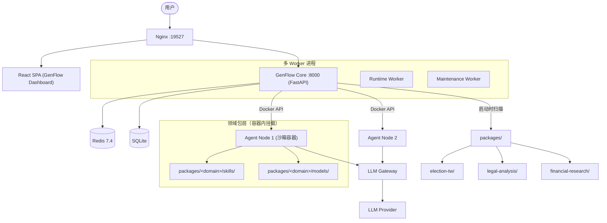

# 02 — 目标架构

---

## 3. 目标架构

### 3.1 新项目名: GenFlow

> **GenFlow** — General-purpose Multi-Agent Workflow Platform
>
> 通用多 Agent DAG 工作流平台。领域知识全部外移为可安装的「领域包（Domain Package）」。

### 3.2 目录结构

```
GenFlow/
├── genflow-core/                ← 当前 orchestrator/ 的通用子集
│   ├── dag/                     ← DAG 引擎（不动）
│   │   ├── engine.py
│   │   ├── plan_generator.py
│   │   ├── plan_compiler.py
│   │   ├── plan_validator.py
│   │   ├── plan_repair_loop.py
│   │   ├── workflow_materializer.py
│   │   ├── engine_planning_mixin.py
│   │   ├── scheduler.py
│   │   ├── node_executor.py
│   │   ├── execution_loop.py
│   │   ├── launcher_executor.py
│   │   ├── launcher_prompt.py
│   │   ├── launcher_workspace.py
│   │   ├── skill_binding.py
│   │   └── skill_auto_binder.py
│   ├── chat/                    ← Chat 执行层（Planner 通用化）
│   │   ├── api.py
│   │   ├── planning_agent.py
│   │   ├── planning/            ← 🆕 通用 Planning 框架
│   │   │   ├── progressive_selection.py
│   │   │   ├── request_pipeline.py
│   │   │   ├── sufficiency.py
│   │   │   ├── workflow_finalize.py
│   │   │   └── domain_loader.py ← 🆕 领域包加载器
│   ├── llm_gateway/             ← LLM 协议网关（不动）
│   ├── routers/                 ← REST API（不动）
│   ├── runs/                    ← Run 管理（不动）
│   ├── export/                  ← 导出引擎（不动）
│   ├── agent/                   ← Orchestrator 侧 Agent 管理
│   │   ├── launcher.py
│   │   ├── workspace_skills.py  ← 投影逻辑（通用化）
│   │   ├── container_config.py
│   │   ├── container_capacity.py
│   │   └── mcp_config.py
│   └── settings.py              ← 集中配置（脱选举化）

├── genflow-agent-runtime/       ← 当前 agent/ 的通用子集
│   ├── run_node.py              ← 节点执行编排（不动）
│   ├── sdk_hooks.py             ← SDK 钩子（不动）
│   ├── sdk_session.py           ← SDK 会话管理（不动）
│   ├── session_lifecycle.py     ← 会话生命周期（不动）
│   ├── system_prompt.py         ← 动态 System Prompt（通用化）
│   ├── runtime_builtin_tools.py
│   ├── skill_bundle_loader.py   ← Skill 加载（通用化）
│   ├── custom_agents.py
│   ├── event_recorder.py
│   ├── export_runtime.py
│   ├── chart_assets.py
│   └── domain/                  ← 🆕 领域模型挂载点
│       └── __init__.py          ← 动态 import 领域包模型

├── genflow-frontend/            ← 当前 frontend/（基本不动）
│   └── src/
│       ├── pages/
│       │   ├── ChatPage.tsx
│       │   ├── RunDetailPage.tsx
│       │   ├── AdminModelPage.tsx
│       │   ├── AdminMcpPage.tsx
│       │   └── AdminDomainPage.tsx  ← 🆕 领域包管理页面
│       ├── components/
│       │   ├── chat/
│       │   ├── monitor/
│       │   └── ui/
│       └── features/monitor/

├── genflow-common/              ← 当前 common/ 的通用子集
│   ├── skills_registry.yaml     ← 🆕 拆分：只含通用技能
│   ├── skills_registry.py
│   ├── skill_docs.py
│   ├── claude_runtime_assets.py ← 通用化 + 多 domain 支持
│   ├── runtime_files.py
│   ├── csv_progress.py
│   ├── report_quality.py
│   ├── mcp_manifest.py
│   └── domain_loader.py         ← 🆕 领域包清单加载器

├── packages/                    ← 🆕 领域安装包
│   ├── election-tw/             ← 当前选举逻辑全部搬家
│   │   ├── package.yaml
│   │   ├── skills.yaml          ← 选举专属技能定义（~18 个）
│   │   ├── skills/              ← SKILL.md 源文件
│   │   ├── agents/              ← 选举专属 Subagent
│   │   ├── planner/             ← 选举专属 Planner Skills
│   │   ├── models/              ← 选举预测模型（原 agent/tw_*.py）
│   │   ├── data/                ← 选举数据（原 public/）
│   │   └── tests/
│   ├── legal-analysis/          ← 示例：法律分析领域包
│   └── financial-research/      ← 示例：金融研究领域包

├── docker/
│   ├── docker-compose.yml
│   ├── Dockerfile.core          ← 原 Dockerfile.orchestrator
│   ├── Dockerfile.agent
│   └── Dockerfile.frontend
├── scripts/
├── docs/
└── README.md
```

### 3.3 服务架构（目标态）



### 3.4 领域包规范 (package.yaml)

每个领域包通过 `package.yaml` 声明自身：

```yaml
# packages/election-tw/package.yaml
name: election-tw
version: "0.1.0"
display_name: "台湾选举分析"
description: "2026 台湾地方选举模拟、预测与报告生成"
author: "GenFlow Team"

# 技能定义（合并到 core skills_registry）
skills: skills.yaml

# Planner 追问模块（Python 模块路径）
planner:
  module: election_tw.planner
  skills:
    - county_mayor_race
    - party_list_threshold
    - recall_wave
    - referendum_impact
    - voter_turnout_sensitivity
    - council_seat_projection
    - cross_strait_scenario
    - local_governance_issue
    - party_realignment
    - poll_methodology_audit

# Agent 运行时模型（容器内加载）
models:
  - tw_election_core
  - tw_election_model
  - tw_local_2026
  - tw_local_common
  - tw_local_report

# 数据目录（相对于 package 根）
data_root: data/

# 搜索 MCP 推荐（可选）
recommended_mcp:
  - exa
  - omniseek

# 依赖的 core 版本
genflow_core: ">=0.1.0"

# 推荐的 DAG 拓扑模板（可选）
preferred_recipes:
  - layered_diamond
  - two_stage_fanout
```

### 3.5 五大核心改造点

#### 改造点 1: Skills Registry 拆分

```
现在: common/skills_registry.yaml (1811行, 35技能, 全选举耦合)
       ↓
目标: genflow-common/skills_registry.yaml (~200行, ~14通用技能)
     + packages/election-tw/skills.yaml (~1600行, ~18选举技能)
     + packages/legal-analysis/skills.yaml (~200行, 法律技能)

通用技能（保留在 core）:
  - agenda_setter · data_discovery · evidence_synthesizer
  - master_analyst · data_analyzer · report_generator
  - chart_visualizer (原 election_visualizer 改名)
  - web_artifacts_builder · report_reviewer_and_polisher
  - appendix_assembler · csv_task_spec · csv_task_runner
  - dag_node_debug · pptx · xlsx

选举技能（搬入 packages/election-tw/）:
  - candidate_profile_analyst · party_list_threshold_analyst
  - electoral_demography_analyst · polls_collector
  - history_data_collector · swing_district_detector
  - district_race_analyst · scenario_simulator
  - competitive_landscape_analyst · referendum_campaign_analyst
  - issue_impact_analyst · electoral_institution_analyst
  - cross_regional_comparator · fact_checker
  - candidate_registry_searcher · realtime_status_researcher
  - exa_web_researcher · library_context_retriever · linkly_ai

合并逻辑: 启动时扫描 packages/*/package.yaml → 读取 domain skills.yaml
         → 合并到 core skills_registry → 校验 ID 不冲突 → 统一注册表
```

#### 改造点 2: Planner Skills 插件化

```
现在: orchestrator/chat/planning/planner_skills/*.py (12个硬编码 import)
       ↓
目标: genflow-core/chat/planning/domain_loader.py (动态发现 + importlib 加载)

1. 扫描 packages/*/package.yaml 中的 planner.module 字段
2. 将 packages/<domain>/ 加入 sys.path
3. importlib.import_module(planner_module) 动态加载
4. 校验每个 skill 函数签名符合 contract
5. 注册到 planner skill registry dict

Planner 调用端: 从静态 import 改为 domain_loader.get_planner_skill(name) 动态 dispatch
```

#### 改造点 3: Agent Runtime 模型解耦

```
现在: agent/election_agent.py (1167行, 含选举逻辑)
     agent/tw_*.py (11文件, 硬编码在 agent/ 中)
       ↓
目标: genflow-agent-runtime/ (纯通用, ~800行)
     packages/election-tw/models/ (选举模型, 容器内 volume mount)

Agent 入口: run_node.py → system_prompt.py → 根据 node skill domain
          → 动态 import domain_models (from /packages/<domain>/models/)
          → 选举节点 → import election_tw.models
          → 通用节点 → 只用 runtime_builtin_tools
```

#### 改造点 4: 数据层多租户化

```
现在: public/ (7个选举数据目录, 硬编码路径)
     resource_audit 直接扫描 public/
       ↓
目标: packages/<domain>/data/ (每个包自己的数据根)
     resource_audit 接受 domain_id → 定位 data/ 目录
     public/ 保留为 shared data（跨领域共享）

前端新增: AdminDomainPage.tsx — 领域包管理
  - 已安装包列表 · 元数据展示 · 启用/禁用 · 数据目录浏览
```

#### 改造点 5: 配置与命名脱选举化

```
环境变量:
  ELECTIONSIM_CLAUDE_RUNTIME_DIR → GENFLOW_RUNTIME_DIR (兼容旧值)

容器:
  election-agent:latest      → genflow-agent:latest
  election-orchestrator      → genflow-core
  election-frontend          → genflow-frontend
  election-runtime-worker    → genflow-runtime-worker
  election-maintenance       → genflow-maintenance

项目名:
  ElectionSim-Lab → GenFlow
  Election Simulation Orchestrator → GenFlow Orchestrator
```

---

*下一篇：[03-技术方案](./03-技术方案.md)*
