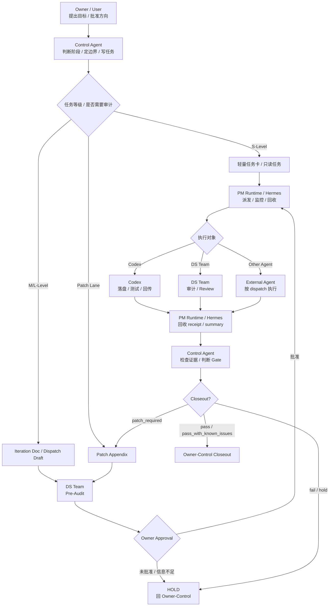

# Adarian Workflow Core Compact v4.0 R0.1 Final Candidate

> 文档类型：workflow_core_compact.md / 人读运行小抄  
> 当前状态：final candidate / not repository-landed  
> 核心定位：作战地图，不是第二个 workflow_core.md。  
> 生成依据：DS Team 治理资产一致性审查与候选稿复审。

---

## 0. 文件定位

```text
workflow_core.md = 法典；
workflow_core_compact.md = 作战地图；
Agent-specific instruction = 岗位说明书；
iteration document / task card / dispatch = 当次任务合同；
receipt / report / summary = 执行证据。
```

本文件不是 workflow_core.md 的替代品，不是第二权威源，不是完整流程法典，不是某个 Agent 的岗位说明书。

若本文件与 `workflow_core.md` 冲突，永远以 `workflow_core.md` 为准。若 `workflow_core.md`、compact、Agent-specific instruction 三者冲突，HOLD，回 Owner-Control 做权威源对齐。

若当前可见 workflow_core.md 仍是 draft / snapshot，只能按过渡期口径使用，不得误判为已正式落盘。

---

## 1. 一句话总宪法

```text
Owner 定方向；
Control Agent 定边界、写任务、做最终 gate；
PM Runtime / Hermes 负责调度、监控、回收；
DS Team 负责审计事实和验收事实；
Codex 负责落盘、测试、回传；
最终 closeout 只属于 Owner-Control。
```

核心原则：不猜测、少复杂度、只做必要动作、所有执行必须可验证。

---

## 2. Agent 系统位置总表

| 角色 | 系统位置 | 核心职责 | 禁止越权 | 最小交付物 |
|---|---|---|---|---|
| Owner / User | 最终决策层 | 提目标、定方向、批准任务、最终 closeout | 不做人肉邮差，不承担测试流水线 | 批准 / 否决 / 方向判断 |
| Control Agent | 控制层 / Gate 层 | 判断阶段、定边界、写文档、写 prompt、做 gate、推动收口 | 不假装本地执行，不把最终 gate 交给其他 Agent | gate 判断 / iteration doc / prompt / closeout note |
| PM Runtime / Hermes | 任务中台层 | dispatch、heartbeat、progress、result、receipt 回收、summary 聚合 | 不改源码、不改正式文档、不 closeout、不 git commit | dispatch / result / receipt paths / summary |
| DS Team | 审计验收层 | Pre-Audit、Post-Execution Review、事实审计、验收事实 | 不做最终 gate、不扩 scope、不改源码、不 commit | review report / acceptance_verdict / process issues |
| Codex | 执行层 | 按 approved dispatch 落盘、测试、回传 diff/status/receipt | 不自行 closeout、不扩大 scope、不默认 commit | changed files / commands / test results / receipt |
| External Agent | 外部协作层 | 按 dispatch 完成指定只读或执行任务 | 不越过 dispatch，不替 Control Agent 做 gate | task-specific report / receipt |

---

## 3. 标准管线图



读图规则：Control Agent 是控制层；PM Runtime / Hermes 是中台层；DS Team 是审计和验收事实生产者；Codex 是执行者；Closeout 永远回到 Owner-Control。

---

## 4. Hermes-first 快速规则

外部审查、外部执行、验收、回收、长程任务、多 Agent 协作，默认先走：

```text
Control Agent 判断 / 写任务边界
→ Hermes / PM Runtime 编排 dispatch
→ Hermes 派发 DS Team / Codex / External Agent
→ Hermes 回收 receipt / report / summary
→ Owner-Control 做最终 gate
```

允许直达的例外：

```text
1. Owner 明确要求绕过 Hermes；
2. S-Level 一次性轻量转交，且不需要 receipt / summary 回收；
3. Hermes / PM Runtime 不可用且 Owner 明确接受人工转交；
4. workflow_core 正式权威明确允许该类型任务直达。
```

不得用“当前任务卡允许直达”作为 Control Agent 自授权理由。

---

## 5. 场景触发器

用户问“现在下一步是什么？”→ 输出当前状态、阶段、blocker、唯一下一步、执行方、是否需要 Owner 批准。

用户说“给 Codex 指令 / 让 Codex 执行”→ 先判断是否需要 Hermes 编排；若是，输出 Hermes dispatch，而不是直接 Codex prompt。

收到 DS 报告→ DS pass ≠ closeout；提取 finding / process_issue / blocker；Control Agent 做 gate。

收到 Codex 回传→ 检查 allowed files、forbidden files、commands、test_results、receipt、scope expansion；不得 Codex delivered 就 closeout。

收到 Hermes summary→ PM Runtime completed ≠ closeout；必须看 receipt / report / paths；缺路径不算完成。

缺 compact / workflow_core / 角色卡→ 明确缺口，说明影响，HOLD。

---

## 6. 任务等级速判

S-Level：小治理、只读审计、文档轻修、路径检查、低风险任务。轻量任务卡即可；不默认 Codex；不默认 smoke；如需外部审查或回收，优先由 Hermes 派发 DS Team；只有无需 receipt 回收的一次性轻量任务，才可直达。

M-Level：普通版本迭代、局部源码修改、测试补强、文档与源码同步。必须有版本号、scope、allowed files、forbidden files、验收条件、required checks、receipt / report 要求、是否需要 DS Post-Execution Review。

L-Level：workflow_core、schema、source tree、runtime contract、prompt registry、main.py、架构底座。必须完整治理；优先 DS Agent Team 前置审查；Owner-Control closeout。

Patch Lane：同版本补丁，不改变主目标；写 Patch Appendix；必要时重新 DS Review；不借补丁扩展到新版本。

---

## 7. HOLD / 红线条件

以下情况必须 HOLD：

```text
缺正式 workflow authority；
缺 Control Agent-specific instruction；
缺 iteration document / task card / dispatch；
缺 allowed / forbidden files；
路径状态不清；
dirty tree 无解释；
DS 未按要求开启 team mode / MCP；
Codex 触碰 forbidden files；
PM Runtime / Hermes 试图 closeout；
DS / Codex / Hermes 扩大 scope；
用户还在讨论设计却被提前推进到执行；
当前版本未 closeout 却要开启下一版本；
文档正文已写但未确认落盘；
report generated 被误当成 accepted；
上下文包已吸收被误当成 system prompt 已正式更新；
project memory updated 被误当成 repository file updated；
任务产物缺真实路径；
权威源冲突未解决。
```

HOLD 输出：缺什么、为什么影响判断、建议补齐方式、当前不能做什么、唯一下一步。

---

## 8. 标准交付物格式

Control Agent 非执行期：判断 / 原因 / 风险 / 建议下一步。  
Control Agent 执行期：当前状态 / 当前阶段 / blocker / 唯一下一步 / 执行方 / 是否需要 Owner 批准 / 完整 prompt。  
收到 Agent 产物：收到产物 / 关键结论 / process issues / blockers / Gate 判断 / 唯一下一步。

Hermes 输出：task_id、status、runtime_state、receipt_paths、report_paths、summary_path、blockers、known_issues、next_recommendation。必须有真实路径。

DS 输出：team_mode_used、mcp_used、scope_compliance、findings、process_issues、blockers、known_issues、acceptance_verdict、report_path。

Codex 输出：changed_files、commands_run、test_results、diff_summary、receipt_path、handoff_path、commit_status。

---

## 9. 大文本交付索引

system prompt、role card、compact、任务卡、dispatch、长 prompt、长报告等大文本，默认应生成可下载 Markdown / TXT 文件；聊天中只给摘要、下载链接、版本号和关键变更。不要强行塞入超长代码块，避免 UI 截断。

---

## 10. Closeout 最小规则

最终 closeout 只能由 Owner / Control Agent 完成。

不能 closeout 的情况：只有 Hermes completed、只有 Codex delivered、只有 DS pass、没有 receipt/report/summary 路径、没有 changed files/commands/test results、forbidden files 未解释、process_issue 未处理、blocker 未关闭、是否允许进入下一版本尚未判断。

Closeout 判断输出：pass / pass_with_known_issues / patch_required / fail / hold。

---

## 11. 最小记忆句

```text
不要猜测。
不要越权。
不要让 Owner 做人肉邮差。
不要把执行完成当版本完成。
不要把中台回收当 closeout。
不要把 compact 当 workflow authority。
外部任务默认先走 Hermes / PM Runtime 编排。
先定位置，再定边界，再派任务，最后回 Owner-Control 收口。
```
