# Adarian：多智能体异步舆情预判系统 MVP 技术规格书 (V1.1)

## 1. 项目愿景与 MVP 边界定义

### 1.1 项目定位

本项目是一个基于**宏微观结合（Macro-Micro Linkage）**的舆情推演系统原型。通过让多个具有独立人格的 LLM 驱动智能体（Agent）在微型社交网络中进行多轮交互，观察群体情绪的涌现与演化，最终由报告智能体提炼出宏观社会情绪指标$x(t)$。

该指标将在后续版本中作为核心参数，分别喂入 **AD 快模块**（热度峰值预判）和**增强型 SEIR 慢模块**（90天情绪演化推演），形成完整的"微观涌现 → 宏观预测"闭环。

### 1.2 MVP 核心目标

采用**"曳光弹（Tracer Bullet）"策略**，剥离实时爬虫和重度前端，聚焦验证一条最小闭环：

$$\text{种子文本} \xrightarrow{\text{LLM1/2/3解析}} \text{实体分类} \xrightarrow{\text{多轮交互}} \text{情绪涌现} \xrightarrow{\text{Report Agent}} x(t) \text{提取}$$

### 1.3 硬性约束 (Hard Constraints)

| 约束编号 | 约束内容 | 理由 |
|---------|---------|------|
| HC-01 | **禁止使用云端 RAG 服务**，所有记忆存储在本地 ChromaDB | 数据主权安全 |
| HC-02 | **禁止硬编码 Agent 数量**，由 LLM 根据材料动态推断，总量不超过 15 个 | 避免冗余，贴合事件复杂度 |
| HC-03 | **禁止依赖网络爬虫**，输入仅为用户提供的本地文本文件 | 降低工程复杂度，聚焦核心算法 |
| HC-04 | **LLM 输出必须经过 Pydantic 校验**，拒绝任何非结构化的自由文本返回 | 保证模块间数据流的可靠性 |
| HC-05 | **Phase 1 必须经过 LLM3 校验通过**，迭代直到格式正确 | 保证实体分类和数量符合要求 |

### 1.4 MVP 不包含的内容（明确排除）

- ❌ AD 快模块（BiHill 方程预测）—— 纳入 V2.0
- ❌ SEIR 慢模块（微分方程求解）—— 纳入 V3.0
- ❌ Vue 3 前端界面 —— 纳入 V3.0
- ❌ 实时数据采集/爬虫
- ❌ WebSocket/轮询机制
- ❌ 事件实体的立场变化机制 —— 纳入 V2.0

---

## 2. 项目文件结构 (Project Structure)

```
adarian/
├── README.md                          # 项目总览
├── requirements.txt                   # Python 依赖
├── config.py                          # 全局配置
├── main.py                            # 主入口
│
├── docs/                              # 文档目录
│   ├── PROJECT_SPEC_v1.1.md          # 本文档
│   ├── skills/                        # 开发规范
│   │   └── dev_workflow.md
│   └── iterations/                    # 迭代记录
│       ├── _template.md
│       ├── CHANGELOG.md
│       ├── TASK_LOG.md
│       └── v*.md                      # 各版本迭代文档
│
├── seeds/                             # 种子材料
├── outputs/                           # 运行结果
├── tests/                             # 单元测试
│
└── src/                               # 源代码
    ├── __init__.py
    ├── schemas.py                     # Pydantic 数据模型
    ├── config.py                      # 全局配置（已复制到根目录）
    ├── llm_client.py                 # LLM 统一调用
    ├── memory_store.py                # ChromaDB 本地记忆
    ├── phase1_entity_extraction.py    # 实体提取（LLM1/2/3 + 迭代校验）
    ├── phase2_topology_builder.py    # 社交拓扑构建
    ├── phase3_tick_simulation.py     # 异步时间步推演
    └── phase4_report_agent.py        # 宏观洞察生成
```

---

## 3. 核心数据流与字段定义 (Data Contracts)

### 3.1 两种实体类型

#### 事件实体（Event Entity）
- 直接参与话题讨论
- 作为第一批发言者（Ttick 0）
- 从种子文本中提取，如：李佳琦、花西子品牌方
- 作为社交网络中的 Core 节点

#### 意见传播实体（Opinion Spreader）
- 不直接参与事件，但会传播意见
- 基于 event_temperature 和 event_intensity 生成
- 类型包括：粉丝、支持者、专家、批评者
- 生成逻辑：
  - **事件温度（event_temperature）** → 决定批评者比例
  - **事件烈度（event_intensity）** → 决定是否出现多样化传播者
- 必须关注事件实体才能发言

### 3.2 Phase 1 输出：实体提取结果

```json
{
  "event_summary": "一句话概括事件（50字以内）",
  "event_temperature": 0.0到1.0之间的浮点数,
  "event_intensity": 0.0到1.0之间的浮点数,
  "event_type": "事件类型（如：产品质量危机、校园冲突）",
  "event_entities": [
    {
      "name": "实体名称",
      "type": "individual | organization | group",
      "role": "在事件中的角色",
      "entity_category": "event_entity"
    }
  ],
  "opinion_spreaders": [
    {
      "group_name": "群体名称（如：花西子死忠粉）",
      "related_event_entity": "关联的事件实体名称",
      "description": "50字以内的人设描述",
      "stance_score": 1.0到10.0之间的浮点数,
      "susceptibility": 0.0到1.0之间的浮点数,
      "confirmation_bias_level": "none | weak | strong",
      "estimated_percentage": 0到100之间的整数,
      "communication_style": "该群体的典型说话风格",
      "entity_category": "opinion_spreader"
    }
  ],
  "relations": [
    {
      "source": "实体A的名称",
      "target": "实体B的名称",
      "type": "关系类型"
    }
  ]
}
```

### 3.3 Phase 2 输出：社交网络拓扑

- **事件实体**：作为 Core 节点，互相连接（Core ↔ Core）
- **意见传播实体**：作为 Periphery 节点，必须关注事件实体
- **Periphery 之间**：可选连接（30% 概率）
- 使用 NetworkX 的 DiGraph（有向图）

### 3.4 Phase 3 输出：每轮交互日志

关键输出 `global_metrics`：

| 字段 | 含义 | 后续版本用途 |
|------|------|------------|
| `mean_stance` | 全局平均立场分，即 x(t) | V3.0 中喂入 SEIR 的 β(t,x) |
| `std_stance` | 立场标准差 | 衡量群体分裂程度 |
| `polarization_index` | 极化指数（标准差/均值） | V2.0 中作为 AD 模型的辅助特征 |

**Tick 发言顺序**：
- **Tick 0**：所有事件实体发言（基于种子文本生成初始声明）
- **Tick 1+**：意见传播实体发言（必须看到 Tick 0 的事件实体发言）

---

## 4. 系统核心架构图 (Architecture)

```mermaid
graph TD
    A["用户上传 seeds/event.txt"]
    A --> B["Phase 1: 实体提取与分类"]

    subgraph P1 ["Phase 1: LLM1/2/3 协作架构"]
        B --> B1["LLM1: 分析种子材料"]
        B1 --> B2["设置 event_temperature + event_intensity"]
        B2 --> B3["LLM2: 提取事件实体 + 生成意见传播者"]
        B3 --> B4["LLM3: 格式校验（JSON格式？双列实体？总量≤15？）"]
        B4 -->|"通过"| B5["输出 event_entities + opinion_spreaders"]
        B4 -->|"失败"| B3
    end

    B5 --> C["Phase 2: Topology Builder"]

    subgraph P2 ["Phase 2: 微型社交网络"]
        C --> C1["事件实体 → Core 节点"]
        C1 --> C2["意见传播实体 → Periphery 节点"]
        C2 --> C3["Core ↔ Core 互相连接"]
        C3 --> C4["Periphery → Core 必须关注"]
        C4 --> C5["Periphery ↔ Periphery 可选连接"]
        C5 --> C6["NetworkX DiGraph: 建立单向关注边"]
    end

    C6 --> D["Phase 3: Tick Simulation"]

    subgraph P3 ["Phase 3: 多轮涌现推演"]
        D --> D0["Tick 0: 事件实体发言"]
        D0 --> D1["Tick 1: 意见传播实体评论事件实体发言"]
        D1 --> D2["Tick 2-N: 读取关注者发言后态度偏移"]
        D2 --> D3["每轮计算 global_metrics"]
        D3 -->|"循环直到 N 轮或收敛"| D2
    end

    D3 --> E["Phase 4: Report Agent"]

    subgraph P4 ["Phase 4: 宏观洞察"]
        E --> E1["读取 ChromaDB 全量日志"]
        E1 --> E2["LLM: 生成 Markdown 报告"]
        E2 --> E3["输出 x_t 序列与 final_report.md"]
    end
```



---

## 5. MVP 验收标准 (Definition of Done)

| 验收项 | 通过条件 |
|--------|---------|
| Phase 1 LLM3 校验通过 | 格式正确、双列实体、总量≤15 |
| Phase 1 实体分类正确 | event_entities 和 opinion_spreaders 分离 |
| Phase 2 图谱可用 | NetworkX 图连通，Core-Periphery 结构正确 |
| Phase 3 Tick 0 事件实体发言 | 所有事件实体在第0轮发言 |
| Phase 3 Tick 1+ 意见传播实体发言 | 意见传播实体必须看到事件实体发言才能发言 |
| Phase 3 涌现可观测 | 经过 3 轮 Tick 后，至少 1 个 Agent 的 stance_delta 绝对值 > 1.5 |
| Phase 4 报告完整 | 输出的 Markdown 包含情绪轨迹表格和拐点分析段落 |
| 端到端闭环 | 从 `main.py` 一键运行，输入 txt，输出 `final_report.md` |

---

## 6. 技术演进路线 (Roadmap)

### V1.1（当前 MVP）—— 验证微观涌现链路

| 维度 | 规格 |
|------|------|
| **验证目标** | 多Agent 涌现 → Report Agent 提取 x(t) 的核心链路是否成立 |
| **Agent 规模** | 事件实体 + 意见传播实体 ≤ 15 个 |
| **实体分类** | 事件实体（第一批发言） + 意见传播实体 |
| **记忆方式** | ChromaDB 精确查询（按 agent_id + tick 编号） |
| **Agent 编排** | 自研 Phase 3 串行循环 |
| **LLM 调用** | 统一参数 |

---

### V1.2 —— Zep 容器本地化 + Graph RAG 能力落地

| 维度 | 规格 |
|------|------|
| **核心目标** | 引入 Zep Docker 容器，实现增量式知识图谱构建 |
| **新增组件** | Zep Docker 容器（本地部署） |
| **新增模块** | `src/zep_client.py`（Zep API 封装） |
| **改造内容** | Phase 3 记忆读写替换为 Zep（语义检索 + 图遍历） |
| **Agent 规模** | ≤15 个（保持不变） |
| **核心优势** | 内置 Embedding、数据 100% 本地化、语义检索 |

**验收标准**：
- ✅ Zep 容器正常启动（`docker-compose up -d`）
- ✅ Agent 发言后记忆写入 Zep
- ✅ Agent 发言前能检索到相关历史记忆
- ✅ 知识图谱自动构建

---

### V1.3 —— CAMEL-AI 底座集成 + Agent 编排重构

| 维度 | 规格 |
|------|------|
| **核心目标** | 引入 CAMEL-AI 作为 Agent 编排底座 |
| **新增模块** | CAMEL-AI 集成（替换自研 Agent 循环） |
| **改造内容** | 重构 Phase 3，使用 CAMEL-AI 的 ChatAgent 管理 Agent 状态 |
| **差异化配置** | 事件实体（temperature=0.3）vs 传播者（temperature=0.8） |
| **Agent 规模** | ≤15 个（保持不变） |
| **核心优势** | 原生支持多 LLM API、差异化参数、代码结构清晰 |

**验收标准**：
- ✅ CAMEL-AI 正常调用 LLM API
- ✅ 事件实体和传播者使用不同 LLM 参数
- ✅ CAMEL-AI 与 Zep 容器联动正常

---

### V1.4 —— OASIS 引擎集成 + 并行仿真架构

| 维度 | 规格 |
|------|------|
| **核心目标** | 替换串行 Phase 3 → OASIS 并行仿真 |
| **新增模块** | OASIS 并行引擎 |
| **Phase 1** | 保留，生成事件实体 + 意见传播者 |
| **Phase 2 改造** | 输出目标从 NetworkX 改为存入 Zep Docker |
| **数据存储** | 实体 + 关系统一存入 Zep Docker |
| **OASIS 输入** | 从 Zep 读取实体和关系 |
| **Agent 规模** | ≤15 个（保持不变） |
| **核心优势** | 并行交互、复用 Zep 数据、实体关系自动传递 |

**数据流程**：
```
Phase 1 → 事件实体 + 传播者 + 关系 → 存入 Zep Docker → OASIS 读取 → 并行仿真
```

**Phase 1 输出演进**：

| 阶段 | Phase 1 输出 |
|------|-------------|
| V1.1-V1.3 | event_entities + opinion_spreaders + relations（JSON 文件） |
| V1.4+ | 转换为 OASIS Profile 格式，存入 Zep Docker |

**Phase 1 转换为 OASIS Profile 的字段映射**：

| 当前字段 | OASIS 字段 | 说明 |
|---------|-----------|------|
| name | name | 实体名称 |
| description | bio | 从 description 生成简介 |
| description + stance_score | persona | 生成详细人设 |
| entity_category | source_entity_type | event_entity / opinion_spreader |
| stance_score | (保留) | 用于立场计算 |

**验收标准**：
- ✅ 实体和关系统一存入 Zep Docker
- ✅ OASIS 能从 Zep 读取完整数据
- ✅ 8 个 Agent 并行交互无阻塞
- ✅ Agent 发言无同质化
- ✅ 舆情指标正常计算

---

### V1.5 —— 全组件闭环优化 + 一键启动脚本

| 维度 | 规格 |
|------|------|
| **核心目标** | 全流程自动化 + 资源监控 + 错误恢复 |
| **新增模块** | `start.bat`/`start.sh` 一键启动脚本 |
| **改造内容** | 健康检查、自动重试、资源监控、数据清理 |
| **Agent 规模** | ≤15 个（保持不变） |
| **核心优势** | 零基础可执行、自动错误恢复、降低运维成本 |

**验收标准**：
- ✅ 执行一键启动脚本后全系统自动启动
- ✅ 健康检查失败时自动报错
- ✅ LLM API 调用失败自动重试

---

### V1.6 —— Graph RAG 可视化 + 知识图谱交互式展示

| 维度 | 规格 |
|------|------|
| **核心目标** | 基于 D3.js 实现 Zep Graph RAG 知识图谱可视化 |
| **新增模块** | `src/graph_api.py`（后端 API）、`visualization/graph.html`（前端） |
| **复用** | 复用 `case/MiroFish-main/frontend` Vue3 前端 |
| **核心功能** | 力导向图、节点颜色区分、交互式拖拽、悬停详情 |

**验收标准**：
- ✅ 图谱数据读取正常
- ✅ 力导向图渲染无重叠
- ✅ 交互功能可用

---

### V2.0 —— AD 快模块 + 规模扩展 + 事件实体立场变化

| 维度 | 规格 |
|------|------|
| **新增模块** | `src/ad_model_predictor.py`（AD 快模块 - BiHill 方程预测） |
| **Agent 规模** | 扩展至 50-100 个 |
| **事件实体机制** | 事件实体参与立场变化（根据舆情压力动态调整） |
| **记忆方式** | Zep 向量语义检索 + `bge-small-zh-v1.5` 本地 Embedding |
| **核心优势** | 热度预判（提前 7 天）、规模扩展、事件实体立场可变 |

**验收标准**：
- ✅ AD 快模块正常预测热度峰值
- ✅ 50-100 个 Agent 并行仿真无阻塞
- ✅ 事件实体立场动态变化

---

### V3.0 —— 引入 SEIR 慢模块 + 完整前端

| 维度 | 规格 |
|------|------|
| **新增模块** | `seir_solver.py`（增强型 SEIR 慢模块） |
| **Agent 规模** | 500+ 个 |
| **前端** | 复用 Vue3 前端 + D3.js 可视化增强 |

---

### 各版本技术栈汇总

| 版本 | 技术栈 |
|------|--------|
| V1.1 | Python + ChromaDB + MiniMax API |
| V1.2 | Python + Zep Docker + MiniMax API |
| V1.3 | Python + Zep Docker + CAMEL-AI + MiniMax API |
| V1.4 | Python + Zep Docker + CAMEL-AI + OASIS + MiniMax API |
| V1.5 | Python + Zep Docker + CAMEL-AI + OASIS + MiniMax API |
| V1.6 | Python + Zep Docker + CAMEL-AI + OASIS + Flask + D3.js |
| V2.0 | Python + Zep Docker + CAMEL-AI + OASIS + AD 模块 + MiniMax API |

---

**文档版本**：v1.1
**最后更新**：2026-03-26
