# Adarian：多智能体异步舆情预判系统 MVP 技术规格书 (V1.1.10)

---

**文档版本**：v1.1.10
**最后更新**：2026-03-31
**变更记录**：

| 日期 | 版本 | 变更内容 | 变更者 |
|------|------|---------|--------|
| 2026-03-31 | v1.1.10 | stance_score描述修正（删除矛盾警告文字）；LLM1/2/3重命名为Analyzer/Generator/Validator | Claude |
| 2026-03-30 | v1.1.9 | 整合"核心参数定义手册"章节（第3章），修订章节编号 | Claude |
| 2026-03-30 | v1.1.9 | 架构变更记录新增 v1.1.6-v1.1.9 | Claude |
| 2026-03-29 | v1.1.5 | 初始版本 | - |

---

## 1. 项目愿景与 MVP 边界定义

### 1.1 项目定位

本项目是一个基于**宏微观结合（Macro-Micro Linkage）**的舆情推演系统原型。通过让多个具有独立人格的 LLM 驱动智能体（Agent）在微型社交网络中进行多轮交互，观察群体情绪的涌现与演化，最终由报告智能体提炼出宏观社会情绪指标$x(t)$。

该指标将在后续版本中作为核心参数，分别喂入 **AD 快模块**（热度峰值预判）和**增强型 SEIR 慢模块**（90天情绪演化推演），形成完整的"微观涌现 → 宏观预测"闭环。

### 1.2 MVP 核心目标

采用**"曳光弹（Tracer Bullet）"策略**，剥离实时爬虫和重度前端，聚焦验证一条最小闭环：

$$\text{种子文本} \xrightarrow{\text{Analyzer/Generator/Validator解析}} \text{实体分类} \xrightarrow{\text{多轮交互}} \text{情绪涌现} \xrightarrow{\text{Report Agent}} x(t) \text{提取}$$

### 1.3 硬性约束 (Hard Constraints)

| 约束编号 | 约束内容 | 理由 |
|---------|---------|------|
| HC-01 | **禁止使用云端 RAG 服务**，所有记忆存储在本地 ChromaDB | 数据主权安全 |
| HC-02 | **禁止硬编码 Agent 数量**，由 LLM 根据材料动态推断，总量不超过 15 个 | 避免冗余，贴合事件复杂度 |
| HC-03 | **禁止依赖网络爬虫**，输入仅为用户提供的本地文本文件 | 降低工程复杂度，聚焦核心算法 |
| HC-04 | **LLM 输出必须经过 Pydantic 校验**，拒绝任何非结构化的自由文本返回 | 保证模块间数据流的可靠性 |
| HC-05 | **Phase 1 必须经过 Validator 校验通过**，迭代直到格式正确 | 保证实体分类和数量符合要求 |

### 1.4 MVP 不包含的内容（明确排除）

- ❌ AD 快模块（BiHill 方程预测）—— 纳入 V2.0
- ❌ SEIR 慢模块（微分方程求解）—— 纳入 V3.0
- ❌ Vue 3 前端界面 —— 纳入 V3.0
- ❌ 实时数据采集/爬虫
- ❌ WebSocket/轮询机制
- ❌ 事件实体的立场变化机制 —— 纳入 V2.0

---

## 2. 项目文件结构 (Project Structure)

```
adarian/
├── README.md                          # 项目总览
├── requirements.txt                   # Python 依赖
├── config.py                          # 全局配置
├── main.py                            # 主入口
│
├── docs/                              # 文档目录
│   ├── PROJECT_SPEC_v1.1.md          # 本文档
│   ├── skills/                        # 开发规范
│   │   └── dev_workflow.md
│   └── iterations/                    # 迭代记录
│       ├── _template.md
│       ├── CHANGELOG.md
│       ├── TASK_LOG.md
│       └── v*.md                      # 各版本迭代文档
│
├── seeds/                             # 种子材料
├── outputs/                           # 运行结果
├── tests/                             # 单元测试
│
└── src/                               # 源代码
    ├── __init__.py
    ├── schemas.py                     # Pydantic 数据模型
    ├── config.py                      # 全局配置（已复制到根目录）
    ├── llm_client.py                 # LLM 统一调用
    ├── memory_store.py                # ChromaDB 本地记忆
    ├── phase0_entity_extraction.py    # 实体提取（v1.1.1 初始版本）
    ├── phase1_entity_extraction.py    # 实体提取（Analyzer/Generator/Validator + 迭代校验，v1.1.4）
    ├── phase1_persona_engine.py      # Persona 生成（v1.1.0 原始版本）
    ├── phase2_topology_builder.py    # 社交拓扑构建
    ├── phase3_tick_simulation.py     # 异步时间步推演
    ├── phase4_report_agent.py        # 宏观洞察生成
    └── agent_quality_analyzer.py     # Agent 质量分析（v1.1.5 新增）
```

---

## 3. 核心参数定义手册

**说明**：所有核心参数的定义、生成依据、取值范围、作用均在此说明。与上游对接时以本章节为准。

---

### 3.1 stance_score（立场分）

**定义**：Agent 的当前立场倾向，1.0-10.0

**语义**：
| 范围 | 语义 | 说明 |
|------|------|------|
| 1.0-3.0 | 强烈批评 | 对品牌/相关方持负面态度，支持维权、质疑品牌 |
| 4.0-6.0 | 中立观望 | 不偏向任何一方，保持理性分析 |
| 7.0-10.0 | 强烈支持 | 对品牌/相关方持正面态度，维护品牌形象 |

**生成依据**：
- 由 Generator 在 Phase 1 生成 archetype 时判断
- 无量化公式，纯主观评分

**在模拟中的作用**：
- Phase 3 初始立场
- 每轮通过 `apply_stance_constraint()` 约束后更新

**源文件**：
- 定义：`src/schemas.py:250`
- 语义规则：`src/phase3_tick_simulation.py:40-46`
- 约束逻辑：`src/phase3_tick_simulation.py:498-553`

---

### 3.2 susceptibility（易感性）

**定义**：Agent 被他人发言影响的程度，0.0-1.0

**语义**：越高越容易被说服改变立场

**生成依据**：
- 由 Generator 在 Phase 1 生成 archetype 时判断
- 无量化公式，纯主观评分

**在模拟中的作用**：
- 调制 stance 变化幅度
- `susceptibility_modulation = 1 + 0.5 × (susceptibility - 0.5)`
- susceptibility=1.0 → 变化幅度 ×1.25
- susceptibility=0.5 → 变化幅度不变
- susceptibility=0.0 → 变化幅度 ×0.75

**源文件**：
- 定义：`src/schemas.py:251`
- 接入逻辑：`src/phase3_tick_simulation.py:529-534`

---

### 3.3 event_scale（事件规模）

**定义**：事件影响范围，0.0-1.0

**语义**：0.0=个人事件，1.0=全社会事件

**生成依据**：由 Analyzer 在 Phase 1 判断

| 维度 | 0.2 | 0.5 | 0.8 |
|------|-----|-----|-----|
| 涉及范围 | 个人事件 | 群体事件 | 全社会事件 |
| 参与多样性 | 单一群体 | 多个群体 | 全民参与 |

**在 Phase 1 中的作用**：
- 影响 Agent 总人数：<0.3→3-5人，0.3-0.7→5-7人，≥0.7→7-10人
- 影响 I 分布：<0.3→I偏中立(3-6)，≥0.7→I高度分化(3-10)

**源文件**：
- 定义：`src/schemas.py`
- 生成 Prompt：`src/phase1_entity_extraction.py`

---

### 3.4 event_controversy（事件争议性）

**定义**：事件立场对立程度，0.0-1.0

**语义**：0.0=事实清晰，1.0=高度对立

**生成依据**：由 Analyzer 在 Phase 1 判断

| 维度 | 0.2 | 0.5 | 0.8 |
|------|-----|-----|-----|
| 是非清晰度 | 事实清晰 | 存在争议 | 高度对立 |
| 道德判断 | 明确对错 | 灰色地带 | 黑白颠倒 |

**在 Phase 1 中的作用**：
- 控制 P（立场方向）分布：<0.3→反对40%/支持60%，0.3-0.7→反对55%/支持45%，>0.7→反对70%/支持30%
- 高争议 + 官方拒不承认 → 极低支持者比例

**源文件**：
- 定义：`src/schemas.py`
- 生成 Prompt：`src/phase1_entity_extraction.py`

---

### 3.5 I（立场强度）

**定义**：Opinion Spreader 的立场坚定程度，1.0-10.0

**语义**：
- I=1-3：极易动摇
- I=4-6：中等坚定
- I=7-10：极度坚定

**生成依据**：由 Generator 在 Phase 1 生成

**在 Phase 3 中的作用**：
- I 越高，越不容易被说服改变立场
- I 决定 P：I≥6 → P=+1，I≤5 → P=-1

**源文件**：
- 定义：`src/schemas.py`（OpinionSpreader.I）
- 生成 Prompt：`src/phase1_entity_extraction.py`

---

### 3.6 P（立场方向）

**定义**：Opinion Spreader 的立场方向，+1 或 -1

**语义**：
- +1 = 支持/维护
- -1 = 反对/批评

**生成依据**：由 Generator 在 Phase 1 生成，由 I 决定

**在 Phase 3 中的作用**：
- 与 C（一致性）共同决定立场计算
- P=+1 时，stance_score = I
- P=-1 时，stance_score = 11 - I

**源文件**：
- 定义：`src/schemas.py`（OpinionSpreader.P）
- 生成 Prompt：`src/phase1_entity_extraction.py`

---

### 3.7 C（一致性）

**定义**：立场一致性指标，由系统固定推导

**语义**：
- C = P × (I/10)
- C > 0：支持方向的一致性强度
- C < 0：反对方向的一致性强度
- |C| 越大，立场越坚定

**生成依据**：系统自动计算，非 LLM 生成

```
C = P * (I / 10)
```

**在 Phase 3 中的作用**：由系统用于立场计算

**源文件**：
- 定义：`src/schemas.py`（OpinionSpreader.C 属性）

---

### 3.8 can_speak（发言权限）

**定义**：事件实体是否可以发言，true/false

**语义**：
| 值 | 语义 | 表现 |
|----|------|------|
| true | 可以发言 | 在 Tick 0 生成声明 |
| false | 不可发言 | 在 Tick 0 标记为"被讨论"，不生成发言 |

**适用场景**：
- 已故实体（如胖猫）：can_speak=false
- 匿名/未成年实体：can_speak=false
- 正常事件实体：can_speak=true

**生成依据**：由 Generator 在 Phase 1 判断

**在模拟中的作用**：
- Tick 0 检查 can_speak：为 false 时不生成发言
- 优先使用 original_statement（从种子材料提取的原始发言）

**源文件**：
- 定义：`src/schemas.py`（Entity 模型的 can_speak 字段）
- 发言逻辑：`src/phase3_tick_simulation.py:252-270`

---

### 3.9 参数关系图

#### IPC 框架参数作用流程（v1.1.11 新增）

```
Analyzer 设置 event_scale + event_controversy
    │
    ├── event_scale ──────────────────→ Agent 总人数 + I 分布
    │
    └── event_controversy ─────────────→ P（立场方向）分布

Generator 生成 OpinionSpreader
    │
    ├── I ──────────────────────────────→ 立场强度（1-10）
    ├── P ──────────────────────────────→ 立场方向（+1/-1）
    │                                      │
    │                                      └── I ≥ 6 → P=+1
    │                                          I ≤ 5 → P=-1
    ├── susceptibility ──────────────────→ Phase 3 变化幅度调制
    │
    └── stance_score（兼容属性）←──────── I + P 映射
                                            P=+1 → stance_score = I
                                            P=-1 → stance_score = 11 - I

C = P × (I/10)（系统固定推导）
```

#### 参数对 I 的分布约束

| event_scale | Agent 人数 | I 分布 |
|-------------|-----------|--------|
| < 0.3 | 3-5 人 | 偏中立（3-6 为主） |
| 0.3-0.7 | 5-7 人 | 中等分布（4-7 为主） |
| ≥ 0.7 | 7-10 人 | 高度分化（3-10） |

#### 参数对 P 的分布约束

| event_controversy | 反对者比例 | 支持者比例 |
|------------------|-----------|-----------|
| < 0.3 | 40% | 60% |
| 0.3-0.7 | 55% | 45% |
| > 0.7 | 70% | 30% |

---

### 3.10 参数定义核对清单

**交接时需确认对方理解以下关键点**：

- [x] I/P/C 语义：I=强度(1-10)，P=方向(+1/-1)，C=一致性(系统推导)
- [x] stance_score 兼容属性：I/P → 1-10 分数映射
- [x] event_scale/event_controversy 语义：规模(0-1)/争议性(0-1)
- [x] confirmation_bias_level 已废除，由 I 推导
- [x] group_distribution_strategy 已废除，由 event_controversy 控制
- [x] event_temperature/intensity 已废除（v1.1.11）

---

## 4. 核心数据流与字段定义 (Data Contracts)

### 4.1 两种实体类型

#### 事件实体（Event Entity）
- 直接参与话题讨论
- 作为第一批发言者（Tick 0）
- 从种子文本中提取，如：李佳琦、花西子品牌方
- 作为社交网络中的 Core 节点
- **可设置 `can_speak=false`**（如已故、匿名实体不可发言）
- **`original_statement`**：从种子材料中提取的该实体原始发言

#### 意见传播实体（Opinion Spreader）
- 不直接参与事件，但会传播意见
- **event_scale 影响生成**：
  - `< 0.3` → 3-5 人
  - `0.3-0.7` → 5-7 人
  - `≥ 0.7` → 7-10 人
- **event_controversy 影响 P 分布**：
  - `< 0.3` → 反对40%/支持60%
  - `0.3-0.7` → 反对55%/支持45%
  - `> 0.7` → 反对70%/支持30%
- **必须关注事件实体才能发言**
- **I/P 框架**（v1.1.11 新增）：
  - `I`：立场强度（1-10）
  - `P`：立场方向（+1/-1）
  - `C`：一致性（系统推导 C = P × I/10）
  - `susceptibility`：易感性，影响立场变化幅度
  - `stance_score`（兼容属性）：I/P → 1-10 映射

### 4.2 Phase 1 输出：实体提取结果（v1.1.11 更新）

```json
{
  "event_summary": "一句话概括事件（50字以内）",
  "event_scale": 0.0到1.0之间的浮点数,
  "event_controversy": 0.0到1.0之间的浮点数,
  "event_type": "事件类型（如：产品质量危机、校园冲突）",
  "event_entities": [
    {
      "name": "实体名称",
      "type": "individual | organization | group",
      "role": "在事件中的角色",
      "entity_category": "event_entity",
      "can_speak": true或false,
      "original_statement": "从种子材料提取的原始发言（可选）"
    }
  ],
  "opinion_spreaders": [
    {
      "group_name": "群体名称（如：花西子死忠粉）",
      "related_event_entity": "关联的事件实体名称",
      "description": "50字以内的人设描述",
      "I": 1.0到10.0之间的浮点数,
      "P": +1 或 -1,
      "susceptibility": 0.0到1.0之间的浮点数,
      "estimated_percentage": 0到100之间的整数,
      "communication_style": "该群体的典型说话风格",
      "entity_category": "opinion_spreader"
    }
  ],
  "relations": [
    {
      "source": "实体A的名称",
      "target": "实体B的名称",
      "type": "关系类型"
    }
  ]
}
```

### 4.3 Phase 2 输出：社交网络拓扑

- **事件实体**：作为 Core 节点，互相连接（Core ↔ Core）
- **意见传播实体**：作为 Periphery 节点，必须关注事件实体
- **Periphery 之间**：可选连接（30% 概率）
- 使用 NetworkX 的 DiGraph（有向图）

### 3.4 Phase 3 输出：每轮交互日志

关键输出 `global_metrics`：

| 字段 | 含义 | 后续版本用途 |
|------|------|------------|
| `mean_stance` | 全局平均立场分，即 x(t) | V3.0 中喂入 SEIR 的 β(t,x) |
| `std_stance` | 立场标准差 | 衡量群体分裂程度 |
| `polarization_index` | 极化指数（标准差/均值） | V2.0 中作为 AD 模型的辅助特征 |

**Tick 发言顺序**：
- **Tick 0**：事件实体发言
  - 检查 `can_speak`：为 false 时不生成发言，标记为"被讨论"
  - 优先使用 `original_statement`：从种子材料提取的原始发言直接使用
  - 无原始发言：LLM 生成声明
- **Tick 1+**：意见传播实体发言
  - **全量发言**：所有 opinion_spreader 在每一轮都会发言（无概率筛选）
  - 必须看到 Tick 0 的事件实体发言
  - `susceptibility` 接入 stance 变化约束（v1.1.9）

**发言决策流程（Tick 0）**：
```
是事件实体吗？
    ↓
can_speak = false?
    ↓ yes → 标记为"被讨论"，不生成发言
    ↓ no
original_statement 存在?
    ↓ yes → 直接使用原始发言
    ↓ no → LLM 生成发言
```

**注意**：`config.MAX_POSTS_PER_TICK` 参数已定义但未在代码中使用。

---

## 5. 系统核心架构图 (Architecture)

```mermaid
graph TD
    A["用户上传 seeds/event.txt"]
    A --> B["Phase 1: 实体提取与分类"]

    subgraph P1 ["Phase 1: Analyzer/Generator/Validator 协作架构"]
        B --> B1["Analyzer: 分析种子材料"]
        B1 --> B2["设置 event_scale + event_controversy"]
        B2 --> B3["Generator: 提取事件实体 + 生成意见传播者"]
        B3 --> B4["Validator: 格式校验（JSON格式？双列实体？总量≤15？）"]
        B4 -->|"通过"| B5["输出 event_entities + opinion_spreaders"]
        B4 -->|"失败"| B3
    end

    B5 --> C["Phase 2: Topology Builder"]

    subgraph P2 ["Phase 2: 微型社交网络"]
        C --> C1["事件实体 → Core 节点"]
        C1 --> C2["意见传播实体 → Periphery 节点"]
        C2 --> C3["Core ↔ Core 互相连接"]
        C3 --> C4["Periphery → Core 必须关注"]
        C4 --> C5["Periphery ↔ Periphery 可选连接"]
        C5 --> C6["NetworkX DiGraph: 建立单向关注边"]
    end

    C6 --> D["Phase 3: Tick Simulation"]

    subgraph P3 ["Phase 3: 多轮涌现推演"]
        D --> D0["Tick 0: 事件实体发言"]
        D0 --> D1["Tick 1: 意见传播实体评论事件实体发言"]
        D1 --> D2["Tick 2-N: 读取关注者发言后态度偏移"]
        D2 --> D3["每轮计算 global_metrics"]
        D3 -->|"循环直到 N 轮或收敛"| D2
    end

    D3 --> E["Phase 4: Report Agent"]

    subgraph P4 ["Phase 4: 宏观洞察"]
        E --> E1["读取 ChromaDB 全量日志"]
        E1 --> E2["LLM: 生成 Markdown 报告"]
        E2 --> E3["输出 x_t 序列与 final_report.md"]
    end
```



---

## 6. MVP 验收标准 (Definition of Done)

| 验收项 | 通过条件 |
|--------|---------|
| Phase 1 Validator 校验通过 | 格式正确、双列实体、总量≤15 |
| Phase 1 实体分类正确 | event_entities 和 opinion_spreaders 分离 |
| Phase 1 can_speak 机制 | 已故/匿名实体 can_speak=false，正常实体 true |
| Phase 1 original_statement | 从种子材料提取的原始发言正确赋值 |
| Phase 1 group_distribution_strategy | Analyzer 自动判断策略，Validator 校验合理性 |
| Phase 2 图谱可用 | NetworkX 图连通，Core-Periphery 结构正确 |
| Phase 3 Tick 0 事件实体发言 | can_speak 检查、original_statement 优先使用 |
| Phase 3 Tick 1+ 意见传播实体全量发言 | 所有 opinion_spreader 每一轮都发言 |
| Phase 3 susceptibility 接入 | stance 变化约束受 susceptibility 调制（v1.1.9） |
| Phase 3 涌现可观测 | 经过 3 轮 Tick 后，至少 1 个 Agent 的 stance_delta 绝对值 > 1.5 |
| Phase 4 报告完整 | 包含 10 个章节：概要→实体→Tick0发言→拐点→演化→立场变化→极化轨迹→洞察→态势→风险 |
| Phase 4 报告区分 | 发言实体 vs 被讨论实体 正确区分 |
| Agent 质量分析 | agent_quality_analyzer.py 可输出多样性报告 |
| 端到端闭环 | 从 `main.py` 一键运行，输入 txt，输出 `final_report.md` |

---

## 7. 架构变更记录 (v1.1.6 - v1.1.10)

### v1.1.10 - stance修正与LLM角色重命名

| 变更类型 | 文件 | 变更内容 |
|---------|------|---------|
| Bug修复 | schemas.py | stance_score description 修正为"1.0-3.0=强烈批评，4.0-6.0=中立观望，7.0-10.0=强烈支持" |
| Bug修复 | dev_spec.md | 删除第3.1节矛盾警告文字（原"1分=最支持，10分=最批评"） |
| 重命名 | phase1_entity_extraction.py | LLM1/2/3 → Analyzer/Generator/Validator |
| 更新 | 所有引用文件 | main.py, README.md, CLAUDE.md, schemas.py, __init__.py, dev_spec.md |

**核心变化**：
- stance_score 语义与代码实现一致：低分(1-3)=批评，高分(7-10)=支持
- LLM 角色命名规范化，便于技术交接

---

### v1.1.6 - 事件实体发言逻辑修复

### v1.1.6 - 事件实体发言逻辑修复

| 变更类型 | 文件 | 变更内容 |
|---------|------|---------|
| 新增字段 | schemas.py | `can_speak: bool`、`original_statement: Optional[str]`、`can_speak_reason: Optional[str]` |
| 新增机制 | phase3_tick_simulation.py | Tick 0 增加 can_speak 检查、original_statement 优先使用 |
| Prompt 修改 | phase1_entity_extraction.py | Generator/Validator Prompt 增加 can_speak 字段说明和校验规则 |

**核心逻辑变化**：
- 已故/匿名实体（如胖猫）不再在 Tick 0 发言
- 优先使用从种子材料提取的原始发言
- 报告中区分"发言实体"和"被讨论实体"

---

### v1.1.7 - 意见传播者群体生成优化

| 变更类型 | 文件 | 变更内容 |
|---------|------|---------|
| 新增字段 | schemas.py | `group_distribution_strategy`、`has_official_response`、`official_admits_fault` |
| 新增机制 | phase1_entity_extraction.py | Analyzer 自动判断群体分布策略（normal/minimal_supporters/no_supporters） |
| 新增机制 | phase3_tick_simulation.py | 舆论压力机制（minimal_supporters 策略下支持者立场受压） |
| Prompt 修改 | phase1_entity_extraction.py | Analyzer/Generator/Validator Prompt 增加策略判断逻辑 |

**核心逻辑变化**：
- 高烈度负面事件不再生成不真实的"支持者"
- 群体分布由 Analyzer 根据官方回应情况自动判断

---

### v1.1.8 - 报告 Agent 优化

| 变更类型 | 文件 | 变更内容 |
|---------|------|---------|
| 新增函数 | phase4_report_agent.py | `build_full_report_context()` |
| 重构 | phase4_report_agent.py | `REPORT_SYSTEM_PROMPT` 新的 10 章节结构 |
| 新增章节 | 报告 | 概要→实体→Tick0发言→拐点→演化→立场变化→极化轨迹→洞察→态势→风险 |

---

### v1.1.9 - susceptibility 接入与数据修复

| 变更类型 | 文件 | 变更内容 |
|---------|------|---------|
| 配置新增 | config.py | `SUSCEPTIBILITY_MODULATION_FACTOR = 0.5` |
| 字段新增 | schemas.py (AgentEntry) | `susceptibility`、`change_reason` |
| 逻辑修改 | phase3_tick_simulation.py | `apply_stance_constraint` 增加 susceptibility 调制 |
| Bug 修复 | phase4_report_agent.py | 立场变化数据从 tick_log[1] 和 tick_log[-1] 读取 |

---

## 8. 技术演进路线 (Roadmap)

### V1.1.9（当前 MVP）—— 实体发言逻辑与报告优化

| 维度 | 规格 |
|------|------|
| **验证目标** | 多Agent 涌现 → Report Agent 提取 x(t) 的核心链路是否成立 |
| **Agent 规模** | 事件实体 + 意见传播实体 ≤ 15 个 |
| **实体分类** | 事件实体（第一批发言） + 意见传播实体 |
| **记忆方式** | ChromaDB 精确查询（按 agent_id + tick 编号） |
| **Agent 编排** | 自研 Phase 3 串行循环 |
| **LLM 调用** | Generator temperature=0.7（发散输出） |
| **发言控制** | can_speak 机制、original_statement 优先、susceptibility 调制 |

**已完成 v1.1.x 迭代**：
- v1.1.1：引入实体提取与基于实体的 Agent 生成
- v1.1.2：Phase3 发言中体现实体信息
- v1.1.3：Stance 语义修复与社交拓扑优化
- v1.1.4：实体分类与 Analyzer/Generator/Validator 协作架构
- v1.1.5：Agent 多样性增强（差异化温度 + 质量分析）
- v1.1.6：事件实体发言逻辑修复（can_speak + original_statement）
- v1.1.7：意见传播者群体生成优化（group_distribution_strategy）
- v1.1.8：报告 Agent 优化（10 章节结构 + 洞察生成）
- v1.1.9：susceptibility 接入 + 立场变化数据修复

---

### V1.2 —— Zep 容器本地化 + Graph RAG 能力落地

---

### V1.2 —— Zep 容器本地化 + Graph RAG 能力落地

| 维度 | 规格 |
|------|------|
| **核心目标** | 引入 Zep Docker 容器，实现增量式知识图谱构建 |
| **新增组件** | Zep Docker 容器（本地部署） |
| **新增模块** | `src/zep_client.py`（Zep API 封装） |
| **改造内容** | Phase 3 记忆读写替换为 Zep（语义检索 + 图遍历） |
| **Agent 规模** | ≤15 个（保持不变） |
| **核心优势** | 内置 Embedding、数据 100% 本地化、语义检索 |

**验收标准**：
- ✅ Zep 容器正常启动（`docker-compose up -d`）
- ✅ Agent 发言后记忆写入 Zep
- ✅ Agent 发言前能检索到相关历史记忆
- ✅ 知识图谱自动构建

---

### V1.3 —— CAMEL-AI 底座集成 + Agent 编排重构

| 维度 | 规格 |
|------|------|
| **核心目标** | 引入 CAMEL-AI 作为 Agent 编排底座 |
| **新增模块** | CAMEL-AI 集成（替换自研 Agent 循环） |
| **改造内容** | 重构 Phase 3，使用 CAMEL-AI 的 ChatAgent 管理 Agent 状态 |
| **发言控制** | 保留 can_speak + original_statement 机制 |
| **Agent 规模** | ≤15 个（保持不变） |
| **核心优势** | 原生支持多 LLM API、差异化参数、代码结构清晰 |

**验收标准**：
- ✅ CAMEL-AI 正常调用 LLM API
- ✅ 事件实体和传播者使用不同 LLM 参数
- ✅ CAMEL-AI 与 Zep 容器联动正常

---

### V1.4 —— OASIS 引擎集成 + 并行仿真架构

| 维度 | 规格 |
|------|------|
| **核心目标** | 替换串行 Phase 3 → OASIS 并行仿真 |
| **新增模块** | OASIS 并行引擎 |
| **Phase 1** | 保留，生成事件实体 + 意见传播者 |
| **Phase 2 改造** | 输出目标从 NetworkX 改为存入 Zep Docker |
| **数据存储** | 实体 + 关系统一存入 Zep Docker |
| **OASIS 输入** | 从 Zep 读取实体和关系 |
| **Agent 规模** | ≤15 个（保持不变） |
| **核心优势** | 并行交互、复用 Zep 数据、实体关系自动传递 |

**数据流程**：
```
Phase 1 → 事件实体 + 传播者 + 关系 → 存入 Zep Docker → OASIS 读取 → 并行仿真
```

**Phase 1 输出演进**：

| 阶段 | Phase 1 输出 |
|------|-------------|
| V1.1-V1.3 | event_entities + opinion_spreaders + relations（JSON 文件） |
| V1.4+ | 转换为 OASIS Profile 格式，存入 Zep Docker |

**Phase 1 转换为 OASIS Profile 的字段映射**：

| 当前字段 | OASIS 字段 | 说明 |
|---------|-----------|------|
| name | name | 实体名称 |
| description | bio | 从 description 生成简介 |
| description + stance_score | persona | 生成详细人设 |
| entity_category | source_entity_type | event_entity / opinion_spreader |
| stance_score | (保留) | 用于立场计算 |

**验收标准**：
- ✅ 实体和关系统一存入 Zep Docker
- ✅ OASIS 能从 Zep 读取完整数据
- ✅ 8 个 Agent 并行交互无阻塞
- ✅ Agent 发言无同质化
- ✅ 舆情指标正常计算

---

### V1.5 —— 全组件闭环优化 + 一键启动脚本

| 维度 | 规格 |
|------|------|
| **核心目标** | 全流程自动化 + 资源监控 + 错误恢复 |
| **新增模块** | `start.bat`/`start.sh` 一键启动脚本 |
| **改造内容** | 健康检查、自动重试、资源监控、数据清理 |
| **Agent 规模** | ≤15 个（保持不变） |
| **核心优势** | 零基础可执行、自动错误恢复、降低运维成本 |

**验收标准**：
- ✅ 执行一键启动脚本后全系统自动启动
- ✅ 健康检查失败时自动报错
- ✅ LLM API 调用失败自动重试

---

### V1.6 —— Graph RAG 可视化 + 知识图谱交互式展示

| 维度 | 规格 |
|------|------|
| **核心目标** | 基于 D3.js 实现 Zep Graph RAG 知识图谱可视化 |
| **新增模块** | `src/graph_api.py`（后端 API）、`visualization/graph.html`（前端） |
| **复用** | 复用 `case/MiroFish-main/frontend` Vue3 前端 |
| **核心功能** | 力导向图、节点颜色区分、交互式拖拽、悬停详情 |

**验收标准**：
- ✅ 图谱数据读取正常
- ✅ 力导向图渲染无重叠
- ✅ 交互功能可用

---

### V2.0 —— AD 快模块 + 规模扩展 + 事件实体立场变化

| 维度 | 规格 |
|------|------|
| **新增模块** | `src/ad_model_predictor.py`（AD 快模块 - BiHill 方程预测） |
| **Agent 规模** | 扩展至 50-100 个 |
| **事件实体机制** | 事件实体参与立场变化（根据舆情压力动态调整） |
| **记忆方式** | Zep 向量语义检索 + `bge-small-zh-v1.5` 本地 Embedding |
| **核心优势** | 热度预判（提前 7 天）、规模扩展、事件实体立场可变 |

**验收标准**：
- ✅ AD 快模块正常预测热度峰值
- ✅ 50-100 个 Agent 并行仿真无阻塞
- ✅ 事件实体立场动态变化

---

### V3.0 —— 引入 SEIR 慢模块 + 完整前端

| 维度 | 规格 |
|------|------|
| **新增模块** | `seir_solver.py`（增强型 SEIR 慢模块） |
| **Agent 规模** | 500+ 个 |
| **前端** | 复用 Vue3 前端 + D3.js 可视化增强 |

---

### 各版本技术栈汇总

| 版本 | 技术栈 |
|------|--------|
| V1.1 | Python + ChromaDB + MiniMax API |
| V1.2 | Python + Zep Docker + MiniMax API |
| V1.3 | Python + Zep Docker + CAMEL-AI + MiniMax API |
| V1.4 | Python + Zep Docker + CAMEL-AI + OASIS + MiniMax API |
| V1.5 | Python + Zep Docker + CAMEL-AI + OASIS + MiniMax API |
| V1.6 | Python + Zep Docker + CAMEL-AI + OASIS + Flask + D3.js |
| V2.0 | Python + Zep Docker + CAMEL-AI + OASIS + AD 模块 + MiniMax API |

---

**文档版本**：v1.1.10
**最后更新**：2026-03-31
