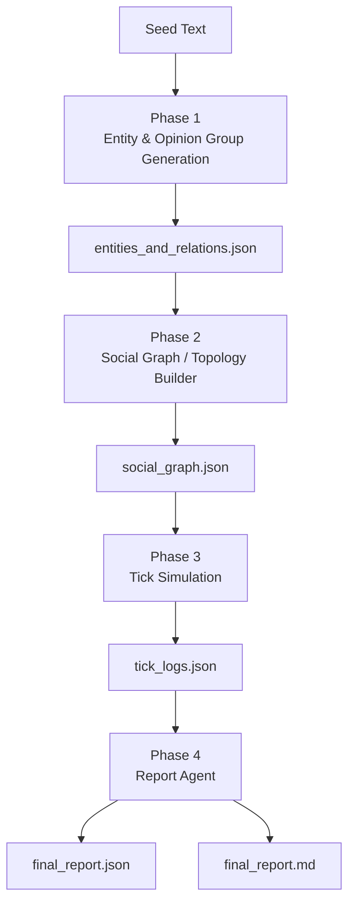
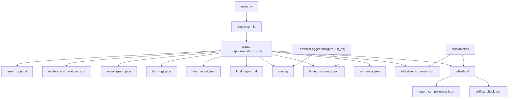

# Adarian Dev Spec

**文档状态**：当前系统技术规格说明  
**当前基线**：v1.2.7 - Phase 4 Report Product Governance Sprint
**最后更新**：2026-05-12
**依据来源**：当前源码、v1.2.0-v1.2.6 迭代记录、`outputs/runs/` 下最新运行产物

本文档描述当前真实系统状态，用于替代旧 v1.1.x 技术设想残留。未实现的未来方向只作为 roadmap 或 out-of-scope 记录，不作为当前能力描述。

---

## 1. Project Definition

Adarian 是一个面向公共事件的多智能体舆情推演 MVP。

它从一段本地公共事件文本出发，生成事件实体、意见群体、关系网络、多轮观点演化日志和风险报告。当前目标不是预测真实未来，而是构建一个可运行、可复盘、可解释的舆情推演沙盘。

当前阶段：

```text
CLI-first / file-artifact-first research prototype
```

含义：

- 当前以命令行运行和文件产物复盘为主。
- 一次运行的权威证据边界是 `outputs/runs/<run_id>/`。
- 暂不做正式 Web 前端。
- 未来 CLI 可以基于 `run_meta.json`、`timing_summary.json`、`run.log`、`final_report.md` 做查看工具。
- CLI 不是当前 v1.2.1 / v1.2.2 的实现目标。

---

## 2. Current Version Baseline

### v1.2.0 Functional Baseline Candidate

```text
v1.2.0 = functional baseline candidate
```

含义：

- 主链 Phase 1 -> Phase 2 -> Phase 3 -> Phase 4 已重新跑通。
- `test7` 已通过端到端验证。
- v1.2.0 恢复了功能基线。
- v1.2.0 不是完整 engineering baseline，因为当时仍缺少 `run_dir / run.log / timing_summary.json`。
- 当时 root `outputs/` 仍存在多次运行互相覆盖风险。

权威记录：

```text
docs/iterations/v1.2.0-functional-baseline-restore.md
```

### v1.2.1 Run Artifact Governance & Runtime Logging

```text
v1.2.1 = Run Artifact Governance & Runtime Logging
```

含义：

- 每次主链 E2E 运行生成独立 run_dir。
- 当前权威产物路径为 `outputs/runs/<run_id>/`。
- `run.log`、`timing_summary.json`、`run_meta.json` 已成为运行证据的一部分。
- `final_report.json` 与 `final_report.md` 分离写入，不得互相覆盖。
- root `outputs/` 不再作为主链运行证据源。
- 当前 v1.2.1 产物治理已经基本完成，但 `run_meta.json` 字段与最初计划仍有差异，因此 v1.2.1 closeout 应记录为 `pass_with_known_issues`，而不是 `clean pass`。

当前确认运行证据：

```text
outputs/runs/test7_20260425_160152/
```

用户要求参考的路径：

```text
docs/iterations/v1.2.1-run-artifact-governance.md
```

当前工作区中不存在。实际完成记录文件为：

```text
docs/iterations/v1.2.1-run-artifact-governance-runtime-logging.md
```

另外，迭代目录中也存在：

```text
docs/iterations/v1.2.1_Run Artifact Governance & Runtime Logging.md
```

`docs/iterations` 中 v1.2.1 存在多份命名相近文档，后续需统一权威文件命名；本轮不清理、不删除。

本文档以 hyphenated `runtime-logging` 文件为 v1.2.1 closeout 依据，因为它是本轮实际更新并完成验收记录的文件。

### v1.2.2 Planned: White-box Observability for Speaker Behavior

```text
v1.2.2 - White-box Observability for Speaker Behavior
```

目标：

```text
只增强 speaker behavior 观测能力，不改变模拟行为。
```

计划补充字段或概念：

```text
speaker_status
speaker_reason
decision_source
selector_score
selector_rank
candidate_count
selected_count
speaker_budget
selection_policy
can_speak_reason
speech_availability
source_basis
```

v1.2.2 明确不做：

- 不做 `influence_trace`。
- 不做 `stance_delta` 语义解释。
- 不接 MCP / Web Search / RAG。
- 不做 logging migration。
- 不改 speaker selector 策略。

### v1.2.7 Phase 4 Report Product Governance Sprint

```text
v1.2.7 = Phase 4 Report Product Governance R0
```

含义：

- Phase 4 报告产品化 R0 闭环完成。
- final_report.md 是业务可读 Markdown，采用五章模板（舆情概要/演化分析/风险研判/对策建议/附录）。
- final_report.md 明确标注"模拟推演型舆情风险研判报告"及模拟推演口径。
- final_report.json 是结构化追溯与工程验收来源。
- generated_at 为代码侧生成（非 LLM 生成）。
- risk_level / risk_type_labels 为 code-owned（非 LLM 自由发明）。
- report_prompts.py 为静态 prompt asset（无函数/类/IO/LLM 调用/业务逻辑）。
- whitebox/report_completeness.py section headings 已对齐五章模板。
- 当前报告为 contract R0 合规骨架，详尽版产品表达质量约 35/100。

后续 detailed report quality / prompt governance / group quality 属于 carry_over（详见 v1.2.7 迭代文档 §14）。

---

## 3. System Pipeline Overview

当前链路分为业务推演主链和运行治理链。

```text
业务推演主链：
Seed Text
  ↓
Phase 1：事件实体与意见传播者生成
  ↓
Phase 2：关系网络 / 拓扑构建
  ↓
Phase 3：多轮观点推演 / tick simulation
  ↓
Phase 4：风险报告生成

运行治理链：
main.py 创建 run_id / run_dir
RuntimeLogger 记录 run.log / timing_summary.json
所有业务产物归档到 outputs/runs/<run_id>/
```

当前权威入口：

```bash
py main.py seeds/test7.txt
```

### 主业务链路架构

主业务链路图回答：系统如何完成舆情推演。



### 运行产物与观测链路

运行产物图回答：一次运行如何被归档和复盘。



当前每次运行的核心输出：

```text
entities_and_relations.json
social_graph.json
tick_logs.json
final_report.json
final_report.md
run.log
timing_summary.json
run_meta.json
seed_input.txt
whitebox_summary.json
whitebox/report_completeness.json
whitebox/artifact_check.json
```

### Schema Contract Library

当前 schema authority 为：

```text
src/schemas/
```

分层结构：

```text
src/schemas/__init__.py  # public re-export, keeps old from src.schemas import X compatible
src/schemas/common.py    # shared Phase 1/common contracts
src/schemas/phase1.py    # Phase 1 new-path compatibility re-export
src/schemas/phase2.py    # Phase 2 contracts
src/schemas/phase3.py    # Phase 3 contracts
src/schemas/phase4.py    # Phase 4 contracts
src/schemas/_legacy.py   # dead/legacy contracts, not re-exported from src.schemas
```

`EntityExtractionOutput` 仍是 Phase 1 canonical object。`ConfirmationBiasLevel` 保留为 `src` 与 `src.schemas` public export。`_legacy.py` 仅作为 legacy boundary，不代表 v1.2.7 P/C/V 已完成。

---

## 4. Phase 1: Entity & Opinion Group Generation

源码模块：

```text
src/phase1/extraction.py
```

职责：

- 从本地 seed 文本中提取事件实体。
- 生成意见传播者 / 群体。
- 生成实体和群体之间的关系。
- 输出事件摘要、事件规模、事件争议性、事件类型、初始立场、易感性、人设字段和关系结构。

输出：

```text
entities_and_relations.json
```

当前主要模型：

- `EntityExtractionOutput`
- `Entity`
- `OpinionSpreader`
- `Relation`

当前关键字段：

- `event_summary`
- `event_scale`
- `event_controversy`
- `event_type`
- `event_entities`
- `opinion_spreaders`
- `relations`

意见传播者立场框架：

- `I`：立场强度，`1.0` 到 `10.0`
- `P`：立场方向，`+1` 或 `-1`
- `C`：系统推导一致性，`P * (I / 10)`
- `stance_score`：由 `I/P` 映射出的兼容属性
- `susceptibility`：易感性，影响立场变化幅度

当前限制：

- `can_speak` 逻辑已经存在并被 Phase 3 使用，但白盒解释仍不足。
- `can_speak_reason / speech_availability / source_basis` 属于 v1.2.2 规划方向。
- Phase 1 当前不接 MCP / Web Search / RAG。
- Phase 1 当前基于本地 seed 文本和 LLM 生成/校验链路。

---

## 5. Phase 2: Social Graph / Topology Builder

源码模块：

```text
src/phase2/topology_builder.py
```

职责：

- 基于 Phase 1 输出生成社会关系图。
- 将事件实体转换为 Core 节点。
- 将意见传播者转换为 Periphery 节点。
- 生成关注关系和拓扑结构。
- 校验图结构。

输出：

```text
social_graph.json
```

当前图模型：

- `Phase2Output`
- `GraphNode`
- `GraphEdge`
- `NodeRole`
- `EdgeType`

当前拓扑概念：

- 事件实体进入 `core` 节点。
- 意见传播者进入 `periphery` 节点。
- Core / Periphery 角色写入 `social_graph.json`。
- OpinionSpreader 的 persona 字段会透传到 graph node。

---

## 6. Phase 3: Tick Simulation

源码模块：

```text
src/phase3/tick_simulation.py
src/phase3/speaker_selector.py
src/phase3/context_builder.py
src/phase3/simulation_card.py
src/phase3/state_updater.py
```

职责：

- 基于事件实体、意见传播者和关系图进行多轮观点演化模拟。
- Tick 0 处理事件实体发言。
- Tick 1+ 使用 speaker selector 选择部分 opinion spreader 发言。
- 未被选中公开发言的 agent 执行 silent update。
- 记录每轮 stance、comment、reasoning、曝光来源和全局指标。

输出：

```text
tick_logs.json
```

当前 Tick 0 行为：

- 先处理事件实体。
- 如果 `can_speak=false`，该实体不生成发言，并记录为不可发言。
- 如果存在 `original_statement`，优先使用原始发言。
- 否则可由 LLM 生成事件实体声明。

当前 Tick 1+ 行为：

- `speaker_selector.select_speakers()` 选择部分 opinion spreader。
- 被选中的 spreader 生成公开评论。
- 未选中的 silent agent 仍写入 `tick_logs.json`，通常使用 `（未发言）` 占位。
- silent update 路径也可能产生 stance 变化。

当前 `tick_logs.json` 可观测字段：

- `tick`
- `entries`
- `agent_id`
- `group_name`
- `saw_posts_from`
- `previous_stance`
- `current_stance`
- `stance_delta`
- `susceptibility`
- `change_reason`
- `comment`
- `reasoning`
- `global_metrics`
- `mean_stance`
- `std_stance`
- `polarization_index`

当前限制：

- `tick_logs.json` 能记录谁发言、谁未发言、stance 如何变化。
- 仍不能充分解释为什么某个 speaker 没有发声。
- 仍不能充分解释为什么某个 agent 被选中。
- 不持久化 selector score、selector rank、完整候选排名或 speaker budget 细节。
- 不能证明 `saw_posts_from` 是否真正影响了生成内容。
- `stance_delta` 有机械层面的 `change_reason`，但没有语义层面的解释。

v1.2.2 的方向是 speaker behavior observability，而不是改变调度策略。

---

## 7. Phase 4: Report Agent

源码模块：

```text
src/phase4/report_agent.py
```

职责：

- 基于 Phase 1-3 的结构化结果生成舆情风险报告。
- 从事件实体、意见传播者、tick logs 和 x(t) 构造报告上下文。
- 输出结构化 JSON 报告和面向阅读的 Markdown 报告。

输出：

```text
final_report.json
final_report.md
```

当前输出模型：

- `Phase4Output`
- `EmotionTrajectory`
- `InflectionPoint`
- `RiskLevel`

v1.2.1 报告契约：

- `final_report.json` 与 `final_report.md` 必须分别保存。
- JSON 和 Markdown 不得互相覆盖。
- `main.py` 主链显式传入 run_dir 内的两个输出路径。
- 主链可直接把 `phase2_output` 传给报告生成逻辑，减少对 root `social_graph.json` 的隐式依赖。

### v1.2.7 Report Product Governance

```text
v1.2.7 = Phase 4 Report Product Governance R0
```

v1.2.7 报告产品化 R0 闭环变更：

- final_report.md 采用五章模板（舆情概要/演化分析/风险研判/对策建议/附录）。
- final_report.md 明确标注"模拟推演型舆情风险研判报告"及模拟推演口径。
- final_report.json 新增 report_meta（generated_at / timezone / report_type / event_name / total_ticks / simulation_run_id）。
- generated_at 为代码侧生成（非 LLM 生成）。
- risk_level / risk_type_labels 为 code-owned（非 LLM 自由发明），risk_type_labels 受轻量白名单约束。
- audience_mode 支持最小关键词路由（generic_government / law_enforcement_facing / regulator_facing / public_management_facing）。
- 新增 src/phase4/report_prompts.py 作为静态 prompt asset（无函数/类/IO/LLM 调用/业务逻辑）。
- whitebox/report_completeness.py section headings 已对齐五章模板。

报告产品表达质量约 35/100，后续 detailed report quality / prompt governance 属于 carry_over。

---

## 8. Run Artifact Governance

当前权威运行产物结构：

```text
outputs/
└── runs/
    └── <run_id>/
        ├── seed_input.txt
        ├── entities_and_relations.json
        ├── social_graph.json
        ├── tick_logs.json
        ├── final_report.json
        ├── final_report.md
        ├── run.log
        ├── timing_summary.json
        ├── run_meta.json
        ├── whitebox_summary.json
        └── whitebox/
            ├── report_completeness.json
            └── artifact_check.json
```

`run_id` 推荐格式：

```text
<seed_stem>_<YYYYMMDD_HHMMSS>
```

示例：

```text
test7_20260425_160152
```

规则：

- `outputs/runs/<run_id>/` 是一次 E2E 的权威证据边界。
- root `outputs/` 不再作为主链运行证据源。
- `config.py` 中的 root 输出路径仍作为 legacy / standalone 调用的兼容默认值保留。
- `main.py` 主链必须显式传入 run_dir 内的输出路径。
- 历史 outputs 由用户手动迁移，系统不自动清理、移动或删除。

当前 v1.2.1 观测到的 `run_meta.json` 字段：

- `run_id`
- `seed_file`
- `seed_copy`
- `run_dir`
- `started_at`
- `provider`
- `model`
- `status`
- `outputs`
- `completed_at`
- `elapsed_seconds`
- `x_t_sequence`
- `final_polarization_index`
- `risk_level`

已知 `run_meta.json` 缺口：

- 尚无 `seed_stem`。
- 尚无 `git_commit`。
- 尚无 `git_dirty`。
- 尚无 `output_dir`；当前字段是 `run_dir`。
- 尚无 `ended_at`；当前字段是 `completed_at`。

---

## 9. Runtime Logging & White-box Observability

### 当前已有观测

`run_meta.json` 当前记录：

- `run_id`
- `seed_file`
- `seed_copy`
- `run_dir`
- `provider`
- `model`
- `status`
- `started_at`
- `completed_at`
- `elapsed_seconds`
- `outputs`
- `x_t_sequence`
- `final_polarization_index`
- `risk_level`

`timing_summary.json` 当前记录：

- `run`
- `phases`
- `llm`
- `persona`
- `ticks`
- `errors`
- run 级状态和耗时
- phase 级 start/end/elapsed
- LLM 调用记录：caller、model、elapsed_seconds、timestamp
- tick 级 timing、speaker count、LLM call count
- 可用时记录 speaker selection summary

`run.log` 当前记录事件流：

- `RUN START`
- `RUN END`
- `PHASE START`
- `PHASE END`
- `LLM START`
- `LLM END`
- `TICK START`
- `TICK END`
- `SPEAKER SELECTION`
- `ERROR`（如有）

`tick_logs.json` 当前记录：

- `tick`
- `entries`
- stance 字段
- comment
- reasoning
- `saw_posts_from`
- `change_reason`
- `global_metrics`

### 当前不足

当前系统仍不足以解释：

```text
1. 为什么某个 event entity 不能发声
2. 为什么某个 opinion spreader 没有进入发言队列
3. speaker selector 的 score / rank / budget
4. saw_posts_from 是否真正影响了内容
5. stance_delta 的语义原因
6. seed facts 被使用 / 遗漏的情况
```

### v1.2.2 观测规划

```text
v1.2.2 - White-box Observability for Speaker Behavior
```

目标：

```text
只增强 speaker behavior 观测能力，不改变模拟行为。
```

计划补充：

```text
speaker_status
speaker_reason
decision_source
selector_score
selector_rank
candidate_count
selected_count
speaker_budget
selection_policy
can_speak_reason
speech_availability
source_basis
```

Phase 1 的 `can_speak_reason / speech_availability / source_basis` 只能在迭代计划中先由 Codex 做 Pre-Implementation Review；如果风险高，应 fallback 到 Phase 3 默认记录 `unknown`，不得直接大改 Phase 1。

明确不做：

- v1.2.2 不做 `influence_trace`。
- v1.2.2 不做 `stance_delta` semantic explainability。
- v1.2.2 不接 MCP / Web Search。
- v1.2.2 不做 logging migration。
- v1.2.2 不改 speaker selector 策略。

---

## 10. Current Known Limitations

- Phase 1 `can_speak` 行为存在，但 source basis 和 decision explanation 仍不够白盒。
- Phase 1 不接 MCP / Web Search / RAG。
- speaker selection 只在 summary 层可观测，score/rank/budget 未持久化。
- silent agent 会被记录，但原因较通用，不暴露 selector 内部细节。
- `saw_posts_from` 记录曝光 ID，但不记录因果影响。
- `stance_delta` 记录数值变化和机械原因，不记录语义解释。
- `run_meta.json` 当前缺少 `seed_stem`、`git_commit`、`git_dirty`、`output_dir`、`ended_at`。
- 当前使用 `run_dir` 替代 `output_dir`，使用 `completed_at` 替代 `ended_at`。
- Windows 路径在部分外部检查中可能出现编码显示问题。
- CLI 工程师系统未完成。
- CSV 横向对比未实现。
- benchmark / profiling 治理独立于 v1.2.1 主链基线。

---

## 11. Out of Scope

当前系统明确不做：

```text
完整 Web 前端
实时爬虫
MCP / Web Search / RAG
百万级 agent
通用多 agent 框架
完整 AD / SEIR 数学预测模型
自动 baseline 仲裁
完整 CLI 工程师系统
CSV 横向对比
benchmark / profiling 新流程
Phase 3 重构
```

---

## 12. Roadmap

### v1.2.2 - White-box Observability for Speaker Behavior

增强 speaker behavior 观测能力，不改变模拟行为。

计划重点：

- 解释 speaker selected / silent 状态。
- 暴露 selector 决策元数据。
- 改进 `can_speak` 解释字段。
- 保持当前调度和模拟行为不变。

明确不包括：

- influence tracing。
- stance-delta semantic explainability。
- MCP / Web Search。
- logging migration。
- speaker selector 策略改动。

### Later v1.2.x

后续可能方向，不属于 v1.2.2：

- 增强 run metadata：`seed_stem`、`git_commit`、`git_dirty`、`output_dir`。
- 基于 `outputs/runs/<run_id>/` 的最小 run viewer / CLI。
- CSV 或表格形式的横向 run 对比。
- 历史 outputs 治理。

### Future Research Lines

以下仍是研究方向，不是当前实现：

- AD 快模块。
- SEIR 慢模块。
- 更大规模 agent 群体。
- 前端可视化。
- benchmark / profiling 治理。

---

## 13. Development Rules

1. 迭代计划先行，再让 Codex 做 Pre-Implementation Review。
2. Codex 只能基于迭代计划反馈源码可行性，不得自行扩大版本目标。
3. 每个版本必须有 iteration doc / TASK_LOG / CHANGELOG 记录。
4. 主链产物以 `outputs/runs/<run_id>/` 为权威来源。
5. 不允许未记录的隐藏迭代。
6. 不允许同时做多个架构方向。
7. 不允许用 prompt 修复结构问题。
8. 不允许在未完成 baseline closeout 前推进下一版本。
9. 新增观测字段优先服务白盒解释，不服务炫技。
10. 每次 closeout 必须记录 carry_over。

---

## 14. Scheduler Product Entry R0（v1.4.0）

`scheduler/` 是平行世界推演控制台的产品入口，独立于旧 `tools/probe_scheduler/` bypass 探针路径。

当前 R0 职责：

- 启动单页控制台：`.venv/bin/python -m scheduler ui --host 127.0.0.1 --port 9788`
- 直接运行 batch：`.venv/bin/python -m scheduler run --models qwen36-35b,ds --seed-text "..."`
- 检查已有 batch：`.venv/bin/python -m scheduler inspect <batch_dir>`
- 通过 `PARALLEL_MODE=true`、`PARALLEL_BATCH_DIR`、`PARALLEL_WORLD_NAME` 复用现有输出路径策略。
- 每个 world 的权威 dataset 位于 `{batch_dir}/world_N/simulation_dataset.json`。
- UI success、`dataset_exists`、`risk_type_classification.primary_types` 必须来自真实文件检查。

下游预留：

- Report Agent Consumer 后续应消费 `batch_dir` 或 `worlds[].dataset_path`。
- v1.4.0 不实现 Report Agent batch consumer，也不重构 Phase 4。
