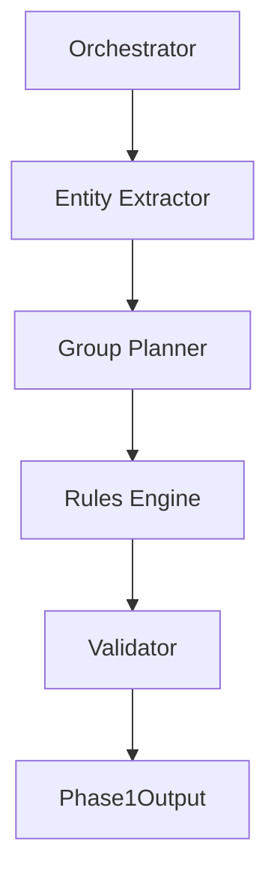

---

# 📄 迭代记录：v1.1.15 - Rules Engine Refactor

---

## 📍 版本信息

* **版本号**：v1.1.15
* **基于版本**：v1.1.14
* **迭代日期**：2026-04-09
* **Git Commit**：`待填写`
* **状态**：✅ 已完成

---

## 🎯 本次迭代目标

### 问题描述

在 v1.1.14 完成 Phase 1 解耦后，系统仍存在关键问题：

### 1️⃣ 结构性字段仍由 LLM 控制

包括：

* `P`
* `estimated_percentage`

👉 问题：

* 不稳定（不同 run 波动大）
* 难以约束（总和≠100、分布异常）
* 难以解释（无法追溯生成逻辑）

---

### 2️⃣ 规则分散

当前规则分布在：

* Prompt
* Validator
* Postprocess

👉 问题：

* 一致性不可控
* Debug 困难
* 修改成本高

---

### 3️⃣ Phase 1 仍然“生成主导”

虽然 v1.1.14 已拆模块，但：

👉 本质仍是：
**LLM 决定结构 → 代码修补**

---

### 解决目标

本版本目标：

👉 **建立 Rules Engine，将关键结构控制权收回代码层**

具体目标：

* 将 `P` 从 LLM 移出，改为代码推导
* 将 `estimated_percentage` 从 LLM 移出，统一归一
* 建立集中规则层（Rules Engine）
* 减少 Validator 修补职责
* 提升稳定性与可解释性

---

## 🧠 架构变更说明

---

## 架构图（v1.1.15）



---

## 核心新增模块

### 🧩 Rules Engine（新增）

路径：

```text
src/phase1/rules_engine.py
```

---

## 🧠 Rules Engine 职责

### 1️⃣ 数值推导

* `P <- f(I)`
* `C <- P * (I / 10)`（如有使用）

---

### 2️⃣ 分布归一

* `raw_weight → estimated_percentage`
* 总和 = 100
* rounding correction（补差）

---

### 3️⃣ 合法性约束

* related_entity 必须存在
* group 去重
* 非法字段修正

---

### 4️⃣ 输出收口

* 统一生成最终结构
* 输出标准化 Phase1Output

---

## 🔄 数据流变化

### v1.1.14

```text
Extractor → Planner → Validator → Output
```

---

### v1.1.15

```text
Extractor → Planner → Rules Engine → Validator → Output
```

👉 **Validator 从“修补者”降级为“检查者”**

---

## 📦 字段职责迁移

---

### 从 LLM 移出（关键）

| 字段                   | 处理方式 |
| -------------------- | ---- |
| P                    | 代码推导 |
| estimated_percentage | 代码归一 |

---

### 保留在 LLM

| 字段                |
| ----------------- |
| event_summary     |
| event_entities    |
| relations         |
| group_name        |
| I                 |
| susceptibility    |
| description（暂时保留） |

---

### 延后处理（v1.1.16）

* persona
* communication style
* phrases

---

## 📋 文件变更清单

---

### 新增文件

```text
src/phase1/rules_engine.py
```

---

### 修改文件

```text
src/phase1/group_planner.py
```

* 删除：

  * P 生成逻辑
  * percentage 生成逻辑

---

```text
src/phase1/orchestrator.py
```

* 新增 Rules Engine 调用

---

```text
src/schemas.py
```

* 更新：

  * GroupPlanResult（去除 P / percentage）
  * Phase1Output（由 Rules Engine 生成）

---

```text
docs/dev_spec.md
docs/iterations/CHANGELOG.md
docs/iterations/TASK_LOG.md
```

---

### 未修改文件

* Phase 2 / 3 / 4
* llm_client
* output_manager

---

## 🔧 详细实现指令（给 Codex）

---

### 任务 1：实现 Rules Engine

**输入：**

* GroupPlanResult
* EntityExtractionResult

**输出：**

* 标准化 Phase1Output

---

**要求：**

实现函数：

```python
def apply_rules(group_plan, entity_result) -> Phase1Output:
```

---

### 任务 2：P 推导逻辑

建议：

```python
P = f(I)
例如：
P = 0.5 + (I / 20)
```

👉 保持单调递增即可（不要求复杂）

---

### 任务 3：percentage 归一

步骤：

1. 读取 raw_weight
2. 归一化
3. 四舍五入
4. 修正总和 = 100

---

### 任务 4：去重与合法性检查

* group_name 去重
* related_entity 必须存在
* 空字段过滤

---

### 任务 5：修改 Group Planner

删除：

* P
* percentage

---

### 任务 6：接入 Orchestrator

流程：

```text
extractor → planner → rules_engine → validator
```

---

## 🔒 实现约束（非常重要）

* ❌ 不允许在 Prompt 中重新加入 P / percentage
* ❌ 不允许在 Validator 中再次做核心规则计算
* ❌ 不允许修改 Phase 2 / 3 / 4
* ❌ 不引入 Persona Writer（留到 1.1.16）

---

## ✅ 验收标准（MiniMax）

---

### 模块验收

* [ ] 存在 rules_engine.py
* [ ] Group Planner 不再生成 P / percentage
* [ ] Orchestrator 已接入 Rules Engine

---

### 行为验收

```bash
py main.py seeds/test1.txt
```

验证：

* [ ] 主流程成功
* [ ] Phase 1 输出完整
* [ ] P 存在且合理
* [ ] percentage 总和 = 100
* [ ] Phase 2 / 3 / 4 正常运行

---

### 回归验收（轻量）

对比 baseline：

* [ ] 未出现结构性回归
* [ ] 输出无明显异常
* [ ] 系统稳定性不下降

---

## 🚫 明确不做

* 不做 benchmark 多轮测试
* 不做 Persona 拆分
* 不做并发
* 不接入知识库
* 不引入 RAG

---
