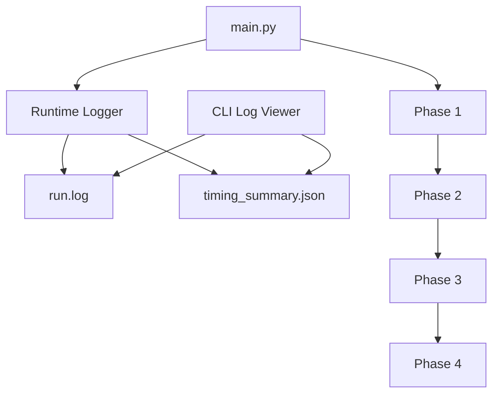

---

# 📄 迭代记录：v1.1.17 - Runtime Observability and CLI Logs

---

## 📍 版本信息

* **版本号**：v1.1.17
* **基于版本**：v1.1.16
* **迭代日期**：2026-04-09
* **Git Commit**：`待填写`
* **状态**：✅ 已完成

---

## 📁 迭代文件名

```text
docs/iterations/v1.1.17_runtime_observability_and_cli_logs.md
```

---

# 🎯 本次迭代目标

## 问题描述

当前系统存在关键运行观测缺失：

### 1️⃣ 无运行日志（致命问题）

* 无法定位性能瓶颈
* 无法判断卡在：

  * Phase 1 / 2 / 3 / 4
  * Persona Writer
  * Tick simulation
  * LLM 调用
* 当前问题已经表现为：

  * Phase 3 Tick 0 后卡死（15分钟超时）

---

### 2️⃣ 无 LLM 调用统计

* 不知道调用了多少次
* 不知道单次耗时
* 不知道哪个模块最慢

---

### 3️⃣ 无 CLI 查看能力

* 只能看控制台
* 无法回看历史 run
* 无法做对比分析

---

### 4️⃣ 无结构化 timing 数据

* 无法做 benchmark 对比
* 无法做版本回归分析

---

## 影响范围

* 性能诊断 ❌
* 调试效率 ❌
* 架构优化 ❌
* 与导师沟通 ❌
* 后续 benchmark 体系 ❌

---

## 是否为结构性问题

👉 **是（系统级观测能力缺失）**

---

## 解决目标

本次版本目标：

### ✅ 建立最小运行可观测体系

* 每次运行生成：

  * `run.log`
  * `timing_summary.json`

---

### ✅ 建立统一 runtime logger

支持记录：

* run start / end
* phase start / end
* llm call start / end
* persona group start / end
* tick start / end
* 错误信息

---

### ✅ 建立 CLI log viewer

支持：

```bash
py tools/log_cli.py latest
py tools/log_cli.py latest --tail 100
py tools/log_cli.py timing latest
py tools/log_cli.py show <run_dir>
```

---

### ✅ 不改变业务逻辑

* 不修改 Phase 1~4 语义
* 不影响输出结果
* 仅增加 observability

---

## Breaking Change

👉 **否**

---

## 是否涉及架构调整

👉 **是（运行观测层）**

---

# 🧠 架构变更说明（新增关键模块）

---

## 当前结构问题

当前系统：

```text
main → Phase1 → Phase2 → Phase3 → Phase4 → output
```

问题：

👉 完全黑盒执行

---

## 目标结构（v1.1.17）



---

## 模块划分

### Module A：Runtime Logger（新增）

* 统一记录日志
* 聚合 timing 数据

---

### Module B：Instrumentation Hooks（新增）

埋点位置：

* main.py（phase级）
* llm_client.py（调用级）
* persona_writer.py（group级）
* phase3_tick_simulation.py（tick级）

---

### Module C：CLI Log Viewer（新增）

* 查看 run.log
* 查看 timing_summary.json

---

# 🔄 数据流变化

---

## 旧流程

```text
main → phases → output
```

---

## 新流程

```text
main → runtime_logger → phases → log + timing → CLI
```

---

# 📦 输出文件结构变化

在 run_dir 下新增：

```text
outputs/
└── normal/
    └── test1_xxx/
        ├── run.log                  ✅ 新增
        ├── timing_summary.json      ✅ 新增
        ├── entities_and_relations.json
        ├── social_graph.json
        └── final_report.md
```

---

# 📋 文件变更清单

---

## 新增文件

```text
src/utils/runtime_logger.py
tools/log_cli.py
```

---

## 修改文件

```text
main.py
```

* 新增 phase timing

---

```text
src/llm_client.py
```

* 新增 LLM 调用埋点

---

```text
src/phase1/orchestrator.py
```

* 接入 logger（Phase1）

---

```text
src/phase1/persona_writer.py
```

* group级 timing

---

```text
src/phase3_tick_simulation.py
```

* tick级 timing
* speakers / llm_calls 统计

---

```text
docs/dev_spec.md
docs/iterations/CHANGELOG.md
docs/iterations/TASK_LOG.md
```

---

## 未修改文件

```text
src/schemas.py
src/phase2_topology_builder.py
src/phase4_report_agent.py
docs/iterations/BENCHMARK_LOG.md
```

---

# 🔧 详细修改指令（给 Codex）

---

## 任务 1：实现 runtime_logger

路径：

```text
src/utils/runtime_logger.py
```

---

### 必须支持：

```python
log_run_start(...)
log_run_end(...)

log_phase_start(name)
log_phase_end(name, elapsed)

log_llm_start(caller, model)
log_llm_end(caller, model, elapsed)

log_persona_start(group)
log_persona_end(group, elapsed)

log_tick_start(tick)
log_tick_end(tick, elapsed, speakers, llm_calls)
```

---

### 输出：

#### run.log（文本）

#### timing_summary.json（结构化）

---

## 任务 2：main.py 埋点

```python
phase1 = timed("Phase 1", run_phase1)
phase2 = timed("Phase 2", run_phase2)
phase3 = timed("Phase 3", run_phase3)
phase4 = timed("Phase 4", run_phase4)
```

---

## 任务 3：llm_client 埋点

在统一入口包裹：

```python
start = time.perf_counter()
...
elapsed = ...
logger.log_llm_end(...)
```

---

## 任务 4：persona_writer 埋点

```python
log_persona_start(group)
...
log_persona_end(group, elapsed)
```

---

## 任务 5：Phase3 Tick 埋点

```python
log_tick_start(tick)

# run simulation

log_tick_end(tick, elapsed, speakers, llm_calls)
```

---

## 任务 6：实现 CLI

路径：

```text
tools/log_cli.py
```

---

### 支持命令：

#### 最新日志

```bash
py tools/log_cli.py latest
```

#### tail

```bash
py tools/log_cli.py latest --tail 100
```

#### timing

```bash
py tools/log_cli.py timing latest
```

#### 指定 run

```bash
py tools/log_cli.py show <run_dir>
```

---

# 🔒 实现约束（非常重要）

* ❌ 不修改业务逻辑
* ❌ 不改变 Phase 输出
* ❌ 不引入外部 logging 框架
* ❌ 不引入数据库
* ❌ 不做性能优化（只做观测）
* ❌ 不接入 RAG / 知识库
* ❌ 不影响 benchmark 体系

---

# ✅ 验收标准（MiniMax 使用）

---

## 模块级

* [ ] 存在 runtime_logger.py
* [ ] 存在 log_cli.py
* [ ] run_dir 内生成 run.log
* [ ] run_dir 内生成 timing_summary.json

---

## 行为级

```bash
py main.py seeds/test1.txt
```

验证：

* [ ] 有 phase log
* [ ] 有 llm log
* [ ] 有 tick log
* [ ] 无运行崩溃

---

## CLI 验收

```bash
py tools/log_cli.py latest
py tools/log_cli.py timing latest
```

* [ ] 可正常显示
* [ ] tail 正常

---

## 可用性验收

* [ ] 可以定位 Phase 3 是否瓶颈
* [ ] 可以看到 LLM 调用次数
* [ ] 可以看到 tick 耗时

---

## 明确不做

* [ ] benchmark 多轮测试
* [ ] AQF 评分
* [ ] 并发优化
* [ ] 性能压测
* [ ] 可视化 UI

---

# 🧩 给两个 Agent 的说明

---

## 给 Codex

你只做：

* runtime_logger
* llm_client 埋点
* persona_writer 埋点
* tick 埋点
* CLI

不要做：

* 架构优化
* prompt 调整
* 并发优化
* memory 重构

交付后：

```bash
py main.py seeds/test1.txt
py tools/log_cli.py latest
```

必须可用

---

## 给 MiniMax

你只验：

* 是否有日志
* 是否能定位瓶颈
* CLI 是否可用

不要要求：

* 性能优化
* benchmark
* 并发提升
* RAG 接入

---

# 🎯 本版本一句话总结

👉 **v1.1.17 = 让系统从“黑盒”变成“可诊断系统”**

---
