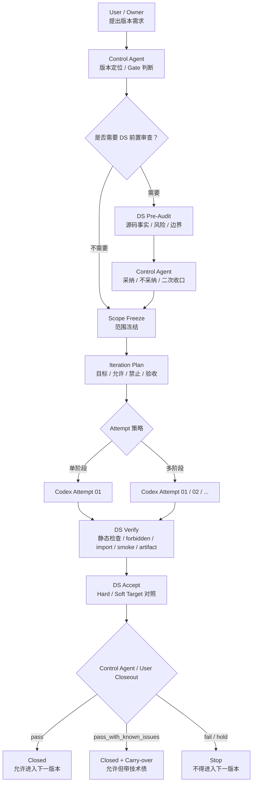

# Adarian MVP 核心开发工作流 v3（Workflow Core）

workflow_core.md version: v3.0  
ratified: 2026-05-06  
authority: primary workflow authority  

---

## 0. 文档定位

本文件是 Adarian MVP 项目的唯一流程规则权威源。

如本文件与其他 workflow 文档冲突，以本文件为准。

本文件定义：

```text
1. 项目角色分工
2. 版本推进流程
3. DS 审计 / 验收职责
4. Codex 执行职责
5. 迭代文档与 TASK_LOG / CHANGELOG 的权威关系
6. Closeout Gate 规则
7. 防漂移边界
8. Hook 的边界与使用方式
````

本文件不定义业务架构，不替代 `dev_spec.md`。

---

## 1. 核心原则

Adarian MVP 当前采用文档驱动、审计优先、最小落地的开发模式。

核心原则：

```text
慢审计，快落地。
```

含义：

```text
1. 方案进入执行前必须先明确版本边界。
2. 重大结构变更必须经过 DS 前置审计。
3. Codex 只负责落盘、执行、自检、回传 diff/status。
4. DS 负责审计与验收，不负责最终 Gate。
5. Control Agent 负责版本定位、范围收口、迭代文档和最终 Gate。
6. User / Owner 保留最终方向判断与审批权。
```

---

## 2. 角色分工

| 角色            | 职责                                                     | 不负责                                       |
| ------------- | ------------------------------------------------------ | ----------------------------------------- |
| User / Owner  | 提出版本需求、审核方案、最终方向判断、批准 closeout                         | 不直接实现、不承担测试流水线                            |
| Control Agent | 版本定位、Gate 判断、采纳 / 不采纳 DS 建议、收口范围、编写迭代文档、最终 closeout 判断 | 不落盘代码、不执行测试                               |
| DS Team       | 前置审查、后置验证、验收判定、TASK_LOG / CHANGELOG 小型记录更新             | 不重新设计版本范围、不扩大架构、不替 Control Agent 做最终 Gate |
| Codex         | 按迭代文档执行代码落盘、运行自检级测试、输出 attempt 交付说明                    | 不自行决定范围、不更新最终 closeout、不越界设计              |

---

## 3. 标准 Pipeline

标准流程：

```text
User / Owner
  ↓
Control Agent
  ↓
DS Pre-Audit
  ↓
Control Agent Scope Freeze
  ↓
Codex Attempt
  ↓
DS Verify
  ↓
DS Accept
  ↓
Control Agent / User Closeout
```

Mermaid：



---

## 4. Workflow Event IDs

v3 使用四类事件 ID。

| 字段              | 生产者           | 含义           | 出现位置                      |
| --------------- | ------------- | ------------ | ------------------------- |
| `task_id`       | Control Agent | 迭代级唯一任务标识    | 迭代文档、TASK_LOG             |
| `audit_id`      | DS Team       | 一次 DS 前置审查标识 | DS Pre-Audit Report、迭代文档  |
| `attempt_id`    | Codex         | 一次代码交付标识     | Codex 交付说明、TASK_LOG       |
| `acceptance_id` | DS Team       | 一次验收判定标识     | DS Accept Report、TASK_LOG |

最小要求：

```text
1. 每份正式迭代文档必须声明 task_id。
2. 每次 DS Pre-Audit 必须声明 audit_id。
3. 每次 Codex 交付必须声明 attempt_id。
4. 每次 DS Accept 必须声明 acceptance_id。
5. acceptance_id 必须引用对应 task_id / audit_id / attempt_id。
```

格式：

```text
task-vX.Y.Z-<topic>
audit-vX.Y.Z-01
attempt-vX.Y.Z-01
accept-vX.Y.Z-01
```

---

## 5. Runtime Authority

当前项目的运行状态以以下事实源为准。

### 5.1 版本状态权威源

```text
1. 当前 iteration 文档状态
2. TASK_LOG.md 最新 acceptance record
3. Control Agent / User closeout 判断
```

### 5.2 运行事实权威源

```text
outputs/runs/<run_id>/
```

一次运行的真实证据包括：

```text
run_meta.json
run.log
timing_summary.json
entities_and_relations.json
social_graph.json
tick_logs.json
final_report.json
final_report.md
whitebox_summary.json（如本版本声明）
```

### 5.3 审计事实权威源

```text
DS Pre-Audit Report
DS Verify Report
DS Accept Report
```

### 5.4 非权威源

以下内容不得作为当前 runtime authority：

```text
旧 control/state.json
旧 control/inbox.md
旧 control/snapshot.md
历史 probe 摘要
未被 iteration doc / TASK_LOG 收录的聊天记录
未被 DS / Control Agent 接受的建议项
```

---

## 6. Control Agent 规则

Control Agent 负责版本治理。

必须完成：

```text
1. 判断当前阶段：exploration / audit / execution / validation / closeout。
2. 判断是否进入 Execution Mode。
3. 编写正式迭代文档。
4. 冻结版本目标、禁止范围、允许修改文件。
5. 决定是否需要 DS Pre-Audit。
6. 采纳 / 不采纳 DS 建议。
7. 向 Codex 提供完整执行 Prompt。
8. 基于 DS Accept 与实际产物做最终 closeout。
```

Control Agent 不得：

```text
1. 把最终 Gate 判断交给 DS。
2. 把迭代文档写作责任交给 Codex。
3. 在探索期过早 Execution Lock。
4. 未 closeout 当前版本就开启下一版本。
5. 把 review findings 自动升级为下一版本任务。
```

---

## 7. DS Team 规则

DS Team 分为三类职责：

```text
1. /ds-pre-audit
2. /ds-verify
3. /ds-accept
```

DS Team 的定位：

```text
审计事实生产者。
验收事实生产者。
不是版本方向决策者。
不是最终 Gatekeeper。
```

---

## 8. /ds-pre-audit

### 8.1 触发时机

当 Control Agent 完成初版迭代文档，并且 Gate 为：

```text
GO
CONDITIONAL_GO
```

且本版本涉及以下任一事项时，必须执行 DS Pre-Audit：

```text
1. 源码结构调整
2. schema / contract 调整
3. main.py 主链路调整
4. phase package / import 路径调整
5. whitebox / runtime artifact contract 调整
6. R1 / R2 / R3 前置设计
7. 任何可能影响下游 Phase 的变更
```

### 8.2 输入

```text
1. 当前迭代文档 draft / under_review
2. 当前源码树
3. 当前 dev_spec.md
4. 当前 TASK_LOG.md / CHANGELOG.md
5. 相关上一版本验收记录
```

### 8.3 输出

DS Pre-Audit Report 必须包含：

```text
audit_id
verdict: GO / CONDITIONAL_GO / HOLD / FAIL
source tree facts
main chain dependency facts
allowed files check
forbidden files check
risk list
blockers
recommended execution scope
DS must not do
```

报告建议存放路径：

```text
audit/phase1大版本审计/vX.Y.Z-<topic>-<YYYY-MM-DD>.md
```

如该审计不是 Phase 1 大版本审计，可使用：

```text
audit/workflow/vX.Y.Z-<topic>-<YYYY-MM-DD>.md
audit/general/vX.Y.Z-<topic>-<YYYY-MM-DD>.md
```

### 8.4 DS Pre-Audit 不负责

DS Pre-Audit 不得：

```text
1. 重新设计版本范围。
2. 扩大架构。
3. 把建议项自动升级为 blocker。
4. 替 Control Agent 做最终 Gate。
5. 要求进入下一版本。
```

---

## 9. /ds-verify

### 9.1 触发时机

Codex 完成一次 attempt 交付后触发。

### 9.2 输入

```text
1. Codex 交付说明
2. attempt_id
3. 当前 iteration document
4. 当前 git status
5. 当前 diff
6. 当前 run_dir（如已运行）
```

### 9.3 Diff 基准

默认基准：

```text
HEAD
```

如果 Codex 已经产生 commit，则必须使用本轮 iteration 开始前的：

```text
base_commit
```

若 Codex 产生了多个 commit，DS Verify 不得使用 `HEAD~1` 猜测基准，必须要求 Codex 提供本轮 iteration 开始前的 `base_commit`。

如果无法确认 diff 基准，DS Verify 必须标记：

```text
partial_fail / hold
```

并要求 Control Agent 判断。

### 9.4 验证步骤

DS Verify 至少执行以下阶段。

#### Phase 1 — 静态检查

```bash
./.venv/bin/python -m py_compile main.py
./.venv/bin/python -m compileall src
```

如本版本声明新增 tests，则执行：

```bash
./.venv/bin/python tests/<declared_test>.py
```

#### Phase 2 — Forbidden Files 检查

执行：

```bash
git diff --name-only <base_commit_or_HEAD>
```

对照 iteration doc §6.3 forbidden files。

若发现 forbidden files 被修改：

```text
立即 hard_fail
不得继续包装为 pass_with_known_issues
```

#### Phase 3 — Import 完整性检查

根据本版本声明执行 import 测试。

例如：

```bash
./.venv/bin/python -c "from src.phase1 import ..."
./.venv/bin/python -c "from src.phase1_entity_extraction import ..."
./.venv/bin/python -c "from src.whitebox import ..."
```

#### Phase 4 — Smoke Test

默认：

```bash
./.venv/bin/python main.py seeds/test1.txt
```

如果 iteration doc §8.4 声明 `test7` 为 hard gate，则必须执行：

```bash
./.venv/bin/python main.py seeds/test7.txt
```

#### Phase 5 — Artifact Contract 检查

检查最新 run_dir：

```text
outputs/runs/<latest_run_id>/
```

必须核验：

```text
run_meta.json
run.log
timing_summary.json
entities_and_relations.json
social_graph.json
tick_logs.json
final_report.json
final_report.md
本版本新增 artifact
```

### 9.5 输出

DS Verify Report 必须包含：

```text
attempt_id
base_commit / diff 基准
modified files
forbidden files result
py_compile result
import result
smoke result
artifact result
overall_verify_result: all_pass / partial_fail / hard_fail
```

---

## 10. /ds-accept

### 10.1 触发时机

`/ds-verify` 完成后触发。

### 10.2 输入

```text
1. DS Verify Report
2. 当前 iteration document
3. Hard Acceptance Target
4. Soft Acceptance Target
5. Codex attempt report
6. DS Pre-Audit Report（如存在）
```

### 10.3 验收逻辑

```text
1. 任一 Hard Target 不满足 → fail / hold
2. 所有 Hard Target 满足，部分 Soft Target 不满足 → pass_with_known_issues
3. Hard / Soft Target 全部满足 → pass
```

### 10.4 DS Accept 可更新

DS Accept 可以更新：

```text
TASK_LOG.md
CHANGELOG.md
当前 iteration doc 的 acceptance section
```

### 10.5 DS Accept 不得越权

DS Accept 不得：

```text
1. 直接把 iteration doc 状态改为 closed。
2. 宣布允许进入下一版本。
3. 替 Control Agent / User 做最终 Gate。
4. 新增下一版本范围。
5. 把 soft issue 自动升级为 blocker。
```

DS Accept 只能输出：

```text
acceptance_result:
  pass
  pass_with_known_issues
  fail
  hold
```

最终 closeout 由：

```text
Control Agent / User
```

确认。

### 10.6 Acceptance Report 最小字段

```text
task_id: task-vX.Y.Z-xxx
audit_id: audit-vX.Y.Z-01 / N/A
attempt_id: attempt-vX.Y.Z-01
acceptance_id: accept-vX.Y.Z-01
acceptance_result: pass / pass_with_known_issues / fail / hold
hard_targets: X/Y
soft_targets: X/Y
carry_over:
  - item 1
  - item 2
closeout_recommendation:
  - allow_closeout / hold / require_fix
```

---

## 11. Codex 执行规则

Codex 是执行 Agent。

Codex 必须：

```text
1. 严格读取 iteration document。
2. 只修改允许文件。
3. 不触碰 forbidden files。
4. 不自行扩大版本范围。
5. 不自行重写架构。
6. 不跳入下一版本任务。
7. 执行声明的自检级测试命令。
8. 回传 attempt report。
```

Codex 自检级测试的目标是：

```text
确认本轮修改没有明显崩溃；
确认自身交付具备进入 DS Verify 的最低条件。
```

DS Verify 验收级测试的目标是：

```text
对照 iteration document 的 Hard / Soft Acceptance Target 做正式验收。
```

两者不冲突：

```text
Codex = 自检级执行
DS Verify = 验收级复核
```

Codex 交付说明必须包含：

```text
attempt_id
actual_added_files
actual_modified_files
actual_deleted_files
test_commands
test_results
latest_run_dir
artifact_check
known_issues
diff_summary
```

Codex 不得：

```text
1. 自行修改 TASK_LOG / CHANGELOG，除非 iteration doc 明确要求。
2. 自行 closeout。
3. 自行改变 prompt / schema / selector / report generation 等禁止区域。
4. 发现问题后擅自进入大重构。
```

---

## 12. Internal Model Endpoint Preflight Rule

当项目使用内网模型服务时，任何 smoke test / E2E / LLM 调用失败，执行 agent 不得立即判定为代码回归。必须先做模型环境预检，区分：

```text
1. 网络 / 沙箱权限问题。
2. endpoint 不可达。
3. 认证失败。
4. configured model 不在 /models 列表。
5. minimal chat 失败。
6. 真实代码回归。
```

### 12.1 触发时机

以下情况必须执行本预检：

```text
1. smoke test 失败，且失败链路包含 LLM 调用。
2. E2E 失败，且失败链路包含 LLM 调用。
3. 任何 attempt 的自检级 LLM 调用出现 APIConnectionError / timeout / authentication / model not found。
4. DS Verify 的 smoke 阶段出现 LLM 连接或模型可用性错误。
```

### 12.2 预检顺序

必须按以下顺序执行。

#### Step 1 — endpoint reachability

检查 `LLM_BASE_URL` 是否可达。

```text
未认证访问 /models 返回 401 可视为 endpoint 在线、认证缺失，而非服务宕机。
```

如因为沙箱网络权限导致连接失败，必须标记为环境阻塞，不得判定为代码回归。

#### Step 2 — authenticated /models

使用项目 `config` 中的 `LLM_API_KEY` 与 `LLM_BASE_URL` 初始化 OpenAI-compatible client。

调用：

```text
client.models.list()
```

回传：

```text
models_count
models_sample
```

不得打印完整 API key。

#### Step 3 — configured_model_in_list

检查：

```text
config.get_model_name() in models list
```

如果不存在，标记为：

```text
model_availability_blocker
```

#### Step 4 — minimal chat test

使用 `config.get_model_name()` 发起最小 chat completion。

最小要求：

```text
prompt: ping
max_tokens: 8 左右
timeout: 15 秒左右
temperature: 0
```

#### Step 5 — business smoke

只有 endpoint、认证、模型可用性、minimal chat 均通过后，才重跑业务 smoke。

本项目默认：

```bash
./.venv/bin/python main.py seeds/test1.txt
```

如非本地 Mac 工作区环境，应使用该环境的项目虚拟环境解释器，并在报告中说明实际解释器。不得默认使用系统 `python3` 或 `/usr/bin/python3`。

```bash
<project-venv-python> main.py seeds/test1.txt
```

必须在报告中说明实际使用的解释器。

### 12.3 结果分类

执行报告必须明确：

```text
smoke_test_result:
- pass
- fail
- blocked_by_environment

failure_type:
- environment_blocker
- code_regression
- unknown
```

### 12.4 判定规则

如果出现以下任一情况：

```text
1. endpoint 不可达。
2. 沙箱网络禁止。
3. 认证失败。
4. configured_model 不在 models list。
5. minimal chat 失败。
```

则必须：

```text
1. 标记为 environment_blocker。
2. 不得继续修改业务源码。
3. 不得判定当前 attempt 代码失败。
4. 回传 blocker 详情。
```

如果模型预检全部通过，但业务 smoke 出现以下问题：

```text
1. import error。
2. shim error。
3. schema mismatch。
4. missing function。
5. Phase 调用链断裂。
```

则必须：

```text
1. 标记为 code_regression。
2. 只允许在当前 attempt 范围内修复。
3. 不得扩大到下一 attempt。
```

如果无法归类：

```text
1. 标记为 unknown。
2. 停止执行并回传证据。
3. 不得继续乱改代码。
```

### 12.5 推荐诊断脚本

```python
from openai import OpenAI
import config

client = OpenAI(
    api_key=config.LLM_API_KEY,
    base_url=config.LLM_BASE_URL,
)

print("provider=", config.LLM_PROVIDER)
print("configured_model=", config.get_model_name())

try:
    models = client.models.list()
    ids = [m.id for m in models.data]
    print("models_count=", len(ids))
    print("models_sample=", ", ".join(ids[:20]))
    print("configured_model_in_list=", config.get_model_name() in ids)
except Exception as e:
    print("models_list_error=", type(e).__name__, str(e))

try:
    response = client.chat.completions.create(
        model=config.get_model_name(),
        messages=[{"role": "user", "content": "ping"}],
        max_tokens=8,
        temperature=0,
        timeout=15,
    )
    print("chat_test=ok")
    print("chat_model=", response.model)
    print("chat_content=", response.choices[0].message.content[:80])
except Exception as e:
    print("chat_test=fail", type(e).__name__, str(e))
```

---

## 13. Project Python Interpreter Rule

本项目在本地 Mac 工作区运行时，项目依赖安装在项目虚拟环境 `.venv` 中。DS Team、Codex、Control Agent 或任何执行验证的 agent，在运行 py_compile、import test、smoke test、E2E 或验收复核前，必须先确认项目 Python 解释器。

默认工作区：

```text
/Users/gary/项目开发/AdarianMigration/adarian mvp
```

默认 Python 解释器：

```bash
./.venv/bin/python
```

禁止默认使用：

```text
python
python3
/usr/bin/python3
```

原因：

```text
系统 Python 通常没有安装项目依赖，例如 pydantic。
如果使用系统 Python 执行 import / smoke，可能误报：
ModuleNotFoundError: No module named 'pydantic'
```

在本项目中，出现 `No module named 'pydantic'` 时，应优先判断为解释器环境错误，而不是源码错误。

### 13.1 Environment Preflight

在执行任何 Python 检查前，必须先运行：

```bash
cd "/Users/gary/项目开发/AdarianMigration/adarian mvp"

./.venv/bin/python --version
./.venv/bin/python -c "import sys; print(sys.executable)"
./.venv/bin/python -c "import pydantic; print('pydantic=', pydantic.__version__)"
```

如果上述检查通过，后续所有 Python 命令统一使用：

```bash
./.venv/bin/python -m py_compile ...
./.venv/bin/python tests/xxx.py
./.venv/bin/python main.py seeds/test1.txt
```

不得使用裸 `python3` 或 `/usr/bin/python3` 作为默认解释器。

### 13.2 Environment Blocker

如果 `./.venv/bin/python` 不存在、不可执行，或 `pydantic` 缺失：

```text
1. 标记为 environment_blocker。
2. 不得判定为源码回归。
3. 不得要求 Codex 修改源码。
4. 回传 venv 状态、解释器路径、缺失依赖。
5. 等待 Control Agent / User 决策。
```

验收输出中必须包含：

```text
environment_preflight:
  workspace:
  python_executable:
  python_version:
  pydantic_available: true / false
  status: pass / environment_blocker
```

### 13.3 Result Classification

如果 venv preflight 失败：

```text
acceptance_result 不得直接写 fail。
应写 hold / blocked_by_environment。
failure_type = environment_blocker。
```

如果 venv preflight 通过，但 import / shim / smoke 失败：

```text
才可以继续判断是否为 code_regression。
```

---

## 14. Attempt 策略

### 14.1 默认策略

默认：

```text
attempt 串行执行。
```

即：

```text
attempt-02 默认依赖 attempt-01 通过。
attempt-01 fail 时，attempt-02 默认不得开始。
```

### 14.2 允许并行的条件

只有 iteration document 明确声明以下条件时，才允许并行：

```text
parallel_attempts_allowed = true
```

并且必须同时满足：

```text
1. 两个 attempt 修改文件集合无交叉。
2. 两个 attempt 的验收目标独立。
3. 两个 attempt 不同时修改 main.py。
4. DS Pre-Audit 明确判定无 merge / conflict 风险。
5. Control Agent 明确批准。
```

### 14.3 并行输出要求

并行 attempt 必须使用不同 attempt_id：

```text
attempt-vX.Y.Z-01
attempt-vX.Y.Z-02
```

并且 DS Verify 必须分别验收。

---

## 15. Iteration Document 规则

正式迭代文档必须使用：

```text
docs/iterations/vX.Y.Z-<topic>.md
```

必须包含：

```text
1. Version Info
2. Control Agent Decision
3. Goal & Boundary
4. DS Review Scope
5. Target Structure / Artifact Contract
6. File Change Scope
7. Execution Attempts
8. Verification Plan
9. Acceptance Target & Criteria
10. Execution Report Requirement
11. Closeout Record
```

Control Agent 必须直接撰写迭代文档。

Codex 不负责生成正式迭代文档，只负责按文档执行。

---

## 16. TASK_LOG / CHANGELOG 规则

### 16.1 TASK_LOG

TASK_LOG 记录：

```text
1. task_id
2. audit_id
3. attempt_id
4. acceptance_id
5. acceptance_result
6. carry_over
7. 实际新增 / 修改 / 删除文件
8. 测试结果
9. 最新 run_dir
```

### 16.2 CHANGELOG

CHANGELOG 记录：

```text
1. 版本主题
2. 新增
3. 修改
4. 修复
5. 兼容性
6. 验收结果
7. 已知遗留
```

### 16.3 更新权限

```text
DS Accept 可以写入 acceptance record。
Control Agent / User 确认 closeout 后，才允许将 iteration 状态改为 closed。
```

---

## 17. Closeout Gate

版本 closeout 必须满足：

```text
1. DS Accept 已完成。
2. Hard Acceptance Target 全部满足。
3. TASK_LOG 已记录 acceptance_result。
4. CHANGELOG 已记录版本变更。
5. run_dir / artifact 证据完整。
6. Control Agent / User 明确批准 closeout。
```

允许结果：

```text
closed / pass
closed / pass_with_known_issues
hold
fail
```

若为 `pass_with_known_issues`，必须列出：

```text
carry_over
risk_level
next_version_candidate
是否阻塞下一版本
```

未 closeout 的版本不得开启下一版本。

---

## 18. 防漂移规则

以下情况视为 workflow drift：

```text
1. Codex 修改 forbidden files。
2. DS 扩大版本范围。
3. DS 把建议项自动升级为 blocker。
4. Control Agent 未写迭代文档就让 Codex 执行。
5. 当前版本未 closeout 就开启下一版本。
6. Hook 结果替代 DS Verify。
7. run_dir 产物缺失但文档宣布通过。
8. review findings 自动变成下一版本任务。
9. 小修复演变成大重构。
10. schema / prompt / selector / report generation 被顺手修改。
```

一旦发现 drift：

```text
1. 停止进入下一阶段。
2. 记录 drift 类型。
3. 由 Control Agent 判断是否 hold / rollback / 最小修复。
```

---

## 19. Hook 规则

Hook 只作为低成本预警，不作为验收权威。

推荐 PreCommit Hook：

```json
{
  "hooks": {
    "PreCommit": [
      {
        "matcher": "Bash",
        "hooks": [
          {
            "type": "command",
            "command": "cd \"${CLAUDE_PROJECT_DIR}\" && ./.venv/bin/python -m py_compile main.py && ./.venv/bin/python -m compileall src || echo \"[DS] py_compile / compileall failed\"",
            "timeout": 30,
            "statusMessage": "[DS] Python syntax check..."
          }
        ]
      },
      {
        "matcher": "Bash",
        "hooks": [
          {
            "type": "command",
            "command": "cd \"${CLAUDE_PROJECT_DIR}\" && echo \"[DS] forbidden files check must be enforced by /ds-verify against iteration doc §6.3\"",
            "timeout": 5,
            "statusMessage": "[DS] Forbidden files reminder..."
          }
        ]
      }
    ]
  }
}
```

禁止：

```text
1. Hook 替代 DS Verify。
2. Hook 自动修改文件。
3. Hook 自动 closeout。
4. Hook 对复杂 artifact contract 做强阻断。
```

---

## 20. 当前项目阶段规则

当前项目处于：

```text
Phase 1 Generation Governance Major Track
```

已确认规则：

```text
v1.2.3 = Phase 1 Output Contract Freeze
v1.2.4 = Phase 1 R1 Readiness Hardening
v1.2.5 = Source Tree Governance / Whitebox Modular Governance
R1 = Parser / Compiler / Validator Skeleton
```

R1 前必须确保：

```text
1. Phase 1 contract 已冻结。
2. 文档漂移已标注。
3. main.py 编排类型约束已补强。
4. Phase 1 output contract 最小测试已建立。
5. src/phase1/ 不得被错误假定存在。
6. EntityExtractionOutput 仍是当前 canonical object。
```

---

## 21. 最终原则

```text
DS 接管审计与验收流水线。
Codex 接管执行落盘。
Control Agent 接管版本边界与最终 Gate。
User / Owner 接管方向与审批。
```

任何流程变体都不得破坏这一分工。

````
